## 认识css

- CSS表示层叠样式表（**C**ascading **S**tyle **S**heet，简称：CSS，又称为又称**串样式列表**、**级联样式表**、**串接样式表**、**阶层式样式表**）是为网页添加**样式的代码**。

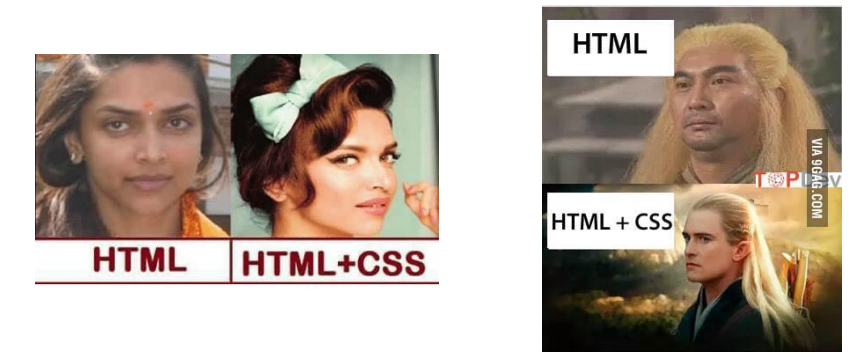

- CSS是用来美化我们的网页


- **CSS是一种语言吗？(知道即可)**
  - MDN解释：CSS 也不是真正的编程语言，甚至不是标记语言。它是一门样式表语言；
  - 维基百科解释：是一种计算机语言，但是不算是一种编程语言；


### CSS的历史

- 早期的网页都是**通过HTML来编写**的，但是我们希望**HTML页面可以更加丰富:**

  - 这个时候就增加了很多**具备特殊样式的元素**：比如i、strong、del等等；

  - 后来也有不同的浏览器**实现各自的样式语言**，但是没有统一的规划；

  - 1994年，哈肯·维姆·莱和伯特·波斯**合作设计CSS**，在1996年的时候发布了**CSS1**；

  - 直到1997年初，W3C组织才专门**成立了CSS的工作组**，1998年5月发布了**CSS2**；

  - 在2006~2009非常流行 **“DIV+CSS”布局**的方式来替代所有的html标签；

  - 从CSS3开始，所有的CSS分成了**不同的模块（modules）**，每一个“modules”都有于CSS2中额外增加的功能，以及向后

    兼容。

  - 直到2011年6月7日，**CSS 3 Color Module**终于发布为W3C Recommendation。


- 总结：CSS的出现是**为了美化HTML**的，并且让**结构（HTML）与样式（CSS）分离**；
  - **美化方式一**：为HTML**添加各种各样的样式**，比如颜色、字体、大小、下划线等等；
  - **美化方式二**：对HTML**进行布局**，按照某种结构显示（CSS进行布局 – 浮动、flex、grid）；

***


## 编写CSS

- **CSS这么重要，那么它的语法规则是怎么样的呢？**

  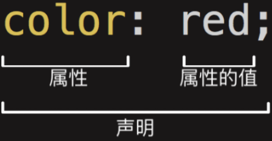

- 声明（**Declaration**）一个**单独的CSS规则**，如 color: red; 用来指定添加的CSS样式。
  - **属性名（Property name）**：要添加的css规则的名称；
  - **属性值（Property value）**：要添加的css规则的值；


- **但是有个问题：我们会编写了，要编写到什么位置呢？**


### CSS编写的位置（如何将CSS样式应用到元素上？）

- CSS提供了3种方法，可以将CSS样式应用到元素上：
  - 内联样式（inline style）
  - 内部样式表（internal style sheet）、文档样式表（document style sheet）、内嵌样式表（embed style sheet）
  - 外部样式表（external style sheet）


#### **内联样式**（inline style）

- **内联样式（inline style），**也有人翻译成行内样式。

  - 内联样式表存在于**HTML元素的style属性**之中。

    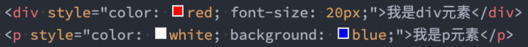

- CSS样式之间用分号**;**隔开，建议每条CSS样式后面都加上分号**;**


- **很多资料不推荐这种写法：**
  - 1.在**原生的HTML编写**过程中确实这种写法是不推荐的
  - 2.在**Vue的template**中某些动态的样式是会使用内联样式的；
- 内联样式的写法依然需要掌握。


#### 内部样式表（internal style sheet）

- **内部样式表（internal style sheet）**

  - 将CSS放在HTML文件```<head>```元素里的```<style>```元素之中。

    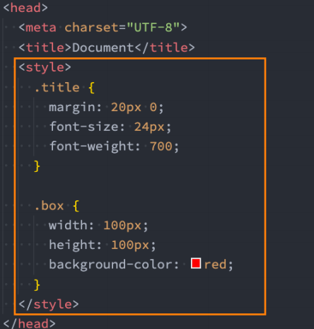

- 在Vue的开发过程中，**每个组件也会有一个style元素，和内部样式表非常的相似（原理并不相同）**；


#### **外部样式表（external style sheet）**

- **外部样式表（external style sheet）** 是将css编写一个独立的文件中，并且通过```<link>```元素引入进来；

- **使用外部样式表主要分成两个步骤：**

  - 第一步：将css样式在一个独立的css文件中编写（后缀名为.css）；

  - 第二步：通过```<link>```元素引入进来；

    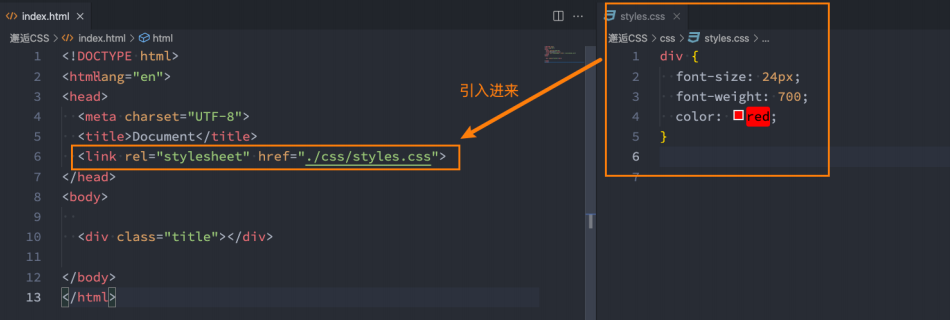


#### **@import**

- 可以在style元素或者CSS文件中使用@import导入其他的CSS文件

  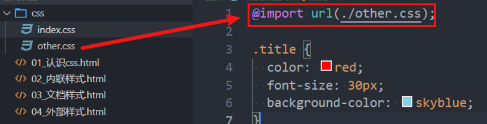


#### **CSS的注释**

- **CSS代码也可以添加注释来方便阅读：**

  - CSS的注释和HTML的注释是不一样的；

  - **/* 注释内容 */**

    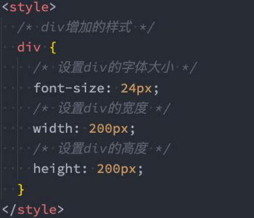


#### **必须掌握的CSS属性**

- 在开发中90+%的时间写的都是这些属性；

  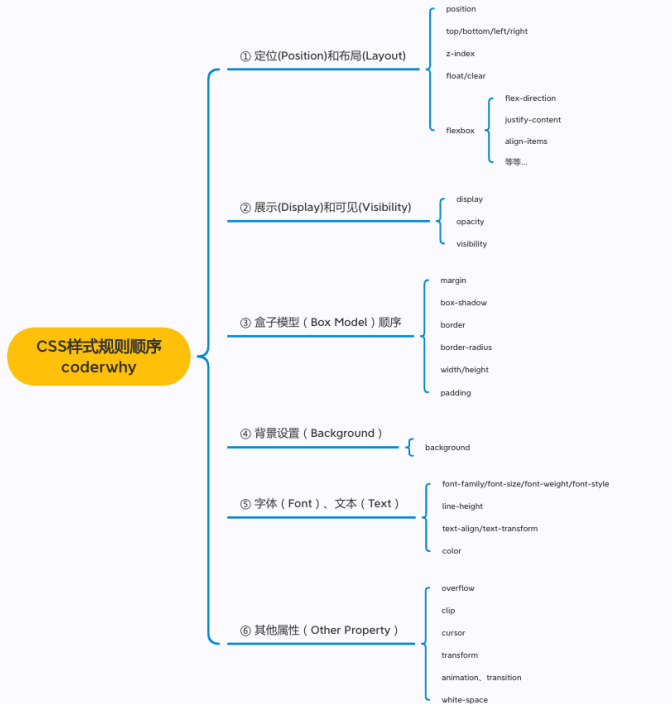


#### CSS属性的官方文档

- **CSS官方文档地址**
  - https://www.w3.org/TR/?tag=css
- **CSS推荐文档地址：**
  - https://developer.mozilla.org/zhCN/docs/Web/CSS/Reference#%E5%85%B3%E9%94%AE%E5%AD%97%E7%B4%A2%E5%BC%95

- **由于浏览器版本、CSS版本等问题，查询某些CSS是否可用：**
  - 可以到https://caniuse.com/查询CSS属性的可用性；
  - 这个网站在后续的browserlist工具中我们再详细说明；


#### **目前需要掌握的CSS属性**

- **background-color**
  - background-color决定背景色
- **color**
  - color属性用来设置文本内容的**前景色**
  - 包括**文字、装饰线、边框、外轮廓**等的颜色

***


## link元素

- link元素是**外部资源链接**元素，规范了**文档与外部资源**的关系
  - link元素通常是在head元素中
- 最常用的链接是**样式表（CSS）**；
  - 此外也可以被用来创建**站点图标**（比如 “favicon” 图标）；


- **link元素常见的属性：**
  - **href**：此属性指定被链接资源的URL。 URL 可以是绝对的，也可以是相对的。
  - **rel**：指定链接类型，常见的链接类型：https://developer.mozilla.org/zh-CN/docs/Web/HTML/Link_types
    - icon：站点图标；
    - stylesheet：CSS样式；


***


## 认识进制

- **进制的概念：**
  - 维基百科：**进位制**是一种记数方式，亦称**进位计数法**或**位值计数法**。
  - 通俗理解：当**数字达到某个值时，进一位(比如从1位变成2位)。**
- 按照进制的概念，来**理解一下十进制**：
  - 当数字到9的时候，用一位已经表示不了了，那么就进一位变成2位。
  - 在东北没有什么是一顿烧烤不能解决的，如果有，那就两顿。
- 按照上面的来理解，**二进制、八进制、十六进制**：
  - **二进制**：当数字到1的时候，用一位已经表示不了了，那么就进一位。
  - **八进制**：当数字到7的时候，用一位已经表示不了了，那么就进一位。
  - **十六进制**：等等，用一位如何表示十六个数字呢？a(10)、b(11)、c(12) 、 d(13) 、 e(14) 、 f(15)


### 人类的十进制

- **学习编程语言，需要了解进制的概念：**
  - 我们平时使用的数字都是**十进制**的，当我写下一个数字的时候，你会**默认当做十进制**来使用。
  - 从发明数字的开始，**人类就使用十进制**，原因可能是**人类正好十根手指**。
  - 如果人类有**八根手指**，现在用的可能是**八进制**。


- **所以说，十进制就是放之四海而皆准的常理吗？**
- 并不见得，计算机就认为二进制、八进制、十六进制更符合自己的思维。


> 常识就是人到十八岁为止所累积的各种偏见。
>
> Common sense is the collection of prejudices acquired by age eighteen.
>
> 阿尔伯特·爱因斯坦（Albert Einstein）


### 计算机中的进制

- 为什么计算机更喜欢**二进制**呢
  - 前面我们已经介绍过了为什么计算机更喜欢二进制了；
  - 和其底层的原理有关系；
- 如何表示二进制、八进制、十六进制?
  - 二进制（**0b开头**, binary）：其中的数字由0、1组成，可以回顾之前学习过的机器语言。
  - 八进制（**0o开头**, Octonary）：其中的数字由0~7组成。
  - 十六进制（**0x开头**, hexadecimal）：其中的数字由0~9和字母a-f组成（大小写都可以）


- **十进制 or 二进制**
  - 虽然计算机更喜欢二进制, 但是编程中我们还是以十进制为主.
  - 因为高级编程语言的目的就是更加接近自然语言, 让我们人类更容易理解.


### **进制之间的转换**

- **十进制转其他进制：**
  - 整除, 取余数.
- 其他进制转十进制：
  - 比如二进制的1001转成十进制: 1 * 2³ + 0 * 2² + 0 * 2 + 1 = 9
  - 比如八进制的1234转成十进制: 1 * 8³ + 2 * 8² + 3 * 8 + 4 = 668
  - 比如十六进制的522转成十进制: 5 * 16² + 2 * 16 + 2 = 1314
- 二进制转八进制：
  - 三位转成一位八进制
- 二进制转十六进制：
  - 二进制转十六进制：
- 如果520情人节忘记了，给大家一个建议，在522那天过，因为十六进制的522，对应的十进制是1314。

***


## **CSS颜色的表示方法**

- **在CSS中，颜色，有以下几种表示方法：**

- **颜色关键字（color keywords）：**

  - 是不区分大小写的标识符，它表示一个具体的颜色；
  - 可以表示哪些颜色呢？
  - https://developer.mozilla.org/zh-CN/docs/Web/CSS/color_value#%E8%AF%AD%E6%B3%95

- **RGB颜色：**

  - RGB是一种色彩空间，通过R（red，红色）、G（green，绿色）、B（blue，蓝色）三原色来组成了不同的颜色；

    - 也就是通过调整这三个颜色不同的比例，可以组合成其他的颜色；

  - RGB各个原色的取值范围是 0~255；

    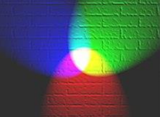


### **RGB的表示方法**

- RGB颜色可以通过以#为前缀的十六进制字符和函数（rgb()、rgba()）标记表示。

- **方式一：十六进制符号：**#RRGGBB[AA]

  - R（红）、G（绿）、B （蓝）和A （alpha）是十六进制字符（0–9、A–F）；A是可选的。
    - 比如，#ff0000等价于#ff0000ff；

  

- **方式二：十六进制符号：**#RGB[A]

  - R（红）、G（绿）、B （蓝）和A （alpha）是十六进制字符（0–9、A–F）；
  - 三位数符号（#RGB）是六位数形式（#RRGGBB）的减缩版。
    - 比如，#f09和#ff0099表示同一颜色。
  - 四位数符号（#RGBA）是八位数形式（#RRGGBBAA）的减缩版。
    - 比如，#0f38和#00ff3388表示相同颜色。


- **方式三：函数符：** rgb[a](R, G, B[, A])
  - R（红）、G（绿）、B （蓝）可以是<number>（数字），或者<percentage>（百分比），255相当于100%。
  - A（alpha）可以是0到1之间的数字，或者百分比，数字1相当于100%（完全不透明）。


***


## **Chrome浏览器开发者工具**

- 打开Chrome调试工具：

  - 方式一：右键 – 检查

  - 方式二：快捷键 – F12

    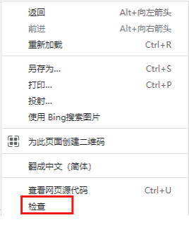

- 其他技巧：

  - 快捷键：ctrl+ 可以调整页面或者调试工具的字体大小；

  - 可以通过删除某些元素来查看网页结构;

  - 可以通过增删css来调试网页样式;

    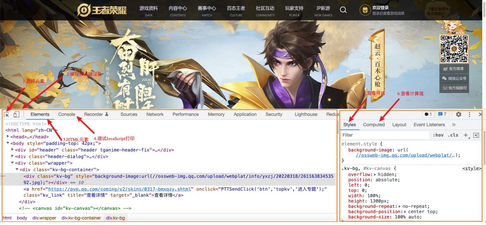


***


## 文本属性

### **text-decoration**

- **text-decoration用于设置文字的装饰线**;

  - decoration是装饰/装饰品的意思

- **常见属性值**

  - none：无任何装饰线

    - 可以去除a元素默认的下划线

      > a元素有下划线的本质是被添加了text-decoration属性

  - underline：下划线

  - overline：上划线

  - line-through：中划线（删除线）


### **text-transform**

- **text-transform用于设置文字的大小写转换**
  - Transform单词是使变形/变换(形变)

- **常见属性值**
  - capitalize：(使…首字母大写, 资本化的意思)将每个单词的首字符变为大写
  - uppercase：(大写字母)将每个单词的所有字符变为大写
  - lowercase：(小写字母)将每个单词的所有字符变为小写
  - none：没有任何影响


### **text-indent**

- **text-indent用于设置第一行内容的缩进**

- text-indent: 2em; 刚好是缩进2个文字

  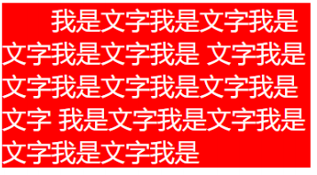


### **text-align**

- **text-align: 直接翻译过来设置文本的对齐方式;**
- **MDN:** **定义行内内容（例如文字）如何相对它的块父元素对齐**;
- **常见属性值**
  - left：左对齐
  - right：右对齐
  - center：正中间显示
  - justify：两端对齐

- W3C中的解释

  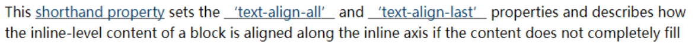


### **letter-spacing、word-spacing**

- **letter-spacing、word-spacing分别用于设置字母、单词之间的间距**
  - 默认是0，可以设置为负数


***


## 字体属性


### **font-size**

- **font-size决定文字的大小**
- 常用的设置
  - **具体数值+单位**
    - 比如100px
    - 也可以使用em单位(不推荐)：1em代表100%，2em代表200%，0.5em代表50%
  - **百分比**
    - 基于父元素的font-size计算，比如50%表示等于父元素font-size的一半


### **font-family**

- font-family用于设置**文字的字体名称**
  - 可以设置1个或者多个字体名称;
  - 浏览器会选择列表中第一个该计算机上有安装的字体;
  - 或者是通过 @font-face 指定的可以直接下载的字体。


- **淘宝使用的字体:**

  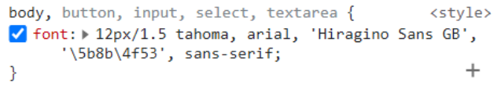


### **font-weight**

- **font-weight用于设置文字的粗细（重量）**
- **常见的取值:**
  - 100 | 200 | 300 | 400 | 500 | 600 | 700 | 800 | 900 ：每一个数字表示一个重量
  - normal：等于400
  - bold：等于700

- strong、b、h1~h6等标签的font-weight默认就是bold


### **font-style**

- **font-style用于设置文字的常规、斜体显示**

  - normal：常规显示

  - italic(斜体)：用字体的斜体显示(通常会有专门的字体)

  - oblique(倾斜)：文本倾斜显示(仅仅是让文字倾斜)

    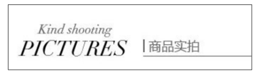

- em、i、cite、address、var、dfn等元素的font-style默认就是italic


### **font-variant**

- **font-variant可以影响小写字母的显示形式**
  - variant是变形的意思;
- **可以设置的值如下**
  - normal：常规显示
  - small-caps：将小写字母替换为缩小过的大写字母


### **line-height**

- **line-height用于设置文本的行高**

  - 行高可以先简单理解为一行文字所占据的高度

    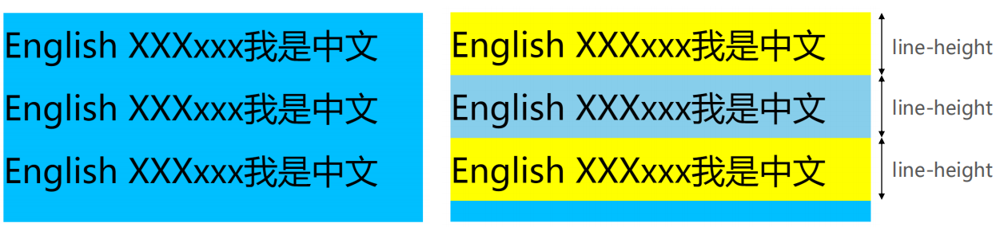


- 行高的严格定义是：**两行文字基线（baseline）之间的间距**

- 基线（baseline）：**与小写字母x最底部对齐的线**

  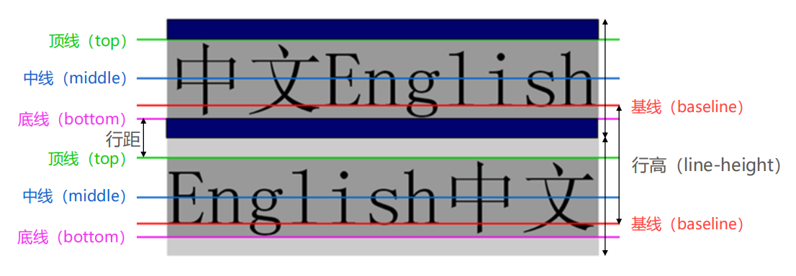


- **注意区分height和line-height的区别**
  - height：元素的整体高度
  - line-height：元素中每一行文字所占据的高度


- 应用实例：假设div中只有一行文字，如何让这行文字**在div内部垂直居中**

  - 让line-height等同于height

    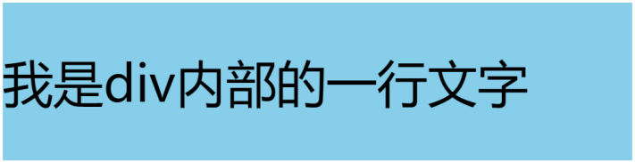


### **font**

- **font是一个缩写属性**
  - font 属性可以用来作为 font-style, font-variant, font-weight, font-size, line-height 和 font-family 属性的简写;
  - **font-style font-variant font-weight font-size/line-height font-family**

- **规则:**

  - font-style、font-variant、font-weight可以随意调换顺序，也可以省略

  - /line-height可以省略，如果不省略，必须跟在font-size后面

  - font-size、font-family不可以调换顺序，不可以省略

    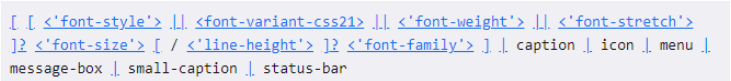

***


## CSS选择器

- 开发中经常需要找到**特定的网页元素进行设置样式**
- **什么是CSS选择器**
  - 按照一定的规则**选出符合条件的元素**，为之添加CSS样式
- **选择器的种类繁多，大概可以这么归类**
  - 通用选择器（universal selector）
  - 元素选择器（type selectors）
  - 类选择器（class selectors）
  - id选择器（id selectors）
  - 属性选择器（attribute selectors）
  - 组合（combinators）
  - 伪类（pseudo-classes）
  - 伪元素（pseudo-elements）


### **通用选择器** *

- **通用选择器（universal selector）**
  - 所有的元素都会被选中;
- **一般用来给所有元素作一些通用性的设置**
  - 比如内边距、外边距;
  - 比如重置一些内容;


- 效率比较低，尽量不要使用;


### **简单选择器**

- **简单选择器是开发中用的最多的选择器:**
  - 元素选择器（type selectors）, 使用元素的名称;
  - 类选择器（class selectors）, 使用 .类名 ;
  - id选择器（id selectors）, 使用 #id;

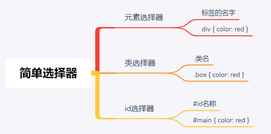


#### **id注意事项**

- 一个HTML文档里面的id值**是唯一的，不能重复**
  - id值如果由多个单词组成，单词之间可以用中划线-、下划线_连接，也可以使用驼峰标识
  - 最好不要用标签名作为id值
- 中划线又叫连字符（hyphen）


### **属性选择器**

- **拥有某一个属性** **[att]**
- **属性等于某个值** **[att=val]**


- **其他了解的(不用记)**

  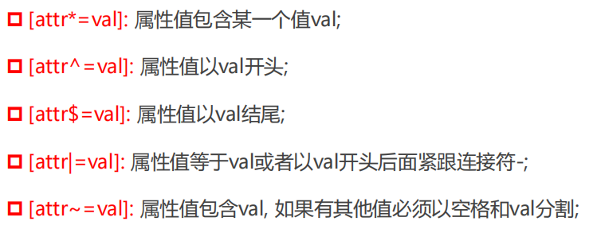

  


### **后代选择器**

- **后代选择器一: 所有的后代(直接/间接的后代)**

  - 选择器之间以空格分割

    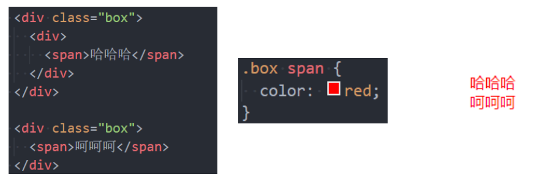


- **后代选择器二: 直接子代选择器(必须是直接子代)**

  - 选择器之间以 > 分割;

    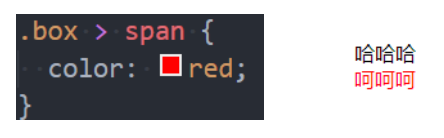


### **兄弟选择器**

- **兄弟选择器一: 相邻兄弟选择器**
  
  - 使用符号 **+** 连接
  
    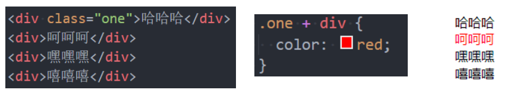


- **兄弟选择器二: 普遍兄弟选择器 ~**

  - 使用符号 **~** 连接

    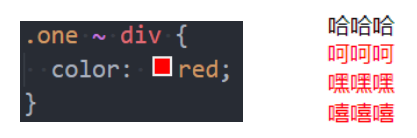


### **交集选择器**

- **交集选择器: 需要同时符合两个选择器条件(两个选择器紧密连接)**

  - 在开发中通常为了**精准的选择某一个元素**;

    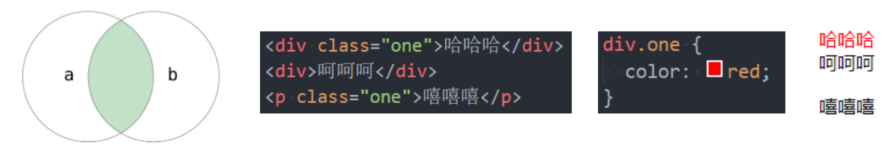


### **并集选择器**

- **并集选择器: 符合一个选择器条件即可(两个选择器以,号分割)**

  - 在开发中通常为了**给多个元素设置相同的样式**;

    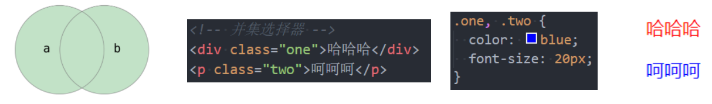


### 伪类

- 伪类是**选择器的一种**，它用于**选择处于特定状态的元素**;

- 比如我们经常会实现的: 当手指放在一个元素上时, 显示另外一个颜色;

  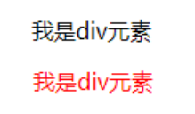


#### 常见伪类

- **1.动态伪类**（dynamic pseudo-classes）
  - :link、:visited、:hover、:active、:focus
- **2.目标伪类**（target pseudo-classes）
  - :target
- **3.语言伪类**（language pseudo-classes）
  - :lang( )
- **4.元素状态伪类**（UI element states pseudo-classes）
  - :enabled、:disabled、:checked
- **5.结构伪类**（structural pseudo-classes）(后续学习)
  - :nth-child( )、:nth-last-child( )、:nth-of-type( )、:nth-last-of-type( )
  - :first-child、:last-child、:first-of-type、:last-of-type
  - :root、:only-child、:only-of-type、:empty
- **6.否定伪类**（negation pseudo-classes）(后续学习)
  - :not()


- 所有的伪类: https://developer.mozilla.org/zhCN/docs/Web/CSS/Pseudo-classes


#### **动态伪类**

- **使用举例**
  - a:link 未访问的链接
  - a:visited 已访问的链接
  - **a:hover** 鼠标挪动到链接上(重要)
  - a:active 激活的链接（鼠标在链接上长按住未松开）


- **使用注意**
  - :hover必须放在:link和:visited后面才能完全生效
  - :active必须放在:hover后面才能完全生效
  - 所以建议的编写顺序是 :link、:visited、:hover、:active


- **除了a元素，:hover、:active也能用在其他元素上**


- :focus指当前**拥有输入焦点的元素**（能接收键盘输入）
  - 文本输入框一聚焦后，背景就会变红色
- 因为链接a元素可以**被键盘的Tab键选中聚焦**，**所以:focus也适用于a元素**


- **动态伪类编写顺序建议为**
  - :link、:visited、:focus、:hover、:active


- **直接给a元素设置样式，相当于给a元素的所有动态伪类都设置了**
  - 相当于a:link、a:visited、a:hover、a:active、a:focus的color都是red


#### 结构伪类

- **:nth-child**
  - **:nth-child(1)**
    - 是父元素中的**第1个子元素**
  - **:nth-child(2n)**
    - n代表任意**正整数和0**
    - 是父元素中的第偶数个子元素（第2、4、6、8......个）
    - 跟:nth-child(even)同义
  - **:nth-child(2n + 1)**
    - n代表任意**正整数和0**
    - 是父元素中的第奇数个子元素（第1、3、5、7......个）
    - 跟:nth-child(odd)同义
  - **nth-child(-n + 2)**
    - 代表**前2个子元素**


- **:nth-last-child**
  - **:nth-last-child()的语法跟:nth-child()类似，不同点是:nth-last-child()从最后一个子元素开始往前计数**
    - :**nth-last-child**(1)，代表倒数第一个子元素
    - :**nth-last-child**(-n + 2)，代表最后2个子元素
  - :**nth-of-type()用法跟:nth-child()类似**
    - 不同点是:**nth-of-type**()计数时只计算同种类型的元素
  - **:nth-last-of-type()用法跟:nth-of-type()类似**
    - 不同点是:**nth-last-of-type**()从最后一个这种类型的子元素开始往前计数


- **其他常见的伪类(了解):**
  - :first-child，等同于:nth-child(1)
  - :last-child，等同于:nth-last-child(1)
  - :first-of-type，等同于:nth-of-type(1)
  - :last-of-type，等同于:nth-last-of-type(1)
  - :only-child，是父元素中唯一的子元素
  - :only-of-type，是父元素中唯一的这种类型的子元素


- **下面的伪类偶尔会使用:**
  - :root，根元素，就是HTML元素
  - :empty代表里面完全空白的元素


#### **否定伪类**

- **:not()的格式是:not(x)**
  - x是一个简单选择器
  - 元素选择器、通用选择器、属性选择器、类选择器、id选择器、伪类（除否定伪类）

- :not(x)表示**除x以外的元素**


---


### **伪元素**

- **常用的伪元素有**
  - :first-line、::first-line
  - :first-letter、::first-letter
  - :before、**::before**
  - :after、**::after**

- 为了区分伪元素和伪类，建议伪元素使用2个冒号，比如::first-line


- ::first-line可以针对**首行文本设置属性**
- ::first-letter可以针对**首字母设置属性**

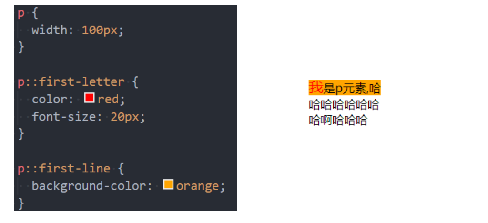


- **::before和::after**用来在一个元素的内容之前或之后插入其他内容（可以是文字、图片)

  - 常通过 **content 属性**来为一个元素添加修饰性的内容。

    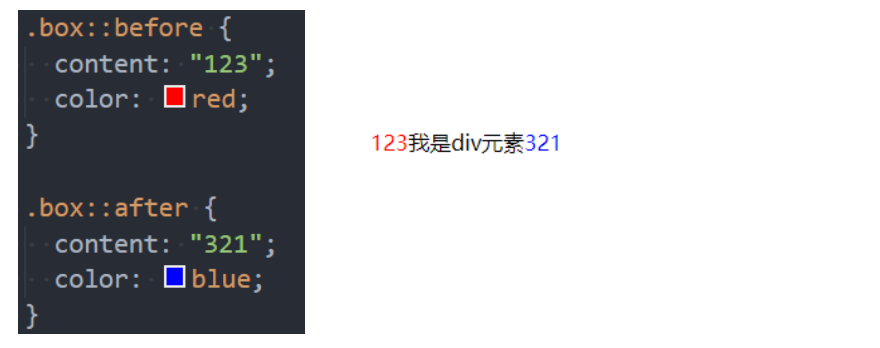

***


## CSS属性的继承

- **CSS的某些属性具有继承性(**Inherited**):**
  - 如果一个**属性具备继承性**, 那么**在该元素上设置后**, 它的**后代元素都可以继承这个属性;**
  - 当然, 如果**后代元素自己有设置该属性**, 那么**优先使用后代元素自己的属性**(不管继承过来的属性权重多高);

- **如何知道一个属性是否具有继承性呢?**
  - 常见的font-size/font-family/font-weight/line-height/color/text-align【文本相关的】都具有继承性;
  - 这些不用刻意去记, 用的多自然就记住了;

- **另外要多学会查阅文档, 文档中每个属性都有标明其继承性的:**

  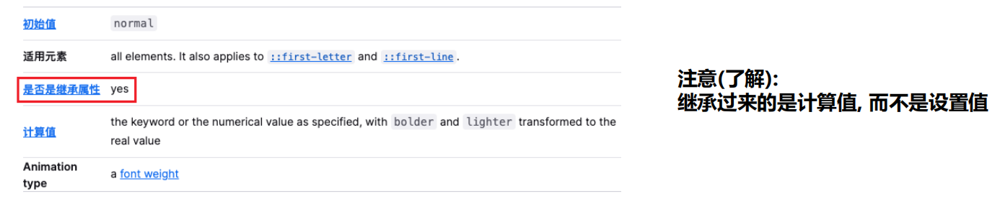

- **常见的继承属性**

  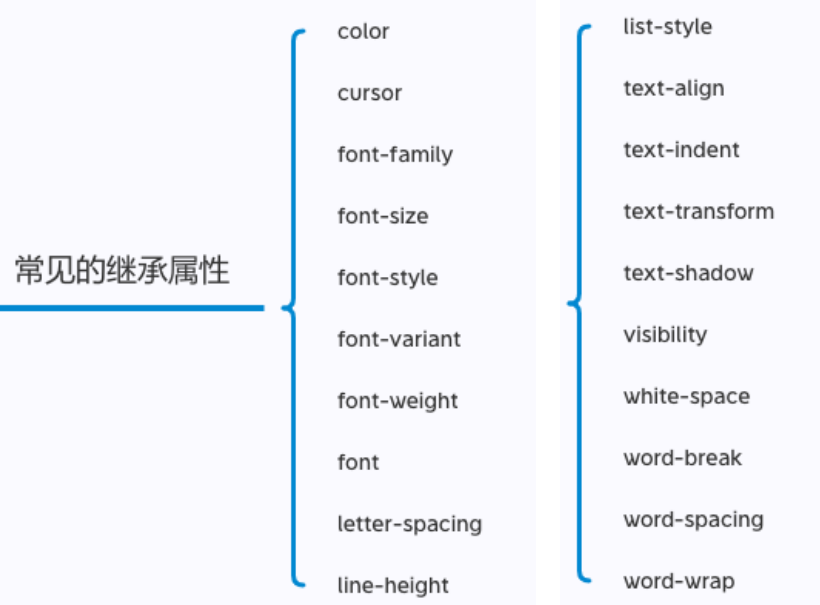

***


## **CSS属性的层叠**

- CSS的翻译是层叠样式表, 什么是**层叠**呢?
  - 对于一个元素来说, **相同一个属性**我们可以**通过不同的选择器给它进行多次设置**;
  - 那么属性会**被一层层覆盖上去;**
  - 但是最终**只有一个会生效;**

- **那么多个样式属性覆盖上去, 哪一个会生效呢?**
  - 判断一: **选择器的权重, 权重大的生效, 根据权重可以判断出优先级;**
  - 判断二: **先后顺序, 权重相同时, 后面设置的生效;**


#### **选择器的权重**

- **按照经验，为了方便比较CSS属性的优先级，可以给CSS属性所处的环境定义一个权值（权重）**

  - !important：10000

  - 内联样式：1000

  - id选择器：100

  - 类选择器、属性选择器、伪类：10

  - 元素选择器、伪元素：1

  - 通配符：0

    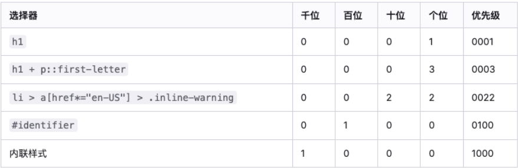

***


## **HTML元素的类型**

- 在前面我们会经常提到div是**块级元素**会独占一行, span是**行内级元素**会在同一行显示.
  - 到底什么是块级元素, 什么是行内级元素呢?

- **HTML定义元素类型的思路:**
  - HTML元素有很多, 比如h元素/p元素/div元素/span元素/img元素/a元素等等;
  - 当我们把这个元素放到页面上时, 这个元素到底占据页面中一行多大的空间呢?
    - 为什么我们这里只说一行呢? 因为垂直方向的高度通常是内容决定的;
  - 比如一个**h1元素的标题,** 我们必然是希望**它独占一行**的, 其他的内容**不应该和我的标题**放在一起;
  - 比如一个**p元素的段落**, 必然也**应该独占一行**, 其他的内容**不应该和我的段落**放在一起;
  - 而类似于**img/span/a元素**, 通常是对**内容的某一个细节的特殊描述, 没有必要独占一行;**
- 所以, **为了区分哪些元素需要独占一行**, **哪些元素不需要独占一行**, **HTML将元素区分(本质是通过CSS的)成了两类**:
  - **块级元素**（block-level elements）: 独占**父元素的一行**
  - **行内级元素**（inline-level elements）:**多个行内级元素可以在父元素的同一行中显示**


### **通过CSS修改元素类型**

- **前面我们说过, 事实上元素没有本质的区别:**

  - div是块级元素, span是行内级元素;

  - div之所以是块级元素仅仅是因为浏览器默认**设置了display属性**而已;

    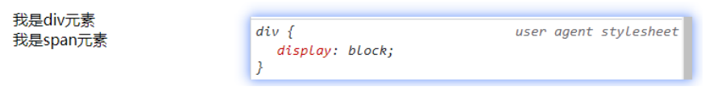

- **我们可以通过display来改变元素的特性**


### **display属性**

- **CSS中有个display属性，能修改元素的显示类型，有4个常用值**
  - block：让元素显示为块级元素
  - inline：让元素显示为行内级元素
  - inline-block：让元素同时具备行内级、块级元素的特征
  - none：隐藏元素


- 事实上display还有其他的值, 比如flex, 后续会专门学习;


- **block元素:**
  - 独占父元素的一行
  - 可以随意设置宽高
  - 高度默认由内容决定
- **inline-block元素:**
  - 跟其他行内级元素在同一行显示
  - 可以随意设置宽高
  - 可以这样理解
    - 对外来说，它是一个行内级元素
    - 对内来说，它是一个块级元素

- **inline:**
  - 跟其他行内级元素在同一行显示;
  - 不可以随意设置宽高;
  - 宽高都由内容决定;

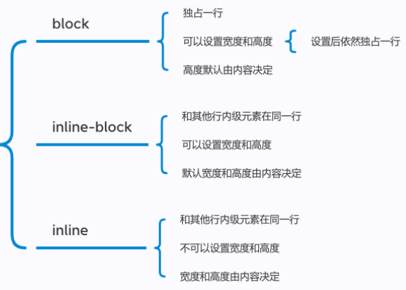


### **编写HTML时的注意事项**

- **块级元素、inline-block元素**
  - 一般情况下，**可以包含其他任何元素**（比如块级元素、行内级元素、inline-block元素）
  - 特殊情况，p元素不能包含其他块级元素

- **行内级元素（比如a、span、strong等）**
  - 一般情况下，只能**包含行内级元素**

***


## **元素隐藏方法**

- **方法一: display设置为none**
  - 元素不显示出来, 并且也不占据位置, **不占据任何空间**(和不存在一样);
  - **会影响子元素**


- **方法二: visibility设置为hidden**
  - 设置为hidden, 虽然元素不可见, 但是**会占据元素应该占据的空间**
  - **会影响子元素**
  - 默认为visible, 元素是可见的;


- **方法三: rgba设置颜色, 将a的值设置为0**
  - rgba的a设置的是alpha值, 可以设置透明度, **不影响子元素;**


- **方法四: opacity设置透明度, 设置为0**
  - 设置整个元素的透明度, **会影响所有的子元素;**


## overflow属性

- **overflow用于控制内容溢出时的行为**
  - visible：溢出的内容照样可见
  - hidden：溢出的内容直接裁剪
  - scroll：溢出的内容被裁剪，但可以通过滚动机制查看
    - 会一直显示滚动条区域，滚动条区域占用的空间属于width、height
  - auto：自动根据内容是否溢出来决定是否提供滚动机制


***


## **CSS样式不生效技巧**

- **为何有时候编写的CSS属性不好使，有可能是因为**
  - 选择器的**优先级太低**
  - 选择器**没选中对应的元素**
  - CSS属性的使用**形式不对**
    - 元素**不支持此CSS属性**，比如span默认是不支持width和height的
    - 浏览器**不支持此CSS属性**，比如旧版本的浏览器不支持一些css module3的某些属性
    - **被同类型的CSS属性覆盖**，比如font覆盖font-size


- 充分利用**浏览器的开发者工具进行调试（增加、修改样式）、查错**

***


## CSS盒子模型


### **认识盒子**

- **生活中, 我们经常会看到各种各样的盒子**

  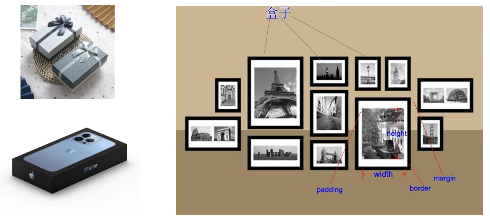


### **HTML每个元素都是盒子**

- 事实上, 我们可以把HTML每一个元素看出一个个的盒子:

  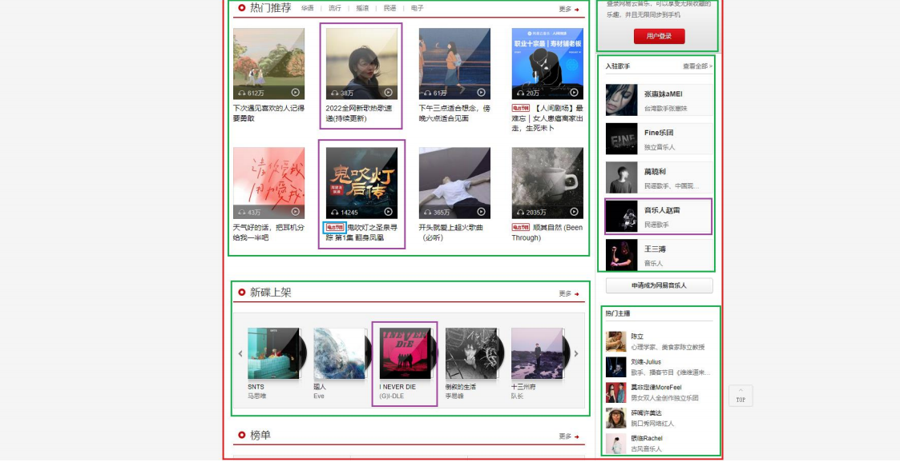


### **盒子模型(Box Model)**

- HTML中的每一个元素都**可以看做是一个盒子**，如右下图所示，可以具备这4个属性
- **内容（content）**
  - 元素的内容width/height
- **内边距（padding）**
  - 元素和内容之间的间距
- **边框（border）**
  - 元素自己的边框
- **外边距（margin）**
  - 元素和其他元素之间的间距

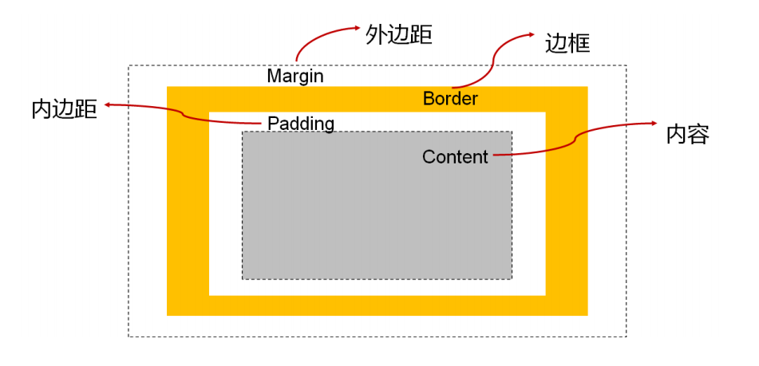


#### 盒子模型的四边

- 因为盒子有四边, 所以**margin/padding/border**都包括**top/right/bottom/left**四个边:

  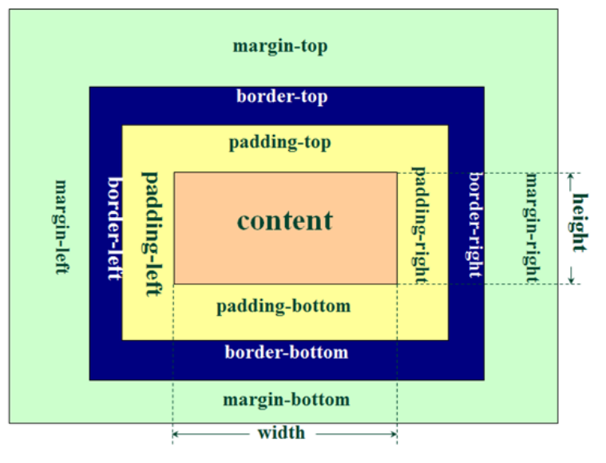


#### **在浏览器的开发工具中**

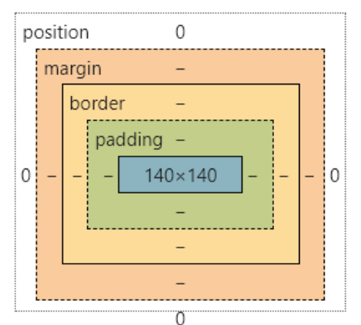


#### **内容 – 宽度和高度**

- **设置内容是通过宽度和高度设置的:**
  - 宽度设置: width
  - 高度设置: height

- 注意: 对于**行内级非替换元素**来说, 设置**宽高是无效**的!


- **另外我们还可以设置如下属性:**
  - **min-width：最小宽度**，无论内容多少，宽度都大于或等于min-width
  - **max-width：最大宽度**，无论内容多少，宽度都小于或等于max-width
  - **移动端适配**时, 可以设置最大宽度和最小宽度;


- **下面两个属性不常用:**
  - **min-height**：最小高度，无论内容多少，高度都大于或等于min-height
  - **max-height**：最大高度，无论内容多少，高度都小于或等于max-height


#### **内边距 - padding**

- **padding属性**用于设置盒子的内边距, 通常用于设置**边框和内容之间的间距;**
- **padding包括四个方向, 所以有如下的取值:**
  - padding-top：上内边距
  - padding-right：右内边距
  - padding-bottom：下内边距
  - padding-left：左内边距

- **padding单独编写是一个缩写属性：**
  - **padding-top、padding-right、padding-bottom、padding-left**的简写属性
  - padding缩写属性是**从零点钟方向开始**, 沿着**顺时针转动**的, 也就是**上右下左**;


- padding并非必须是**四个值**, 也可以有**其他值**;

  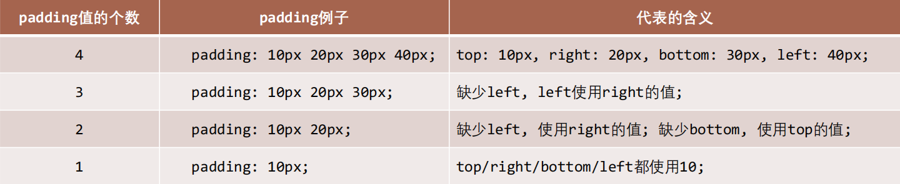


#### **边框 - border**

- **border用于设置盒子的边框:**

  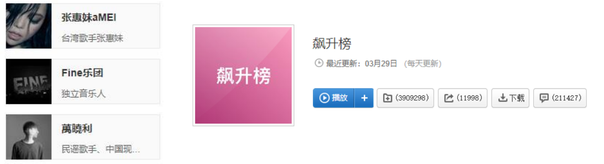

- **边框**相对于content/padding/margin来说特殊一些:
  - 边框具备**宽度**width;
  - 边框具备**样式**style;
  - 边框具备**颜色**color;


- **边框宽度**
  - border-top-width、border-right-width、border-bottom-width、border-left-width
  - border-width是上面4个属性的简写属性


- **边框颜色**
  - border-top-color、border-right-color、border-bottom-color、border-left-color
  - border-color是上面4个属性的简写属性


- **边框样式**
  - border-top-style、border-right-style、border-bottom-style、border-left-style
  - border-style是上面4个属性的简写属性


- **边框的样式有很多, 我们可以了解如下的几个:**

  - groove：凹槽, 沟槽, 边框看上去好象是雕刻在画布之内

  - ridge：山脊, 和grove相反，边框看上去好象是从画布中凸出来

    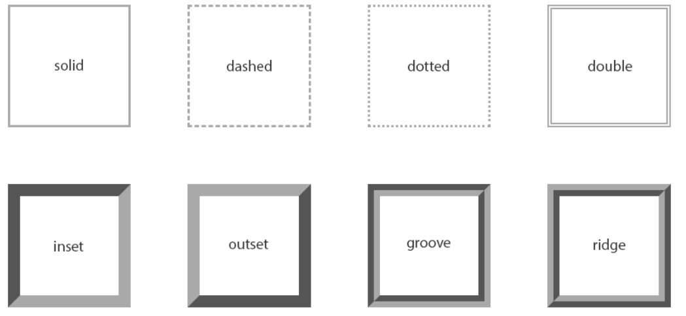


- **如果我们相对某一边同时设置 宽度 样式 颜色, 可以进行如下设置:**
  - border-top
  - border-right
  - border-bottom
  - border-left
  - border：统一设置4个方向的边框


- **边框颜色、宽度、样式的编写顺序任意**

  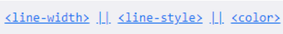


***


#### **圆角 – border-radius**

- **border-radius用于设置盒子的圆角**

  


- **border-radius常见的值:**
  - **数值**: 通常用来设置小的圆角, 比如6px;
  - **百分比**: 通常用来设置一定的弧度或者圆形;


- **border-radius事实上是一个缩写属性**
  - 将这四个属性 border-top-left-radius、border-top-right-radius、border-bottom-right-radius，和 border-bottomleft-radius 简写为一个属性。
  - 开发中比较少见一个个圆角设置;


- 如果一个元素是正方形, 设置border-radius大于或等于50%时，就会变成一个圆.

  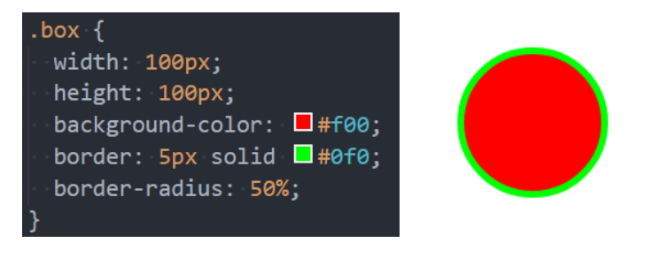


#### **外边距 - margin**

- **margin属性**用于设置盒子的**外边距**, 通常用于**元素和元素之间的间距**;
- **margin包括四个方向, 所以有如下的取值:**
  - margin-top：上内边距
  - margin-right：右内边距
  - margin-bottom：下内边距
  - margin-left：左内边距

- **margin单独编写是一个缩写属性：**
  - margin-top、margin-right、margin-bottom、margin-left的简写属性
  - margin缩写属性是**从零点钟方向开始**, 沿着**顺时针转动的**, 也就是**上右下左**;


- **margin也并非必须是四个值, 也可以有其他值;**

  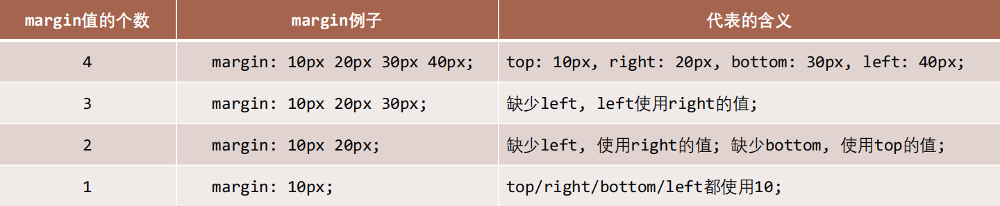


#### **上下margin的传递**

- **margin-top传递**
  - 如果**块级元素的顶部线和父元素的顶部线重叠**，那么**这个块级元素的margin-top值会传递给父元素**
- **margin-bottom传递**
  - 如果**块级元素的底部线和父元素的底部线重叠，并且父元素的高度是auto**，那么**这个块级元素的margin-bottom值会传递给父素**

- **如何防止出现传递问题？**
  - 给**父元素设置padding-top\padding-bottom**
  - 给**父元素设置border**
  - 触发BFC: **设置overflow为auto**


- **建议**
  - **margin**一般是用来**设置兄弟元素之间**的间距
  - **padding**一般是用来**设置父子元素之间**的间距


#### **上下margin的折叠**

- 垂直方向上相邻的2个margin（margin-top、margin-bottom）有可能会合并为1个margin，这种现象叫做**collapse**（折叠）
- 水平方向上的margin（margin-left、margin-right）永远不会collapse
- **折叠后最终值的计算规则**
  - 两个值进行比较，取较大的值
- **如何防止margin collapse？**
  - **只设置其中一个元素的margin**


#### **上下margin折叠的情况**

- **两个兄弟块级元素之间上下margin的折叠**

- **父子块级元素之间margin的折叠**

  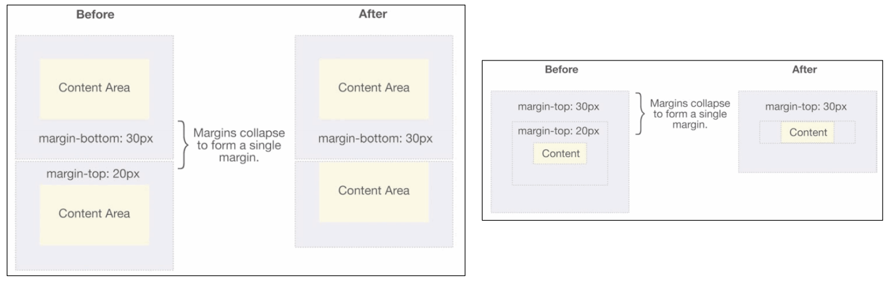


#### **外轮廓 - outline**

- outline表示元素的**外轮廓**
  - 不占用空间
  - 默认显示在border的外面

- **outline相关属性有**
  - outline-width: 外轮廓的宽度
  - outline-style：取值跟border的样式一样，比如solid、dotted等
  - outline-color: 外轮廓的颜色
  - outline：outline-width、outline-style、outline-color的简写属性，跟border用法类似


- **应用实例**
  - 去除a元素、input元素的focus轮廓效果


#### **盒子阴影 – box-shadow**

- **box-shadow属性可以设置一个或者多个阴影**
  - 每个阴影用```<shadow>```表示
  - 多个阴影之间用**逗号,隔开，从前到后叠加**

- **```<shadow>```的常见格式如下**

  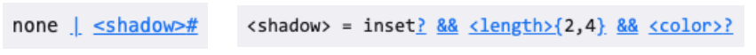

  - 第1个```<length>```：offset-x, 水平方向的偏移，正数往右偏移
  - 第2个```<length>```：offset-y, 垂直方向的偏移，正数往下偏移
  - 第3个```<length>```：blur-radius, 模糊半径
  - 第4个```<length>```：spread-radius, 延伸半径
  - ```<color>```：阴影的颜色，如果没有设置，就跟随color属性的颜色
  - inset：外框阴影变成内框阴影


- 我们可以通过一个网站测试盒子的阴影:

  - https://html-css-js.com/css/generator/box-shadow/

    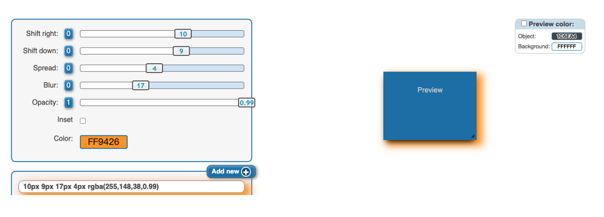


#### **文字阴影 - text-shadow**

- **text-shadow用法类似于box-shadow，用于给文字添加阴影效果**

- **```<shadow>```的常见格式如下**

  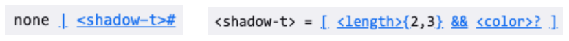

  - 相当于box-shadow, 它没有spread-radius的值;

- **我们可以通过一个网站测试文字的阴影:**

  - https://html-css-js.com/css/generator/box-shadow/

    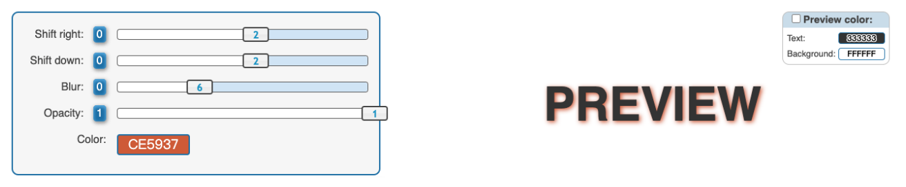


#### **行内非替换元素的注意事项**

- **以下属性对行内级非替换元素不起作用（eg. span元素）**

  - width、height、margin-top、margin-bottom

- **以下属性对行内级非替换元素的效果比较特殊**

  - padding、border【均可设置，但是垂直方向上设置的不占实际空间，而水平方向上占空间】

    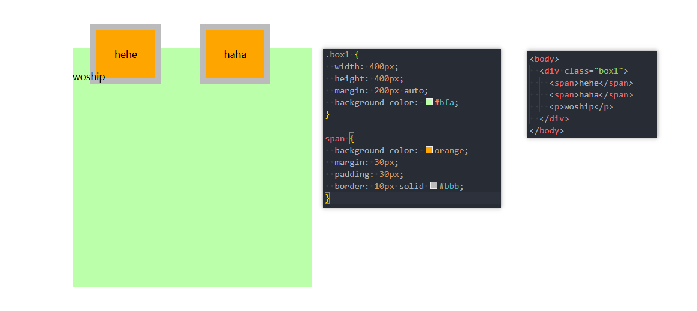


#### **CSS属性 - box-sizing**

- **box-sizing用来设置盒子模型中宽高的行为**

- **content-box**

  - padding、border都布置在width、height外边

    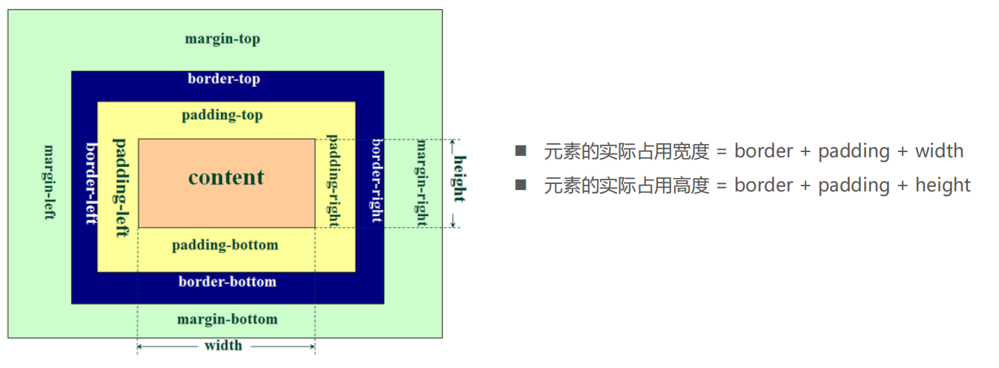

- **border-box**

  - padding、border都布置在width、height里边

    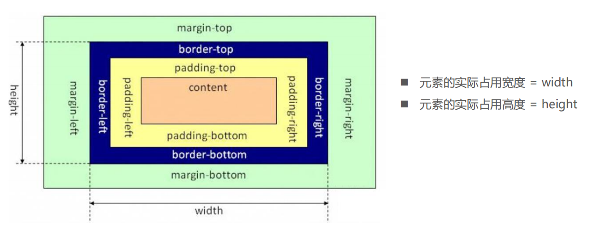


#### **IE盒子模型**

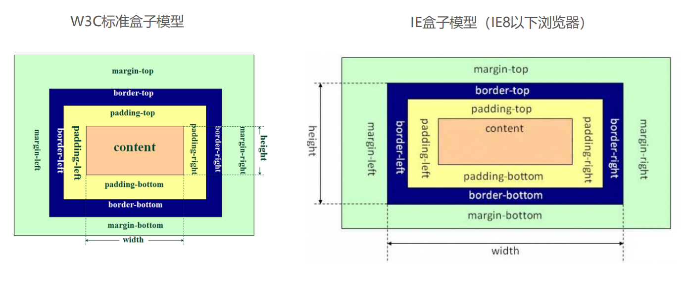


#### **元素的水平居中方案**

- **在一些需求中，需要元素在父元素中水平居中显示（父元素一般都是块级元素、inline-block）**
- **行内级元素(包括inline-block元素)**
  - 水平居中：在父元素中设置text-align: center
- **块级元素**
  - 水平居中：margin: 0 auto


## CSS背景

### **认识网页的背景**

- **在开发中, 为了让网页更加美观, 我们经常会设置各种各样的背景:**

  - 我们前面已经学习了如何**设置背景颜色**, 这里我们要学习**设置背景的更多知识;**

    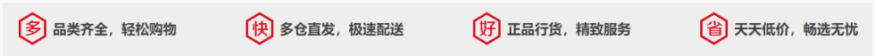

    


### **background-image**

- **background-image用于设置元素的背景图片**

  - 会**盖在(不是覆盖)background-color的上面**

- **如果设置了多张图片**

  - 设置的**第一张图片将显示在最上面，其他图片按顺序层叠在下面**

  

- **注意：如果设置了背景图片后，元素没有具体的宽高，背景图片是不会显示出来的**

  


### **background-repeat**

- **background-repeat用于设置背景图片是否要平铺**

- **常见的设值有**

  - repeat：平铺

  - no-repeat：不平铺

  - repeat-x：只在水平方向平铺

  - repeat-y：只在垂直平方向平铺

    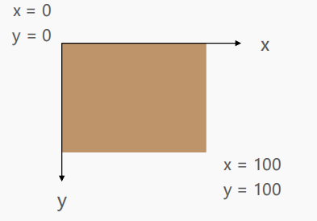

    

- 应用案例

  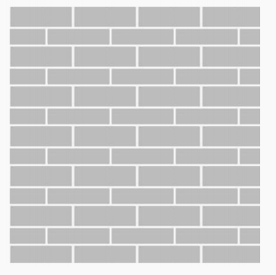


### **background-size**

- **background-size用于设置背景图片的大小**

  - auto：默认值, 以背景图本身大小显示

  - cover：缩放背景图，以完全覆盖铺满元素,可能背景图片部分看不见

  - contain：缩放背景图，宽度或者高度铺满元素，但是图片保持宽高比

  - ```<percentage>```：百分比，相对于背景区（background positioning area）

  - length：具体的大小，比如100px

    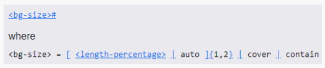


### **background-position**

- **background-position用于设置背景图片在水平、垂直方向上的具体位置**

  - 可以设置**具体的数值** 比如 20px 30px;

  - 水平方向还可以设值：**left、center、right**

  - 垂直方向还可以设值：**top、center、bottom**

  - 如果只**设置了1个方向，另一个方向默认是center**

    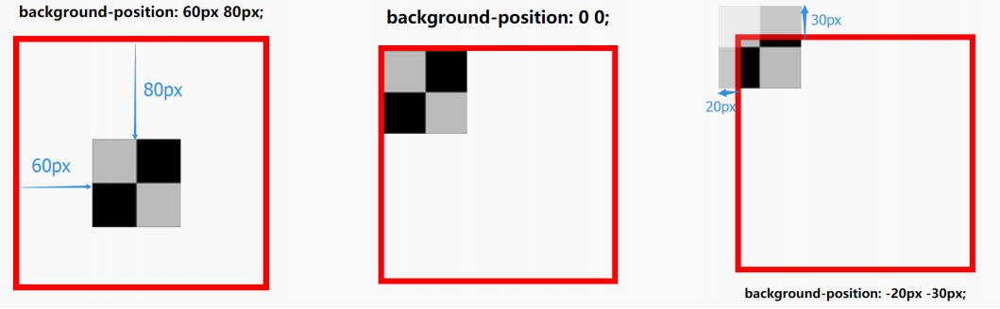


### **background-attachment**

- background-attachment**决定背景图像的位置是在视口内固定，或者随着包含它的区块滚动。**

- **可以设置以下3个值**
  - scroll：此关键属性值表示背景相对于元素本身固定， 而不是随着它的内容滚动
  - local：此关键属性值表示背景相对于元素的内容固定。如果一个元素拥有滚动机制，背景将会随着元素的内容滚动
  - fixed：此关键属性值表示背景相对于视口固定。即使一个元素拥有滚动机制，背景也不会随着元素的内容滚动。


### **background**

- **background是一系列背景相关属性的简写属性**

- **常用格式是**

  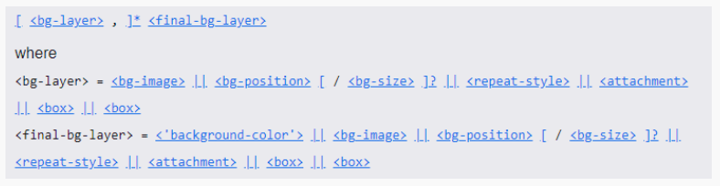

- background-size可以省略，如果不省略，/background-size必须紧跟在background-position的后面
- 其他属性也都可以省略，而且顺序任意


### **background-image和img对比**

- **利用background-image和img都能够实现显示图片的需求，在开发中该如何选择？**

  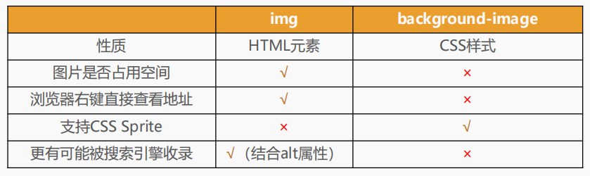


- **总结**
  - img，作为网页内容的重要组成部分，比如广告图片、LOGO图片、文章配图、产品图片
  - background-image，可有可无。有，能让网页更加美观。无，也不影响用户获取完整的网页内容信息


## border图形

- **border主要是用来给盒子增加边框的, 但是在开发中我们也可以利用边框的特性来实现一些形状:**

  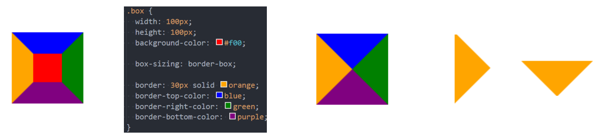


- **假如我们将border宽度设置成50会是什么效果呢?**
  - 如果我们进一步, 将另外三边的颜色去除呢?
  - 如果我们将这个盒子旋转呢?


- **所以利用border或者CSS的特性我们可以做出很多图形:**
  - https://css-tricks.com/the-shapes-of-css/#top-of-site


## **认识Web字体**

- **在之前我们有设置过页面使用的字体: font-family**
  - 我们需要提供**一个或多个字体种类名称**，浏览器会在**列表中搜寻**，直到找到它**所运行的系统上可用的字体**。
  - 这样的方式完全没有问题，但是对于传统的web开发人员来说，**字体选择是有限的**;
  - 这就是所谓的 **Web-safe 字体;**
  - 并且这种默认可选的字体**并不能进行一些定制化的需求;**


- **比如下面的字体样式, 系统的字体肯定是不能实现的**

  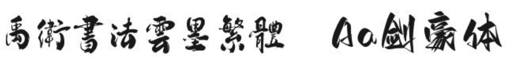


- 那么我们是否依然可以在网页中使用这些字体呢?  **使用Web Fonts即可**.


### **Web fonts的工作原理**

- 首先, 我们需要通过一些渠道**获取到希望使用的字体**(不是开发来做的事情):
  - 对于某些**收费的字体**, 我们需要获取到**对应的授权**;
  - 对于某些**公司定制的字体**, 需要**设计人员来设计**;
  - 对于某些**免费的字体**, 我们需要**获取到对应的字体文件**;


- 其次, 在我们的CSS代码当中**使用该字体**(重要):
  - 具体的过程看后面的操作流程;
- 最后, 在**部署静态资源**时, 将**HTML/CSS/JavaScript/Font一起部署在静态服务器**中;


- **用户的角度:**
  - 浏览一个网页时, 因为代码中有引入字体文件, **字体文件会被一起下载下来**;
  - 浏览器会根据使用的字体在**下载的字体文件中查找、解析、使用对应的字体；**
  - **在浏览器中使用对应的字体显示内容**；


### **使用Web Fonts**

- 第一步：在字体天下网站下载一个字体
  - https://www.fonts.net.cn/fonts-zh-1.html
  - 默认下载下来的是ttf文件；
- 第二步：使用字体；


- **使用过程如下：**

  - 1.将字体放到对应的目录中

  - 2.通过@font-face来引入字体, 并且设置格式

  - 3.使用字体

    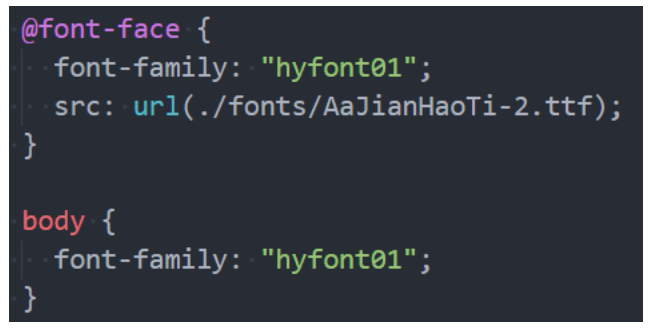


- **注意: @font-face 用于加载一个自定义的字体;**


### **web-fonts的兼容性**

- **我们刚才使用的字体文件是 .ttf, 它是TrueType字体.**
  - 在开发中某些浏览器可能不支持该字体, 所以为了浏览器的兼容性问题, 我们需要有对应其他格式的字体;
- **TrueType字体：拓展名是 .ttf**
  - **OpenType/TrueType字体**：拓展名是 .ttf、.otf，建立在TrueType字体之上
  - **Embedded OpenType字体**：拓展名是 .eot，OpenType字体的压缩版
  - **SVG字体**：拓展名是 .svg、 .svgz
  - **WOFF表示Web Open Font Format web开放字体**：拓展名是 .woff，建立在TrueType字体之上


- **这里我们提供一个网站来生产对应的字体文件:**
  - https://font.qqe2.com/# 暂时可用


### **web fonts兼容性写法**

- **如果我们具备很强的兼容性, 那么可以如下格式编写:**

  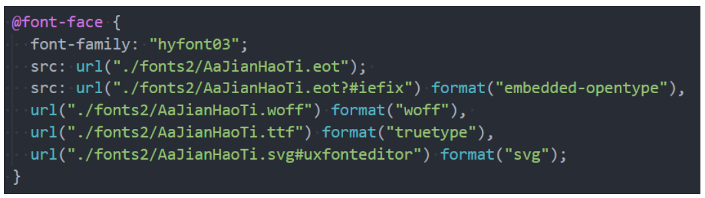


- **这被称为"bulletproof @font-face syntax（刀枪不入的@font-face语法）“:**
  - 这是 **Paul Irish**早期的一篇文章提及后@font-face开始流行起来 (Bulletproof @font-face Syntax)。

- **src用于指定字体资源**
  - **url**指定资源的路径
  - **format**用于帮助浏览器快速识别字体的格式;


### **认识字体图标**

- 思考：字体可以**设计成各式各样的形状**，那么**能不能把字体直接设计成图标的样子**呢？
  - 当然可以，这个就叫做**字体图标**。


- **字体图标的好处：**
  - 放大不会失真
  - 可以任意切换颜色
  - 用到很多个图标时，文件相对图片较小


- **字体图标的使用：**
  - 登录阿里icons（https://www.iconfont.cn/）
  - 下载代码，并且拷贝到项目中


- **将字体文件和默认的css文件导入到项目中**


### **字体图标的使用**

- 字体图标的使用步骤:
  - 第一步: 通过link引入iconfont.css文件
  - 第二步: 使用字体图标


- **使用字体图标常见的有两种方式:**

  - 方式一: 通过对应字体**图标的Unicode**来显示代码;

  - 方式二: 利用已经**编写好的class**, 直接使用即可;

    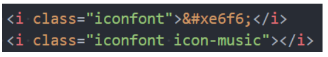


## **认识精灵图 CSS Sprite**

- **什么是CSS Sprite**
  - 是一种**CSS图像合成技术**，将**各种小图片合并到一张图片**上，然后**利用CSS的背景定位来显示对应的图片部分**
  - 有人翻译为：**CSS雪碧、CSS精灵**


- **使用CSS Sprite的好处**
  - 减少网页的**http请求数量，加快网页响应速度，减轻服务器压力**
  - 减小**图片总大小**
  - 解决了**图片命名的困扰**，只需要针对一张集合的图片命名


- **Sprite图片制作（雪碧图、精灵图）**
  - 方法1：Photoshop, 设计人员提供
  - 方法2：https://www.toptal.com/developers/css/sprite-generator


### **精灵图的使用**

- **精灵图如何使用呢?**
  - 精灵图的原理是**通过只显示图片的很小一部分来展示**的；
  - **通常使用背景:**
    - 1.设置对应元素的宽度和高度
    - 2.设置精灵图作为背景图片
    - 3.调整背景图片的位置来展示


- **如何获取精灵图的位置**

  - http://www.spritecow.com/

    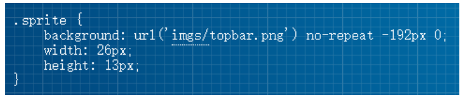


## **cusor**

- **cursor可以设置鼠标指针（光标）在元素上面时的显示样式**
- **cursor常见的设值有**
  - **auto**：浏览器根据上下文决定指针的显示样式，比如根据文本和非文本切换指针样式
  - **default**：由操作系统决定，一般就是一个小箭头
  - **pointer**：一只小手，鼠标指针挪动到链接上面默认就是这个样式
  - **text**：一条竖线，鼠标指针挪动到文本输入框上面默认就是这个样式
  - **none**：没有任何指针显示在元素上面


## CSS元素定位

### 标准流（**Normal Flow**）

- 默认情况下，元素都是按照**normal flow**（标准流、常规流、正常流、文档流【document flow】）进行排布
  - **从左到右、从上到下**按顺序摆放好
  - 默认情况下，**互相之间不存在层叠现象**

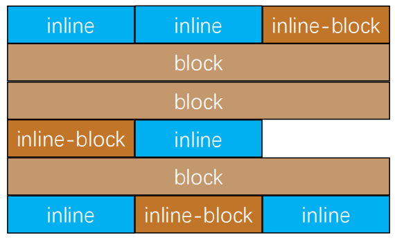

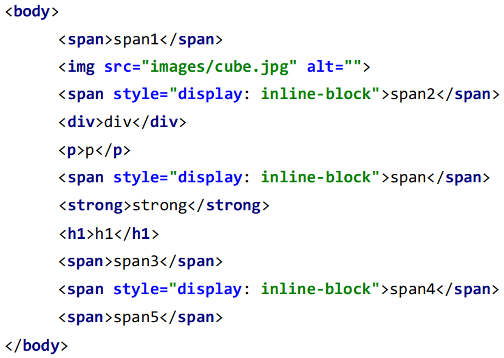


- 在标准流中，可以使用**margin、padding**对元素进行定位
  - 其中margin还可以设置负数
- **比较明显的缺点是**
  - 设置一个元素的**margin或者padding**，通常会**影响到标准流中其他元素**的定位效果
  - **不便于实现元素层叠的效果**


- **如果我们希望一个元素可以跳出标准流,单独的对某个元素进行定位呢?**
  - 我们可以通过**position属性**来进行设置;


### **认识元素的定位**

- 定位允许您从**正常的文档流布局中取出元素**，并使它们具有不同的行为:
  - 例如**放在另一个元素的上面**;
  - 或者**始终保持在浏览器视窗内的同一位置;**


- **定位在开发中非常常见:**

  


#### **认识position属性**

- **利用position可以对元素进行定位，常用取值有5个:**

  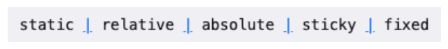

- **默认值:**
  - **static**：默认值, 静态定位


- **使用下面的值, 可以让元素变成 定位元素(**positioned element)
  - **relative**：相对定位
  - **absolute**：绝对定位
  - **fixed**：固定定位
  - **sticky**：粘性定位


##### **静态定位 - static**

- **position属性的默认值**
  - 元素按照**normal flow**布局
  - **left 、right、top、bottom**没有任何作用


##### **相对定位 - relative**

- 元素按照**normal flow**布局
- 可以通过**left、right、top、bottom**进行定位
  - 定位**参照对象**是元素**自己原来的位置**

- **left、right、top、bottom用来设置元素的具体位置，对元素的作用如下图所示**

  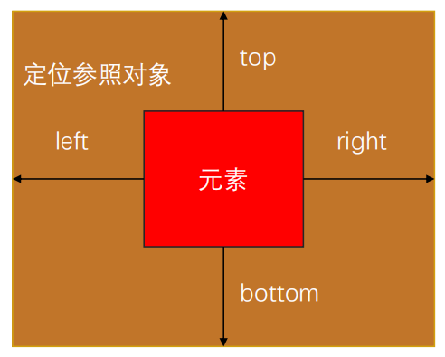


- **相对定位的应用场景**
  - 在**不影响其他元素位置的前提**下，对**当前元素位置进行微调**


##### **固定定位 - fixed**

- 元素**脱离normal flow**（脱离标准流、脱标）
- 可以通过**left、right、top、bottom**进行定位
- **定位参照对象是视口（viewport）**
- **当画布滚动时，固定不动**


###### **画布 和 视口**

- **视口（Viewport）**
  - 文档的可视区域
  - 如下图**红框**所示


- **画布（Canvas）**
  - 用于渲染文档的区域
  - 文档内容超出视口范围，可以通过滚动查看
  - 如下图**黑框**所示


- **宽高对比**
  - 画布 >= 视口

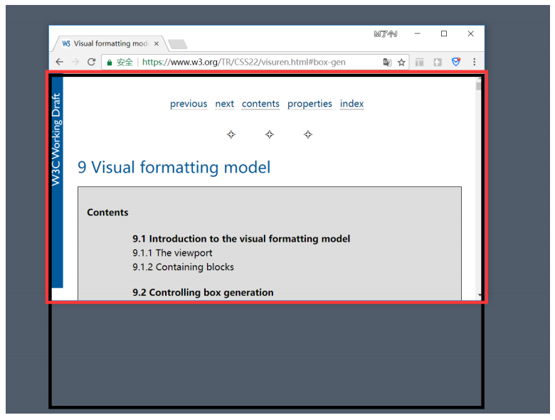


##### **绝对定位 - absolute**

- **元素脱离normal flow（脱离标准流、脱标）**

- **可以通过left、right、top、bottom进行定位**
  - 定位参照对象是**最邻近的定位祖先元素**
  - 如果**找不到这样的祖先元素，参照对象是视口**

- **定位元素（positioned element）**
  - position值不为**static**的元素
  - 也就是position值为**relative、absolute、fixed**的元素


##### **粘性定位 - sticky**

- 另外还有一个定位的值是**position: sticky**，比起**其他定位值要新一些**.
  - sticky是一个大家期待已久的属性;
  - 可以看做是**相对定位和固定(绝对)定位的结合体;**
  - 它允许被定位的元素**表现得像相对定位一样**，直到它滚动到某个阈值点;
  - 当**达到这个阈值点**时, 就会**变成固定(绝对)定位;**


- sticky是相对于最近的滚动祖先包含滚动视口的(the nearest ancestor scroll container’s scrollport )


#### **子绝父相**

- 在绝大数情况下，子元素的**绝对定位都是相对于父元素进行定位**

- **如果希望子元素相对于父元素进行定位，又不希望父元素脱标，常用解决方案是：**
  - 父元素设置**position: relative**（让父元素成为定位元素，而且父元素不脱离标准流）
  - 子元素设置**position: absolute**
  - 简称为“**子绝父相**”


### 脱标元素的特点


#### **将position设置为absolute/fixed元素的特点(一)**

- **可以随意设置宽高**
- **宽高默认由内容决定**
- **不再受标准流的约束**
  - 不再严格按照从上到下、从左到右排布
  - 不再严格区分块级(block)、行内级(inline)，行内块级(inline-block)的很多特性都会消失

- **不再给父元素汇报宽高数据**
- **脱标元素内部默认还是按照标准流布局**


#### **将position设置为absolute/fixed元素的特点(二)**

- **绝对定位元素（absolutely positioned element）**
  - position值为**absolute**或者**fixed**的元素


- **对于绝对定位元素来说**
  - 定位参照对象的宽度 = left + right + margin-left + margin-right + 绝对定位元素的实际占用宽度
  - 定位参照对象的高度 = top + bottom + margin-top + margin-bottom + 绝对定位元素的实际占用高度


- **如果希望绝对定位元素的宽高和定位参照对象一样，可以给绝对定位元素设置以下属性**
  - left: 0、right: 0、top: 0、bottom: 0、margin:0


- **如果希望绝对定位元素在定位参照对象中居中显示，可以给绝对定位元素设置以下属性**
  - left: 0、right: 0、top: 0、bottom: 0、margin: auto
  - 另外，还得**设置具体的宽高值**（宽高小于定位参照对象的宽高）


### **auto到底是什么?**

- 800 = 200 + ml0 + mr0 + 0 + 0
- **auto -> 交给浏览器你来处理**
- **width: auto;**
- 1.行内非替换元素 -> width: 包裹内容
- 2.块级元素 ->width: 包含块的宽度
- 3.绝对定位元素 -> width: 包裹内容


### **position值对比**

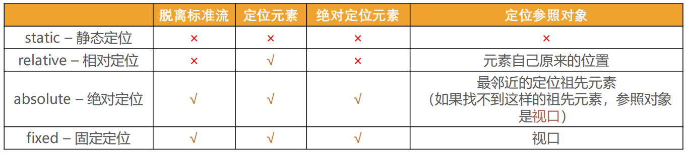


### **z-index**

- z-index属性用来设置定位元素的**层叠顺序**（仅对定位元素有效）
  - 取值可以是**正整数、负整数、0**


- **比较原则**
  - 如果是**兄弟关系**
    - **z-index越大，层叠在越上面**
    - **z-index相等，写在后面的那个元素层叠在上面**
  - 如果**不是兄弟关系**
    - 各自**从元素自己以及祖先元素中，找出最邻近的2个定位元素进行比较**
    - 而且**这2个定位元素必须有设置z-index的具体数值**
  
  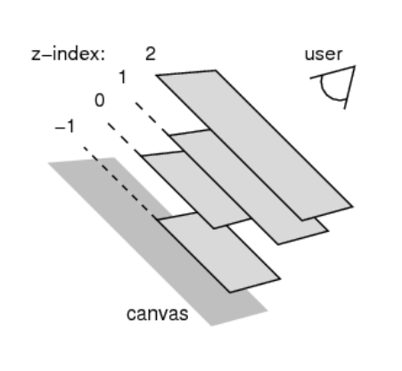


## CSS浮动


- **float**属性可以指定一个元素应**沿其容器**的**左侧**或**右侧**放置，允**文本和内联元素环绕它**。
  - float 属性最初只用于在一段文本内**浮动图像, 实现文字环绕的效果;**
  - 但是早期的CSS标准中并没有提供好的**左右布局方案**, 因此在一段时间里面它成为**网页多列布局的最常用工具;**


- **绝对定位、浮动都会让元素脱离标准流，以达到灵活布局的效果**


- **可以通过float属性让元素产生浮动效果，float的常用取值**
  - none：不浮动，默认值
  - left：向左浮动
  - right：向右浮动


### **浮动规则一**

- **元素一旦浮动后, 脱离标准流**

  - 朝着向左或向右方向移动，直到自己的边界紧贴着包含块（一般是父元素）或者其他浮动元素的边界为止

  - 定位元素会层叠在浮动元素上面

    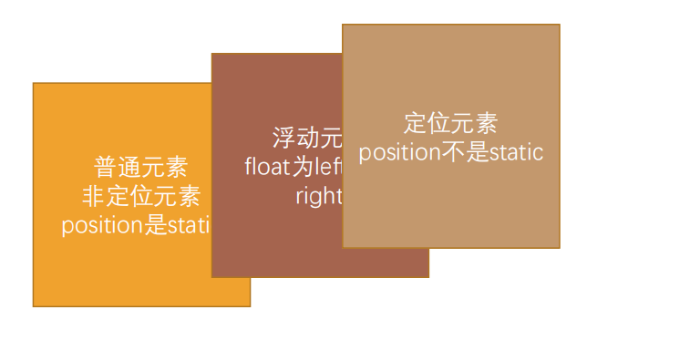


### **浮动规则二**

- 如果元素是向左（右）浮动，浮动元素的左（右）边界不能超出**包含块**的左（右）边界

  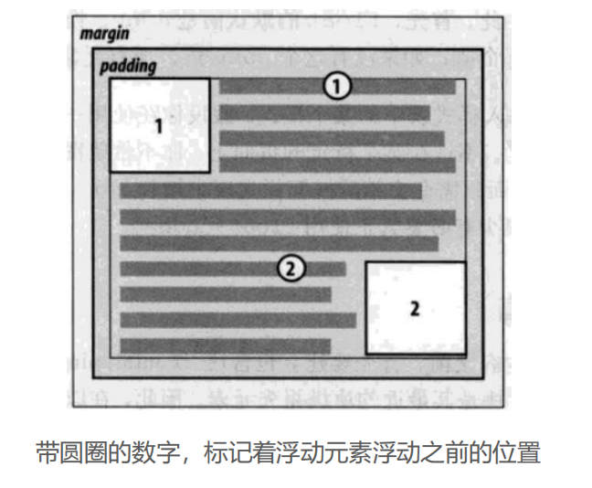


### **浮动规则三**

- **浮动元素之间不能层叠**

  - 如果一个元素浮动，另一个浮动元素已经在那个位置了，后浮动的元素将紧贴着前一个浮动元素（左浮找左浮，右浮找右浮）

  - 如果水平方向剩余的空间不够显示浮动元素，浮动元素将向下移动，直到有充足的空间为止

    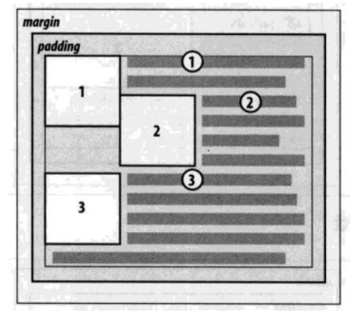


### **浮动规则四**

- **浮动元素不能与行内级内容层叠，行内级内容将会被浮动元素推出**

  - 比如行内级元素、inline-block元素、块级元素的文字内容

    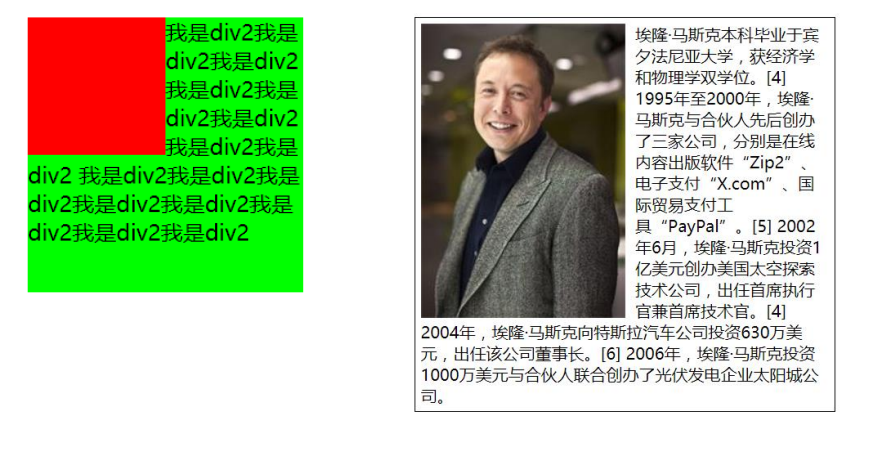


### **浮动规则五**

- **行内级元素、inline-block元素浮动后，其顶部将与所在行的顶部对齐**

  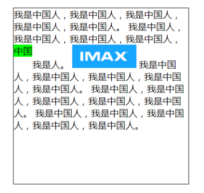


### **浮动的问题 – 高度塌陷**

- 由于浮动元素脱离了标准流，变成了脱标元素，所以**不再向父元素汇报高度**
  - 父元素计算总高度时，就不会计算浮动子元素的高度，导致了高度坍塌的问题
- 解决父元素高度坍塌问题的过程，一般叫做**清浮动（清理浮动、清除浮动）**
- **清浮动的目的是**
  - 让父元素计算总高度的时候，把浮动子元素的高度算进去


### 清除浮动

- **clear属性**
  - clear 属性可以指定一个元素是否必须移动(清除浮动后)到在它之前的浮动元素下面;


- **clear的常用取值**
  - left：要求元素的顶部低于之前生成的所有左浮动元素的底部
  - right：要求元素的顶部低于之前生成的所有右浮动元素的底部
  - both：要求元素的顶部低于之前生成的所有浮动元素的底部
  - none：默认值，无特殊要求


- **我们可以利用这个特性来清除浮动.**


#### 方法

- **方法一: 给父元素设置固定高度**

  - 扩展性不好（不推荐）

- **方法二: 在父元素最后增加一个空的块级子元素，并且让它设置clear: both**

  - 会**增加很多无意义的空标签**，维护麻烦
  - 违反了结构与样式分离的原则（不推荐）

- **方法三: 给父元素添加一个伪元素**

  - **推荐;**

  - 编写好后可以轻松实现清除浮动;

    - 给父元素增加**::after伪元素**

      ```css
      .clear-fix::after {
          content: "";
          display: block;
          clear: both;
          
          visibility: hidden; /* 浏览器兼容性 */
          height: 0; /* 浏览器兼容性 */
      }
      
      .clear-fix {
          *zoom: 1; /* IE6/7兼容性 */
      }
      ```


### 布局方案总结

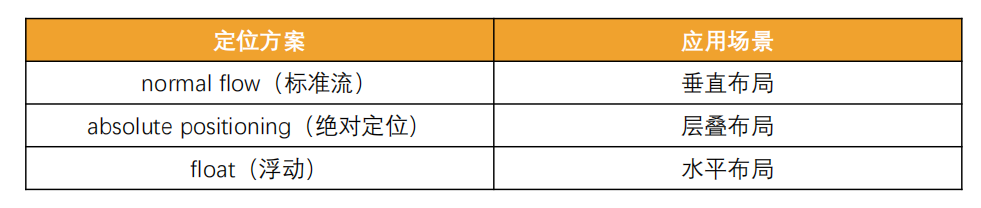


## CSS flex布局

- **Flexbox翻译为弹性盒子**
  - 弹性盒子是一种用于按行或按列布局元素的一维布局方法 ;
  - 元素可以膨胀以填充额外的空间, 收缩以适应更小的空间;
  - 通常我们使用Flexbox来进行布局的方案称之为flex布局(flex layout);
- **flex布局是目前web开发中使用最多的布局方案：**
  - flex 布局（Flexible 布局，弹性布局）;
  - 目前特别在**移动端**可以说已经完全普及;
  - 在**PC端**也几乎已经完全普及和使用, 只有**非常少数的网站依然在用浮动来布局;**
- **为什么需要flex布局呢?**
  - 长久以来，CSS 布局中唯一可靠且跨浏览器兼容的**布局工具只有 floats 和 positioning。**
  - 但是这两种方法本身**存在很大的局限性**, 并且他们用于布局实在是无奈之举;


### **原先的布局存在的痛点**

- **原来的布局存在哪些痛点呢? 举例说明:**

  - 比如在父内容里面**垂直居中一个块内容**。

    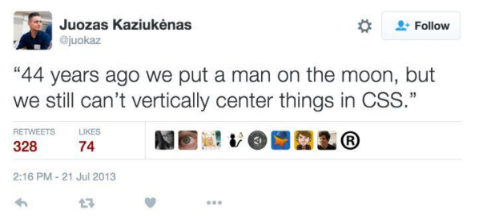

  - 比如使容器的**所有子项等分可用宽度/高度**，而**不管有多少宽度/高度可用**。

  - 比如使**多列布局中的所有列采用相同的高度**，即使**它们包含的内容量不同**。


### **flex布局的出现**

- 所以长久以来, 大家非常期待一种真正可以用于对元素布局的方案:**于是flex布局出现了;**

  - Nature and nature's laws lay hid in night; God said "Let Newton be" and all was light.
  - 自然与自然的法则在黑夜隐藏，于是上帝说，让**牛顿**出现吧！于是世界就明亮了起来.

- **flexbox在使用时, 我们最担心的是它的兼容性问题:**

  - 我们可以在caniuse上查询到具体的兼容性

    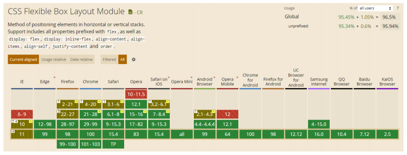


### **flex布局的重要概念**

- **两个重要的概念：**

  - 开启了 flex 布局的元素叫 **flex container**

  - flex container 里面的**直接子元素**叫做 **flex item**

    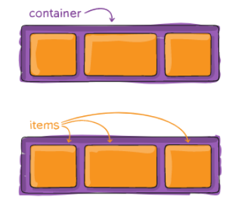

- **当flex container中的子元素变成了flex item时, 具备一下特点:**

  - flex item的布局将**受flex container属性的设置来进行控制和布局;**
  - flex item**不再严格区分块级元素和行内级元素;**
  - flex item**默认情况下是包裹内容**的, **但是可以设置宽度和高度;**


- **设置 display 属性为 flex 或者 inline-flex 可以成为 flex container**
  - **flex**： flex container 以 **block-level** 形式存在
  - **inline-flex**： flex container 以 **inline-level** 形式存在


### **flex布局的模型**

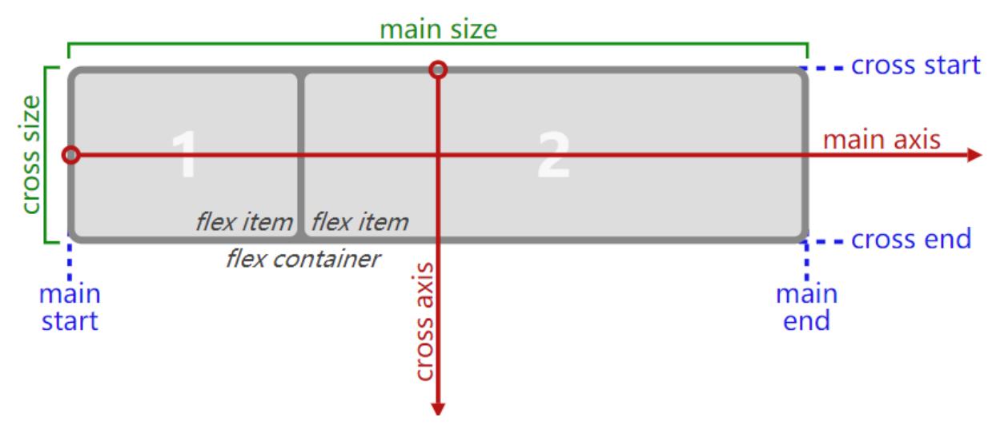


- 应用在 flex container 上的 CSS 属性
  - flex-flow
  - flex-direction
  - flex-wrap
  - justify-content
  - align-items
  - align-content
- 应用在 flex items 上的 CSS 属性
  - flex-grow
  - flex-basis
  - flex-shrink
  - order
  - align-self
  - flex


- **flex-direction**

  - **flex items 默认都是沿着 main axis（主轴）从 main start 开始往 main end 方向排布**

    - flex-direction 决定了 main axis 的方向，有 4 个取值

    - row（默认值）、row-reverse、column、column-reverse

      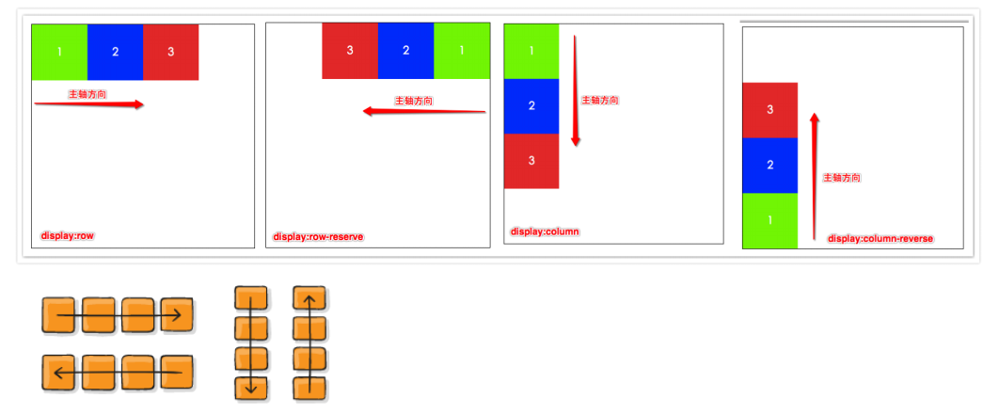

- **flex-wrap**

  - **flex-wrap 决定了 flex container 是单行还是多行**

    - nowrap（默认）：单行

    - wrap：多行

    - wrap-reverse：多行（对比 wrap，cross start 与 cross end 相反）

      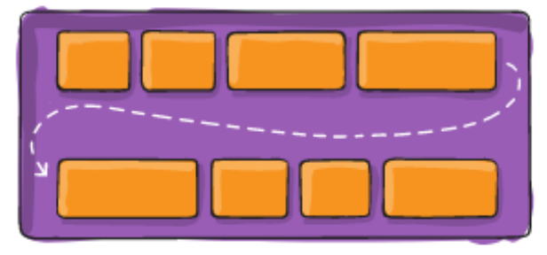

  

- **flex-flow**

  - **flex-flow 属性是 flex-direction 和 flex-wrap 的简写**

    - 顺序任何, 并且都可以省略;

      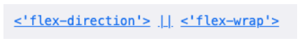

  

- **justify-content**

  - **justify-content 决定了 flex items 在 main axis 上的对齐方式**

    - flex-start（默认值）：与 main start 对齐
    - flex-end：与 main end 对齐
    - center：居中对齐
    - space-between：
      - flex items 之间的距离相等
      - 与 main start、main end两端对齐
    - space-around：
      - flex items 之间的距离相等
      - flex items 与 main start、main end 之间的距离是 flex items 之间距离的一半
    - space-evenly：
      - flex items 之间的距离相等
      - flex items 与 main start、main end 之间的距离 等于 flex items 之间的距离

    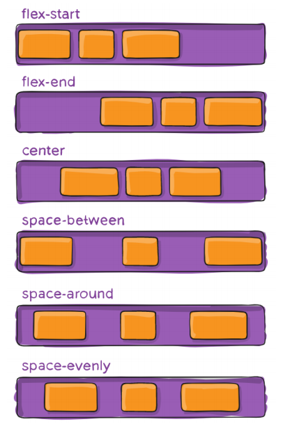


- **align-item**

  - **align-items 决定了 flex items 在 cross axis 上的对齐方式**
    - normal：在弹性布局中，效果和stretch一样
    - stretch：当 flex items 在 cross axis 方向的 size 为 auto 时，会自动拉伸至填充 flex container
    - flex-start：与 cross start 对齐
    - flex-end：与 cross end 对齐
    - center：居中对齐
    - baseline：与基准线对齐

  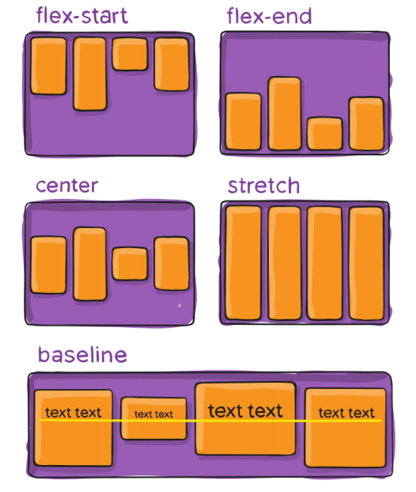


- **align-content**

  - **align-content 决定了多行 flex items 在 cross axis 上的对齐方式，用法与 justify-content 类似**

    - stretch（默认值）：与 align-items 的 stretch 类似

    - flex-start：与 cross start 对齐

    - flex-end：与 cross end 对齐

    - center：居中对齐

    - space-between：

      - flex items 之间的距离相等
      - 与 cross start、cross end两端对齐

    - space-around：

      - flex items 之间的距离相等
      - flex items 与 cross start、cross end 之间的距离是 flex items 之间距离的一半

    - space-evenly：

      - flex items 之间的距离相等
      - flex items 与 cross start、cross end 之间的距离 等于 flex items 之间的距离

      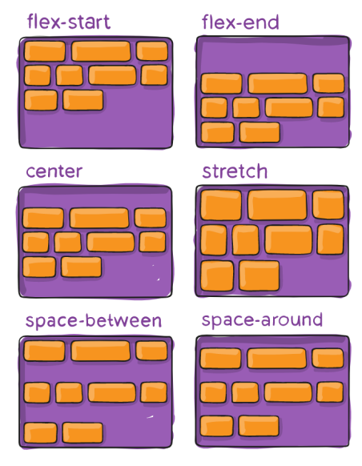


- **flex-item属性 - order**

  - **order 决定了 flex items 的排布顺序**

    - 可以设置任意整数（正整数、负整数、0），值越小就越排在前面
    - 默认值是 0

    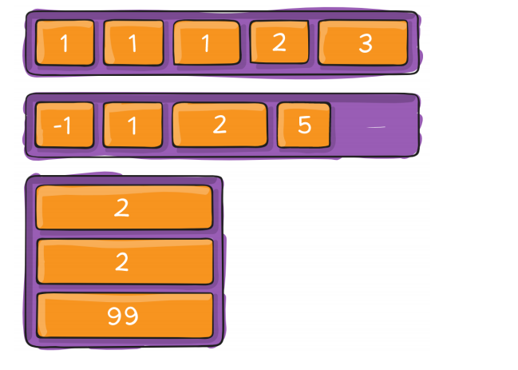


- **flex-item属性 - align-self**

  - **flex items 可以通过 align-self 覆盖 flex container 设置的 align-items**

    - auto（默认值）：遵从 flex container 的 align-items 设置
    - stretch、flex-start、flex-end、center、baseline，效果跟 align-items 一致

    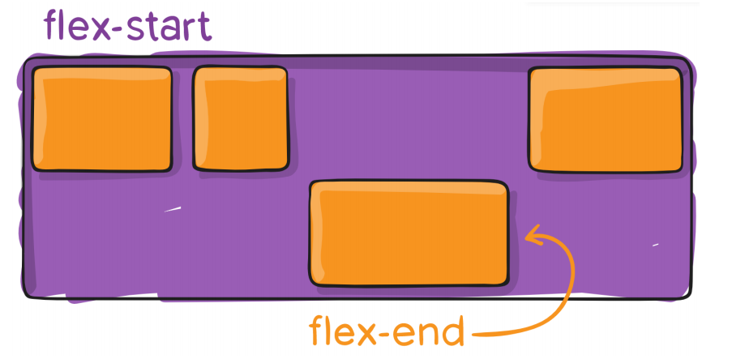


- **flex-item属性 - flex-grow**

  - **flex-grow 决定了 flex items 如何扩展(拉伸/成长)**

    - 可以设置任意非负数字（正小数、正整数、0），默认值是 0
    - 当 flex container 在 main axis 方向上有剩余 size 时，flex-grow 属性才会有效

  - 如果所有 flex items 的 flex-grow 总和 sum 超过 1，每个 flex item 扩展的 size 为

    - flex container 的剩余 size * flex-grow / sum

    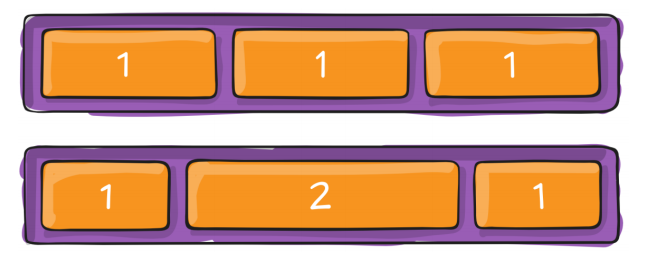

  - **flex items 扩展后的最终 size 不能超过 max-width\max-height**


- **flex-item属性 - flex-shrink**
  - **flex-shrink 决定了 flex items 如何收缩(缩小)**
    - 可以设置任意非负数字（正小数、正整数、0），默认值是 1
    - 当 flex items 在 main axis 方向上超过了 flex container 的 size，flex-shrink 属性才会有效
  - **如果所有 flex items 的 flex-shrink 总和超过 1，每个 flex item 收缩的 size为**
    - flex items 超出 flex container 的 size * 收缩比例 / 所有 flex items 的收缩比例之和
  - **flex items 收缩后的最终 size 不能小于 min-width\min-height**


- **flex-item属性 - flex-basis**
  - **flex-basis 用来设置 flex items 在 main axis 方向上的 base size**
    - auto（默认值）、具体的宽度数值（100px）
  - **决定 flex items 最终 base size 的因素，从优先级高到低**
    - max-width\max-height\min-width\min-height
    - flex-basis
    - width\height
    - 内容本身的 size


- **flex-item属性 - flex属性**

  - **flex 是 flex-grow || flex-shrink || flex-basis 的简写,flex 属性可以指定1个，2个或3个值。**

    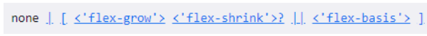

  - **单值语法: 值必须为以下其中之一:**

    - 一个无单位数(```<number>```): 它会被当作```<flex-grow>```的值。
    - 一个有效的宽度(width)值: 它会被当作 ```<flex-basis>```的值。
    - 关键字none，auto或initial.

  - **双值语法: 第一个值必须为一个无单位数，并且它会被当作 ```<flex-grow>``` 的值。**

    - 第二个值必须为以下之一：
      - 一个无单位数：它会被当作``` <flex-shrink>``` 的值
      - 一个有效的宽度值: 它会被当作 ```<flex-basis> ```的值

  - **三值语法:**

    - 第一个值必须为一个无单位数，并且它会被当作``` <flex-grow>``` 的值。
    - 第二个值必须为一个无单位数，并且它会被当作``` <flex-shrink>``` 的值。
    - 第三个值必须为一个有效的宽度值， 并且它会被当作 ```<flex-basis>``` 的值。
