## 开发第一个网页 - 记事本

- **新建一个.txt的文件**
  - 在其中添加一些文字，比如**Hello World**
  - **保存文件**
  - 修改文件的**扩展名为.html**文件
  - 使用**浏览器打开页面**

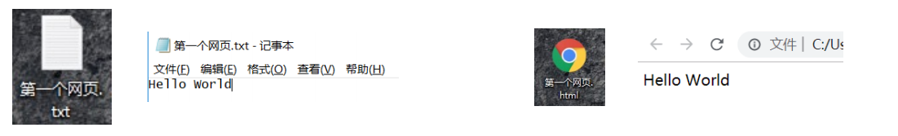

- **这个网页有什么缺点？**
  - 只能显示**一段普通的文本**；
  - 浏览器不知道是否要对**这段文本加粗、放大、段落之间**的间距；


### **案例 – 显示一条新闻**

- 如果我们现在**有一条新闻需要显示**，那么可以通过**某些“元素”**来告知浏览器这部分**内容如何显示**。

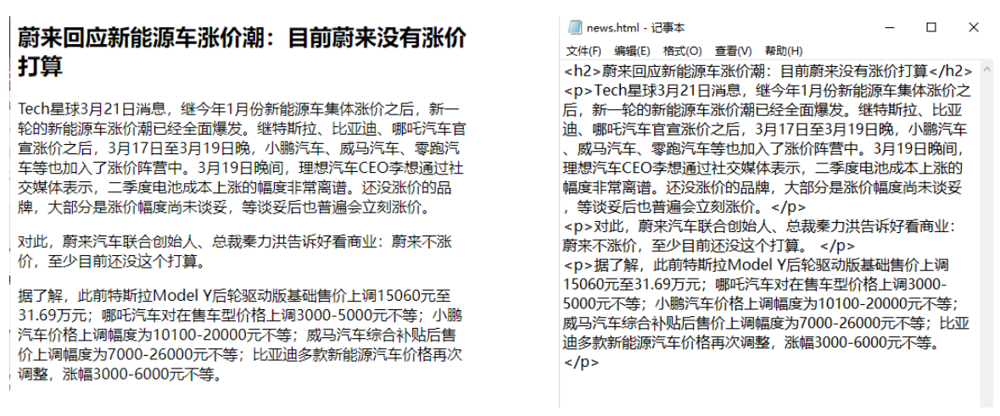

- 而我们编写的```<h2></h2>，<p></p>```就是HTML元素；


## **认识HTML**

**超文本标记语言**（英语：**H**yper**T**ext **M**arkup **L**anguage，简称：**HTML**）是一种用于创建**网页**的标准**标记语言**。

-  HTML元素是构建网站的基石；


**什么是标记语言（****markup language** **）****？**

- 由无数个**标记（标签、tag)**组成；
- 是对**某些内容进行特殊的标记**，以供其他**解释器识别处理**；
- 比如使用```<h2></h2>```标记的文本会被识别为**“标题”**进行**加粗、文字放大**显示；
- 由**标签和内容**组成的称为**元素（element）**


**什么是超文本（ HyperText ）呢？**

- 表示不仅仅可以插入**普通的文本（Text）**，还可以插入**图片、音频、视频**等内容；
- 还可以表示**超链接（HyperLink）**，从一个网页跳转到另一个网页；


## **HTML文件的特点 – 扩展名（后缀名）**

- HTML文件的拓展名是.htm\.html
  - 因历史遗留问题，Win95\Win98系统的文件拓展名不能超过3字符，所以使用.htm
  - 现在统一使用 **.html**


## **HTML文件的特点 – 结构**

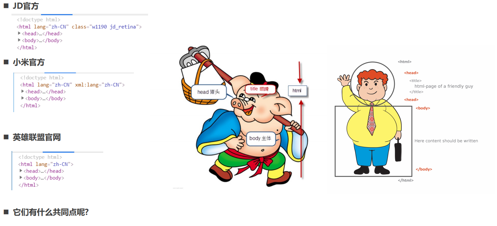


## **改进自己的网页**

- **修改自己的网页代码，让自己的网页也具备正确的结构：**

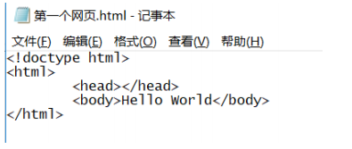

- **运行效果是一样的，但是我们现在的网站也有正确的结构了**

  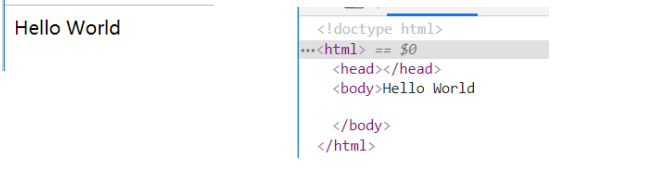


## **开发工具选择**

- **记事本可以开发一个网页吗？**答案：**可以**。但是有很多的缺点：
  - 创建和管理文件不方便；
  - 没有颜色标识/没有智能提示/无法调试程序；
- **专业的前端开发工具**
  - WebStorm、Sublime Text、Visual Studio Code、Atom、HBuilder、IntelliJ IDEA、Dreamweaver
  - 智能提示、高亮识别、语法检测、集成环境、开发效率高
- **上课推荐开发工具：**
  - Webstorm
    - 优点：集成开发工具，包罗万象
    - 缺点：重（占用系统资源多），收费
  - **VSCode（上课使用）**
    - 优点：轻（相当于一个编辑器），免费
    - 缺点：需要安装一些插件来辅助开发


## VSCode工具安装

- **VSCode编辑器下载-安装**：https://code.visualstudio.com/
- **安装插件（增加功能）**：右侧图标最后一项，Extensions，查找需要的插件（联网）
  - 中文插件：Chinese
  - 颜色主题：atom one dark
  - 文件夹图标：VSCode Great Icons
  - 在浏览器中打开网页：open in browser、Live Sever
  - 自动重命名标签：auto rename tag
- **VSCode的配置：**
  - Auto Save 自动保存
  - Font Size 修改代码字体大小
  - Word Wrap 代码自动换行
  - Render Whitespace 空格的渲染方式(个人推荐)
  - Tab Size 代码缩进
    - 推荐2个空格（公司开发项目基本都是2个空格）


## **认识元素**

- 我们会发现HTML本质上是由一系列的**元素（Element）**构成的；
- **什么是元素（Element）呢？**
  - **元素**是网页的一部分；
  - 一个元素可以**包含一个数据项，或是一块文本，或是一张照片，亦或是什么也不包含；**
- **那么HTML有哪些元素呢？**
  - https://developer.mozilla.org/zh-CN/docs/Web/HTML/Element
- **我们会发现元素非常非常的多，这么多能记得住吗？**
  - 常用的，用的多自然就记住了；
  - 不常用的，知道在哪里查找即可；


## 元素的组成

- **剖析一个HTML元素的组成：**

  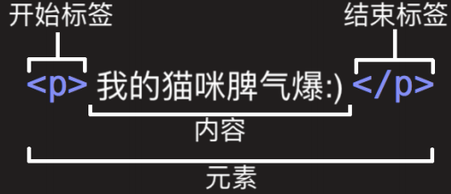

- 这个元素的主要部分有：
  1. **开始标签**（Opening tag）：包含元素的名称（本例为 p），被左、右尖括号所包围。表示元素从这里开始或者开始起作用 —— 在本例中即段落由此开始。
  2. **结束标签**（Closing tag）：与开始标签相似，只是其在元素名之前包含了一个斜杠。这表示着元素的结尾 —— 在本例中即段落在此结束。初学者常常会犯忘记包含结束标签的错误，这可能会产生一些奇怪的结果。
  3. **内容**（Content）：元素的内容，本例中就是所输入的文本本身。
  4. **元素**（Element）：开始标签、结束标签与内容相结合，便是一个完整的元素。


### 元素的属性

- **元素也可以拥有属性（Attribute）：**

  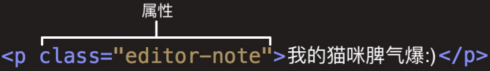

- 属性包含元素的额外信息，这些信息不会出现在实际的内容中。

- **一个属性必须包含如下内容：**

  1. 一个空格，在属性和元素名称之间。(如果已经有一个或多个属性，就与前一个属性之间有一个空格。)
  2. 属性名称，后面跟着一个等于号。
  3. 一个属性值，由一对引号“ ”引起来。

- 创建一个超链接元素a：

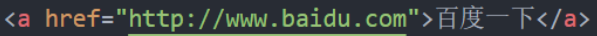


### 属性的分类

- 有些属性是公共的，每一个元素都可以设置
  - 比如class、id、title属性
- 有些属性是元素特有的，不是每一个元素都可以设置
  - 比如meta元素的charset属性、img元素的alt属性等


### **单标签元素 – 双标签元素**

- **双标签元素**：我们会发现前面大部分看到的元素都是双标签的；
  - html、body、head、h2、p、a元素；
- **单标签元素**：也有一些元素是只有一个标签；
  - br、img、hr、meta、input；

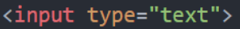

- **注意事项**
  - HTML元素不区分大小写，但是**推荐小写**


### **元素的结构总结**

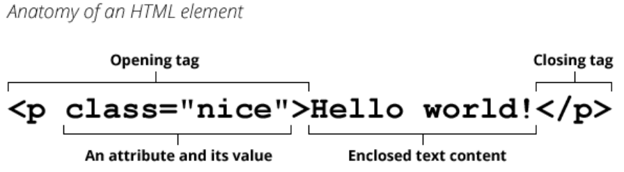


### **元素的嵌套关系**

- 某些元素的内容除了可以是文本之外，还可以嵌套其他元素，这样就形成了**元素的嵌套**。

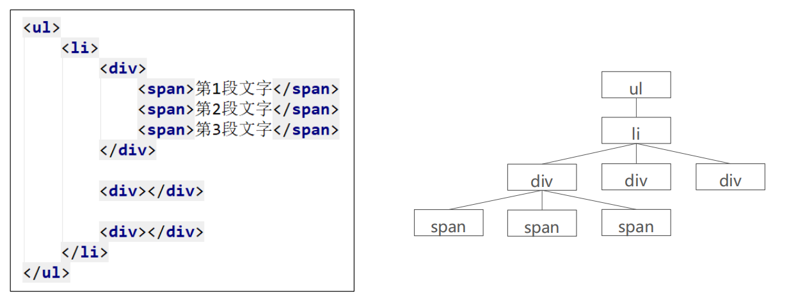


## **为什么需要注释**

- **程序员才懂的冷笑话:**

  - 在我写这段代码的时候, 只有我和上帝知道这段代码是什么意思.
  - 一段时间之后, 只有上帝知道是什么意思了.

- **为什么会出现这样的情况呢?**

  - 随着学习的深入, 你的一个程序**不再是几行代码**就可以搞定的了.

  - 可能我们需要写出有**上千行, 甚至上万行**的程序.

  - 某些代码完成某个功能后, 你写的时候思路很清晰, 但是**过段时间会出现忘记为什**

    **么这样写的情况**, 这很正常.

- **和同事协同开发**

  - 在实际工作中, 一个项目通常是**多人协作完成**的. 可能是**几个或者十几个**等等.
  - 这个时候, 你可能需要**使用别人写出的代码功能, 别人也可能使用你的代码功能.**
  - 如果你的代码**自己都看不懂**了, 更何况**你的同事呢**?


#### **什么是注释？**

- 简单来说，注释就是一段代码说明
- ```<!-- 注释内容 -->```
- 注释是只给开发者看的，浏览器并不会把注释显示给用户看


#### **注释的意义:**

- 帮助我们自己理清代码的思路, 方便以后进行查阅.
- 与别人合作开发时, 添加注释, 可以减少沟通成本.(同事之间分模块开发)
- 开发自己的框架时, 加入适当的注释, 方便别人使用和学习.(开源精神)
- 可以临时注释掉一段代码, 方便调试.


#### **注释快捷键：ctrl + /**


## HTML常见的元素


### **完整的HTML结构**

- 一个完整的HTML结构包括哪几部分呢？

  - **文档声明**
  - **html元素**
    - head元素
    - body元素

  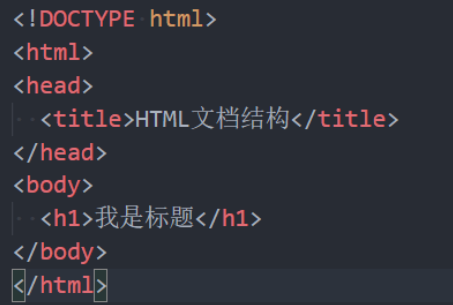


#### **文档声明**

- HTML最上方的一段文本我们称之为 **文档类型声明**，用于声明**文档类型**

  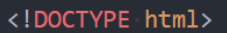

- ```<!DOCTYPE html>```
  - HTML文档声明，告诉浏览器当前页面是HTML5页面；
  - 让浏览器用HTML5的标准去解析识别内容；
  - 必须放在HTML文档的最前面，不能省略，省略了会出现兼容性问题；


- HTML5的文档声明比HTML 4.01、XHTML 1.0简洁非常多(了解即可)

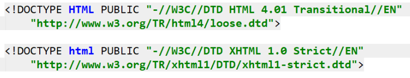


#### html元素

- <html> 元素 表示一个 HTML 文档的**根**（顶级元素），所以它也被称为**根元素**。
  - 所有其他元素必须是此元素的后代。

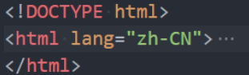

- W3C标准建议为html元素增加一个**lang属性**，作用是
  - 帮助**语音合成工具**确定要使用的发音;
  - 帮助**翻译工具**确定要使用的翻译规则;


- **比如常用的规则：**
  - lang=“en”表示这个HTML文档的语言是英文；
  - lang=“zh-CN”表示这个HTML文档的语言是中文；


#### **head元素**

- **HTML head** **元素** 规定文档相关的**配置信息（也称之为元数据），**包括文档的标题，引用的文档样式和脚本等。
  - 什么是元数据（meta data），是描述数据的数据；
  - 这里我们可以理解成对整个页面的配置：


- **常见的设置有哪些呢？一般会至少包含如下2个设置。**

- 网页的标题：**title元素**
  ```html
  <title>网易云音乐</title>
  ```

  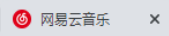

- 网页的编码：**meta元素**
  - 可以用于设置网页的**字符编码**，让浏览器更精准地显示每一个文字，**不设置或者设置错误会导致乱码**；
  - 一般都使用**utf-8编码**，涵盖了世界上几乎所有的文字；

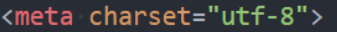


#### **body元素**

- body元素里面的内容将是你**在浏览器窗口中看到的东西**，也就是**网页的具体内容和结构**。

  - 之后学习的大部分HTML元素都是在body中编写呈现的；

    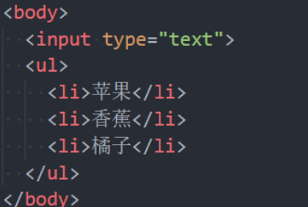


#### **html常见元素**

- HTML元素本身很多，但是**常用的元素就是那么几个**。
  - https://developer.mozilla.org/zh-CN/docs/Web/HTML/Element
  - 我们只需要记住**常用的**，不常用的学会查看文档即可；
- **常用的元素**（暂时掌握下面几个就够了，90%时间都在写这几个）：
  - p元素、h元素；
  - img元素、a元素、iframe元素；
  - div元素、span元素；
- **下阶段学习的元素：**
  - ul、ol、li元素；
  - button元素、input元素；
  - table、thead、tbody、thead、th、tr、td；
- **HTML5新增元素（后续学习）**


##### h元素

- 在一个页面中通常会有一些比较**重要的文字**作为标题，这个时候我们可以使用**h元素**。

- ```<h1>–<h6> ```标题 (Heading) 元素呈现了六个不同的级别的标题

  - Heading是头部的意思，通常会用来做标题
  - ```<h1> 级别最高，而 <h6> 级别最低。```

  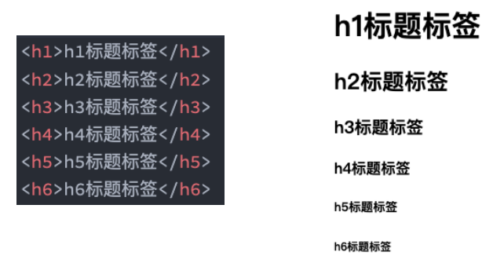

- 注意：**h元素通常和SEO优化有关系**（什么是SEO，后续再介绍）


##### p元素

- 如果我们想表示一个**段落**，这个时候可以使用p元素。
- **HTML ```<p>```**元素（或者说 HTML 段落元素）表示**文本的一个段落**。
  - **p元素**是paragraph单词的缩写，是**段落、分段**的意思；
  - **p元素**多个段落之间会有一定的间距；

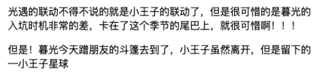


##### **img元素**

- 我们应该如何告诉浏览器来**显示一张图片**呢？使用img元素。
- **HTML `````` 元素**将一份图像嵌入文档。
  - img是image单词的所以，是图像、图像的意思；
  - 事实上img是一个可替换元素（ replaced element ）；

- **img有两个常见的属性：**
  - src属性：source单词的缩写，表示源
    - 是**必须的**，它包含了你想嵌入的图片的文件路径。
  - alt属性：不是强制性的，有两个作用
    - 作用一：当图片加载不成功（错误的地址或者图片资源不存在），那么会显示这段文本；
    - 作用二：屏幕阅读器会将这些描述读给需要使用阅读器的使用者听，让他们知道图像的含义；


- **设置img的src时，需要给图片设置路径：**
  - 网络图片：一个URL地址（后续会专门讲URL）；
    - 网络图片的设置非常简单，给一个地址即可；
  - 本地图片：本地电脑上的图片，后续会和html一起部署到服务器；


- **本地图片的路径有两种方式：**

  - 方式一：绝对路径（几乎不用）；

    - 从电脑的根目录开始一直找到资源的路径；

      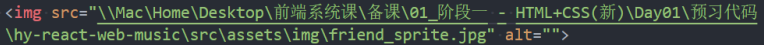

  - 方式二：相对路径（常用）；

    - 相当于当前文件的一个路径；

    - **.** 代表当前文件夹（1个.），可以省略

    - **..** 代表上级文件夹（2个.）

      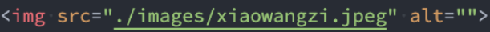

- 对于网页来说，不管什么操作系统（Windows、Mac、Linux），路径分隔符都是 /，而不是 \


- **img元素支持的图片格式非常多：**

  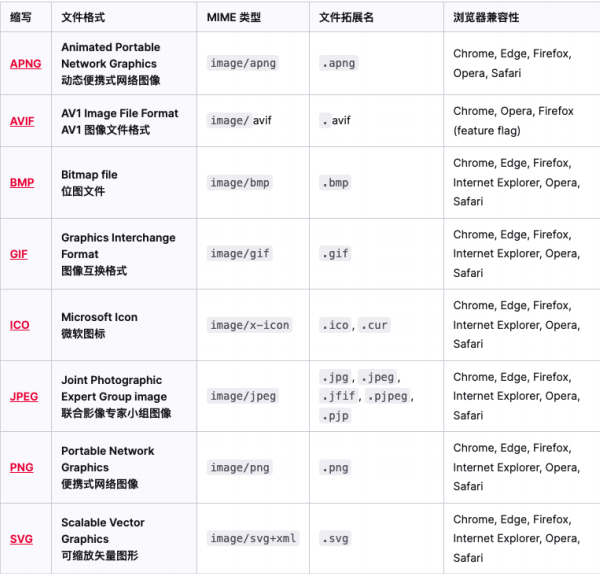


##### **a元素**

- 在网页中我们经常需要**跳转到另外一个链接**，这个时候我们使用**a元素**；
- **HTML``` <a>``` 元素**（或称锚（anchor）元素）：
  - 定义超链接，用于打开新的URL；
- **a元素有两个常见的属性：**
  - href：Hypertext Reference的简称
    - 指定要打开的URL地址；
    - 也可以是一个本地地址；
  - target：该属性指定在何处显示链接的资源。
    - _self：默认值，在当前窗口打开URL；
    - _blank：在一个新的窗口中打开URL；
    - 其他不常用, 后面iframe可以讲一下；

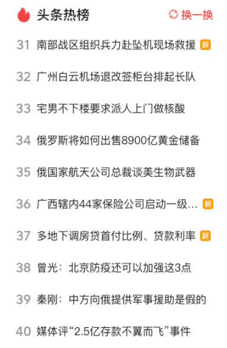

- 锚点链接可以实现：跳转到**网页中的具体位置**
- **锚点链接有两个重要步骤：**
  - 在要跳到的元素上**定义一个id属性**；
  - 定义**a元素**，并且a元素的**href指向对应的id**；

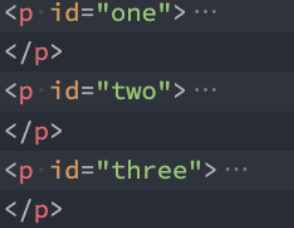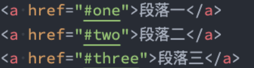


- 在很多网站我们会发现**图片**也是可以点击**进行跳转**的

  - **img元素跟a元素**一起使用，可以实现**图片链接；**

    

- **实现思路：**

  - a元素中不存放文字，而是**存放一个img元素；**
  - 也就是img元素是a元素的内容；

  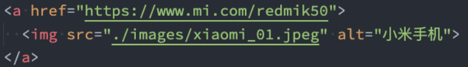


- **a元素一定是用来跳转到新网页的么？**

  - https://github.com/coderwhy/HYMiniMall/archive/master.zip
  - mailto:12345@qq.com

  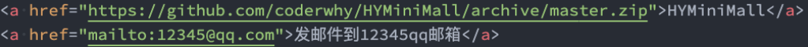


##### **iframe元素**

- 利用iframe元素可以实现：在一个HTML文档中嵌入其他HTML文档
- frameborder属性
  - 用于规定是否显示边框
    - 1：显示
    - 0：不显示
- a元素target的其他值:
  - _parent：在父窗口中打开URL
  - _top：在顶层窗口中打开URL


##### div元素、span元素

- 在HTML中**有两个特殊的元素div元素、span元素**：
  - div元素：division，分开、分配的意思；
  - span元素：跨域、涵盖的意思；
- **这两个元素有什么作用呢？**无所用、无所不用。
- **产生的历史：**
  - 网页的发展早期是**没有css**，这个时候我们必须通过**语义化元素**来告知浏览器一段文字如何显示；
  - 后来**出现了css，结构和样式需要分离**，这个时候**html只需要负责结构**即可；
  - 比如h1元素可以是一段**普通的文本+CSS修饰样式**；
  - 这个时候就出现了**div、span来编写HTML结构所有的结构，样式都交给css来处理；**
- **所以，理论上来说：**
  - 我们的页面可以**没有div、span；**
  - 我们的页面也可以**全部都是div、span；**


- 这个时候有一个问题：**我出现一个不就可以了吗？**
- div元素和span元素都是**“纯粹的” 容器**，也可以把他们理解成**“盒子”**，它们都是用来**包裹内容**的；
  - **div元素：**多个div元素包裹的内容会在**不同的行**显示；
    - 一般作为其他元素的父容器，把其他元素包住，代表一个整体
    - 用于把网页分割为多个独立的部分
  - **span元素：**多个span元素包裹的内容会**在同一行**显示；
    - 默认情况下，跟普通文本几乎没差别
    - 用于区分特殊文本和普通文本，比如用来显示一些关键字


##### 不常用元素

- **strong元素**：内容加粗、强调；
  - 通常加粗会使用css样式来完成；
  - 开发中很偶尔会使用一下；
- **i元素：**内容倾斜；
  - 通常斜体会使用css样式来完成；
  - 开发中偶尔会用它来做字体图标（因为看起来像是icon的缩写）；
- **code元素：**用于显示代码
  - 偶尔会使用用来显示等宽字体；
- **br元素：**换行元素
  - 开发中已经不使用；
- 更多元素详解，查看MDN文档：
  - https://developer.mozilla.org/zh-CN/docs/Web/HTML/Element


## **HTML全局属性**

- 我们发现**某些属性只能设置在特定的元素**中：
  - 比如img元素的src、a元素的href；
- 也**有一些属性是所有HTML都可以设置和拥有**的，这样的属性我们称之为 **“全局属性（Global Attributes）”**
  - 全局属性有很多：https://developer.mozilla.org/zh-CN/docs/Web/HTML/Global_attributes


- **常见的全局属性如下：**

  - **id**：定义唯一标识符（ID），该标识符在整个文档中必须是唯一的。其目的是在链接（使用片段标识符），脚本或样

    式（使用 CSS）时标识元素。

  - **class**：一个以空格分隔的元素的类名（classes ）列表，它允许 CSS 和 Javascript 通过类选择器或者DOM方法来选

    择和访问特定的元素；

  - **style**：给元素添加内联样式；

  - **title**：包含表示与其所属元素相关信息的文本。 这些信息通常可以作为提示呈现给用户，但不是必须的。


## **字符实体**

- 思考：**我们编写的HTML代码会被浏览器解析**。

- 如下代码是**如何被解析**的呢？
  - 如果你使用小于号（<），浏览器会将其后的文本解析为一个tag。
  
  - 但是某些情况下，我们确实需要编写一个小于号（<）；
  
  - 这个时候我们就可以使用**字符实体**；
  
    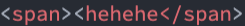
  
- HTML 实体是一段以**连字号（&）开头、以分号（;）结尾的文本**（字符串）：

  - 实体常常用于显示**保留字符**（这些字符会被解析为 HTML 代码）和**不可见的字符**（如“不换行空格”）；

  - 你也可以用实体来代替**其他难以用标准键盘键入的字符**；

    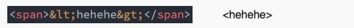

- 常见的字符实体

  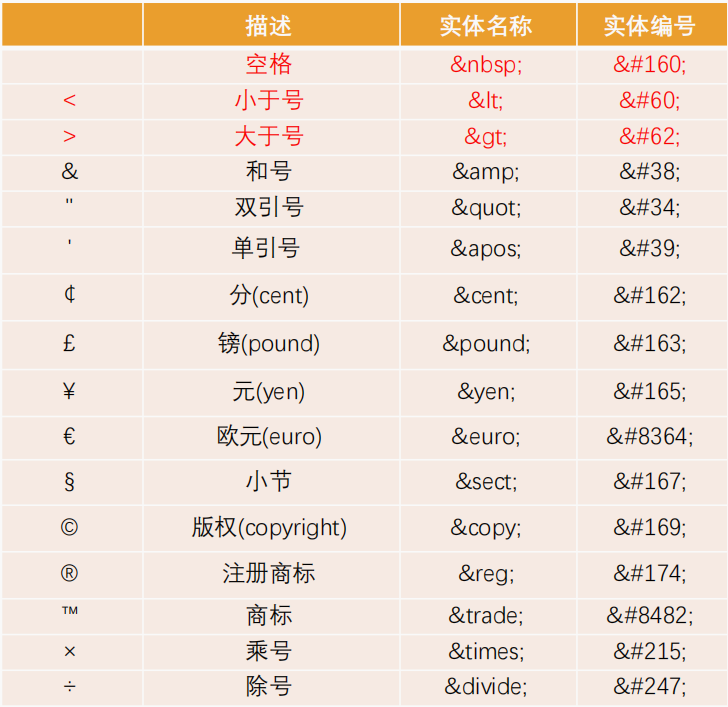


## URL

- **URL 代表着是统一资源定位符（**Uniform Resource Locator**）**

- **通俗点说：**URL 无非就是一个给定的独特资源在 Web 上的地址。（有点类似于网络中的ip地址，是唯一的）

  - 理论上说，每个有效的 URL 都指向一个唯一的资源；

  - 这个资源可以是一个 HTML 页面，一个 CSS 文档，一幅图像，等等；

    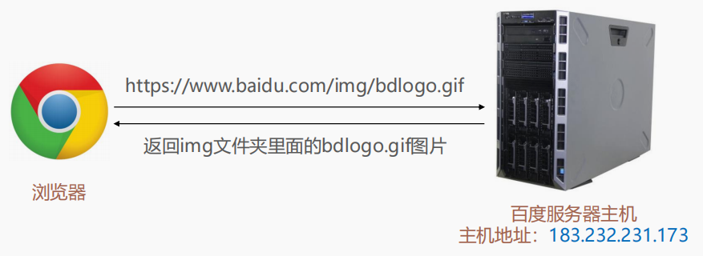


## URI和URL

> URI（统一资源标识符，**Uniform Resource Identifier**）和 URL（统一资源定位符，**Uniform Resource Locator**）是网络资源标识和访问的重要概念。它们常常会混用，但实际上存在一些细微的区别。

1. **URI 和 URL 的定义**

   - **URI（Uniform Resource Identifier，统一资源标识符）**：
     - URI 是一个通用的概念，指代用来唯一标识资源的字符串。URI 可以表示资源的名字、位置，甚至其他描述。它包括两类：URL 和 URN（统一资源名称）。
     - **URI 的作用**是标识某一个资源，而不一定要提供它的访问方式。


   - **URL（Uniform Resource Locator，统一资源定位符）**：
     - URL 是 URI 的一个子集，除了标识资源外，它还具体定义了访问该资源的方式（比如协议、主机名、端口号等）。URL 主要是用来“定位”资源。
     - **URL 的作用**是标识资源，并且提供访问资源的方法。


2. **区别与联系**
   - **URI 是一个广义的概念**，它可以表示任何资源的标识，包括但不限于网络资源。URI 包含 URL 和 URN，两者是 URI 的子集。

   - **URL 是 URI 的子集**，它不仅标识了资源，还提供了获取该资源的方式（协议 + 位置）。

   - **URN（Uniform Resource Name，统一资源名称）**是 URI 的另一子集，它只用来标识资源而不涉及具体的访问方法。URN 主要用于给资源命名，而不涉及资源的物理位置。


3. **URL 和 URI 的关系图**

```
URI
 ├── URL （标识 + 访问方式）
 └── URN （只标识资源）
```

4. **示例**

   - **URL 示例**：
     - `https://www.example.com/index.html`
       - 这是一个 URL，因为它不仅标识了资源 `/index.html`，还包括了如何访问它：通过 `https` 协议从 `www.example.com` 主机获取资源。

   - **URN 示例**：
     - `urn:isbn:0451450523`
       - 这是一个 URN，因为它通过 ISBN 标识了一本书，但并没有说明如何通过网络访问这本书。


   - **URI 示例**（包括 URL 和 URN）：
     - `https://www.example.com/index.html`（URL 是 URI 的一种）
     - `urn:isbn:0451450523`（URN 也是 URI）


5. **URI 和 URL 的技术解析**

   - **URI 结构**：
     一个完整的 URI 通常由以下部分组成：

     ```
     [scheme]://[userinfo]@[host]:[port]/[path]?[query]#[fragment]
     ```

     - **scheme**: 协议，比如 `http`、`https`、`ftp`。
     - **userinfo**: 可选，通常用于用户名和密码认证，比如 `user:pass`。
     - **host**: 主机名或 IP 地址，比如 `www.example.com` 或 `192.168.1.1`。
     - **port**: 可选，网络端口号，比如 `:80`、`:443`。
     - **path**: 资源的路径，比如 `/index.html`。
     - **query**: 可选，查询参数，比如 `?id=123&name=John`。
     - **fragment**: 可选，文档中的片段标识符，比如 `#section1`。

   - **URL 结构**：
     URL 通常会有完整的 scheme 和 host 信息，用于定义资源位置和访问方式。例如：

     ```
     https://www.example.com/path/to/resource?id=123#fragment
     ```


6. **总结**
   - **URI** 是统一资源标识符，是一个更广泛的概念，用于标识资源。所有的 URL 和 URN 都是 URI。

   - **URL** 是 URI 的一个子集，它不仅标识了资源，还提供了获取该资源的方式（比如使用 `http` 或 `ftp` 进行访问）。


​	**因此，所有的 URL 都是 URI，但并非所有的 URI 都是 URL。**


## 元素语义化

- 元素的语义化：用正确的元素做正确的事情

- 理论上来说，所有的HTML元素，我们都能实现相同的事情：

  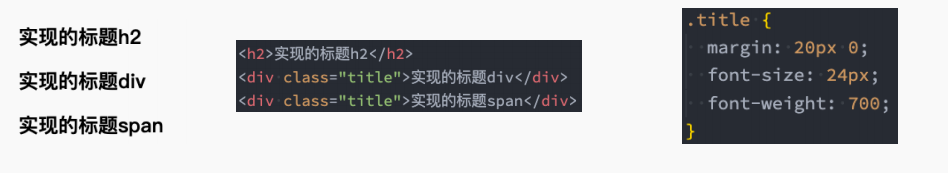

- 标签语义化的好处
  - 方便代码维护；
  - 减少让开发者之间的沟通成本；
  - 能让语音合成工具正确识别网页元素的用途，以便作出正确的反应；
  - 有利于SEO；


## 什么是SEO？

SEO 即 Search Engine Optimization，中文译为搜索引擎优化，是一种通过了解搜索引擎的运作规则来调整网站，优化网站内容、结构和外部链接等，来提高网站在搜索引擎自然搜索结果中的排名，从而增加网站流量和曝光度的技术和策略。

### 目的 

 -  **提高排名**：让网站在搜索引擎结果页面（SERP）中获得更高的排名。例如，当用户搜索“旅游攻略”时，优化良好的旅游网站能出现在搜索结果的前几页，甚至首页，这样就能吸引更多用户点击进入网站。 

 -  **增加流量**：通过提高排名吸引更多的自然流量。自然流量是指用户通过搜索引擎自然搜索结果进入网站的流量，与付费广告流量不同，它是免费且更具针对性的。 

 -  **提升用户体验**：在优化过程中，需要对网站的结构、内容等进行调整，使其更符合用户的浏览习惯和需求，从而提升用户体验，增加用户在网站的停留时间和对网站的好感度。 

    

### 主要工作内容

- **关键词研究**：分析和选择与网站主题相关且有一定搜索量和商业价值的关键词。比如一个健身网站，可能会选择 “健身教程”“增肌方法”“减肥食谱” 等作为关键词。
- **网站内容优化**：创作高质量、原创且与关键词相关的内容，包括文章、图片、视频等。内容要能够满足用户的搜索意图，例如为 “减肥食谱” 这个关键词创作一系列详细的、有科学依据的减肥餐制作方法和饮食计划的文章。同时，合理地在内容中分布关键词，但要避免过度堆砌，确保内容自然流畅。
- **网站结构优化**：优化网站的内部链接结构，使搜索引擎能够更轻松地抓取和索引网站页面。例如，设置清晰的导航栏、面包屑导航，确保页面之间有合理的链接关系，让用户和搜索引擎能够方便地从一个页面跳转到其他相关页面。
- **外部链接建设**：获取其他高质量网站指向本网站的链接，即反向链接。这些反向链接就像是其他网站对本网站的 “信任投票”，可以提高网站在搜索引擎眼中的权威性和可信度。例如，一个科技博客被知名科技媒体网站链接，就会提升其在搜索引擎中的权重。


### 优化效果影响因素

- **网站质量**：包括网站的内容质量、页面加载速度、安全性等。高质量、有价值的内容以及快速稳定的网站性能会受到搜索引擎的青睐。
- **关键词竞争度**：如果选择的关键词竞争激烈，如 “手机”“汽车” 等热门关键词，要在搜索结果中获得高排名就相对困难，需要投入更多的精力和资源进行优化。
- **搜索引擎算法更新**：搜索引擎会不断更新算法来提供更精准、高质量的搜索结果。例如，谷歌的 PageRank 算法就是根据网页的链接结构来评估其重要性，网站需要及时适应这些算法变化，调整优化策略，否则可能会导致排名下降。


### 意义

- **对于网站所有者**：可以降低营销成本，获得更多免费的流量和曝光，提高网站的知名度和品牌影响力，从而实现更多的商业转化，如增加产品销售、服务订单等。
- **对于用户**：能够帮助用户更快、更准确地找到他们需要的信息和资源，提高信息获取的效率和质量。
- **对于搜索引擎**：促使网站提供更优质的内容和更好的用户体验，从而提升搜索引擎自身的服务质量和用户满意度，增强搜索引擎在市场中的竞争力。


## 字符编码

- **计算机是干什么的?**

  - 计算机一开始发明出来时是用来解决数字计算问题的，后来人们发现，计算机还可以做更多的事，例如**文本处理**。
  - 但计算机其实挺笨的，它只“认识”010110111000…这样由**0和1两个数字组成的二进制**数字；
  - 这是因为**计算机的底层硬件实现就是用电路的开和闭**两种状态来表示0和1两个数字的。
  - 因此，计算机只可以直接存储和处理二进制数字。

- 为了在计算机上也**能表示、存储和处理像文字、符号等等之类的字符**，就必须将这些**字符转换成二进制**数字。

  - 当然，肯定不是我们想怎么转换就怎么转换，否则就会造成同一段二进制数字在不同计算机上显示出来的字符不一样的情况，因此必须得定一个统一的、标准的转换规则

    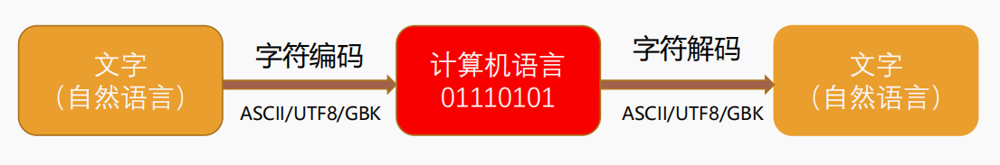

- 关于字符编码coderwhy老师的另一篇文章https://www.jianshu.com/p/899e749be47c


## HTML高级元素

### 列表元素

- **认识列表元素**

  - **在开发一个网页的过程中, 很多数据都是以列表的形式存在的**

    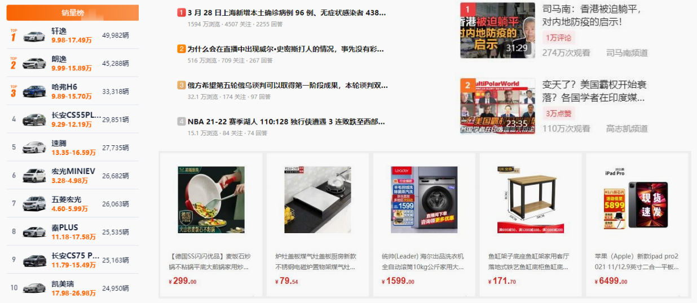


- **列表的实现方式**
  - **事实上现在很多的列表功能采用了不同的方案来实现:**
    - **方案一**: 使用**div元素**来实现(比如汽车之家, 知乎上的很多列表)
    - **方案二**: 使用**列表元素**, 使用元素语义化的方式实现;
  - 事实上现在很多的网站对于列表元素没有很强烈的偏好, 更加不拘一格, **按照自己的风格来布局**:
    - 原因是**列表元素默认的CSS样式, 让它用起来不是非常方便;**
    - 比如**列表元素往往有很多的限制, ul/ol中只能存放li, li再存放其他元素, 默认样式等;**
    - 虽然我们可以**通过重置来解决**, 但是我们**更喜欢自由的div;**
  - **HTML提供了3组常用的用来展示列表的元素**
    - 有序列表：**ol、li**
    - 无序列表：**ul、li**
    - 定义列表：**dl、dt、dd**


- **有序列表 – ol – li**

  - **ol（ordered list）**

    - **有序列表**，直接子元素只能是**li**

  - **li（list item）**

    - 列表中的**每一项**

    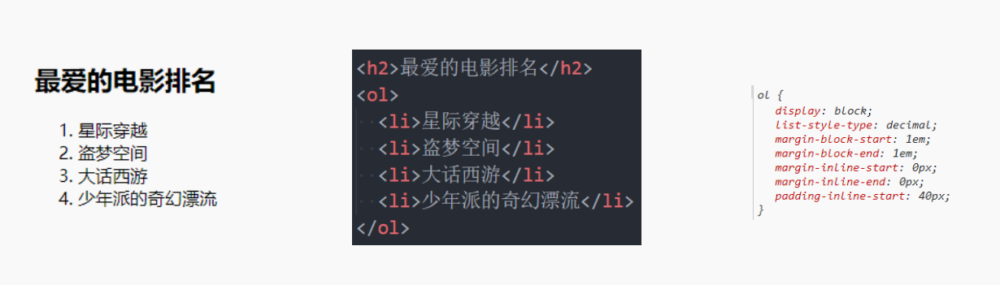


- **无序列表 – ul - li**

  - **ul（unordered list）**

    - **无序列表**，直接子元素只能是**li**

  - **li（list item）**

    - 列表中的**每一项**

      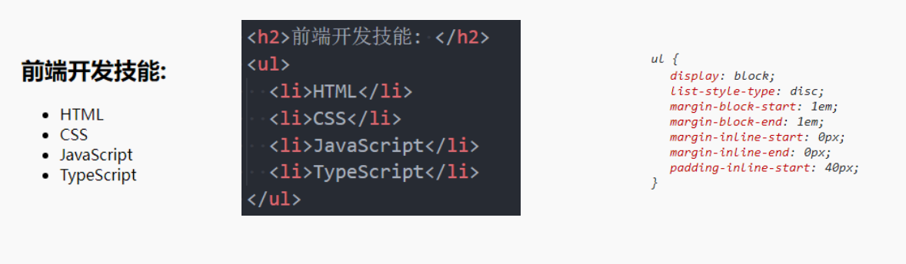


- **定义列表 – dl – dt - dd**

  - **dl（definition list）**

    - **定义列表**，直接子元素只能是dt、dd

  - **dt（definition term）**

    - term是项的意思, **列表中每一项的项目名**

  - **dd（definition description）**

    - **列表中每一项的具体描述**，是对 dt 的描述、解释、补充

    - 一个dt后面一般紧跟着1个或者多个dd

      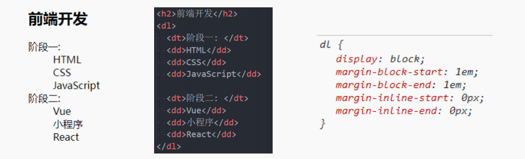


### 表格元素

- **认识表格元素**

  - **在网页中, 对于某些内容的展示使用表格元素更为合适和方便**

    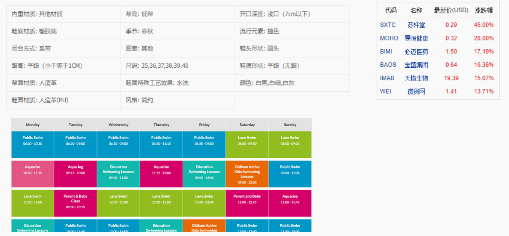


- **表格常见的元素**

  - **编写表格最常见的是下面的元素:**

  - **table**

    - **表格**

  - **tr(table row)**

    - 表格中的**行**

  - **td(table data)**

    - 行中的**单元格**

  - **另外表格有很多相关的属性可以设置表格的样式, 但是已经不推荐使用了**

    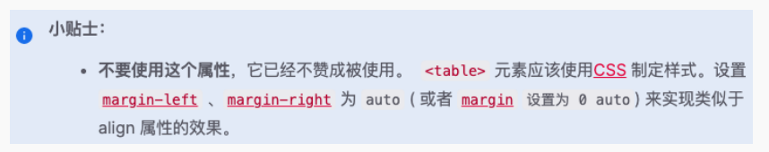


- **表格的练习**

  - **通过表格元素和CSS完成下面的表格:**

    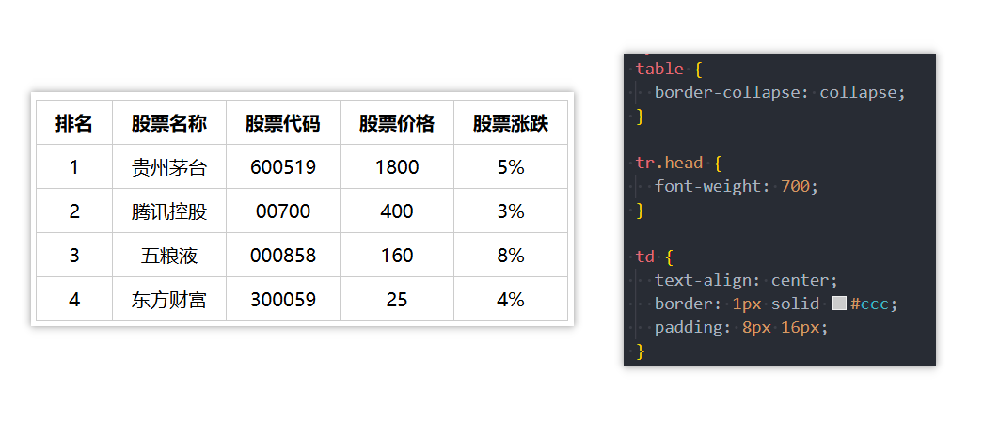

  - **这里我们需要用到一个非常重要的属性:**
    - **border-collapse** CSS 属性是用来决定表格的边框是**分开的**还是**合并的**。
    - table { border-collapse: collapse; }
    - **合并单元格的边框**


- **表格的其他元素**

  - **thead**

    - 表格的表头

  - **tbody**

    - 表格的主体

  - **tfoot**

    - 表格的页脚

  - **caption**

    - 表格的标题

  - **th**

    - 表格的表头单元格

    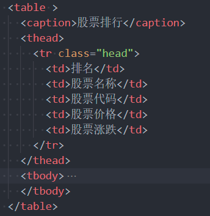


- **单元格合并**

  - **在某些特殊的情况下, 每个单元格占据的大小可能并不是固定的**

    - 一个单元格可能会**跨多行或者多列来使用;**

  - **比如下面的表格**

    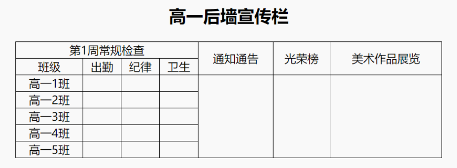