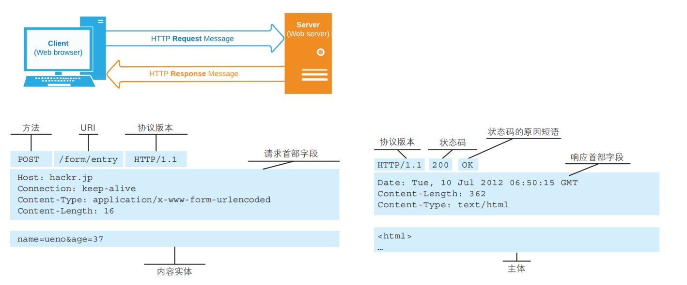
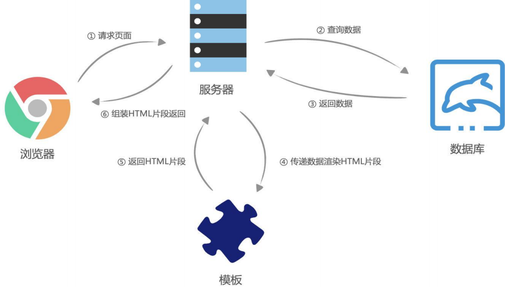

# JavaScript 网络编程

> JavaScript 网络编程是使用 JavaScript 在网络上进行通信的技术，通常用于与服务器交换数据。它使前端应用能够通过 HTTP 请求与后端服务交互，实现动态内容加载和用户交互。常用的网络 API 包括 `XMLHttpRequest` 和 `Fetch` API。


## 1. HTTP

> **HTTP**：是一种无状态的应用层协议，用于在**客户端（通常是浏览器）**和**服务器**之间传输超文本数据。它的设计允许浏览器请求资源（如 HTML 页面、图像等），并接收响应。


### 1. 工作原理

- 通过使用**网页浏览器、网络爬虫或者其它的工具**，客户端发起一个**HTTP请求**到服务器上指定端口（默认端口为80）；
  - 我们称这个客户端为**用户代理程序（user agent）**；
- **响应的服务器上存储着一些资源**，比如HTML文件和图像。
  - 我们称这个**响应服务器为源服务器（origin server）；**


### 2. 网页中资源的获取

- 网页中的资源通常是被放在Web资源服务器中，由浏览器自动发送HTTP请求来获取、解析、展示的。


- 目前我们页面中很多数据是动态展示的
  - 比如页面中的**数据展示、搜索数据、表单验证**等等，也是通过在JavaScript中发送HTTP请求获取的；


### 3. HTTP的组成

一次HTTP请求主要包括：**请求（Request）和响应（Response）**



#### HTTP请求

HTTP 请求由以下部分组成：

- **请求行**：包括请求方法、请求 URL 和 HTTP 版本。
  - 示例：`GET /index.html HTTP/1.1`

- **请求头**：包含关于请求的信息（如浏览器类型、接受的内容类型等）。

  - 示例：

    ```http
    Host: www.example.com
    User-Agent: Mozilla/5.0
    Accept: text/html,application/xhtml+xml
    ```

- **请求体**（可选）：用于 POST 请求时发送的数据。
  - 示例：表单数据或 JSON 数据。


#### HTTP 响应

HTTP 响应由以下部分组成：

- **状态（响应）行**：包括 HTTP 版本、状态码和状态描述。

  - 示例：`HTTP/1.1 200 OK`

- **响应头**：包含关于响应的信息（如内容类型、内容长度等）。

  - 示例：

    ```http
    Content-Type: text/html; charset=UTF-8
    Content-Length: 1234
    ```

- **响应体**：包含请求的资源数据（如 HTML 内容）。

  - 示例：实际的 HTML 页面内容。


### 4. HTTP的版本

- **HTTP/0.9**
  - 发布于1991年；
  - 只支持GET请求方法获取文本数据，当时主要是为了获取HTML页面内容；
- **HTTP/1.0** 
  - 发布于1996年；
  - 支持POST、HEAD等请求方法，支持请求头、响应头等，支持更多种数据类型(不再局限于文本数据) ；
  - 但是浏览器的每次请求都需要与服务器建立一个TCP连接，请求处理完成后立即断开TCP连接，每次建立连接增加了性能损耗；
- **HTTP/1.1(目前使用最广泛的版本)** 
  - 发布于1997年；
  - 增加了PUT、DELETE等请求方法；
  - 采用持久连接(Connection: keep-alive)，多个请求可以共用同一个TCP连接；（不同服务器配置的持久连接的时间不一样，Node默认为5s）
- **2015年，HTTP/2.0**
  - 引入了多路复用、头压缩和服务器推送等特性，以提高性能和减少延迟。它允许在同一连接上同时发送多个请求和响应。
- **2018年，HTTP/3.0**
  - 基于 QUIC 协议，进一步提高了传输速度和安全性。它通过使用 UDP 而非 TCP，减少了连接和传输延迟。


### 5. HTTP 与 HTTPS

- **HTTPS**（HTTP Secure）：是 HTTP 的安全版本，通过 SSL/TLS 协议加密数据传输，确保数据的机密性和完整性。它在请求和响应的传输中提供了加密层，防止数据被窃听或篡改。


### 6. HTTP的请求方式

在RFC中定义了一组请求方式，来表示要对给定资源执行的操作：

- **GET**：GET 方法请求一个指定资源的表示形式，使用 GET 的请求应该只被用于获取数据。**（常用）**

- **HEAD**：HEAD 方法请求一个与 GET 请求的响应相同的响应，但没有响应体。
  - 比如在准备下载一个文件前，先获取文件的大小，再决定是否进行下载；
- **POST**：POST 方法用于将实体提交到指定的资源。**（常用）**
- **PUT**：PUT 方法用请求有效载荷（payload）替换目标资源的所有当前表示；
- **DELETE**：DELETE 方法删除指定的资源；
- **PATCH**：PATCH 方法用于对资源应部分修改；
- **CONNECT**：CONNECT 方法建立一个到目标资源标识的服务器的隧道，通常用在代理服务器，网页开发很少用到。
- **TRACE**：TRACE 方法沿着到目标资源的路径执行一个消息环回测试。


### 7. HTTP Request Header

在使用ajax技术进行发送网络请求时，客户端会允许我们对当次请求进行配置，其中主要是对请求头（以对象形式）进行操作配置。以下是常用请求头含义以及取值。


- **content-type**：**表示这次请求携带的数据类型（以便服务器对其进行处理）**
  - **application/x-www-form-urlencoded**：表示数据被编码成以 '&' 分隔的键 - 值对，同时以 '=' 分隔键和值
  - **application/json**：表示是一个json类型；
  - **text/plain**：表示是文本类型；
  - **application/xml**：表示是xml类型；
  - **multipart/form-data**：表示是上传文件；
- **content-length**：**文件的大小长度**
- **keep-alive**
  - http是基于TCP协议的，但是通常在进行一次请求和响应结束后会立刻中断；
  - 在http1.0中，如果想要继续保持连接：
    - 浏览器需要在请求头中添加 connection: keep-alive；
    - 服务器需要在响应头中添加 connection:keey-alive；
    - 当客户端再次发送请求时，就会使用同一个连接，直到一方中断连接；
  - 在http1.1中，所有连接默认是 connection: keep-alive的；
    - 不同的Web服务器会有不同的保持 keep-alive的时间；
    - Node中默认是5s；
- **accept-encoding**：告知服务器，客户端支持的文件压缩格式，比如js文件可以使用gzip编码，对应 .gz文件（浏览器拿到js对应的.gz文件后会自动进行解压执行代码）；
- **accept**：告知服务器，客户端可接受文件的格式类型；
- **user-agent**：客户端相关的信息；


### 8. HTTP Response Header

响应的header中包括一些服务器给客户端的信息


### 9. HTTP 状态码

HTTP 状态码是服务器返回给客户端的三位数字代码，用于指示请求的处理结果。

- Http状态码非常多，可以根据不同的情况，给客户端返回不同的状态码；
- MDN响应码解析地址：https://developer.mozilla.org/zh-CN/docs/web/http/status


## 2. 服务端渲染

服务端渲染（SSR）是指在服务器端生成完整的 HTML 页面，然后将其发送到客户端。客户端接收到的页面已经包含所有必要的内容，这样可以提高页面的加载速度并改善 SEO。常用的框架包括 Next.js 和 Nuxt.js，它们支持服务端渲染。



服务端渲染（SSR）的流程主要涉及在服务器上生成完整的 HTML 页面，然后将其发送到客户端。这一过程通常分为几个步骤。以下是服务端渲染的详细流程：

### 1. **客户端请求**
- 用户在浏览器中输入 URL 或点击链接，浏览器发送 HTTP 请求到服务器，通常是 GET 请求。
- 请求的 URL 指向需要渲染的页面。

### 2. **服务器接收请求**
- 服务器接收到请求并解析请求的 URL。
- 根据 URL 确定需要处理的路由和相应的控制器（或处理函数）。

### 3. **获取数据**
- 服务器通过查询数据库或调用外部 API 获取所需的数据。这个过程可能涉及多次异步操作。
- 数据通常以 JSON 格式获取，准备传递给视图模板。

### 4. **渲染页面**
- 服务器使用模板引擎（如 EJS、Pug、Handlebars）将获取的数据和视图模板结合，生成完整的 HTML 内容。
- 此时，所有必要的内容（如文本、图像、样式）都已嵌入到 HTML 中。

### 5. **返回响应**
- 服务器将生成的 HTML 内容作为 HTTP 响应发送回客户端。
- 响应的 `Content-Type` 通常设置为 `text/html`。

### 6. **客户端接收响应**
- 浏览器接收到服务器的响应后，开始解析和渲染 HTML。
- 所有 CSS 和 JavaScript 文件的链接（通常在 `<head>` 部分）会被加载。

### 7. **页面渲染完成**
- 浏览器根据解析的 HTML 和附加的 CSS 渲染出完整的页面，用户可以与之交互。
- 如果有 JavaScript 文件，可能会进行额外的操作，比如初始化动态组件。

### 8. **后续交互**
- 在页面加载后，前端可能会发起额外的 API 请求，以获取更新的数据或异步加载内容。
- 许多现代框架（如 Next.js、Nuxt.js）还支持客户端路由，可以在不重新加载整个页面的情况下进行导航。

### 总结
服务端渲染的流程涉及从客户端请求开始，到服务器处理请求、获取数据、渲染 HTML、返回响应、最终在浏览器中展示页面。SSR 的优点包括更快的初始加载速度和更好的 SEO，因为生成的 HTML 内容可以被搜索引擎抓取。但它也可能带来更高的服务器负担和复杂的状态管理。

----


### 9. 服务端渲染方案选择

在服务端渲染（SSR）中，后续的交互是否会刷新页面取决于实现方式和应用的架构。

#### 1. **传统 SSR**

在传统的服务端渲染中，每次用户进行交互（例如点击链接或提交表单）时，浏览器会发送新的 HTTP 请求到服务器，服务器处理请求并返回新的 HTML 页面。此时，整个页面会刷新。

#### 2. **现代框架**

许多现代前端框架（如 Next.js、Nuxt.js）在服务端渲染的基础上引入了客户端路由。这样，当用户进行交互时：
- 应用可以在不重新加载整个页面的情况下，使用 JavaScript 处理路由变化。
- 这通常通过 AJAX 请求获取新的数据，并使用 JavaScript 更新页面的部分内容，从而实现无刷新更新。

#### 3. **混合模式**

在一些情况下，应用可以结合 SSR 和客户端渲染。初始页面使用 SSR 加载，以便快速显示内容和支持 SEO，后续交互使用客户端渲染，提供更流畅的用户体验。

#### 总结

- **传统 SSR**：每次交互会导致页面刷新。
- **现代框架**：可以通过客户端路由实现无刷新更新，提升用户体验。

这种灵活性使得开发者能够根据具体需求选择合适的渲染策略。


## 3. 前端渲染

前端渲染是指在客户端（浏览器）使用 JavaScript 处理和渲染页面内容。通常通过 AJAX 请求获取数据，并使用 JavaScript 将其动态插入到 HTML 中。这种方式可以提高用户体验，减少页面加载时间，但可能会对搜索引擎优化（SEO）产生影响。


前端渲染（Client-Side Rendering，CSR）是指在客户端（浏览器）中使用 JavaScript 处理和渲染页面内容的过程。以下是前端渲染的详细流程：

### 1. **客户端请求**
- 用户在浏览器中输入 URL 或点击链接，浏览器发送 HTTP 请求到服务器，通常是 GET 请求，获取页面的 HTML 文件。

### 2. **服务器响应**
- 服务器接收到请求后，返回一个包含基础 HTML 结构的页面，这个页面通常只包含最基本的内容。
- 这个 HTML 页面通常会包含对 JavaScript 文件的引用（例如 React、Vue 或 Angular 的构建输出）。

### 3. **加载 JavaScript 文件**
- 浏览器解析 HTML 文件，发现引用的 JavaScript 文件，开始下载这些文件。
- 在下载完成后，浏览器会执行 JavaScript 代码。

### 4. **初始化应用**
- JavaScript 代码会执行应用的初始化逻辑，通常包括创建应用的根组件（如在 React 中的 `ReactDOM.render()`）。
- 这时，应用开始加载数据，通常通过 AJAX 请求（使用 Fetch API 或 Axios）向服务器请求所需的数据。

### 5. **获取数据**
- 通过 API 调用获取数据后，应用会将这些数据存储在状态管理中（如 Redux、Vuex 等）或组件的本地状态中。
- 这个过程可能涉及多个异步操作。

### 6. **渲染视图**
- 数据获取完成后，应用根据获取到的数据更新组件的状态，并重新渲染视图。
- React、Vue 等框架会根据组件的状态变化，自动更新 DOM，以反映最新的数据。

### 7. **用户交互**
- 用户与页面进行交互（如点击按钮、填写表单），JavaScript 会处理这些事件。
- 交互可能触发新的数据请求，或改变当前组件的状态，进而导致视图的重新渲染。

### 8. **路由变化**
- 在 SPA（单页面应用）中，当用户进行路由导航（例如点击链接）时，应用使用客户端路由库（如 React Router、Vue Router）拦截链接点击事件，阻止浏览器的默认行为。
- 应用会根据新的路由加载对应的数据和组件，更新视图，而不重新加载整个页面。

### 9. **优化与性能**
- 为了提高性能和用户体验，前端渲染应用通常会使用懒加载、代码拆分等技术，只加载用户当前所需的资源。
- 这可以减少初始加载时间，提高应用的响应速度。

### 总结
前端渲染的流程主要包括从客户端请求开始，到服务器返回基础 HTML，加载 JavaScript，初始化应用、获取数据、渲染视图、处理用户交互等步骤。前端渲染的优点包括良好的用户体验和动态内容加载能力，但初始加载时间可能较长，SEO 也可能受到影响。因此，开发者需要权衡使用前端渲染和服务端渲染的利弊。


## 4. XMLHttpRequest

`XMLHttpRequest` 是一个用于在浏览器中与服务器进行异步通信的 API。它可以发送和接收 HTTP 请求，常用于动态加载数据。以下是对 `XMLHttpRequest` 的详细讲解，包括使用方法和常见用例。

### 1. **创建 XMLHttpRequest 对象**
```javascript
const xhr = new XMLHttpRequest();
```

### 2. **请求方法**
- **GET**：从服务器获取数据。
- **POST**：向服务器发送数据。

### 3. **配置请求**
使用 `open()` 方法：
```javascript
xhr.open('GET', 'https://api.example.com/data', true);
```
- 第一个参数是请求方法。
- 第二个参数是请求的 URL。
- 第三个参数表示是否异步（`true` 为异步）。

### 4. **设置请求头**
在发送请求之前，可以设置请求头：
```javascript
xhr.setRequestHeader('Content-Type', 'application/json');
```
常见的请求头包括：
- `Content-Type`：指定请求体数据类型。
- `Authorization`：用于身份验证。

### 5. **发送请求**
```javascript
xhr.send(); // GET 请求

// 对于 POST 请求，发送数据
const data = JSON.stringify({ key: 'value' });
xhr.send(data);
```

### 6. **处理响应**
使用 `onreadystatechange` 事件处理响应：
```javascript
xhr.onreadystatechange = function () {
    if (xhr.readyState === 4) { // 请求完成
        if (xhr.status === 200) { // 成功
            const responseData = JSON.parse(xhr.responseText);
            console.log(responseData);
        } else {
            console.error('Error: ' + xhr.status);
        }
    }
};
```

### 7. **常用属性**
- **readyState**：表示请求的状态（0-4）。
- **status**：HTTP 响应状态码（如 200、404）。
- **responseText**：返回的响应文本。
- **responseXML**：如果响应为 XML 格式，返回解析后的 XML 文档。

### 8. **常用方法**
- **abort()**：取消请求。
- **getResponseHeader(header)**：获取指定响应头的值。
- **getAllResponseHeaders()**：获取所有响应头的字符串。

### 9. **事件处理**
除了 `onreadystatechange`，还可以使用其他事件：
- **onload**：请求完成并成功时触发。
- **onerror**：请求失败时触发。
- **ontimeout**：请求超时时触发。

### 10. **进度事件**
可以监控请求进度（适用于上传和下载）：
```javascript
xhr.upload.onprogress = function (event) {
    if (event.lengthComputable) {
        const percentComplete = (event.loaded / event.total) * 100;
        console.log('Upload progress: ' + percentComplete + '%');
    }
};
```

### 11. **跨域请求**
进行跨域请求时需要注意 CORS：
- 服务器需在响应头中设置 `Access-Control-Allow-Origin` 来允许特定源的请求。

### 12. **JSON 处理**
发送和接收 JSON 数据时，常见模式如下：
```javascript
// 发送 JSON
xhr.open('POST', 'https://api.example.com/data', true);
xhr.setRequestHeader('Content-Type', 'application/json');
const data = JSON.stringify({ key: 'value' });
xhr.send(data);

// 处理 JSON 响应
xhr.onreadystatechange = function () {
    if (xhr.readyState === 4 && xhr.status === 200) {
        const responseData = JSON.parse(xhr.responseText);
        console.log(responseData);
    }
};
```

### 13. **完整示例**
以下是一个完整的示例，展示如何使用 `XMLHttpRequest` 进行 GET 和 POST 请求：
```javascript
// GET 请求示例
function fetchData() {
    const xhr = new XMLHttpRequest();
    xhr.open('GET', 'https://api.example.com/data', true);
    xhr.onreadystatechange = function () {
        if (xhr.readyState === 4) {
            if (xhr.status === 200) {
                const responseData = JSON.parse(xhr.responseText);
                console.log(responseData);
            } else {
                console.error('Error: ' + xhr.status);
            }
        }
    };
    xhr.send();
}

// POST 请求示例
function postData() {
    const xhr = new XMLHttpRequest();
    xhr.open('POST', 'https://api.example.com/data', true);
    xhr.setRequestHeader('Content-Type', 'application/json');
    const data = JSON.stringify({ key: 'value' });
    xhr.onreadystatechange = function () {
        if (xhr.readyState === 4) {
            if (xhr.status === 201) {
                console.log('Data posted successfully');
            } else {
                console.error('Error: ' + xhr.status);
            }
        }
    };
    xhr.send(data);
}
```

### 总结
`XMLHttpRequest` 提供了强大的功能来处理异步请求和响应。尽管它有一些局限性，现代开发中常常推荐使用 `Fetch API`，但理解 `XMLHttpRequest` 的使用仍然很重要，特别是在需要兼容旧版浏览器或处理复杂请求时。


## 5. fetch

Fetch API 是现代浏览器提供的用于进行网络请求的接口，具有更简洁的语法和更强大的功能，相较于传统的 `XMLHttpRequest` 更易于使用。以下是对 Fetch API 的详细讲解，包括基本用法、配置选项、错误处理和常见用例。

### 1. **基本用法**
使用 Fetch API 进行请求的基本语法如下：
```javascript
fetch(url, options)
  .then(response => {
    // 处理响应
  })
  .catch(error => {
    // 处理错误
  });
```

### 2. **发送 GET 请求**
```javascript
fetch('https://api.example.com/data')
  .then(response => {
    if (!response.ok) {
      throw new Error('Network response was not ok');
    }
    return response.json(); // 解析 JSON
  })
  .then(data => {
    console.log(data); // 使用数据
  })
  .catch(error => {
    console.error('Fetch error:', error);
  });
```

### 3. **发送 POST 请求**
发送 POST 请求时，可以在 `fetch` 的第二个参数中传递选项：
```javascript
fetch('https://api.example.com/data', {
  method: 'POST',
  headers: {
    'Content-Type': 'application/json'
  },
  body: JSON.stringify({ key: 'value' }) // 请求体
})
  .then(response => {
    if (!response.ok) {
      throw new Error('Network response was not ok');
    }
    return response.json();
  })
  .then(data => {
    console.log('Data posted successfully:', data);
  })
  .catch(error => {
    console.error('Fetch error:', error);
  });
```

### 4. **配置选项**
Fetch API 提供了一些常用的配置选项：
- **method**：指定请求方法（如 `GET`、`POST`、`PUT`、`DELETE` 等）。
- **headers**：设置请求头，通常是一个对象。
- **body**：请求体，适用于 `POST` 或 `PUT` 请求。
- **mode**：指定请求的模式，如 `cors`、`no-cors`、`same-origin`。
- **credentials**：指定是否发送凭据，选项包括 `omit`、`same-origin`、`include`。
- **cache**：控制缓存的使用方式。

### 5. **处理响应**
Fetch API 返回的 `Response` 对象包含有关请求的信息：
- **response.ok**：指示响应状态是否在 200-299 之间。
- **response.status**：响应状态码。
- **response.statusText**：响应状态文本。
- **response.json()**：解析 JSON 响应，返回一个 Promise。
- **response.text()**：解析文本响应，返回一个 Promise。
- **response.blob()**：解析为 Blob 对象，用于处理文件。

### 6. **错误处理**
Fetch API 不会对 HTTP 错误（如 404 或 500）抛出错误，只有网络错误会被捕获。因此需要手动检查 `response.ok` 来判断请求是否成功。

### 7. **示例：GET 请求**
```javascript
fetch('https://api.example.com/data')
  .then(response => {
    if (!response.ok) {
      throw new Error(`HTTP error! status: ${response.status}`);
    }
    return response.json();
  })
  .then(data => {
    console.log('Data:', data);
  })
  .catch(error => {
    console.error('Error:', error);
  });
```

### 8. **示例：POST 请求**
```javascript
fetch('https://api.example.com/data', {
  method: 'POST',
  headers: {
    'Content-Type': 'application/json'
  },
  body: JSON.stringify({ name: 'John', age: 30 })
})
  .then(response => {
    if (!response.ok) {
      throw new Error(`HTTP error! status: ${response.status}`);
    }
    return response.json();
  })
  .then(data => {
    console.log('Posted data:', data);
  })
  .catch(error => {
    console.error('Error:', error);
  });
```

### 9. **使用 async/await**
Fetch API 也可以与 `async/await` 一起使用，使代码更加简洁：
```javascript
async function fetchData() {
  try {
    const response = await fetch('https://api.example.com/data');
    if (!response.ok) {
      throw new Error(`HTTP error! status: ${response.status}`);
    }
    const data = await response.json();
    console.log('Data:', data);
  } catch (error) {
    console.error('Error:', error);
  }
}

fetchData();
```

### 10. **跨域请求（CORS）**
当使用 Fetch API 进行跨域请求时，确保服务器支持 CORS。在响应中，服务器需要添加相应的 `Access-Control-Allow-Origin` 头。

### 11. **总结**
Fetch API 是一种现代、简洁的方式来进行网络请求，支持 Promise 语法和异步操作，使得处理异步请求更为方便。尽管它相比于 `XMLHttpRequest` 具有更好的可读性和可维护性，但在使用时仍需关注错误处理和跨域问题。

如果你有特定的使用场景或问题，欢迎随时问我！