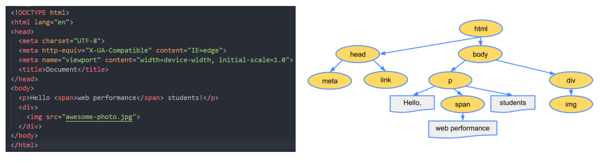
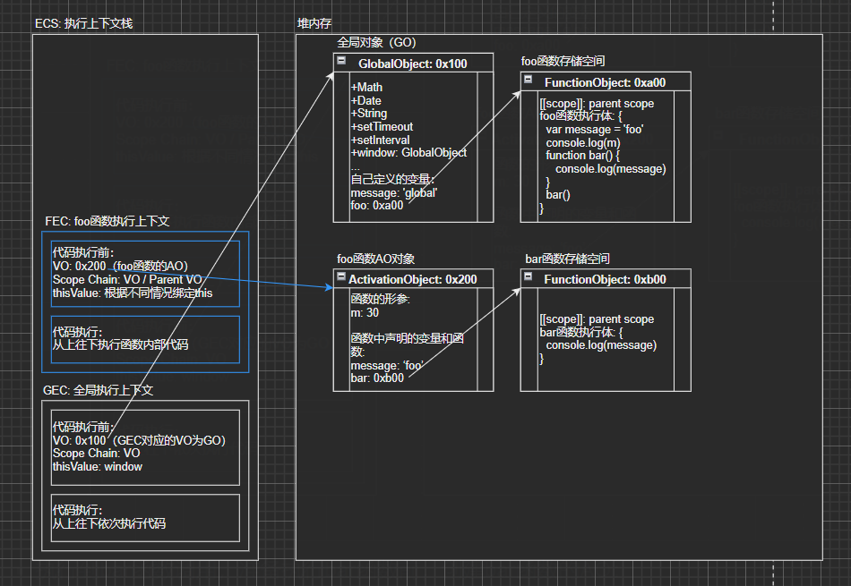
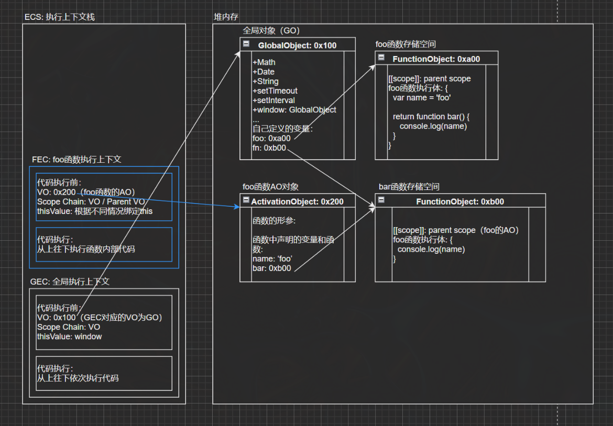
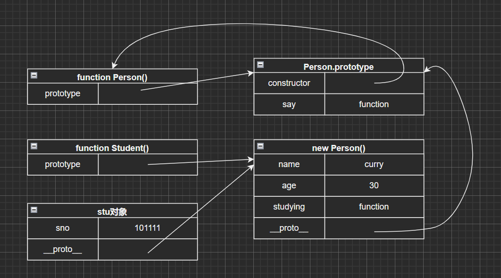
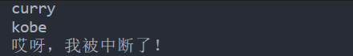

# javaScript高级


## 一、 this指向

> 在 JavaScript 中，`this` 的指向取决于函数的调用方式。以下是几种常见的 `this` 指向情况：

### 1. **全局作用域中的函数调用**
   - **`this` 指向：全局对象**
   - 在非严格模式下，全局作用域中的函数的 `this` 指向 `window`（浏览器环境）或 `global`（Node.js 环境）。
   - 在严格模式下，`this` 会是 `undefined`。

   ```javascript
function showThis() {
    console.log(this);
}

showThis(); // 浏览器中输出: window
   ```

   ```javascript
'use strict';
function showThis() {
    console.log(this);
}

showThis(); // 输出: undefined
   ```

### 2. **对象方法调用**
   - **`this` 指向：调用该方法的对象**
   - 如果函数作为对象的方法调用，`this` 会指向调用该方法的对象。

   ```javascript
const obj = {
    name: 'Alice',
    greet: function() {
        console.log(this.name);
    }
};

obj.greet(); // 输出: Alice，this 指向 obj 对象
   ```

### 3. **构造函数调用**
   - **`this` 指向：新创建的实例对象**
   - 当使用 `new` 关键字调用构造函数时，`this` 指向由该构造函数创建的新的实例对象。

   ```javascript
function Person(name) {
    this.name = name;
}

const person1 = new Person('Bob');
console.log(person1.name); // 输出: Bob
   ```

### 4. **`call`/`apply`/`bind` 调用**
   - **`this` 指向：指定的对象**
   - 通过 `call` 或 `apply` 方法调用函数时，`this` 被显式地指定为第一个参数。
   - `bind` 返回一个新的函数，该函数在调用时 `this` 始终指向指定的对象。

   ```javascript
function greet() {
    console.log(this.name);
}

const obj1 = { name: 'Alice' };
const obj2 = { name: 'Bob' };

greet.call(obj1); // 输出: Alice
greet.apply(obj2); // 输出: Bob

const boundGreet = greet.bind(obj1);
boundGreet(); // 输出: Alice
   ```

### 5. **箭头函数**
   - **`this` 指向：定义箭头函数时的外层作用域**
   - 箭头函数没有自己的 `this`，它会继承定义时外层作用域的 `this`。

   ```javascript
const obj = {
    name: 'Alice',
    greet: () => {
        console.log(this.name);
    }
};

obj.greet(); // 输出: undefined (因为 this 指向的是全局作用域)
   ```

   但是在对象或方法中嵌套箭头函数时，它会继承外层函数的 `this`。

   ```javascript
const obj = {
    name: 'Alice',
    greet: function() {
        const inner = () => {
            console.log(this.name);
        };
        inner();
    }
};

obj.greet(); // 输出: Alice (因为箭头函数继承了外层函数的 this)
   ```

### 6. **事件处理函数**
   - **`this` 指向：触发事件的 DOM 元素**
   - 在事件处理函数中，`this` 默认指向触发该事件的 DOM 元素。

   ```javascript
   const button = document.querySelector('button');
   button.addEventListener('click', function() {
     console.log(this); // 输出: 被点击的 button 元素
   });
   ```

总结：

- 普通函数调用：全局对象（严格模式下为 `undefined`）。
- 对象方法调用：调用该方法的对象。
- 构造函数调用：新创建的实例对象。
- `call`/`apply`/`bind`：显式指定的对象。
- 箭头函数：继承定义时的外层作用域。
- 事件处理函数：触发事件的 DOM 元素。


## 二、this绑定规则的优先级

> 在 JavaScript 中，`this` 的绑定规则存在优先级，不同调用方式之间可能会产生冲突。以下是 `this` 绑定规则的优先级从高到低的顺序：

### 1. **`new` 绑定（构造函数调用）**
   当使用 `new` 关键字调用一个函数时，会创建一个新的对象，并将 `this` 绑定到这个新创建的对象上。此时 `new` 绑定的优先级最高，其他绑定规则会被忽略。

   ```javascript
function Person(name) {
    this.name = name;
}

const person = new Person('Alice'); // this 指向新创建的 person 对象


// 3.2. new优先级高于bind
function foo() {
    console.log("foo:", this)
}
var bindFn = foo.bind("aaa")
new bindFn()
   ```

### 2. **`call` / `apply` / `bind` 显式绑定**
   `call`、`apply` 和 `bind` 可以显式地指定 `this` 的绑定对象。显式绑定的优先级次于 `new` 绑定。如果函数是通过 `new` 关键字调用的，显式绑定会被忽略。

   - `call` 和 `apply` 会立即执行函数，并传递指定的 `this`。
   - `bind` 会创建一个新的函数，`this` 被永久绑定到指定的对象，调用时不再改变。

   ```javascript
function greet() {
    console.log(this.name);
}

const obj = { name: 'Bob' };
greet.call(obj); // this 指向 obj，输出: Bob

// 4.bind/apply优先级
// bind优先级高于apply/call
function foo() {
    console.log("foo:", this)
}
var bindFn = foo.bind("aaa")
bindFn.call("bbb")
   ```

### 3. **隐式绑定（对象方法调用）**
   如果函数作为某个对象的方法调用，`this` 会隐式绑定到该对象上。隐式绑定优先级低于 `new` 和显式绑定。

   ```javascript
const obj = {
    name: 'Charlie',
    greet: function() {
        console.log(this.name);
    }
};

obj.greet(); // this 指向 obj，输出: Charlie
   ```

   **隐式绑定丢失：**
   如果将对象方法赋值给一个变量，隐式绑定会丢失，`this` 将会回退到默认绑定（在非严格模式下为全局对象，严格模式下为 `undefined`）。

   ```javascript
   const greet = obj.greet;
   greet(); // this 指向全局对象，非严格模式下输出: undefined
   ```

### 4. **默认绑定**
   当没有任何绑定规则适用时，`this` 会采用默认绑定。在非严格模式下，默认绑定会将 `this` 指向全局对象（浏览器中是 `window`，Node.js 环境是 `global`）；而在严格模式下，`this` 会是 `undefined`。

   ```javascript
function greet() {
    console.log(this.name);
}

const name = 'Global';
greet(); // 非严格模式下，this 指向 window，输出: Global
   ```

### 5. **箭头函数绑定（词法作用域绑定）**
   箭头函数不会创建自己的 `this`，它会捕获定义时外层作用域中的 `this`，并且无法通过 `new`、`call`、`apply` 或 `bind` 改变其 `this` 指向。因此，箭头函数的 `this` 绑定具有非常特殊的行为，优先级最低，但也最稳定，因为它的 `this` 是在定义时确定的，之后不再改变。

   ```javascript
const obj = {
    name: 'David',
    greet: () => {
        console.log(this.name);
    }
};

obj.greet(); // this 指向定义箭头函数时的外层作用域（全局），输出: undefined
   ```


### 6. 其他特殊情况

   我们讲到的规则已经足以应付平时的开发，但是总有一些语法，超出了我们的规则之外。（神话故事和动漫中总是有类似这样的人物）

```js
// 1. 如果在显示绑定中，我们传入一个null或者undefined，那么这个显示绑定会被忽略，使用默认规则：
function foo() {
    console.log(this)
}

var obj = {
    name: 'why'
}

foo.call(obj) // why
foo.call(null) // window
foo.call(undefined) // window

var bar = foo.bind(null)
bar() // window


// 2. 创建一个函数的 间接引用，这种情况使用默认绑定规则
//		- 赋值(obj2.foo = obj1.foo)的结果是foo函数；
//		- foo函数被直接调用，那么是默认绑定；
function foo() {
    console.log(this)
}

var obj1 = {
    name: 'obj1',
    foo: foo
}

var obj2 = {
    name: 'obj2'
}

obj1.foo() // obj1对象
(obj2.foo = obj1.foo)() // window
```


### 综合优先级排序（从高到低）：

1. **`new` 绑定**：`new` 操作符优先创建新对象并绑定 `this`。
2. **显式绑定（`call`/`apply`/`bind`）**：通过 `call`、`apply` 和 `bind` 显式指定 `this` 的指向。
3. **隐式绑定**：通过对象方法调用时，`this` 会绑定到调用该方法的对象上。
4. **默认绑定**：在没有其他绑定规则时，`this` 指向全局对象（非严格模式）或 `undefined`（严格模式）。
5. **箭头函数**：箭头函数的 `this` 是在定义时绑定的，无法通过任何方式改变。

这个优先级规则帮助我们理解在不同场景下 `this` 的指向如何确定。例如，使用 `new` 关键字时，尽管有显式绑定，`this` 仍然会优先指向新创建的对象。


## 三、浏览器工作原理和浏览器内核

### 1. 浏览器工作原理

> 在浏览器中输入查找内容，浏览器是怎样将页面加载出来的？以及JavaScript代码在浏览器中是如何被执行的？

大概流程可观察以下图：

- 首先，用户在浏览器搜索栏中输入服务器地址，与服务器建立连接；
- 服务器返回对应的静态资源（一般为`index.html`）；
- 然后，浏览器拿到`index.html`后对其进行解析；
- 当解析时遇到css或js文件，就向服务器请求并下载对应的css文件和js文件；
- 最后，浏览器对页面进行渲染，执行js代码；


那么在输入服务器地址，敲下回车那一刻会发生什么？

- 对浏览器输入的地址进行DNS解析，将域名解析成对应的IP地址；
- 然后向这个IP地址发送http请求，服务器收到发送的http请求，处理并响应；
- 最终浏览器得到服务器响应的内容

### 2. 浏览器内核

> 浏览器的**内核**（Rendering Engine 或称为浏览器引擎）是负责处理和渲染网页内容的核心部分。它是浏览器中的重要组件，负责解析 HTML、CSS、JavaScript 以及其他资源（如图像和视频），最终将其显示为用户可见的页面。浏览器的内核一般由两个主要部分组成：**渲染引擎** 和 **JavaScript 引擎**。（浏览器从服务器下载的文件最终都是通过浏览器的内核来进行解析的。）

以webkit浏览器为例：

- WebCore**：**负责HTML解析、布局、渲染等等相关的工作；

- JavaScriptCore**：**解析、执行JavaScript代码；

  

小程序中编写的JavaScript代码就是由JSCore执行的，也就是小程序使用的引擎就是JavaScriptCore：

- 渲染层：由Webview来解析和渲染wxml、wxss等；

- 逻辑层：由JSCore来解析和执行JS代码；

- 以下为小程序的官方架构图：

  


### 3. **渲染引擎**

> 渲染引擎的主要职责是将 HTML、CSS 以及其他内容解析为网页，并呈现给用户。它负责构建 DOM 树、CSSOM 树，生成渲染树，进行布局和绘制。不同浏览器使用不同的渲染引擎，这导致了不同浏览器之间可能出现的页面显示差异。

#### 1.1常见的渲染引擎有：
- **WebKit**：早期被 Safari 和 Chrome 使用。Chrome 后来从 WebKit 分支出 **Blink**，成为其自家的渲染引擎。

- **Blink**：现在用于 Google Chrome 和基于 Chromium 的浏览器（如 Microsoft Edge）。

- **Gecko**：Mozilla Firefox 使用的渲染引擎。

- **Trident** 和 **EdgeHTML**：分别是 Internet Explorer 和早期版本的 Microsoft Edge 使用的引擎。Edge 后来转向使用 Blink。

  

#### 1.2渲染引擎渲染页面的详细流程:


1. 解析 HTML 文件，构建 DOM 树
   当浏览器接收到 HTML 文件后，渲染引擎首先开始解析 HTML 标记语言。它会根据 HTML 元素构建 **DOM 树**（Document Object Model），这是一个反映 HTML 结构的树形结构。（上图中紫色的DOM三角，是js对DOM的相关操作；）

   

2. 解析 CSS 文件，构建 CSSOM 树

   在解析HTML文件的过程中，如果遇到CSS的link元素，那么会由浏览器负责下载对应的CSS文件（下载CSS文件是不会影响DOM的解析的）；浏览器下载完CSS文件后，就会对CSS文件进行解析。

   渲染引擎会加载与 HTML 相关联的所有样式资源（包括外部的 CSS 文件和嵌入在 HTML 中的样式）。CSS 文件会被解析为 **CSSOM 树**（CSS Object Model Tree），其中每个 CSS 规则与相应的 HTML 元素绑定。

   

3. 生成渲染树（Render Tree）

   DOM 树和 CSSOM 树构建完毕后，渲染引擎会将这两者结合，生成 **渲染树**。渲染树的每个节点都是可见元素的“盒子”，并且带有样式信息。

   **注意一**：link元素不会阻塞DOM Tree的构建过程，但是会阻塞Render Tree的构建过程（因为Render Tree在构建时，需要对应的CSSOM Tree；）
   **注意二**：Render Tree和DOM Tree并不是一一对应的关系（比如对于display为none的元素，压根不会出现在render tree中）

   **特点**：不包含不可见的元素（如 `display: none` 的元素）；只包含需要呈现在屏幕上的节点。

   

4. 布局（Layout）
   生成渲染树后，布局是在渲染树（Render Tree）上运行布局（Layout）以计算每个节点的几何体。**渲染引擎会开始进行 **布局计算，也称为 **Reflow**或 **重排**。这个阶段的目标是确定每个渲染对象的确切位置和尺寸（高度、宽度）。

   **布局过程：**

   ​	1、计算每个盒子的位置（坐标）和尺寸（宽高）。

   ​	2、从页面的根节点开始，逐层遍历所有渲染树节点。

   ​	3、布局依赖父元素的尺寸和位置，因此是自上而下的。

   

5. 绘制（Painting）

   在布局完成后，浏览器会将渲染树中的节点转换为 **像素**，即将每个节点绘制到屏幕上。绘制过程由渲染引擎中的绘制模块负责，将每个节点的视觉属性（如颜色、背景、边框等）转换为图形。

   **绘制阶段分为多个步骤：**

   ​	* 背景颜色和图片的绘制。

   ​	* 边框的绘制。

   ​	* 文字的绘制。

   ​	* 其他装饰效果的绘制，如阴影、渐变等。

6. 合成层（Compositing Layers）

   在一些复杂的场景下，渲染引擎会将页面分成多个 **层**，称为 **合成层**。这些层可能是由于 CSS3 的某些属性（如 `transform`、`opacity`、`position: fixed` 等）而被单独处理。每个合成层会被独立绘制，然后进行合成，最终生成完整的页面。这是浏览器的一种优化手段。

   - 默认情况下，标准流中的内容都是被绘制在同一个图层（Layer）中的；
   - 而一些特殊的属性，会创建一个新的合成层（**CompositingLayer**），并且新的图层可以利用GPU来加速绘制。（因为每个合成层都是单独渲染的）
   - 那么哪些属性可以形成新的合成层呢？常见的一些属性
     - 3D transforms
     - video、canvas、iframe
     - opacity 动画转换时
     - position: fixed
     - will-change：一个实验性的属性，提前告诉浏览器元素可能发生哪些变化；
     - animation 或 transition 设置了opacity、transform；
   - 分层确实可以提高性能，但是它以内存管理为代价，因此不应作为 web 性能优化策略的一部分过度使用。

   为什么要使用合成层？

   - 分离绘制复杂的元素，可以提高性能，避免重绘整个页面。
   - 合成层独立于其他层更新，可以加速页面交互，例如滚动或动画效果。

   每个合成层的绘制顺序会被确定，浏览器最终将这些层合成为一个完整的图像并呈现出来。

   

   

7. 展示（Displaying）

   最终，合成好的页面会通过浏览器的绘图接口，显示在用户的屏幕上。渲染引擎会不断重复这一过程，以处理用户的交互、页面的滚动、JavaScript 代码执行等操作。如果页面内容改变，例如某个 JavaScript 改变了 DOM 树中的内容，渲染引擎会重新执行部分或全部的这些步骤。

#### 1.3 回流和重绘

**回流（Reflow）** 和 **重绘（Repaint）** 是浏览器渲染过程中涉及的两个重要概念，它们会影响网页的性能，特别是当网页发生频繁的变化时。了解它们的工作机制可以帮助开发者优化页面的渲染，减少性能瓶颈。

##### 1. **回流（Reflow）** 也称为重排（Layout）

**回流** 是当页面的布局和几何信息（如尺寸、位置）发生变化时，浏览器重新计算元素的布局并调整它们在页面中的位置的过程。回流是一个昂贵的操作，因为它需要浏览器重新计算许多元素的位置和大小。

- **第一次**确定节点的大小和位置，称之为**布局**（layout）。
- 之后对节点的大小、位置修改重新计算称之为**回流**。

###### 触发回流的常见操作：

- **添加或删除 DOM 元素**。
- **修改元素的尺寸**（如 `width`、`height`、`padding`、`border`）。
- **修改元素的位置**（如 `top`、`left`）。
- **修改元素的 `display` 属性**（如从 `none` 变为 `block`）。
- **修改页面的字体大小**。
- **窗口大小变化**（如浏览器窗口的缩放）。
- **读取元素几何信息**（如 `offsetWidth`、`offsetHeight`、`scrollTop` 等），因为浏览器为了提供准确的几何数据，会先触发回流。

###### 回流的性能影响：

- 回流会遍历整个渲染树或渲染树的某个子树，并且可能影响页面的多个部分。
- 页面元素越复杂，回流的性能开销就越大。
- 浏览器通常会通过批量处理回流来优化性能，但频繁触发回流仍会导致性能问题，特别是在动态网页或动画中。

##### 2. **重绘（Repaint）**

**重绘** 是指当元素的外观发生变化，但并不影响布局时，浏览器会重新绘制元素以反映这些变化。与回流不同，重绘不需要重新计算元素的位置和几何信息，因此它比回流的性能开销要小一些。

- **第一次**渲染内容称之为**绘制**（paint）。
- 之后重新渲染称之为**重绘**。

###### 触发重绘的常见操作：

- **修改元素的外观**，如背景颜色、边框颜色、字体颜色等。
- **修改元素的 `visibility` 属性**（从 `hidden` 变为 `visible` 或相反）。

###### 重绘的性能影响：

- 虽然重绘比回流开销小，但如果频繁修改元素的样式（例如通过动画），大量的重绘仍会影响性能，尤其是在低性能设备上。

##### 3. **回流和重绘的区别**

- **回流**：涉及布局的重新计算，影响元素的几何属性，如位置和尺寸，代价更高。
- **重绘**：只涉及元素的视觉变化，不影响布局，代价较低。

##### 4. **如何减少回流和重绘**

为了提高性能，前端开发中应尽量避免频繁触发回流和重绘。以下是一些优化建议：

1. **批量处理 DOM 操作**

   - 在避免频繁的 DOM 操作时，使用 **文档片段（DocumentFragment）** 和 **离线 DOM** 是常见的优化方法。它们的主要目的是减少对实际页面的反复修改，避免多次触发回流和重绘，从而提升性能。

    **文档片段（DocumentFragment）**

   `DocumentFragment` 是一个轻量的、无父级的 DOM 片段。当你在 `DocumentFragment` 中进行 DOM 操作时，它不会触发页面的重排（回流），因为它不是真实 DOM 树的一部分，直到你将它一次性插入到实际的 DOM 中为止。

   **使用 DocumentFragment 的示例**：

   假设我们有一个列表，想动态添加 1000 个列表项。如果直接操作 DOM，会触发 1000 次回流。而使用 `DocumentFragment` 可以一次性将 1000 个列表项插入 DOM 中，只触发一次回流。

   ```html
   <!DOCTYPE html>
   <html>
   <head>
       <title>DocumentFragment Example</title>
   </head>
   <body>
       <ul id="list"></ul>
   
       <script>
           const list = document.getElementById('list');
           const fragment = document.createDocumentFragment();  // 创建文档片段
   
           for (let i = 0; i < 1000; i++) {
               const listItem = document.createElement('li');
               listItem.textContent = `Item ${i + 1}`;
               fragment.appendChild(listItem);  // 将列表项添加到文档片段中
           }
   
           list.appendChild(fragment);  // 一次性将文档片段插入到 DOM 中，只触发一次回流
       </script>
   </body>
   </html>
   ```

   **执行步骤**：

   1. 创建一个 `DocumentFragment` 对象。
   2. 将新的 `li` 元素添加到 `DocumentFragment`。
   3. 最后一次性将 `DocumentFragment` 插入到实际的 DOM 中。

   这减少了对实际 DOM 的操作，只触发了一次回流，而不是 1000 次。

   **离线 DOM**

   **离线 DOM** 是指创建一个不在当前文档中的 DOM 元素（例如一个 `div`），你可以在其上进行大量的 DOM 操作，然后一次性将这个元素或其内容插入到页面中。这和 `DocumentFragment` 的思想类似，但区别在于你操作的是真实 DOM 元素。

   **使用离线 DOM 的示例**：

   和上面例子类似，我们也可以通过创建一个新的 `div` 容器，先将新的元素插入到这个离线的 `div` 中，最后再一次性将 `div` 插入页面。

   ```html
   <!DOCTYPE html>
   <html>
   <head>
       <title>Offline DOM Example</title>
   </head>
   <body>
       <ul id="list"></ul>
   
       <script>
           const list = document.getElementById('list');
           const tempDiv = document.createElement('div');  // 创建一个离线的 div
   
           for (let i = 0; i < 1000; i++) {
               const listItem = document.createElement('li');
               listItem.textContent = `Item ${i + 1}`;
               tempDiv.appendChild(listItem);  // 将列表项添加到离线的 div 中
           }
   
           // 将离线 div 的内容一次性插入到实际 DOM 中
           list.innerHTML = tempDiv.innerHTML;
       </script>
   </body>
   </html>
   ```

   **执行步骤**：

   1. 创建一个离线的 `div` 元素。
   2. 将新的 `li` 元素添加到这个 `div` 中。
   3. 最后一次性将 `div` 的内容插入到 `ul` 中。

   这减少了对实际 DOM 的频繁操作，降低了回流次数。

   

   **总结：**

   - **DocumentFragment** 是一个轻量的虚拟 DOM 片段，它不会被插入到页面中，因此不会触发回流。通过批量操作 `DocumentFragment`，然后一次性插入页面，可以减少多次回流。
   - **离线 DOM** 通过在一个不在文档中的 DOM 元素上进行操作（如创建离线的 `div`），然后再一次性插入实际 DOM 中，也能有效避免频繁的回流操作。

   这两种方法都可以大幅度提升动态页面的性能，尤其是在处理大量 DOM 操作时。

   

2. **避免逐项修改样式**

   - 当需要修改元素的多个样式时，避免逐项修改。例如：
     ```javascript
     // 避免逐项修改
     element.style.width = "100px";
     element.style.height = "200px";
     element.style.backgroundColor = "red";
     ```
     应使用 **class** 或修改 **`style.cssText`** 一次性修改多个样式：
     ```javascript
     element.className = "new-style"; // 或者使用 class
     // 或者
     element.style.cssText = "width: 100px; height: 200px; background-color: red;";
     ```


3. **避免频繁读取导致回流的属性**
   - 读取某些属性（如 `offsetHeight`、`offsetWidth`）会强制浏览器进行回流，以确保获取到的几何信息是准确的。应避免在频繁更新页面时立即读取这些属性，尤其是在循环中。
   - 尽量避免通过getComputedStyle获取尺寸、位置等信息；


4. **使用 CSS3 动画和 GPU 加速**
   - 某些 CSS 属性，如 `transform` 和 `opacity`，可以通过 GPU 加速来进行动画，而不会触发回流和重绘。因此，优先使用这些属性进行动画操作，而不是直接修改几何属性或其他会影响布局的属性。


5. **使用 `will-change` 提示优化**

   - 可以使用 `will-change` CSS 属性来提示浏览器即将发生的变化，这样浏览器可以提前优化处理这些元素。例如：
     ```css
     .box {
       will-change: transform;
     }
     ```

6. **对某些元素使用position的absolute或者fixed**

   - 使用这两个定位方式，可以将这些元素从文档的标准流（normal flow）中移除，减少它们对其他元素布局的影响，从而降低回流和重绘的开销。

##### 总结

- **回流**：当页面的布局或几何信息发生变化时触发，性能开销较大，需避免频繁触发。
- **重绘**：当页面元素的外观发生变化但不涉及布局时触发，性能开销较小，但仍需注意避免过度重绘。
- **回流**一定会**引起重绘**，所以回流是一件很消耗性能的事情。
- **优化方法**：批量处理 DOM 操作、减少几何属性的读取、使用 CSS 动画、避免逐项修改样式等，都可以减少回流和重绘，提升网页的性能。


#### 1.4 script元素和页面解析的关系

`<script>` 元素和页面解析的关系直接影响网页的加载顺序、性能和用户体验。JavaScript 的加载、解析和执行与 HTML 文档的解析是紧密相关的，不同的 `script` 加载方式会影响浏览器的解析和渲染流程。以下是 `script` 元素和页面解析之间的关键关系：

 ##### 1. 默认情况下，JavaScript 阻塞 HTML 解析

当浏览器遇到一个普通的 `<script>` 标签时，HTML 解析会暂停，直到 JavaScript 文件下载完成并执行后才会继续。这是因为 JavaScript 可能会动态修改 DOM 结构（如通过 `document.write`），因此浏览器必须等待脚本执行完毕，以避免修改了未完全解析的 HTML 内容。

**流程**：
1. 浏览器开始解析 HTML 文档。
2. 遇到 `<script>` 标签，暂停 HTML 解析。
3. 下载并执行 JavaScript。
4. 执行完成后继续解析 HTML。

```html
<!DOCTYPE html>
<html>
<head>
    <script src="script.js"></script>
</head>
<body>
    <h1>Hello, World!</h1>
</body>
</html>
```

在上述例子中，页面的解析会在遇到 `<script>` 标签时暂停，等到 `script.js` 下载并执行完后，才会继续解析剩下的 HTML（如 `<h1>` 元素）。

##### 2. `defer` 属性：延迟执行且不阻塞解析

`defer` 属性告诉浏览器在解析完整个 HTML 文档后再执行 JavaScript 文件。这种方式不会阻塞 HTML 的解析，但脚本的执行顺序仍然按照它们在文档中出现的顺序。

- **特点**：
  - 不阻塞 HTML 解析。
  - 在 DOM 树完全构建后执行，优先级低于文档解析。
  - 如果脚本提前下载好了，它会等待DOM Tree构建完成，在**DOMContentLoaded**事件之前先执行defer中的代码；
  - 通常用于需要在文档解析后操作DOM的JavaScript代码，并且对多个script文件有顺序要求的，适合用于页面加载完成后才执行的脚本。

```html
<!DOCTYPE html>
<html>
<head>
    <script src="script.js" defer></script>
</head>
<body>
    <h1>Hello, World!</h1>
</body>
</html>
```

在这个例子中，浏览器会继续解析整个页面，直到 HTML 文档全部解析完毕后，再执行 `script.js`，从而加快页面的初始加载速度。

##### 3. `async` 属性：异步加载且不阻塞解析

`async` 属性会告诉浏览器异步下载 JavaScript 文件，不会阻塞 HTML 的解析。一旦脚本下载完毕，它会立即执行，而不等待 HTML 完全解析。这意味着脚本的执行顺序不一定与文档中的顺序一致。

- **特点**：
  - 不阻塞 HTML 解析。
  - 一旦脚本下载完成，立即执行，可能在 HTML 解析完成之前。
  - async不能保证在**DOMContentLoaded**之前或者之后执行；
  - 适合用于与页面无强关联、独立执行的脚本，如广告、分析工具等。

```html
<!DOCTYPE html>
<html>
<head>
    <script src="script.js" async></script>
</head>
<body>
    <h1>Hello, World!</h1>
</body>
</html>
```

在这个例子中，`script.js` 会异步加载，不阻塞 HTML 的解析。然而，脚本的执行可能在页面完全解析之前发生。

##### 4. 行内脚本（Inline Script）

当 JavaScript 直接嵌入到 HTML 中时，解析器会在遇到 `<script>` 标签时立即执行该代码，仍然会阻塞 HTML 的解析。

```html
<!DOCTYPE html>
<html>
<head>
    <script>
        console.log('This will execute immediately.');
    </script>
</head>
<body>
    <h1>Hello, World!</h1>
</body>
</html>
```

在此示例中，`console.log` 会在浏览器继续解析 `<h1>` 元素之前执行。

##### 5. 放置 `<script>` 标签的位置

将 `<script>` 标签放在 `<body>` 标签的底部（如 `<body>` 结束标签之前），可以减少页面加载初期的阻塞效果。这是因为 HTML 解析和渲染可以先完成，最后才下载并执行 JavaScript 文件。这种方式和 `defer` 属性的效果类似。

```html
<!DOCTYPE html>
<html>
<head>
    <title>Example</title>
</head>
<body>
    <h1>Hello, World!</h1>
    <script src="script.js"></script>
</body>
</html>
```

此时，JavaScript 只有在页面结构已经加载完成后才会被加载和执行。

##### 总结

- **默认 `<script>`**：阻塞 HTML 解析，等待脚本加载和执行。
- **`defer`**：不会阻塞解析，页面解析完成后按顺序执行脚本。
- **`async`**：不会阻塞解析，脚本加载完成后立即执行，可能在解析结束之前。
- **放置位置**：将 `<script>` 放在 `<body>` 底部可以减少阻塞，提高加载性能。

选择适当的方式加载 JavaScript，可以显著改善页面的加载性能和用户体验。


### 4. **JavaScript 引擎**

> JavaScript 引擎专门负责执行网页中的 JavaScript 代码。在现代网页中，JavaScript 用于控制动态行为，如用户交互、动画、数据请求等。JavaScript 引擎是浏览器内核的一个关键部分，负责解释和执行 JavaScript 脚本。

#### 常见的 JavaScript 引擎有：
- **V8**：V8引擎使用C++编写的Google**开源高性能**JavaScript和WebAssembly引擎，它用于Chrome和Node.js等，可以独立运行，也可以嵌入到任何C++的应用程序中。所以说V8并不单单只是服务于JavaScript的，还可以用于WebAssembly（一种用于基于堆栈的虚拟机的二进制指令格式），并且可以**运行在多个平台**。
- **SpiderMonkey**：Mozilla 开发的 JavaScript 引擎，用于 Firefox 浏览器。
- **JavaScriptCore（Nitro）**：Apple 的 WebKit 中使用的 JavaScript 引擎，主要用于 Safari。
- **Chakra**：Microsoft 开发，用于 Internet Explorer 和旧版本的 Edge 浏览器。

#### 内核的作用和工作流程

当浏览器加载网页时，内核会执行以下步骤：
1. **解析**：内核从服务器获取 HTML 文件，解析它并生成 DOM 树。
2. **样式计算**：解析 CSS 文件，构建 CSSOM 树。
3. **布局和渲染**：将 DOM 树和 CSSOM 树结合起来生成渲染树，计算页面中各个元素的布局，并绘制在屏幕上。
4. **执行 JavaScript**：JavaScript 引擎解析并执行页面中的 JavaScript 代码，可能会修改 DOM 树或 CSSOM 树，从而影响页面的渲染。

#### 内核和浏览器的区别

浏览器是整个应用程序，而内核只是其中负责渲染网页内容的部分。浏览器还包括其他组件，例如：
- **用户界面**：如地址栏、前进和后退按钮等。
- **网络层**：负责处理 HTTP 请求和响应。
- **数据存储**：管理 cookies、localStorage 等数据存储机制。

浏览器内核的工作是幕后进行的，它处理了大量技术细节，确保用户在访问网页时得到无缝的体验。


#### V8引擎的工作原理

V8 是 Google 开发的开源 JavaScript 引擎，用于执行 JavaScript 代码。它最初被设计用于 Chrome 浏览器，但后来扩展到了 Node.js 等其他环境中。V8 的核心目标是通过高效地编译和执行 JavaScript 代码来提升性能。以下是 V8 引擎执行 JavaScript 的基本原理：


1. **解释与编译**

   JavaScript 是一种解释型语言，传统的 JavaScript 引擎（如早期的解释器）会逐行解析和执行代码。V8 引擎的特别之处在于，它将 JavaScript 编译成机器码来提升执行效率。它采用了**即时编译（JIT）**的方式，这意味着在执行过程中，代码会被动态编译为机器码。

   - **Full-Codegen**: 在 V8 的早期版本中，V8 使用 Full-Codegen，将 JavaScript 代码直接转化为非优化的机器码。这种方式相对简单，但性能有限。
   - **Ignition（解释器）**: Ignition 是 V8 的现代解释器，它将 JavaScript 源代码编译为一种高效的中间字节码，并且不需要立即生成机器码。
   - **TurboFan（优化编译器）**: V8 使用 TurboFan 对常用和热点代码进行优化，将这些代码编译为高效的机器码。它会通过运行时分析对代码进行优化，并将常用的代码段进一步优化。

2. **执行流程**


> V8的底层架构主要有三个核心模块（Parse、Ignition和TurboFan），接下来对上面架构图进行详细说明。

   当 JavaScript 代码在 V8 中运行时，整个执行流程大致如下：
   - **Parsing（解析）**: V8 首先通过 Parser（解析器）解析 JavaScript 源代码，生成抽象语法树（AST）。AST 是代码的结构化表示，便于分析和后续处理。（如果函数没有被调用，那么是不会被转换成AST的；）

     - 该过程主要对JavaScript源代码进行词法分析和语法分析；

     - 词法分析：对代码中的每一个词或符号进行解析，最终会生成很多tokens（一个数组，里面包含很多对象）；

       - 比如，对`const name = 'curry'`这一行代码进行词法分析：

         ```js
         // 首先对const进行解析，因为const为一个关键字，所以类型会被记为一个关键词，值为const
         tokens: [
           { type: 'keyword', value: 'const' }
         ]
         
         // 接着对name进行解析，因为name为一个标识符，所以类型会被记为一个标识符，值为name
         tokens: [
           { type: 'keyword', value: 'const' },
           { type: 'identifier', value: 'name' }
         ]
         
         // 以此类推...
         ```

       - 语法分析：在词法分析的基础上，拿到tokens中的一个个对象，根据它们不同的类型再进一步分析具体语法，最终生成AST；

       - 以上即为简单的JS词法分析和语法分析过程介绍，如果想详细查看我们的JavaScript代码在通过Parse转换后的AST，可以使用[AST Explorer](https://astexplorer.net/)工具：

         

       - AST在前端应用场景特别多，比如将TypeScript代码转成JavaScript代码、ES6转ES5、还有像vue中的template等，都是先将其转换成对应的AST，然后再生成目标代码；

       - 参考官方文档：https://v8.dev/blog/scanner

   - **Ignition（解释字节码）**: 解析后，代码被传递给 Ignition 解释器。Ignition 将 AST 转换为字节码，并开始解释执行。

     - 字节码（Byte-code）：是一种包含执行程序，由一序列 op 代码/数据对组成的二进制文件，是一种中间码。
     - 将JS代码转成AST是便于引擎对其进行操作，前面说到JS代码最终是转成机器码给CPU执行的，为什么还要先转换成字节码呢？
       - 因为JS运行所处的环境是不一定的，可能是windows或Linux或iOS，不同的操作系统其CPU所能识别的机器指令也是不一样的。字节码是一种中间码，本身就有跨平台的特性，然后V8引擎再根据当前所处的环境将字节码编译成对应的机器指令给当前环境的CPU执行。

     - 参考官方文档：https://v8.dev/blog/ignition-interpreter

   - **TurboFan模块**：一个编译器，可以将字节码编译为CPU认识的机器码。

     - 在了解TurboFan模块之前可以先考虑一个问题，如果每执行一次代码，就要先将AST转成字节码然后再解析成机器指令，是不是有点损耗性能呢？强大的V8早就考虑到了，所以出现了TurboFan这么一个库；
     - TurboFan可以获取到Ignition收集的一些信息，如果一个函数在代码中被多次调用，那么就会被标记为**热点函数**，然后经过TurboFan转换成优化的机器码，再次执行该函数的时候就直接执行该机器码，提高代码的执行性能；
     - 图中还存在一个`Deoptimization`（去优化）过程，其实就是**机器码被还原成ByteCode**，比如，在后续执行代码的过程中传入**热点函数的参数类型发生了变化**（如果给sum函数传入number类型的参数，那么就是做加法；如果给sum函数传入String类型的参数，那么就是做字符串拼接），可能之前优化的机器码就不能满足需求了，就会逆向转成字节码，字节码再编译成正确的机器码进行执行；
     - 从这里就可以发现，如果在编写代码时给函数传递固定类型的参数，是可以从一定程度上优化我们代码执行效率的，所以TypeScript编译出来的JavaScript代码的性能是比较好的；
     - 参考官方文档：https://v8.dev/blog/turbofan-jit


**补充：V8引擎执行过程**

> V8引擎的官方在Parse过程提供了以下这幅图，最后就来详细了解一下Parse具体的执行过程。

- ①Blink内核将JS源码交给V8引擎；

- ②Stream获取到JS源码进行**编码转换**；

- ③Scanner进行词法分析，将代码转换成tokens；

- ④经过语法分析后，tokens会被转换成AST，中间会经过Parser和PreParser过程：

  - Parser：直接解析，将tokens转成AST树；
  - PreParser：预解析（为什么需要预解析？）
    - 因为并不是所有的JavaScript代码，在一开始时就会执行的，如果一股脑对所有JavaScript代码进行解析，必然会影响性能，所以V8就实现了**Lazy Parsing（延迟解析）**方案，对不必要的函数代码进行预解析，也就是先解析急需要执行的代码内容，对函数的**全量解析**会放到函数被调用时进行。

- ⑤生成AST后，会被Ignition转换成字节码，然后转成机器码，最后就是代码的执行过程了；

  

**总结：**

V8 引擎通过现代的解释与即时编译技术，结合垃圾回收与运行时优化，使得 JavaScript 的执行效率得到了大幅提升。它的工作原理涉及字节码解释、机器码生成、内存管理、类型反馈等机制，并通过不断的监控与优化，保证了代码的高效执行。


#### JavaScript的执行过程

> 编写一段JavaScript代码，它是如何执行的呢？简单来说，JS引擎在执行JavaScript代码的过程中需要先解析再执行。那么在解析阶段JS引擎又会进行哪些操作，接下来就一起来了解一下JavaScript在执行过程中的详细过程，包括执行上下文、GO、AO、VO和VE等概念的理解。


##### 1.初始化全局对象

> 首先，JS引擎会在执行代码之前，也就是解析代码时，会在我们的堆内存创建一个全局对象：Global Object（简称GO），观察以下代码，在全局中定义了几个变量：

示例代码：

```js
var name = 'curry'
var message = 'I am a coder'
var num = 30
```

JS引擎内部在解析以上代码时，会创建一个全局对象（伪代码如下）：

- 所有的**作用域（scope）**都可以访问该全局对象；
- 对象里面会包含一些**全局的方法和类**，像Math、Date、String、Array、setTimeout等等；
- 其中有一个**window属性**是指向该全局对象自身的；
- 该对象中会收集我们上面全局定义的变量，并设置成undefined；
- 全局对象是非常重要的，我们平时之所以能够使用这些全局方法和类，都是在这个全局对象中获取的；


```js
var GlobalObject = {
  Math: '类',
  Date: '类',
  String: '类',
  setTimeout: '函数',
  setInterval: '函数',
  window: GlobalObject,
  ...
  name: undefined,
  message: undefined,
  num: undefined
}
```

##### 2.执行上下文栈（调用栈）

> 了解了什么是全局对象后，下面就来聊聊代码具体执行的地方。JS引擎为了执行代码，引擎内部会有一个**执行上下文栈（Execution Context Stack，简称ECS）**，它是用来执行代码的**调用栈**。

**（1）ECS如何执行？先执行谁呢？**

- 无疑是先执行我们的全局代码块；
- 在执行全局代码前会构建一个**全局执行上下文（Global Execution Context，简称GEC）**；
- 一开始GEC就会被放入到ECS中执行；

**（2）那么全局执行上下文（GEC）包含那些内容呢？**

- 第一部分：

  执行代码前。

  - 在转成抽象语法树之前，会将**全局定义的变量、函数**等加入到**Global Object**中，也就是上面初始化全局对象的过程；
  - 但是**并不会真正赋值**（表现为undefined），所以这个过程也称之为**变量的作用域提升（hoisting）**；

- 第二部分：

  代码执行。

  - 对变量进行赋值，或者执行其它函数等；

下面就通过一幅图，来看看GEC被放入ECS后的表现形式：


##### 3.调用栈调用GEC的过程

> 接下来，将全局代码复杂化一点，再来看看调用栈调用全局执行上下文（GEC）的过程。

示例代码：

```js
var name = 'curry'

console.log(message)

var message = 'I am a coder'

function foo() {
  var name = 'foo'
  console.log(name)
}

var num1 = 30
var num2 = 20

var result = num1 + num2

foo()
```

调用栈调用过程：

- 1.初始化全局对象。

  - 这里需要注意的是函数存放的是地址，会指向函数对象，与普通变量有所不同；

  - 从上往下解析JS代码，当解析到foo函数时，因为foo不是普通变量，并不会赋为undefined，JS引擎会在堆内存中开辟一块空间存放foo函数，在全局对象中引用其地址；

  - 这个开辟的函数存储空间最主要存放了该函数的**父级作用域**和函数的**执行体代码块**；

    

- 2.构建一个全局执行上下文（GEC），代码执行前将VO的内存地址指向GlobalObject（GO）。

  

- 3.将全局执行上下文（GEC）放入执行上下文栈（ECS）中。

  

- 4.从上往下开始执行全局代码，依次对GO对象中的全局变量进行赋值。

  - 当执行`var name = 'curry'`时，就从VO（对应的就是GO）中找到name属性赋值为curry；

  - 接下来执行`console.log(message)`，就从VO中找到message，注意**此时的message还为undefined**，因为message真正赋值在下一行代码，所以就直接打印undefined（也就是我们经常说的变量作用域提升）；

  - 后面就依次进行赋值，执行到`var result = num1 + num2`，也是从VO中找到num1和num2两个属性的值进行相加，然后赋值给result，result最终就为50；

  - 最后执行到`foo()`，也就是需要去执行foo函数了，这里的操作是比较特殊的，涉及到**函数执行上下文**，下面来详细了解；

    


##### 4.函数执行上下文

> 在执行全局代码遇到函数如何执行呢？

- 在执行的过程中遇到函数，就会根据函数体创建一个**函数执行上下文（Functional Execution Context，简称FEC）**，并且加入到执行上下文栈（ECS）中。
- 函数执行上下文（FEC）包含三部分内容：
  - AO：在解析函数时，会创建一个**Activation Objec（AO）**；
  - 作用域链：由**函数VO和父级VO组成**，查找是一层层往外层查找；
  - this指向：this绑定的值，在函数执行时确定；
- 其实全局执行上下文（GEC）也有自己的作用域链和this指向，只是它对应的作用域链就是自己本身，而this指向为window。

继续来看上面的代码执行，当执行到`foo()`时：

- 先找到foo函数的存储地址，然后**解析foo函数**，生成函数的AO；
- 根据AO生成函数执行上下文（FEC），并将其放入执行上下文栈（ECS）中；
- 开始执行foo函数内代码，依次找到AO中的属性并赋值，当执行`console.log(name)`时，就会去foo的VO（对应的就是foo函数的AO）中找到name属性值并打印；


##### 5.变量环境和记录

> 上文中提到了很多次VO，那么VO到底是什么呢？下面从ECMA新旧版本规范中来谈谈VO。

在早期ECMA的版本规范中：每一个执行上下文会被关联到一个**变量环境（Variable Object，简称VO）**，在源代码中的**变量和函数声明**会被作为属性添加到VO中。对应函数来说，参数也会被添加到VO中。

- 也就是上面所创建的GO或者AO都会被关联到变量环境（VO）上，可以通过VO查找到需要的属性；
- 规定了VO为Object类型，上文所提到的GO和AO都是Object类型；

在最新ECMA的版本规范中：每一个执行上下文会关联到一个**变量环境（Variable Environment，简称VE）**，在执行代码中**变量和函数的声明**会作为**环境记录（Environment Record）**添加到变量环境中。对于函数来说，参数也会被作为环境记录添加到变量环境中。

- 也就是相比于早期的版本规范，对于变量环境，已经去除了VO这个概念，提出了一个新的概念VE；
- 没有规定VE必须为Object，不同的JS引擎可以使用不同的类型，作为一条环境记录添加进去即可；
- 虽然新版本规范将变量环境改成了VE，但是JavaScript的执行过程还是不变的，只是关联的变量环境不同，将VE看成VO即可；


##### 6.全局代码执行过程（函数嵌套）

> 了解了上面相关的概念和调用流程之后，就来看一下存在函数嵌套调用的代码是如何执行的，以及执行过程中的一些细节，以下面代码为例：

```js
var message = 'global'

function foo(m) {
  var message = 'foo'
  console.log(m)

  function bar() {
    console.log(message)
  }

  bar()
}

foo(30)
```

- 初始化全局对象（GO），执行全局代码前创建GEC，并将GO关联到VO，然后将GEC加入ECS中：

  - foo函数存储空间中指定的父级作用域为全局对象；

    

- 开始执行全局代码，从上往下依次给全局属性赋值：

  - 给message属性赋值为global；

    

- 执行到foo函数调用，准备执行foo函数前，创建foo函数的AO：

  - bar函数存储空间中指定父级作用域为foo函数的AO；

    

- 创建foo函数的FEC，并加入到ECS中，然后开始执行foo函数体内的代码：

  - 根据foo函数调用的传参，给形参m赋值为30，接着给message属性赋值为foo；

  - 所以，m打印结果为30；

    

- 执行到bar函数调用，准备执行bar函数前，创建bar函数的AO：

  - bar函数中没有定义属性和声明函数，以空对象表示；

    

- 创建bar函数的FEC，并加入到ECS中，然后开始执行bar函数体内的代码：

  - 执行`console.log(message)`，会先去bar函数自己的VO中找message，没有找到就往上层作用域的VO中找；

  - 这里bar函数的父级作用域为foo函数，所以找到foo函数VO中的message为foo，**打印结果为foo**；

    

- 全局中所有代码执行完成，bar函数执行上下文出栈，bar函数AO对象失去了引用，进行销毁。

- 接着foo函数执行上下文出栈，foo函数AO对象失去了引用，进行销毁，同样，foo函数AO对象销毁后，bar函数的存储空间也失去引用，进行销毁。


**总结**

- 函数在执行前就已经确定了其父级作用域，与函数在哪执行没有关系，以函数声明的位置为主；
- 执行代码查找变量属性时，会沿着**作用域链**一层层往上查找（沿着VO往上找），如果一直找到全局对象中还没有该变量属性，就会报错未定义；
- 上文中提到了很多概念名词，下面来总结一下：

| 名词 | 解释                                                         |
| :--- | :----------------------------------------------------------- |
| ECS  | 执行上下文栈（Execution Context Stack），也可称为调用栈，以栈的形式调用创建的执行上下文 |
| GEC  | 全局执行上下文（Global Execution Context），在执行全局代码前创建 |
| FEC  | 函数执行上下文（Functional Execution Context），在执行函数前创建 |
| VO   | Variable Object，早期ECMA规范中的变量环境，对应Object        |
| VE   | Variable Environment，最新ECMA规范中的变量环境，对应环境记录 |
| GO   | 全局对象（Global Object），解析全局代码时创建，GEC中关联的VO就是GO |
| AO   | 函数对象（Activation Object），解析函数体代码时创建，FEC中关联的VO就是AO |


##### 7. JavaScript内存管理

**1.什么是内存管理？**

> 在了解JavaScript的内存管理之前，可以先大致熟悉一下什么是内存管理，不管什么样的编程语言，在其代码执行的过程中都是需要为其分配内存的。

不管什么样的编程语言，以及它用什么方式来管理内存，其内存的管理都具备以下的**生命周期**：

- 申请内存：分配其需要的内存。
- 使用内存：使用分配的内存。
- 释放内存：使用完毕后，对其进行释放。

但是不同的编程语言对内存的**申请和释放**会有不同的实现，主要分为**手动和自动管理内存**：

- 手动管理内存：像C、C++等一些接近底层的编程语言，都是需要手动来申请和释放内存（malloc函数用于申请内存、free函数用于释放内存）。
- 自动管理内存：像Java、JavaScript、Python等一些高级编程语言，都是自动帮助我们管理内存的。

**2.JavaScript的内存分配**

> 通过上面对内存管理的简单介绍可以知道，JavaScript是自动管理内存的，所以在我们编写JS代码定义变量时就会为其分配内存。

根据JavaScript不同的数据类型，会对其分配到不同的内存空间中，数据类型主要分为**基本数据类型**和**复杂数据类型**：

- 对于基本数据类型的内存分配会在执行时，直接在栈空间中进行分配。
  - 基本数据类型（也称值类型）：string、number、boolean、undefined、null、symbol；
- 对于复杂数据类型的内存分配会在堆内存中开辟一块空间，变量引用其内存地址。
  - 复杂数据类型（也称引用类型）：object、function、array；

以下代码在内存结构中的表现形式如下：

```js
const name = 'curry'
const age = 30
const info = {
  name: 'kobe',
  age: 24
}
```


**3.JavaScript的垃圾回收机制**

> 在管理内存的生命周期中是包括内存的释放，因为我们的内存大小是有限的，所以当代码执行完毕，不再需要内存的时候，那么就需要对其进行内存释放，以便腾出更多的内存空间给其它的应用程序使用。
>
> 垃圾回收的核心思想是识别和释放不再被引用的对象。JavaScript 引擎会定期检查内存，确定哪些对象是“可达的”，哪些是“不可达的”。可达的对象是指在程序运行过程中仍然可以访问到的对象。

- 而在手动管理内存的编程语言中，需要自己通过一些方式来释放不再需要的内存，这样就需要编写专门用于管理内存的代码，不仅影响编写代码的效率，管理不当也有可能产生**内存泄露**。
- 所以大部分现代的编程语言都是有自己的垃圾回收机制的，那么什么是垃圾回收机制？
  - **垃圾回收（Garbage Collection，简称GC）**，就是对于那些不再使用的数据，都可以称之为垃圾，需要通过回收来释放内存空间；
  - 在JavaScript的运行环境JS引擎中就存在垃圾回收的功能模块，这个功能模块就称为**垃圾回收器**；
- 那么这里就可以提出一个疑问，GC是如何找到不再使用的数据，并对其进行内存回收呢？
  - 这里就用到了GC算法，下面介绍**两种常见的GC算法**；

**4.两种常见的GC算法**

4.1.引用计数

> 什么是引用计数？
>
> 当一个对象有一个引用指向它时，那么这个对象的引用就加1，并且将其引用次数保存起来，而当一个对象的引用为0时，那么这个对象就可以被销毁了（回收）。

示例代码：

- person1的引用次数为3；
- person2和person3的引用次为1；

```js
let person1 = { name: 'curry' }

let person2 = {
  name: 'kobe',
  friend: person1
}

let person3 = {
  name: 'klay',
  friend: person1
}
```

内存表现：


如果接着执行`person3 = null`，那么person3的引用指向次数就会减1，变为0，从而销毁。而person3销毁后person1也会失去person3的指向，引用指向次数也会减1，变为2。

**缺点**：但是引用计数这个GC算法，存在一个很大的弊端，就是当出现**循环引用**时，就无法进行正确的回收，导致内存泄露，如下示例代码：

- curry的好朋友是klay，巧合的是klay的好朋友是curry，这样就出现了对象的循环引用；

```js
let person1 = {
  name: 'curry',
  friend: person2
}

let person2 = {
  name: 'klay',
  friend: person1
}
```

内存表现：

- 即使执行`person1 = null; person2 = null`，person1和person2对象的引用次数依然为1；

- 所以引用计数就无法很好的处理这种情况了；

  

4.2.标记清除

> 什么是标记清除？
>
> 这个算法设置了一个**根对象（root object如全局对象、当前活动函数的变量等）**，GC会**定期**从这个根对象开始往下查找有引用到的对象，而对于那些没有引用到的对象，也就是没有查找到的对象，就认为是需要进行回收的对象。

标记清除的一大优势就是可以很好的解决循环引用的问题，如下图：

- 标记清除算法首先会从root object往下开始查找引用到的对象；

- 而对于object6和object7进行了循环引用了的对象，是查找不到的，就会被视为回收对象，从而被GC回收；

- 目前的JS引擎的GC核心采用的比较多的算法就是标记清除，类似于V8引擎不单单只是用了标记清除，同时也结合了一些其它的算法来应对更多的情况；

  

4.3 分代垃圾回收

为了提高效率，现代 JavaScript 引擎（如 V8）采用分代垃圾回收策略。内存中的对象根据其生命周期被分为两类：

- 新生代（New Space）

  - 存储新创建的对象，生命周期通常较短。

  - 垃圾回收器频繁检查新生代，通常使用复制算法来回收内存。

- 老生代（Old Space）

  - 存储经过多次垃圾回收仍然存活的对象，生命周期较长。

  - 垃圾回收器较少检查老生代，使用标记-清除算法进行回收。


4.4 标记整理（Mark-Compact） 和“标记－清除”相似；

- 不同的是，回收期间同时会将保留的存储对象搬运汇集到连续的内存空间，从而整合空闲空间，避免内存碎片化；


4.5 增量收集（Incremental collection）

- 如果有许多对象，并且我们**试图一次遍历并标记整个对象集，则可能需要一些时间，并在执行过程中带来明显的延迟。**

- 所以引擎试图将垃圾收集工作分成几部分来做，然后将这几部分会逐一进行处理，这样会有许多微小的延迟而不是一个大的

  延迟


4.6 闲时收集（Idle-time collection）

- 垃圾收集器**只会在 CPU 空闲时尝试运行，以减少可能对代码执行**的影响。


4.7 V8引擎详细的内存图


##### 8. 闭包

**1.函数在JavaScript中的地位**

> 在介绍闭包之前，可以先聊聊函数在JavaScript中的地位，因为闭包的存在是与函数息息相关的。

- JavaScript之所以可以称之为支持**头等函数**的编程语言，是因为JavaScript中函数是**一等公民**；
- 函数不仅在JavaScript中扮演着重要的角色，而且可以使用的非常灵活；
- 函数不仅可以作为另一个函数的**参数**，也可以作为另一个函数的**返回值**；
- 这样使用的函数也称之为**高阶函数**，像JS的数组中就实现了许多高阶函数（map、filter、reduce等）；

**2.JavaScript中闭包的定义**

> 闭包的概念出现于60年代，最早实现闭包的程序是Scheme，那么就可以理解为什么JavaScript中有闭包了，因为JavaScript中大量的设计是源自于Scheme的。而在不同的地方对JavaScript闭包的定义是不一样的，但是整体核心还是一致的，只是用不同的话来描述JavaScript闭包，以下是摘抄自三个地方的定义。

维基百科中对闭包的定义：

- 闭包（Closure），又称**词法闭包**（Lexical Closure）或**函数闭包**（function closures），是在支持**头等函数**的编程语言中，实现词法绑定的一种技术；
- 闭包在实现上是一个**结构体**，它存储了**一个函数**和**一个关联的环境**（相当于一个符号查找表）；
- 闭包跟函数最大的区别在于，当捕捉闭包的时候，它的**自由变量**会在捕捉时被确定，这样即使脱离了捕捉时的上下文，它也能照常运行；

MDN中对闭包定义：

- 一个**函数**和对其**周围状态**（lexical environment，词法环境）的引用捆绑在一起（或者说函数被引用包围），这样的组合就是闭包（closure）；
- 也就是说，闭包让你可以**在一个内层函数中访问到其外层函数的作用域**；
- 在JavaScript中，每当创建一个函数，闭包就会在函数创建的同时被创建出来；

《JavaScript高级程序设计》中对闭包的定义：

- 闭包指的是那些引用了**另一个函数作用域中变量**的函数，通常是在**嵌套函数**中实现的；

对闭包定义的总结：

- 以上对闭包的三种定义，都提到了函数、环境、作用域和变量，总结为就是：一个**函数**，如果它可以访问**外层作用域**的**自由变量**，那么这个函数就是一个闭包；
- 闭包由两部分组成：**内层函数+可以访问的外层自由变量**；
- 广义角度：JavaScript中的函数都是闭包（都可以形成闭包）；
- 狭义角度：JavaScript中的一个函数，如果访问了外层作用域的变量，那么它是一个闭包；

**3.闭包是如何形成的？**

> 看了一大堆闭包的定义，那么到底什么情况下就形成了闭包呢？

（1）**产生闭包的条件**：简单来说，满足以下几个条件就可以说产生了闭包。

- 函数嵌套；
- 内层函数引用了外层函数作用域中的变量；
- 外层函数执行；

（2）**常见的闭包。**

- 将一个函数作为另一个函数返回值，例如：

  ```js
  function foo() {
    var name = 'foo'
  
    return function bar() {
      console.log(name)
    }
  }
  
  var fn = foo()
  fn()
  ```

- 将一个函数作为实参传递另一个函数，例如：

  ```js
  function showDelay(msg) {
    setTimeout(function() {
      console.log(msg)
    })
  }
  
  showDelay('我形成了闭包')
  ```

**4.闭包的访问和执行过程**

> 下面介绍闭包在访问和执行过程中的内存表现，进一步深入对闭包的了解，以如下代码为例：

示例代码：

```js
function foo() {
  var name = 'foo'

  return function bar() {
    console.log(name)
  }
}

var fn = foo()
fn()
```

- 首先，在执行全局代码之前，会在内存中创建一个全局对象（GO），将全局执行上下文压入栈中，这时的fn还未被赋值；

  

- 当执行到`var fn = foo()`时，在调用foo之前创建foo的活动对象（AO），创建foo函数执行上下文，并将其压入栈中，接着执行foo函数，执行完成后fn指向bar函数内存地址；

  

- foo函数执行完成后，foo函数执行上下文会弹出栈，而按道理foo的活动对象（AO）是需要被销毁的，那到底有没有销毁，我们接着看；

- 接着执行`fn()`，因为fn是指向bar函数的，执行之前会先创建bar的活动对象（AO），然后执行`console.log(name)`，而name会先去自己的AO中查找，发现没有找到就会去到上层作用域（父级作用域）中查找，最终找到`foo`并打印，这里bar函数的上层作用域就是foo函数的作用域对应foo的活动对象（AO）；

  

- bar函数执行完成后，bar函数的执行上下文弹出栈，对应bar的活跃对象（AO）被销毁，而foo的活跃对象（AO）还一直存留在内存中；

  

- 但是bar函数的父级作用域是在什么时候确定的呢？

  - 在编译bar函数时就已经确定了bar函数的父级作用域——foo的活动对象（AO）早在编译时就加入到了bar函数的作用域链中；
  - 为什么执行完foo函数后还可以访问其name变量，就可以回答上面的问题了，foo的活动对象（AO）是没有被销毁的；
  - 因为bar函数的作用域链中依然对foo的活动对象（AO）有引用，导致其不能正常销毁；

根据上面闭包的访问和执行过程结合闭包的定义做一个总结：

- 在维基百科中定义的“闭包在实现上是一个结构体，它存储了一个函数和一个关联的环境（相当于一个符号查找表）”，以及MDN中定义的“一个函数和对其周围状态（lexical environment，词法环境）的引用捆绑在一起（或者说函数被引用包围），这样的组合就是闭包（closure）”，其函数和关联的环境、函数和对其周围状态的引用，对应的就是上面的bar函数和上层作用域中的name；

  

- 而对于维基百科中提到的“闭包跟函数最大的区别在于，当捕捉闭包的时候，它的**自由变量**会在捕捉时被确定，这样即使脱离了捕捉时的上下文，它也能照常运行”，也就是在捕捉bar函数时，同时捕捉到对name这个自由变量的引用，执行完foo函数后，将bar函数赋值给fn，最后执行fn时，也是能正常访问到name的；

- 了解了其访问执行过程后，可以发现本应该被销毁的foo的活跃对象（AO），在代码执行完后最终没能被销毁，而这样的情况称之为**内存泄露**，下面就来谈谈闭包的内存泄露；

- 如果对上面的执行过程不清楚，可以先看看这篇文章：[JavaScript的执行过程（深入执行上下文、GO、AO、VO和VE等概念）](https://www.cnblogs.com/MomentYY/p/15785719.html)

**5.闭包的内存泄露**

> 闭包会保留它们包含函数的作用域，所以比其它函数更占用内存，而过渡使用闭包可能导致内存过度占用，也就是内存泄露，而除了内存泄露这个概念还有一个内存溢出的概念，下面就先了解一下这两者的区别和关系：

- 内存溢出：程序运行出现错误，当程序运行需要的内存超过了剩余的内存时，就会抛出内存溢出的错误（比如，死循环）。
- 内存泄露：占用的内存没有及时释放，内存泄露积累过多就容易导致内存溢出（比如，意外的全局变量、没有及时清理计时器或回调、**闭包**）

那具体怎么解决闭包产生的内存泄露呢？

- 针对于上面的代码，可以在最后执行`fn = null`；
- 因为将fn设置为null时，就不再对bar函数有引用，bar函数失去了全部的引用就会被销毁，对应foo的活动对象（AO）也就失去了引用，在下一次的垃圾回收（GC）检测中，就会被销毁掉；

**6.使用浏览器查看闭包**

> 闭包其实是可以在浏览器中观察到的，在查看闭包之前先来讨论一个问题，外层函数的活跃对象（AO）不会被销毁，是不是里面所有的属性都不会被销毁呢?

如果将上面的代码改成下面这样，多增加两个变量age和message，但是bar函数中并没有对age和message有引用：


```js
function foo() {
  var name = 'foo'
  var age = 18
  var message = 'hello bibao'

  return function bar() {
    console.log(name)
  }
}

var fn = foo()
fn()
```

- 形成闭包后，name是一定不会被销毁的，这个上面已经验证过了；

- 具体age和message有没有被销毁，可以在代码中打上断点，在Chrome浏览器查看对应的闭包；

  

- 观察上面的结果是没有age和message属性的，这个就涉及到JS引擎的实现了，像V8引擎就对其进行了优化，对于闭包内层函数没有使用到的自由变量，是不会被保存的，这样就大大提升了内存的使用率；

## 四、函数增强

> js中的函数也是一个对象，既然是一个对象，那么也可有自己的属性和方法；只是比较特殊，因为函数可以调用。

### 1、常见属性和方法：

1. **length**

- 表示函数的**形参个数**（即声明时函数期望的参数数量，不包括默认参数和剩余参数）。
  
  ```javascript
  function sum(a, b) { return a + b; }
  console.log(sum.length); // 2
  
  // 从左往右开始，查找到第一个有默认值的形参，此时length的值为该形参左侧的所有形参之和
  function sum(a = 1, b) { return a + b; }
  console.log(sum.length); // 0
  
  function sum(a, b = 1) { return a + b; }
  console.log(sum.length); // 1
  
  // 不包括剩余参数
  function sum(a, b, ...args) { return a + b; }
  console.log(sum.length); // 2
  ```

2. **name**

- 返回函数的**名称**，如果是匿名函数表达式，`name` 将返回空字符串。

  ```javascript
  function multiply() {}
  console.log(multiply.name); // 'multiply'
  
  const anonymousFunc = function() {};
  console.log(anonymousFunc.name); // ''
  ```

3. **prototype**

- 每个函数都具有 `prototype` 属性，它用于为构造函数提供原型链（适用于 `new` 操作符创建的对象）。这是构造函数的重要属性。

  ```javascript
  function Person(name) {
      this.name = name;
  }
  
  Person.prototype.greet = function() {
      console.log(`Hello, ${this.name}`);
  };
  
  const person = new Person('John');
  person.greet(); // 'Hello, John'
  ```

4. **caller (deprecated)**

- 返回调用当前函数的函数（如果有的话）。该属性已被弃用，推荐使用 **`arguments.callee.caller`** 或者调试工具代替。

  ```javascript
  function outer() {
      inner();
  }
  
  function inner() {
      console.log(inner.caller); // 输出 outer 函数
  }
  
  outer();
  ```

5. **arguments (非属性)**

- `arguments` 对象在**函数内部**自动创建，用于存储调用函数时传递的所有参数。

- 它是类似数组的对象，拥有 `length` 属性，可以通过索引访问参数，但它**不是真正的数组**，因此不继承数组方法。

- 可以用于处理未知数量的参数（当你不确定调用时会传递多少参数时）。

	```javascript
    function showArgs() {
        console.log(arguments); // 输出类数组对象
        console.log(arguments.length); // 参数的个数
    }
	
    showArgs(1, 2, 3); // 输出: [1, 2, 3], 3
	```

  **访问 `arguments` 中的元素**

    `arguments` 的元素可以通过**索引**访问，类似于数组。

    ```javascript
    function sum() {
        let total = 0;
        for (let i = 0; i < arguments.length; i++) {
            total += arguments[i];
        }
        return total;
    }
  
    console.log(sum(1, 2, 3, 4)); // 10
    ```

  **`arguments.length`**

    - `length` 属性表示传递给函数的参数个数。

    ```javascript
    function argLength() {
        return arguments.length;
    }
  
    console.log(argLength(1, 2, 3)); // 3
    ```

  **函数参数和 `arguments` 的关系**

    - 当函数定义了形参时，`arguments` 中的值与形参**按顺序对应**。如果传递的实参比形参少或多，`arguments` 仍然会包含所有传递的实参。

    ```javascript
    function test(a, b) {
        console.log(a); // 实参对应形参
        console.log(b);
        console.log(arguments[2]); // 可以访问多余的参数
    }
  
    test(1, 2, 3); // 输出: 1, 2, 3
    ```

  **动态函数参数**

    `arguments` 对象在处理**变长参数**时非常有用，比如你不知道要传递多少个参数。

    ```javascript
    function logAllArgs() {
        for (let i = 0; i < arguments.length; i++) {
            console.log(arguments[i]);
        }
    }
  
    logAllArgs('a', 'b', 'c'); // 输出: 'a', 'b', 'c'
    ```

  **`arguments` 与数组的区别**

    尽管 `arguments` 是类似数组的对象，但它不是真正的数组，不能直接使用数组的方法（如 `map()`、`filter()` 等）。不过可以将 `arguments` 转为数组。

    ```javascript
  // 1. Array.prototype.slice.call
  // 这种方法通过 call 将 slice 方法应用于 arguments 对象，将其转换为数组。
  function argsToArray() {
      const argsArray = Array.prototype.slice.call(arguments);
      console.log(argsArray);
  }
  
  argsToArray(1, 2, 3); // [1, 2, 3]
  
  // 2. Array.from
  // Array.from 方法可以直接将类数组对象（如 arguments）转换为数组。
  function argsToArray() {
      const argsArray = Array.from(arguments);
      console.log(argsArray);
  }
  
  argsToArray(4, 5, 6); // [4, 5, 6]
  
  
  // 3. 扩展运算符（Spread Operator）
  // 在 ES6 中，可以使用扩展运算符 ... 来将 arguments 转换为数组。
  function argsToArray() {
      const argsArray = [...arguments];
      console.log(argsArray);
  }
  
  argsToArray(7, 8, 9); // [7, 8, 9]
  
  
  // 4. 使用 Array 构造函数
  // 虽然不常用，但也可以通过 Array 构造函数来转换，利用 apply 方法。
  function argsToArray() {
      const argsArray = Array.apply(null, arguments);
      console.log(argsArray);
  }
  
  argsToArray(10, 11, 12); // [10, 11, 12]
    ```
  
  **限制与替代**
  
    - 在现代 JavaScript 中，`arguments` 对象逐渐被**剩余参数语法（rest parameters）**所替代，因为剩余参数提供了更好的语义和灵活性。
  
    **剩余参数语法示例：**
  
    ```javascript
    function sum(...nums) {
        return nums.reduce((total, num) => total + num, 0);
    }
  
    console.log(sum(1, 2, 3)); // 6
    ```
    剩余参数语法不仅能够接收变长参数，而且它返回的是真正的数组，能够直接使用数组方法。
  
  **ES6+ 与 `arguments`**
  
    - 在箭头函数中，是没有自己的`arguments` 对象。所以我们在箭头函数中使用arguments会去上层作用域查找，如果需要处理变长参数，可以使用**剩余参数**来代替。
  
    ```javascript
    function bar(m,n) {
        return (x, y, z) => {
            console.log(arguments)
        }
    }
    
    const fn = bar(20, 30)
    fn(10, 20, 30) // [20, 30]
    
    const add = (...args) => args.reduce((acc, curr) => acc + curr, 0);
    console.log(add(1, 2, 3)); // 6
    ```
  
    `arguments` 对象是处理变长参数的经典方式，虽然在现代 JavaScript 中，剩余参数语法（`...args`）更加推荐使用，但 `arguments` 在老代码和某些场景下仍然有其独特的作用。如果你有具体使用场景，或者对 `arguments` 对象的某些用法有疑问，可以告诉我！


6. **`__proto__` (继承自 Object.prototype)**

- 指向创建函数的原型对象。函数是对象，因此它也继承自 `Object.prototype`，并拥有 `__proto__` 属性，指向其原型链。

  ```javascript
  function test() {}
  
  console.log(test.__proto__ === Function.prototype); // true
  ```

7. **constructor**

- 指向创建该函数实例的构造函数。在函数上，通常是 `Function` 构造函数。

  ```javascript
  function example() {}
  
  console.log(example.constructor === Function); // true
  ```

8. **bind()、call()、apply()** (方法)

- 虽然它们是函数的**方法**而非属性，但非常重要：
  - `bind()`：创建一个新函数，并将其 `this` 值绑定到指定的对象。
  - `call()`：立即调用函数，并传入一个 `this` 值和参数列表。
  - `apply()`：立即调用函数，传入 `this` 值和参数数组。

  ```javascript
  function greet(greeting, name) {
      console.log(`${greeting}, ${name}`);
  }
  
  greet.call(null, 'Hello', 'John'); // 'Hello, John'
  greet.apply(null, ['Hi', 'Jane']); // 'Hi, Jane'
  
  const greetJohn = greet.bind(null, 'Hey', 'John');
  greetJohn(); // 'Hey, John'
  ```

总结

JavaScript 中函数作为对象，拥有这些属性和方法，可以为函数提供更多的灵活性和功能。如果你对某个属性或方法想了解更多，随时告诉我！

### 2、JavaScript函数式编程（纯函数、柯里化以及组合函数）

> 函数式编程（Functional Programming），又称为泛函编程，是一种编程范式。早在很久以前就提出了函数式编程这个概念了，而后面一直长期被面向对象编程所统治着，最近几年函数式编程又回到了大家的视野中，JavaScript是一门以函数为第一公民的语言，必定是支持这一种编程范式的，下面就来谈谈JavaScript函数式编程中的核心概念纯函数、柯里化以及组合函数。

#### 1.纯函数

##### 1.1.纯函数的概念

> 对于纯函数的定义，维基百科中是这样描述的：在程序设计中，若函数符合以下条件，那么这个函数被称之为纯函数。

- 此函数在**相同的输入值**时，需**产生相同的输出**；
- 函数的输入和输出值以外的**其他隐藏信息或状态无关**，也和**由I/O设备产生的外部输出无关**；
- 该函数不能有语义上可观察的**函数副作用**，诸如“触发事件”，使输出设备输出，或更改输出值以外物件的内容等；

对以上描述总结就是：

- 对于相同的输入，永远会得到相同的输出；
- 在函数的执行过程中，没有任何可观察的副作用；
- 同时也不依赖外部环境的状态；

##### 1.2.副作用

> 上面提到了一个词叫“副作用”，那么什么是副作用呢？

- 通常我们所说的副作用大多数是指药会产生的副作用；
- 而在计算机科学中，副作用指在执行一个函数时，除了得到函数的返回值以外，还在函数调用时产生了附加的影响，比如修改了全局变量的状态，修改了传入的参数或得到了其它的输出内容等；

##### 1.3.纯函数案例

- 编写一个求和的函数sum，只要我们输入了固定的值，sum函数就会给我们返回固定的结果，且不会产生任何副作用。

  ```js
  function sum(a, b) {
    return a + b
  }
  
  console.log(sum(10, 20)); // 30
  console.log(sum(10, 20)); // 30（相同输入，始终相同输出）
  ```

- 以下的sum函数虽然对于固定的输入也会返回固定的输出，但是函数内部修改了全局变量message，就认定为产生了副作用，不属于纯函数。

  ```js
  let message = 'hello'
  function sum(a, b) {
    message = 'hi'
    return a + b
  }
  ```

- 在JavaScript中也提供了许多的内置方法，有些是纯函数，有些则不是。像操作数组的两个方法slice和splice。

  - slice方法就是一个纯函数，因为对于同一个数组固定的输入可以得到固定的输出，且没有任何副作用；

    ```js
    const nums = [1, 2, 3, 4, 5]
    const newNums = nums.slice(1, 3)
    console.log(newNums) // [2, 3]
    console.log(nums) // [ 1, 2, 3, 4, 5 ]
    ```

  - splice方法不是一个纯函数，因为它改变了原数组nums；

    ```js
    const nums = [1, 2, 3, 4, 5]
    const newNums = nums.splice(1, 3)
    console.log(newNums) // [ 2, 3, 4 ]
    console.log(nums) // [ 1, 5 ]
    ```

#### 2.柯里化

##### 2.1.柯里化的概念

> 对于柯里化的定义，维基百科中是这样解释的：

- 柯里化是指把接收多个参数的函数，变成**接收一个单一参数**（最初函数的第一个参数）的函数，并且返回接收余下的参数，而且**返回结果的新函数**的技术；
- 柯里化声称**“如果你固定某些参数，你将得到接受余下参数的一个函数”**；

总结：只传递给函数**一部分参数**来调用它，让它**返回一个函数去处理剩余的参数**的过程就称之为柯里化。

##### 2.2.函数柯里化的过程

编写一个普通的三值求和函数：

```js
function sum(x, y, z) {
  return x + y + z
}

const res = sum(10, 20, 30)
console.log(res) // 60
```

将以上求和函数柯里化得：

- 将传入的三个参数进行拆解，依次返回一个函数，并传入一个参数；
- 在保证同样功能的同时，其调用方式却发生了变化；
- 注意：在拆解参数时，不一定非要将参数拆成一个个的，也可以拆成2+1或1+2；

```js
function sum(x) {
  return function(y) {
    return function(z) {
      return x + y + z
    }
  }
}

const res = sum(10)(20)(30)
console.log(res)
```

使用ES6箭头函数简写为：

```js
const sum = x => y => z => x + y + z
```

##### 2.3.函数柯里化的特点及应用

- **让函数的职责更加单一。**柯里化可以实现让一个函数处理的问题尽可能的单一，而不是将一大堆逻辑交给一个函数来处理。

  - 将上面的三值求和函数增加一个需求，在计算结果之前给每个值加上2，先看看不使用柯里化的实现效果：

    ```js
    function sum(x, y, z) {
      x = x + 2
      y = y + 2
      z = z + 2
      return x + y + z
    }
    ```

  - 柯里化的实现效果：

    ```js
    function sum(x) {
      x = x + 2
      return function(y) {
        y = y + 2
        return function(z) {
          z = z + 2
          return x + y + z
        }
      }
    }
    ```

  - 很明显函数柯里化后，让我们对每个参数的处理更加单一

- **提高函数参数逻辑复用。**同样使用上面的求和函数，增加另一个需求，固定第一个参数的值为10，直接看柯里化的实现效果吧，后续函数调用时第一个参数值都为10的话，就可以直接调用sum10函数了。

  ```js
  function sum(x) {
    return function(y) {
      return function(z) {
        return x + y + z
      }
    }
  }
  
  const sum10 = sum(10) // 指定第一个参数值为10的函数
  const res = sum10(20)(30)
  console.log(res) // 60
  ```

##### 2.4.自动柯里化函数的实现

```js
function autoCurrying(fn) {
  // 1.拿到当前需要柯里化函数的参数个数
  const fnLen = fn.length

  // 2.定义一个柯里化之后的函数
  function curried_1(...args1) {
    // 2.1拿到当前传入参数的个数
    const argsLen = args1.length

    // 2.1.将当前传入参数个数和fn需要的参数个数进行比较
    if (argsLen >= fnLen) {
      // 如果当前传入的参数个数已经大于等于fn需要的参数个数
      // 直接执行fn，并在执行时绑定this，并将对应的参数数组传入
      return fn.apply(this, args1)
    } else {
      // 如果传入的参数不够，说明需要继续返回函数来接收参数
      function curried_2(...args2) {
        // 将参数进行合并，递归调用curried_1，直到参数达到fn需要的参数个数
        return curried_1.apply(this, [...args1, ...args2])
      }

      // 返回继续接收参数函数
      return curried_2
    }
  }

  // 3.将柯里化的函数返回
  return curried_1
}
```

测试：

```js
function sum(x, y, z) {
  return x + y + z
}

const curryingSum = autoCurrying(sum)

const res1 = curryingSum(10)(20)(30)
const res2 = curryingSum(10, 20)(30)
const res3 = curryingSum(10)(20, 30)
const res4 = curryingSum(10, 20, 30)
console.log(res1) // 60
console.log(res2) // 60
console.log(res3) // 60
console.log(res4) // 60
```

#### 3.组合函数

> **组合函数（Compose Function）**是在JavaScript开发过程中一种对函数的使用技巧、模式。对某一个数据进行函数调用，执行两个函数，这两个函数需要依次执行，所以需要将这两个函数组合起来，自动依次调用，而这个过程就叫做函数的组合，组合形成的函数就叫做组合函数。

需求：对一个数字先进行乘法运算，再进行平方运算。

- 一般情况下，需要先定义两个函数，然后再对其依次调用：

  ```js
  function double(num) {
    return num * 2
  }
  function square(num) {
    return num ** 2
  }
  
  const duobleResult = double(10)
  const squareResult = square(duobleResult)
  console.log(squareResult) // 400
  ```

- 实现一个组合函数，将duoble和square两个函数组合起来：

  ```js
  function composeFn(fn1, fn2) {
    return function(num) {
      return fn2(fn1(num))
    }
  }
  
  const execFn = composeFn(double, square)
  const res = execFn(10)
  console.log(res) // 400
  ```

实现一个自动组合函数的函数：

```js
function autoComposeFn(...fns) {
  // 1.拿到需要组合的函数个数
  const fnsLen = fns.length

  // 2.对传入的函数进行边界判断，所有参数必须为函数
  for (let i = 0; i < fnsLen; i++) {
    if (typeof fns[i] !== 'function') {
      throw TypeError('The argument passed must be a function.')
    }
  }

  // 3.定义一个组合之后的函数
  function composeFn(...args) {
    // 3.1.拿到第一个函数的返回值
    let result = fns[0].apply(this, args)

    // 3.1.判断传入的函数个数
    if (fnsLen === 1) {
      // 如果传入的函数个数为一个，直接将结果返回
      return result
    } else {
      // 如果传入的函数个数 >= 2
      // 依次将函数取出进行调用，将上一个函数的返回值作为参数传给下一个函数
      // 从第二个函数开始遍历
      for (let i = 1; i < fnsLen; i++) {
        result = fns[i].call(this, result)
      }

      // 将结果返回
      return result
    }
  }

  // 4.将组合之后的函数返回
  return composeFn
}
```

测试：

```js
function double(num) {
  return num * 2
}
function square(num) {
  return num ** 2 
}

const composeFn = autoComposeFn(double, square)
const res = composeFn(10)
console.log(res) // 400
```


## 五、JavaScript面向对象—对象的创建和操作

> **前言**
>
> 虽然说在JavaScript编程语言中，函数是第一公民，但是JavaScript不仅支持函数式编程，也支持面向对象编程。JavaScript对象设计成了一组属性的无序集合，由key和value组成，key为一个标识符名称，而value可以是任意类型的值，当函数作为对象的属性值时，这个函数就可以称之为对象的方法。下面就来看看JavaScript的面向对象吧。

### 1.JavaScript创建对象的方式

> 一般地，常用于创建对象的方式有两种，早期经常使用Object类，通过new关键字来创建一个对象，有点类似于Java中创建对象，后来为了方便就直接使用对象字面量的方式来创建对象了，用法更为简洁。

- 使用`Object`类创建对象；

  ```js
  const obj = new Object() // 创建一个空对象
  // 往对象中添加属性
  obj.name = 'curry'
  obj.age = 30
  ```

- 使用对象字面量创建对象；

  ```js
  // 直接往{}添加键值对
  const obj = {
    name: 'curry',
    age: 30
  }
  ```

### 2.对象属性操作的控制

> 对象创建出来后，如何对该对象进行操作控制呢？这里涉及到一个很重要的方法：Object.defineProperty()。

#### 2.1.Object.defineProperty()

> 该方法可以在对象上定义一个新的属性，也可修改对象现有属性，并将该对象返回。

```js
Object.defineProperty(obj, prop, descriptor)
```

接收三个参数：

- obj：指定操作的对象；
- prop：指定需要定义或修改的属性名称；
- description：定义或修改的属性描述符；

#### 2.2.属性描述符的分类

> 什么是属性描述符？顾名思义就是对对象中的属性进行描述，简单来说就是给对象某个属性指定一些规则。属性描述符主要分为**数据属性描述符**和**存取属性描述符**两种类型。

对于属性描述符中的属性是否两者都可以设置呢？其实数据和存取属性描述符两者是有区别，下面的表格统计了两者可用和不可用的属性：

| 属性           | configurable | enumerable | value  | writable | get    | set    |
| :------------- | :----------- | :--------- | :----- | :------- | :----- | :----- |
| 数据属性描述符 | 可以         | 可以       | 可以   | 可以     | 不可以 | 不可以 |
| 存取属性描述符 | 可以         | 可以       | 不可以 | 不可以   | 可以   | 可以   |

那么为什么有些属性可以用，有些属性又不能用呢？因为数据属性描述符和存取属性描述符所担任的角色不一样，下面就来详细介绍一下，它们两者的区别。

#### 2.3.数据属性描述符

> 从上面的表格可以知道，数据属性描述符可以使用configurable、enumerable、value、writable。而这就是数据属性描述符的四个特性。

- **Configurable**：表示是否可以通过delete删除对象属性，是否可以修改它的特性，或者是否可以将它修改为存取属性描述符。当通过`new Object()`或者字面量的方式创建对象时，其中的属性的`configurable`默认为`true`，当通过属性描述符定义一个属性时，其属性的`configurable`默认为`false`。
- **Enumerable**：表示是否可以通过for-in或者Object.keys()返回该属性。当通过`new Object()`或者字面量的方式创建对象时，其中的属性的`enumerable`默认为`true`，当通过属性描述符定义一个属性时，其属性的`enumerable`默认为`false`。
- **Writable**：表示是否可以修改属性的值。当通过`new Object()`或者字面量的方式创建对象时，其中的属性的`writable`性描述符定义一个属性时，其属性的`writable`默认为`false`。
- **Value**：属性的value值，读取属性时会返回该值，修改属性时会对其进行修改。（默认：undefined）

```js
const obj = {
  name: 'curry'
}

Object.defineProperty(obj, 'age', {
  configurable: false, // age属性是否可以删除，默认false
  enumerable: false, // age属性是否可以枚举，默认false
  writable: false, // age属性是否可以写入（修改），默认false
  value: 30 // age属性的值，默认undefined
})

// 当configurable为false，age属性是不可被删除的
delete obj.age
console.log(obj) // { name: 'curry', age: 30 }

// 当writable为false，age属性的值是不可被修改的
obj.age = 18
console.log(obj) // { name: 'curry', age: 30 }
```


```js
// 如果将enumerable修改为false，age属性是不可以被遍历出来的
for (const key in obj) {
  console.log(key) // name
}
```

#### 2.4.存取属性描述符

> 存取属性描述符可以使用configurable、enumerable、get、set。在获取对象某个属性值时，可以通过get来拦截，在设置对象某个属性值时，可以通过set来拦截。configurable和enumerable的用法和特性跟数据属性描述符一样。

- **Get**：获取属性时会执行的函数。（默认undefined）
- **Set**：设置属性时会执行的函数。（默认undefined）

get和set的使用场景：

- 隐藏某一个私有属性，不希望直接被外界使用和赋值。如下代码`_age`表示不想直接被外界使用，外界就可以通过使用`age`的set和get来访问设置`_age`了。

- 如果希望截获某一个属性它访问和设置值的过程。（Vue2的响应式原理就在这）

  ```js
  const obj = {
    name: 'curry',
    _age: 30
  }
  
  // 注意：这里的this是指向obj对象的
  Object.defineProperty(obj, 'age', {
    configurable: true,
    enumerable: true,
    get: function() {
      console.log('age属性被访问了')
      return this._age
    },
    set: function(newValue) {
      console.log('age属性被设置了')
      this._age = newValue
    }
  })
  
  obj.age // age属性被访问了
  obj.age = 18 // age属性被设置了
  ```

#### 2.5.同时给多个属性定义属性描述符

> 上面使用Object.defineProperty()方法都是给单个属性进行定义描述符，想要一次性定义多个属性，那么就可以使用Object.defineProperties()方法了。写法如下：

```js
Object.defineProperties(obj, {
  name: {
    configurable: true,
    enumerable: true,
    writable: true,
    value: 'curry'
  },
  age: {
    configurable: false,
    enumerable: false,
    get: function() {
      return this._age
    },
    set: function(newValue) {
      this._age = newValue
    }
  }
})
```

### 3.Object中常用的方法

> 上面介绍了Object中defineProperty和defineProperties两个方法。其实Object中还有很多方法，下面介绍一些常用的。

- 获取对象的属性描述符：

  - 获取单个属性：`Object.getOwnPropertyDescriptor`；
  - 获取所有属性：`Object.getOwnPropertyDescriptors`；

  ```js
  const obj = {
    name: 'curry',
    age: 30
  }
  
  console.log(Object.getOwnPropertyDescriptor(obj, 'age')) // { value: 30, writable: true, enumerable: true, configurable: true }
  console.log(Object.getOwnPropertyDescriptors(obj))
  /*
    {
      name: {
        value: 'curry',
        writable: true,
        enumerable: true,
        configurable: true
      },
      age: { value: 30, writable: true, enumerable: true, configurable: true }
    }
  */
  ```

- `Object.preventExtensions()`：禁止对象扩展新属性，给一个对象添加新的属性会失败（在严格模式下会报错）。

- `Object.seal()`：将对象密封起来，不允许配置和删除属性。（实际还是调用`preventExtensions`，并且将现有属性的`configurable`设置为`false`）

- `Object.freeze()`：将对象冻结起来，不允许修改对象现有属性。（实际上是调用seal，并且将现有属性的`writable`设置为`false`）

### 4.JavaScript创建多个对象

> 上面提到的创建对象的方式仅适用于创建单个对象适用，如果有多个对象比较类似，那么一个个创建必然是很麻烦的，如何批量创建对象呢？JavaScript也给我们提供了一些方案。

#### 4.1.方案一：工厂函数

> 如果我们不想在创建对象时做重复的工作，那么就可以定义一个函数为我们去做这些重复性的工作，我们只需要将属性对应的值传入函数即可。

```js
function createObj(name, age) {
  // 创建一个空对象
  const obj = {}

  // 设置对应属性值
  obj.name = name
  obj.age = age
  // 公共方法共用
  obj.sayHello = function() {
    console.log(`My name is ${this.namename}, I'm ${this.age} years old.`)
  }

  // 将对象返回
  return obj
}

const obj1 = createObj('curry', 30)
const obj2 = createObj('kobe', 24)
console.log(obj1) // { name: 'curry', age: 30, sayHello: [Function (anonymous)] }
console.log(obj2) // { name: 'kobe', age: 24, sayHello: [Function (anonymous)] }
obj1.sayHello() // My name is undefined, I'm 30 years old.
obj2.sayHello() // My name is undefined, I'm 24 years old.
```

**缺点**：创建出来的对象全是通过字面量创建的，获取不到对象真实的类型。

#### 4.2.方案二：构造函数

**（1）什么是构造函数？**

- 构造函数也称之为构造器（constructor），通常是我们在创建对象时会调用的函数；
- 在其他面向对象的编程语言里面，构造函数是存在于类中的一个方法，称之为构造方法；
- 如果一个普通的函数被使用**new操作符来调用**了，那么这个函数就称之为是一个构造函数；
- 一般规定构造函数的函数名首字母大写；

**（2）new操作符调用函数的作用**

> 当一个函数被new操作符调用了，默认会进行如下几部操作：

- 在内存中创建一个**新的对象**（空对象）；
- 这个对象内部的**[[prototype]]属性**会被赋值为该**构造函数的prototype属性**；
- 构造函数内部的this，会**指向创建出来的新对象**；
- 执行函数的**内部代码**（函数体代码）；
- 如果构造函数没有返回**对象**，则默认返回创建出来的新对象。

**（3）构造函数创建对象的过程**

- 通过构造函数创建的对象就真实的类型了，如下所示的Person类型；

```js
function Person(name, age) {
  this.name = name
  this.age = age
  
  this.sayHello = function() {
    console.log(`My name is ${this.name}, I'm ${this.age} years old.`)
  }
}

const p1 = new Person('curry', 30)
const p2 = new Person('kobe', 24)
console.log(p1) // Person { name: 'curry', age: 30, sayHello: [Function (anonymous)] }
console.log(p2) // Person { name: 'kobe', age: 24, sayHello: [Function (anonymous)] }
```

**缺点**：在每次使用new创建新对象时，会重新给每个对象创建新的属性，包括对象中方法，实际上，对象中的方法是可以共用的，消耗了不必要的内存。

```js
console.log(p1.sayHello === p2.sayHello) // false
```

#### 4.3.方案三：原型+构造函数

> 在了解该方案之前，需要先简单的认识一下何为原型。

**（1）对象的原型**

> JavaScript中每个对象都有一个特殊的内置属性[[prototype]]（我们称之为**隐式原型**），这个特殊的属性指向另外一个对象。那么这个属性有什么用呢?

- 前面介绍了，当我们通过对象的key来获取对应的value时，会触发对象的get操作；
- 首先，get操作会先查看该对象自身是否有对应的属性，如果有就找到并返回其值；
- 如果在对象自身没有找到该属性就会去对象的[[prototype]]这个内置属性中查找；

那么对象的[[prototype]]属性怎么获取呢？主要有两种方法：

- 通过对象的`__proto__`属性访问；
- 通过`Object.getPrototypeOf()`方法获取；

```js
const obj = {
  name: 'curry',
  age: 30
}

console.log(obj.__proto__)
console.log(Object.getPrototypeOf(obj))
```


**（2）函数的原型**

> 所有的函数都有一个prototype属性，并且只有函数才有这个属性。前面提到了new操作符是如何在内存中创建一个对象，并给我们返回创建出来的对象，其中第二步**这个对象内部的[[prototype]]属性会被赋值为该构造函数的prototype属性**。将代码与图结合，来看一下具体的过程。

示例代码：

```js
function Person(name, age) {
  this.name = name
  this.age = age
}

const p1 = new Person('curry', 30)
const p2 = new Person('kobe', 24)
// 验证：对象(p1\p2)内部的[[prototype]]属性(__proto__)会被赋值为该构造函数(Person)的prototype属性；
console.log(p1.__proto__ === Person.prototype) // true
console.log(p2.__proto__ === Person.prototype) // true
```

内存表现：

- p1和p2的原型都指向Person函数的prototype原型；
- 其中还有一个constructor属性，默认原型上都会有这个属性，并且指向当前的函数对象；


**（3）结合对象和函数的原型，创建对象**

> 先简单的总结一下：

- 前面使用构造函数创建对象的缺点是对象中的方法不能共用；
- 对象的属性可以通过[[prototype]]隐式原型进行查找；
- 构造函数创建出来的对象[[prototype]]与构造函数prototype指向同一个对象（同一个地址空间）；
- 那么我们可以将普通的属性放在构造函数的内部，将方法放在构造函数的原型上，当查找方法时，就都会去到构造函数的原型上，从而实现方法共用；

```js
function Person(name, age) {
  this.name = name
  this.age = age
}

Person.prototype.sayHello = function() {
  console.log(`My name is ${this.name}, I'm ${this.age} years old.`)
}

const p1 = new Person('curry', 30)
const p2 = new Person('kobe', 24)

console.log(p1.sayHello === p2.sayHello) // true
```


## 六、JavaScript面向对象—继承的实现

> 面向对象的三大特性：封装、继承和多态。上一篇我们简单的了解了封装的过程，也就是把对象的属性和方法封装到一个函数中，这一篇讲一下JavaScript中继承的实现，继承是面向对象中非常重要的特性，它可以帮助我们提高代码的复用性。继承主要的思想就是将重复的代码逻辑抽取到分类中，子类只需要通过继承分类，就可以使用分类中的方法，但是在实现JavaScript继承之前，需要先了解一个重要的知识点“原型链”。

### 1.JavaScript中的原型链

> 在上面**JavaScript面向对象—对象的创建和操作**中已经简单的了解过了JavaScript中对象的原型和函数的原型，当我们从一个对象上获取属性时，如果在当前对象自身没有找到该属性的话，就会去它原型上面获取，如果原型中也没有找到就会去它原型的原型上找，沿着这么一条线进行查找，那么这条线就是我们所说的原型链了。

示例代码：

```js
const obj = {
  name: 'curry',
  age: 30
}

obj.__proto__ = {}
obj.__proto__.__proto__ = {}
obj.__proto__.__proto__.__proto__ = { height: 1.83 }

console.log(obj.height) // 1.83
```

对应的内存中的查找过程：


当通过原型链查找某个属性时，一直找不到的话会一直查找下去么？肯定是不会的，JavaScript的原型链也是有尽头的，这个尽头就是Object的原型。

### 2.Object的原型

> 事实上，不管是对象还是函数，它们原型链的尽头都是Object的原型，也称之为顶层原型，我们可以打印看看这个顶层原型长什么样。

**（1）打印Object的原型**

```js
console.log(Object.prototype)
```

- 在node环境中：


- 在浏览器中：


**（2）Object原型的特殊之处**

- 如果我们再次打印`Object.prototype`的原型，这个原型属性已经指向了**null**；

  ```js
  console.log(Object.prototype.__proto__) // null
  ```

- 并且在`Object.prototype`上有很多默认的属性和方法，像`toString、hasOwnProperty`等；

**（3）上一篇中讲到当使用new操作符调用构造函数时，其对象的`[[prototype]]`会指向该构造函数的原型`prototype`，其实`Object`也是一个构造函数，因为我们可以使用new操作符来调用它，创建一个空对象。**

- 示例代码：

  ```js
  const obj = new Object()
  
  obj.name = 'curry'
  obj.age = 30
  
  console.log(obj.__proto__ === Object.prototype) // true
  console.log(obj.__proto__) // [Object: null prototype] {}
  console.log(obj.__proto__.__proto__) // null
  ```

- 内存表现：

  

**（4）总结**

- 从Object的原型可以得出一个结论“原型链最顶层的原型对象就是Object的原型对象”，这也就是为什么所有的对象都可以调用`toString`方法了；
- 从继承的角度来讲就是“Object是所有类的父类”；

### 3.JavaScript继承的实现方案

#### 3.1.方案一：通过原型链实现继承

> 如果需要实现继承，那么就可以利用原型链来实现了。

- 定义一个父类`Person`和子类`Student`；
- 父类中存放公共的属性和方法供子类使用；
- 核心：将父类的实例化对象赋值给子类的原型；

```js
// 定义Person父类公共的属性
function Person() {
  this.name = 'curry'
  this.age = 30
}
// 定义Person父类的公共方法
Person.prototype.say = function() {
  console.log('I am ' + this.name)
}

// 定义Student子类特有的属性
function Student() {
  this.sno = 101111
}

// 实现继承的核心：将父类的实例化对象赋值给子类的原型
Student.prototype = new Person()

// 定义Student子类特有的方法
Student.prototype.studying = function() {
  console.log(this.name + ' studying')
}

// 实例化Student
const stu = new Student()
console.log(stu.name) // curry
console.log(stu.age) // 30
console.log(stu.sno) // 101111
stu.say() // I am curry
stu.studying() // curry studying
```

内存表现：



**缺点**：

- 从内存表现图中就可以看出，当打印stu对象时，name和age属性是看不到的，因为不会打印原型上的东西；
- 当父类中的属性为引用类型时，子类的多个实例对象会共用这个引用类型，如果进行修改，会相互影响；
- 在使用该方案实现继承时，属性都是写死的，不支持动态传入参数来定制化属性值；

#### 3.2.方案二：借用构造函数实现继承

> 针对方案一的缺点，可以借用构造函数来进行优化。

- 在子类中通过call调用父类，这样在实例化子类时，每个实例就可以创建自己单独属性了；

```js
// 定义Person父类公共的属性
function Person(name, age) {
  this.name = name
  this.age = age
}
// 定义Person父类的公共方法
Person.prototype.say = function() {
  console.log('I am ' + this.name)
}

// 定义Student子类特有的属性
function Student(name, age, sno) {
  // 通过call调用Person父类，创建自己的name和age属性
  Person.call(this, name, age)
  this.sno = sno
}

// 实现继承的核心：将父类的实例化对象赋值给子类的原型
Student.prototype = new Person()

// 定义Student子类特有的方法
Student.prototype.studying = function() {
  console.log(this.name + ' studying')
}

// 实例化Student
const stu1 = new Student('curry', 30, 101111)
const stu2 = new Student('kobe', 24, 101112)
console.log(stu1) // Person { name: 'curry', age: 30, sno: 101111 }
console.log(stu2) // Person { name: 'kobe', age: 24, sno: 101112 }
```

内存表现：


缺点：

- 在实现继承的过程中，Person构造函数被调用了两次，一次在`new Person()`，一次在`Person.call()`；
- 在Person的实例化对象上，也就是stu1和stu2的原型上，多出来了没有使用的属性name和age；

#### 3.3.方案三：寄生组合式继承

> 通过上面两种方案，我们想实现继承的目的是重复利用另外一个对象的属性和方法，如果想解决方案二中的缺点，那么就要减少Person的调用次数，避免去执行`new Person()`，而解决的办法就是可以新增一个对象，让该对象的原型指向Person的原型即可。

**（1）对象的原型式继承**

> 将对象的原型指向构造函数的原型的过程就叫做对象的原型式继承，主要可以通过以下三种方式实现：

- 封装一个函数，将传入的对象赋值给构造函数的原型，最后将构造函数的实例化对象返回；

  ```js
  function createObj(o) {
    // 定义一个Fn构造函数
    function Fn() {}
    // 将传入的对象赋值给Fn的原型
    Fn.prototype = o
    // 返回Fn的实例化对象
    return new Fn()
  }
  
  const protoObj = {
    name: 'curry',
    age: 30
  }
  
  const obj = createObj(protoObj) // 得到的obj对象的原型已经指向了protoObj
  console.log(obj.name) // curry
  console.log(obj.age) // 30
  console.log(obj.__proto__ === protoObj) // true
  ```

- 改变上面方法中的函数体实现，使用`Object.setPrototypeOf()`方法来实现，该方法设置一个指定的对象的原型到另一个对象或null；

  ```js
  function createObj(o) {
    // 定义一个空对象
    const newObj = {}
    // 将传入的对象赋值给该空对象的原型
    Object.setPrototypeOf(newObj, o)
    // 返回该空对象
    return newObj
  }
  ```

- 直接使用`Object.create()`方法，该方法可以创建一个新对象，使用现有的对象来提供新创建的对象的`__proto__`；

  ```js
  const protoObj = {
    name: 'curry',
    age: 30
  }
  
  const obj = Object.create(protoObj)
  console.log(obj.name) // curry
  console.log(obj.age) // 30
  console.log(obj.__proto__ === protoObj) // true
  ```

**（2）寄生组合式继承的实现**

> 寄生式继承就是将对象的原型式继承和工厂模式进行结合，即封装一个函数来实现继承的过程。而这样结合起来实现的继承，又可以称之为寄生组合式继承。下面就看看具体的实现过程吧。

- 创建一个原型指向`Person`父类的对象，将其赋值给`Student`子类的原型；
- 在上面的实现方案中，`Student`子类的实例对象的类型都是`Person`，可以通过重新定义`constructor`来优化；

```js
// 定义Person父类公共的属性
function Person(name, age) {
  this.name = name
  this.age = age
}
// 定义Person父类的公共方法
Person.prototype.say = function() {
  console.log('I am ' + this.name)
}

// 定义Student子类特有的属性
function Student(name, age, sno) {
  // 通过call调用Person父类，创建自己的name和age属性
  Person.call(this, name, age)
  this.sno = sno
}

// 调用Object.create方法生成一个原型指向Person原型的对象，并将这个对象赋值给Student的原型
Student.prototype = Object.create(Person.prototype)
// 定义Student原型上constructor的值为Student
Object.defineProperty(Student.prototype, 'constructor', {
  configurable: true,
  enumerable: false,
  writable: true,
  value: Student
})

// 定义Student子类特有的方法
Student.prototype.studying = function() {
  console.log(this.name + ' studying')
}

// 实例化Student
const stu1 = new Student('curry', 30, 101111)
const stu2 = new Student('kobe', 24, 101112)
console.log(stu1) // Student { name: 'curry', age: 30, sno: 101111 }
console.log(stu2) // Student { name: 'kobe', age: 24, sno: 101112 }
```

内存表现：


总结：

- 多个地方用到了继承，可以将上面的核心代码赋值在一个函数里面，如果不想用`Object.create()`，也可以使用上面封装的`createObj`函数；

  ```js
  function createObj(o) {
    function Fn() {}
    Fn.prototype = o
    return new Fn()
  }
  
  /**
   * @param {function} SubClass 
   * @param {function} SuperClass 
   */
  function inherit(SubClass, SuperClass) {
    SubClass.prototype = createObj(SuperClass.prototype)
    Object.defineProperty(SubClass.prototype, 'constructor', {
      configurable: true,
      enumerable: false,
      writable: true,
      value: SubClass
    })
  }
  ```

- 寄生组合式实现继承的原理其实就是创建一个空对象用于存放子类原型上的方法，并且这个对象的原型指向父类的原型，在ES6中推出的class的实现原理就在这；


## 七、JavaScript面向对象—深入ES6的class

> 在上面一篇中主要介绍了JavaScript中使用**构造函数+原型链**实现继承，从实现的步骤来说还是比较繁琐的。在ES6中推出的class的关键字可以直接用来定义类，写法类似与其它的面向对象语言，但是使用class来定义的类其本质上依然是构造函数+原型链的语法糖而已，下面就一起来全面的了解一下class吧。

### 1.类的定义

> class关键字定义类可使用两种方式来定义：

```js
class Person {} // 类声明
const Person = class {} // 类表达式
```

### 2.类的构造函数

> 从上面class定义类可以发现是没有`()`让我们来传递参数的，当希望在实例化对象的给类传递一些参数，这个时候就可以使用到类的构造函数`constructor`了。

- 每个类都可以有一个自己的`constructor`方法，**注意只能有一个**，如果有多个会抛出异常；

  ```js
  class Person {
    constructor(name, age) {
      this.name = name
      this.age = age
    }
  
    constructor() {}
  }
  ```

  

- 当通过new操作符来操作类时，就会去调用这个类的`constructor`方法，并返回一个对象（具体new操作符调用函数时的默认操作步骤在上一篇中有说明）；

  ```js
  class Person {
    constructor(name, age) {
      this.name = name
      this.age = age
    }
  }
  
  const p = new Person('curry', 30)
  console.log(p) // Person { name: 'curry', age: 30 }
  ```

### 3.类的实例方法

> 在构造函数中实现方法继承是将其放到构造函数的原型上，而在class定义的类中，可直接在类中定义方法，最终class还是会帮我们放到其原型上，供多个实例来使用。

```js
class Person {
  constructor(name, age) {
    this.name = name
    this.age = age
  }

  eating() {
    console.log(this.name + 'is eating.')
  }

  running() {
    console.log(this.name + 'is running.')
  }
}
```

### 4.类的访问器方法

> 在使用`Object.defineProperty()`方法来控制对象的属性时，在其数据属性描述符中可以使用setter和getter函数，在class定义的类中，也是可以使用这两个访问器方法的。

```js
class Person {
  constructor(name, age) {
    this.name = name
    this._age = 30 // 使用_定义的属性表示为私有属性，不可直接访问
  }

  get age() {
    console.log('age被访问')
    return this._age
  }

  set age(newValue) {
    console.log('age被设置')
    this._age = newValue
  }
}

const p = new Person('curry', 30)
console.log(p) // Person { name: 'curry', _age: 30 }
p.age // age被访问
p.age = 24 // age被设置
console.log(p) // Person { name: 'curry', _age: 24 }
```

### 5.类的静态方法

> 什么叫类的静态方法呢？该方法不是供实例对象来使用的，而是直接加在类本身的方法，可以使用类名点出来的方法，可以使用static关键字来定义静态方法。

```js
class Person {
  constructor(name, age) {
    this.name = name
    this.age = age
  }

  static foo() {
    console.log('我是Person类的方法')
  }
}

Person.foo() // 我是Person类的方法
```

### 6.类的继承

#### 6.1.extends关键字

> 在ES6之前实现继承是不方便的，ES6中增加了extends关键字，可以方便的帮助我们实现类的继承。

实现`Student`子类继承自`Person`父类：

```js
class Person {
  constructor(name, age) {
    this.name = name
    this.age = age
  }

  eating() {
    console.log(this.name + ' is eating.')
  }
}

class Student extends Person {
  constructor(sno) {
    this.sno = sno
  }

  studying() {
    console.log(this.name + ' is studying.')
  }
}
```

那么子类如何使用父类的属性和方法呢？

#### 6.2.super关键字

> 使用super关键字可以在子类构造函数中调用父类的构造函数，但是必须在子类构造函数中使用this或者返回默认对象之前使用super。

```js
class Person {
  constructor(name, age) {
    this.name = name
    this.age = age
  }

  eating() {
    console.log(this.name + ' is eating.')
  }
}

class Student extends Person {
  constructor(name, age, sno) {
    super(name, age)
    this.sno = sno
  }

  studying() {
    console.log(this.name + ' is studying.')
  }
}

const stu = new Student('curry', 30, 101111)
console.log(stu) // Student { name: 'curry', age: 30, sno: 101111 }
// 父类的方法可直接调用
stu.eating() // curry is eating.
stu.studying() // curry is studying.
```

但是super关键字的用途并不仅仅只有这个，super关键字一般可以在三个地方使用：

- **子类的构造函数中**（上面的用法）；

- **实例方法中**：子类不仅可以重写父类中的实例方法，还可以通过super关键字复用父类实例方法中的逻辑代码；

  ```js
  class Person {
    constructor(name, age) {
      this.name = name
      this.age = age
    }
  
    eating() {
      console.log(this.name + ' is eating.')
    }
  
    parentMethod() {
      console.log('父类逻辑代码1')
      console.log('父类逻辑代码2')
      console.log('父类逻辑代码3')
    }
  }
  
  class Student extends Person {
    constructor(name, age, sno) {
      super(name, age)
      this.sno = sno
    }
  
    // 直接重写父类eating方法
    eating() {
      console.log('Student is eating.')
    }
  
    // 重写父类的parentMethod方法，并且复用逻辑代码
    parentMethod() {
      // 通过super调用父类方法，实现复用
      super.parentMethod()
  
      console.log('子类逻辑代码4')
      console.log('子类逻辑代码5')
      console.log('子类逻辑代码6')
    }
  }
  ```

  

- **静态方法中**：用法就和实例方法的方式一样了；

  ```js
  class Person {
    constructor(name, age) {
      this.name = name
      this.age = age
    }
  
    static parentMethod() {
      console.log('父类逻辑代码1')
      console.log('父类逻辑代码2')
      console.log('父类逻辑代码3')
    }
  }
  
  class Student extends Person {
    constructor(name, age, sno) {
      super(name, age)
      this.sno = sno
    }
  
    // 重写父类的parentMethod静态方法，并且复用逻辑代码
    static parentMethod() {
      // 通过super调用父类静态方法，实现复用
      super.parentMethod()
  
      console.log('子类逻辑代码4')
      console.log('子类逻辑代码5')
      console.log('子类逻辑代码6')
    }
  }
  
  Student.parentMethod()
  ```

  

#### 6.3.继承内置类

> extends关键字不仅可以实现继承我们自定义的父类，还可以继承JavaScript提供的内置类，可对内置类的功能进行扩展。

比如，在`Array`类上扩展两个方法，一个方法获取指定数组的第一个元素，一个方法数组的最后一个元素：

```js
class myArray extends Array {
  firstItem() {
    return this[0]
  }

  lastItem() {
    return this[this.length - 1]
  }
}

const arr = new myArray(1, 2, 3)
console.log(arr) // myArray(3) [ 1, 2, 3 ]
console.log(arr.firstItem()) // 1
console.log(arr.lastItem()) // 3
```

### 7.类的混入

> 何为类的混入？在上面的演示代码中，都只实现了子类继承自一个父类，因为JavaScript的类只支持单继承，不能继承自多个类。如果非要实现继承自多个类呢？那么就可以引入混入（Mixin）的概念了。

看看JavaScript中通过代码如何实现混入效果：

```js
// 封装混入Animal类的函数
function mixinClass(BaseClass) {
  // 返回一个匿名类
  return class extends BaseClass {
    running() {
      console.log('running...')
    }
  }
}

class Person {
  eating() {
    console.log('eating...')
  }
}

class Student extends Person {
  studying() {
    console.log('studying...')
  }
}

const NewStudent = mixinClass(Student)
const stu = new NewStudent
stu.running() // running...
stu.eating() // eating...
stu.studying() // studying...
```

混入的实现一般不常用，因为参数不太好传递，过于局限，在JavaScript中单继承已经足够用了。

### 8.class定义类转ES5

> 上面介绍ES6中类的各种使用方法，极大的方便了我们对类的使用。我们在日常开发中编写的ES6代码都是会被babel解析成ES5代码，为了对低版本浏览器做适配。那么使用ES6编写的类被编译成ES5语法会是什么样呢？通过[babel官网的试一试](https://www.babeljs.cn/repl)可以清楚的看到ES6语法转成ES5后的样子。

- 刚开始通过**执行自调用函数**得到一个Person构造函数；
- 定义的实例方法和类方法会分别收集到一个数组中，便于后面直接调用函数进行遍历添加；
- 判断方法类型：如果是实例方法就添加到Person原型上，是类方法直接添加到Person上；
- 所以class定义类的本质还是通过构造函数+原型链，class就是一种语法糖；


这里可以提出一个小问题：定义在`constructor`外的属性最终会被添加到哪里呢？还是会被添加到类的实例化对象上，因为ES6对这样定义的属性进行了单独的处理。

```js
class Person {
  message = 'hello world'

  constructor(name, age) {
    this.name = name
    this.age = age
  }

  eating() {
    console.log(this.name + ' is eating.')
  }

  static personMethod() {
    console.log('personMethod')
  }
}

const p = new Person('curry', 30)
console.log(p) // Person { message: 'hello world', name: 'curry', age: 30 }
```


**扩展**：在上图中通过通过babel转换后的代码中，定义的Person函数前有一个`/*#__PURE__*/`，那么这个有什么作用呢？

- 实际上这个符号将函数标记为了**纯函数**，在JavaScript中纯函数的特点就是没有副作用，不依赖于其它东西，独立性很强；
- 在使用webpack构建的项目中，通过babel转换后的语法更有利于webpack进行`tree-shaking`，没有使用到的纯函数会直接在打包的时候被压缩掉，达到减小包体积效果；


## 八、ES6-ES12简单知识点总结

### 1.ES6相关知识点

#### 1.1.对象字面量的增强

> ES6中对对象字面量的写法进行了增强，主要包含以下三个方面的增强：

- 属性的简写：当给对象设置属性时，如果希望变量名和属性名一样就可以直接写该变量名；
- 方法的简写：对象中的方法可直接写成`foo() {}`的形式；
- 计算属性名：对象的属性名可以动态传入，将变量使用`[]`包裹即可；

```js
const obj = {
  // 1.属性简写
  name,
  age,
  // 2.方法简写
  foo() {
    console.log('foo')
  },
  // 3.计算属性名
  [key]: 'value'
}
```

#### 1.2.解构

> 为了方便从数组或对象中获取数据，ES6给我们提供了解构的方案，可分为数组的解构和对象的解构。

- 数组的解构：注意数组的解构是按元素顺序来的。

  ```js
  const names = ['curry', 'kobe', 'klay', 'james']
  
  // 1.基本的解构，解构出数组所有的元素
  var [name1, name2, name3, name4] = names
  console.log(name1, name2, name3, name4) // curry kobe klay james
  
  // 2.解构部分元素，只解构后面两个元素
  var [, , name3, name4] = names
  console.log(name3, name4) // klay james
  
  // 3.解构出第一个元素，后面的元素放到一个新数组中
  var [name1, ...newNames] = names
  console.log(newNames) // [ 'kobe', 'klay', 'james' ]
  
  // 4.解构数组的同时，给元素指定默认值，如果数组中没有该元素，就会使用默认值
  var [name1, name2, name3, name4, name5 = 'default'] = names
  console.log(name1, name2, name3, name4, name5) // curry kobe klay james default
  ```

- 对象的解构：对象的解构是不按顺序的，是根据key来赋值的。

  ```js
  const obj = {
    name: 'curry',
    age: 30,
    team: '金州勇士'
  }
  
  // 1.基本的解构
  var { name, age, team } = obj
  console.log(name, age, team) // curry 30 金州勇士
  
  // 2.解构的同时重命名
  var { name: newName, age: newAge, team: newTeam } = obj
  console.log(newName, newAge, newTeam) // curry 30 金州勇士
  
  // 3.解构的同时指定默认值，当对象中没有该属性时，就会取默认值
  var { height = '1.83' } = obj
  console.log(height) // 1.83
  
  // 4.同时重命名和指定默认值
  var { height: newHeight = '1.83' } = obj
  console.log(newHeight) // 1.83
  ```

- 解构的应用场景：一般开发中拿到一个变量，可以对其进行解构使用，比如对函数的参数进行解构。

  ```js
  function fn({ name, age, team }) {
    console.log(name, age, team)
  }
  fn(obj) // curry 30 金州勇士
  ```

#### 1.3.let和const的使用

> 在ES5中，声明变量都是使用var，从ES6开始新增了两个声明变量的关键字let和const。

- let关键字：从直观的角度来说，let和var是没有太大的区别的，都是用于声明一个变量。

  ```js
  let message = 'hello world'
  ```

- const关键字：const声明的变量称为常量，表示保存的数据一旦被赋值就不能再被修改了，但是如果是引用类型的数据，还是可以通过引用找到对应的对象进行修改的。

  ```js
  const obj = {
    name: 'curry',
    age: 30
  }
  const names = ['curry', 'kobe']
  
  obj.name = 'kobe'
  names.push('klay')
  
  console.log(obj) // { name: 'kobe', age: 30 }
  console.log(names) // [ 'curry', 'kobe', 'klay' ]
  
  // 注意：不能直接给引用类型重新赋值
  /*
    obj = {} // TypeError: Assignment to constant variable.
    names = [] // TypeError: Assignment to constant variable.
  */
  ```

- **注意**：与var不同的是，let和const是不允许重复声明变量的。并且使用let和const声明的变量是具有自己的块级作用域的。var和let可以不设置初始值，const必须设置。

**有关作用域提升的问题：**

> 使用过var关键字的人都知道，var声明的变量是会进行作用域提升的，如果使用let和const声明的变量，是不允许在声明之前对其进行访问的，会直接报错。

```js
console.log(message) // undefined
var message = 'hello world'
```

```js
console.log(message) // ReferenceError: Cannot access 'message' before initialization
let message = 'hello world'
```

**为什么var声明的变量有作用域提升，而let和const没有呢？**

- **作用域提升**：在声明变量的作用域中，如果这个变量可以**在声明之前被访问**，那么就可以称之为作用域提升。
- 在JavaScript执行之前，会先对我们声明的变量进行收集创建，普通变量的默认值都为undefined，只有等到执行赋值代码时，该变量才会被真正赋值，所以在声明之前访问就为undefined。
- 那let和const不能访问，是不是let和const声明的变量没有在代码执行前被收集创建呢？到底let和const有没有作用域提升？
  - 其实let和const声明的变量在代码执行前是有被收集创建的，只是不能访问而已，所以就不能称之为作用域提升，在ECMA262对let和const的描述中，这些变量会被创建在包含它们的词法环境被实例化时，但是是**不可以访问它们**的，直到词法绑定被求值（也就是变量被赋值之后）；
  - 在使用var声明的变量，是会添加到window上的，而let和const声明的变量是不会被添加到window上的，实际上是被添加到了变量环境中进行存储；
  - **暂时性死区**：在代码中，使用let、const声明的变量，在声明之前变量是不可以被访问的，这种现象称之为temporal dead zone（**TDZ**）；

**总结**：在上面的代码中，其实message在代码执行前就已经被创建了，在用let进行修饰后，js底层会对其进行约束，以至于在声明前不可以访问。

#### 1.4.模板字符串

> ES6允许使用字符串模板来嵌入JS的变量或者表达式来进行拼接。

使用**``**来编写字符串，可以${expression}来嵌入动态内容，里面可以写一个表达式。

```js
const name = 'curry'
const age = 30

console.log(`My name is ${name}\nMy age is ${age}`)
```


**标签模板字符串**：模板字符串另外一种用法，可以用来调用函数，如果使用标签模板字符串，并且在调用的时候插入其他的变量。

- 模板字符串被拆分了；
- 第一个元素是数组，元素为被`${}`的字符串组合；
- 后面的元素是一个个`${}`中传入的变量值；

```js
function fn(x, y, z) {
  console.log(x, y, z)
}

const name = 'curry'
const age = 30

fn`sojfo${name}hghaooa${age}jgoajg` // [ 'sojfo', 'hghaooa', 'jgoajg' ] curry 30
```

应用：在react中编写css就有这么一个库叫`styled-components`，其原理就是使用的标签模块字符串。


#### 1.5.函数的默认参数

> 在ES6之前，我们编写的函数参数是没有默认值的，而ES6给我们提供了默认参数，如果传入了该参数就使用传入的值，没有传入就使用默认值。

- 在ES6之前，如果想实现默认参数的效果，就必须编写以下最终代码。

  ```js
  function fn() {
    var m = arguments.length > 0 && arguments[0] !== undefined ? arguments[0] : 'aaa'
    var n = arguments.length > 1 && arguments[1] !== undefined ? arguments[1] : 'bbb'
    console.log(m, n)
  }
  
  fn() // aaa bbb
  fn(111, 222) // 111 222
  ```

- 在ES6中，可以在声明函数时给其参数默认值。

  - 一般默认值写法：

    ```js
    function fn(m = 'aaa', n = 'bbb') {
      console.log(m, n)
    }
    ```

  - 默认值搭配解构的使用：

    ```js
    // 1.写法一：对象参数+解构
    function fn1({ name, age } = { name: 'curry', age: 30 }) {
      console.log(name, age)
    }
    fn1() // curry 30
    
    // 2.写法二：解构+默认值
    function fn2({ name = 'curry', age = 30 } = {}) {
      console.log(name, age)
    }
    fn2() // curry 30
    ```

**注意**：有默认值的参数一般会放到最后，在JS中函数都会有一个length属性，length长度代表函数参数个数，但是有默认值的参数是不会被计算在内的。但是如果将有默认值的参数放在中间，那么后面的参数也不会被计算在内的。

```js
function fn1(x, y, z) {}
console.log(fn1.length) // 3

function fn2(x, y, z = 30) {}
console.log(fn2.length) // 2

function fn3(x, y = 30, z) {}
console.log(fn3.length) // 1
```

#### 1.6.函数的剩余参数

> ES6中引用了剩余参数，可以将不定数量的参数放入到一个数组中，如果最后一个参数是以...为前缀的，那么它会将剩余的参数放入到该参数中，并且作为一个数组。

剩余参数和arguments有什么区别呢？

- 剩余参数只包含那些没有对应形参的实参，而arguments对象包含了传给函数的所有实参；
- arguments对象不是一个真正的数组，而rest是一个真正的数组，可以进行数组的所有操作；
- arguments是早期的ECMAScript中为了方便去获取所有的参数提供的一个数据结构，而剩余参数是ES6中提供并且希望代替arguments的；

```js
function foo(m, n, ...args) {
  console.log(m, n, args)
  console.log(arguments) // [Arguments] { '0': 10, '1': 20, '2': 30, '3': 40, '4': 50 }
}

foo(10, 20, 30, 40, 50) // 10 20 [ 30, 40, 50 ]
```

#### 1.7.箭头函数

> 相比于普通函数，箭头函数有一下几个特殊点：

- 箭头函数内部是不绑定this的，会去它上一层作用域中找；
- 箭头函数是没有显示原型的，所以不能作为构造函数，使用new操作符来调用；
- 箭头函数没有自己的argments；

```js
const fn = () => {
  console.log(this)
  // console.log(argments) // ReferenceError: argments is not defined
}

fn() // window对象
console.log(fn.prototype) // undefined
```

#### 1.8.展开语法

> 展开语法（spread syntax）可以在函数调用或数组构造是，将数组表示或者字符串在语法层面展开，还可以在构造字面量对象时，将对象表达式按键值对的方式展开。

展开语法的主要使用场景：在**函数调用时**和**数组构造时**使用：

```js
const nums = [1, 2, 3]
const str = 'abc'

function fn(x, y, z) {
  console.log(x, y, z)
}

// 函数调用时
fn(...nums) // 1 2 3
fn(...str) // a b c

// 数组构造时
const newNums1 = [...nums, 4, 5]
const newNums2 = [...nums, ...str]
console.log(newNums1) // [ 1, 2, 3, 4, 5 ]
console.log(newNums2) // [ 1, 2, 3, 'a', 'b', 'c' ]
```

#### 1.9.数值的表示

> ES6中规范了二进制和八进制的写法。

```js
const num1 = 188 // 十进制
const num2 = 0b101 // 二进制
const num3 = 0o567 // 八进制
const num4 = 0x8cf // 十六进制

// 打印转成对应的十进制数
console.log(num1, num2, num3, num4) // 188 5 375 2255
```

#### 1.10.Symbol的使用

> 在ES6之前，对象属性名都是字符串形式，很容易造成属性名冲突，Symbol是ES6中新增的一个基本数据类型，可用来生成一个独一无二的值。

- 作为属性名：

  ```js
  const s1 = Symbol()
  const s2 = Symbol()
  const s3 = Symbol()
  
  // 对比调用Symbol生成的值
  console.log(s1 === s2) // false
  
  // Symbol值作为对象key
  // 写法一：定义对象字面量时使用
  const obj = {
    [s1]: 'aaaa'
  }
  // 写法二：对象新增属性
  obj[s2] = 'bbbb'
  // 写法三：通过Object.defineProperty()
  Object.defineProperty(obj, s3, {
    enumerable: true,
    configurable: true,
    writable: true,
    value: 'cccc'
  })
  
  console.log(obj) // { [Symbol()]: 'aaaa', [Symbol()]: 'bbbb', [Symbol()]: 'cccc' }
  ```

- 作为属性值：

  ```js
  const s1 = Symbol()
  
  const obj = {
    name: 'curry',
    age: s1
  }
  
  console.log(obj) // { name: 'curry', age: Symbol() }
  ```

- 注意：Symbol作为属性名时，不能通过`.`方式来获取，也就是`obj.s1`，只能通过`obj[s1]`的方式获取。并且在通过`Object.keys()`获取对象所有的key时，是获取不到这些Symbol的，可以借助`Object.getOwnPropertySymbols()`来获取所有类型为Symbol的key。

  ```js
  console.log(obj.s1) // undefined
  
  console.log(obj[s1]) // aaaa
  console.log(obj[s2]) // bbbb
  
  // 使用Object.keys获取对象所有key并打印，发现数组中是没有Symbol的key
  console.log(Object.keys(obj)) // []
  
  // 使用Object.getOwnPropertySymbols(obj)获取所有的Symbol的key
  console.log(Object.getOwnPropertySymbols(obj)) // [ Symbol(), Symbol(), Symbol() ]
  ```

延伸：Symbol的作用就是给我们创建一个独一无二的值，如果我们想创建一个相同的Symbol可以怎么做呢？

- 可以使用`Symbol.for()`来做到这一点；
- 并且可以通过`Symbol.keyFor()`方法来获取对应的key；

```js
// 通过Symbol.for(描述)创建并传入相同描述
const s1 = Symbol.for('aaaa')
const s2 = Symbol.for('aaaa')

console.log(s1 === s2) // true

// 拿到s1传入的值
const key = Symbol.keyFor(s1)
console.log(key) // aaaa

// 将拿到的值又传给s3
const s3 = Symbol.for(key)
console.log(s3 === s1) // true
console.log(s3 === s2) // true
```

#### 1.11.Set和WeakSet的使用

> 在ES6之前，存储数据的结构主要有两种，分别是数组和对象。在ES6中新增了另外两种数据结构：Set、Map，以及它们另外形式的WeakSet、WeakMap。下面就先来看看Set和WeakSet。

**（1）Set**：用于保存数据，类似于数组，与数组不同的是Set中的元素是不能重复的。

- Set的基本使用：

  ```js
  // 1.创建一个Set结构
  const set = new Set()
  
  // 2.往set中添加元素
  set.add(30)
  set.add(30) // 相同的基本数据类型只会保留一个
  set.add('abc')
  set.add(undefined)
  set.add({})
  set.add({}) // 对象可以重复的原因是，对象存放的是内存地址
  set.add(NaN)
  set.add(NaN) // 为什么NaN也不能重复，因为在Set内部会视NaN为同一个东西
  
  console.log(set) // Set(6) { 30, 'abc', undefined, {}, {}, NaN }
  ```

- Set常见的属性：

  - size：返回Set中元素的个数；

    ```js
    console.log(set.size) // 6
    ```

- Set常见的方法：

  - add(value)：添加一个元素，返回set对象本身；
  - delete(value)：从set中删除与value值相等的元素，返回boolean类型；
  - has(value)：判断set中是否存在value这个元素，返回boolean；
  - clear()：清空set中所有的元素，无返回值；
  - forEach(callback，[thisArg])：遍历set对象（**Set的实例化对象是一个可迭代对象，所以也支持for...of遍历**）；

  ```js
  // add
  console.log(set.add(30)) // Set(1) { 30 }
  console.log(set.add(60)) // Set(2) { 30, 60 }
  console.log(set.add(90)) // Set(2) { 30, 60, 90 }
  // delete
  console.log(set.delete(40)) // 未找到40，返回false
  console.log(set.delete(30)) // true
  // has
  console.log(set.has(60)) // true
  console.log(set.has(30)) // false
  // forEach
  set.forEach(item => {
    console.log(item) // 60 90
  })
  // for...of
  for (const item of set) {
    console.log(item) // 60 90
  }
  // clear
  set.clear()
  console.log(set) // Set(0) {}
  ```

**（2）WeakSet**：也要求内部元素不能重复。

- WeakSet与Set的区别：

  - 区别一：WeakSet中**只能存放对象类型**，不能存放基本数据类型；
  - 区别二：WeakSet对元素的引用是**弱引用**，如果没有其他引用对该元素进行引用，是可以被GC回收的；
  - 区别三：WeakSet由于是弱引用的原因，所以是不能进行遍历的，存储到WeakSet中的对象是没办法通过遍历获取的；
  - 什么是弱引用？：简单理解就是对对象类型的引用是可以看成没有的，但是却可以访问其对象内部的数据；

- WeakSet常见方法：add(value)、delete(value)、has(value)，没有clear和forEach；

- WeakSet的基本使用：

  ```js
  const wSet = new WeakSet()
  // 只能存放对象类型
  // wSet.add(10) // TypeError: Invalid value used in weak set
  wSet.add({ name: 'curry', age: 30 })
  wSet.add([1, 2, 3])
  ```

#### 1.12.Map和WeakMap的使用

> 下面来讲讲Map和WeakMap，主要用于存储映射关系。

**（1）Map**：对于普通对象存储映射关系，只能使用字符串或者Symbol作为属性名，如果普通对象使用对象来作为key的话，会自动将对象转成字符串，但是Map允许我们使用对象作为key。

```js
const obj1 = { name: 'curry', age: 30 }

const obj = {
  [obj1]: 'aaaa'
}
// 普通对象使用对象作为key，对象会自动转成字符串[object Object]
console.log(obj) // { '[object Object]': 'aaaa' }
```

- Map的基本使用：

  ```js
  const obj1 = { name: 'curry', age: 30 }
  const obj2 = { name: 'kobe', age: 24 }
  
  // 方式一：创建map后，通过set添加属性
  const map1 = new Map()
  map1.set(obj1, 'aaaa')
  map1.set(obj2, 'bbbb')
  
  // 方式二：创建map时，传入一个数组
  const map2 = new Map([
    [obj1, 'aaaa'],
    [obj2, 'bbbb']
  ])
  
  console.log(map1)
  console.log(map2)
  ```

  

- Map常见的属性：

  - size：返回Map中元素的个数；

    ```js
    console.log(map1.size) // 2
    ```

- Map常见的方法：与Set很相似，设置和获取属性不太一样。

  - set(key, value)：在Map中添加key和value，并且返回整个map对象；
  - get(key)：根据key获取map中的value；
  - has(key)：判断map中是否包含某一个key，返回boolean值；
  - delete(key)：根据key删除一个键值对，返回boolean值；
  - clear()：清空所有的属性；
  - forEach(callback, [thisArg])：遍历map（也可使用for...of遍历）；

  ```js
  const map = new Map()
  const obj = { name: 'curry', age: 30 }
  
  // set
  map.set(obj, 'aaaa')
  map.set('bbbb', 1234)
  map.set(11, 'cccc')
  // get
  console.log(map.get(obj)) // aaaa
  // delete
  console.log(map.delete(11)) // true
  console.log(map.delete(22)) // false
  // has
  console.log(map.has('bbbb')) // true
  console.log(map.has('abc')) // false
  // forEach
  map.forEach((value, key) => {
    console.log(key, value)
    /*
      { name: 'curry', age: 30 } aaaa
      bbbb 1234
    */
  })
  // clear
  map.clear()
  
  console.log(map) // Map(0) {}
  ```

  如果map使用for...of遍历，看一下遍历出来的值是什么样子的：

  ```js
  // 这里取出的item是一个个数组，数组第一个元素是key，第二个元素是value
  for (const item of map) {
    console.log(item)
  }
  
  // 所以可以在取值的时候对item进行解构
  for (const [key, value] of map) {
    console.log(key, value)
  }
  ```

  

**（2）WeakMap**：也是以键值对的形式存在。

- WeakMap和Map的区别：与Set和WeakSet的区别类似；
  - 区别一：WeakMap的key只能使用对象，不接受其他类型作为key；
  - 区别二：WeakMap的key对对象的引用是弱引用，如果没有其他引用指向这个对象，那么GC可以回收该对象；
  - 区别三：WeakMap和WeakSet一样也不能进行遍历；
- WeakMap常见的方法：set(key, value)、get(key)、has(key)、delete(key)，没有clear和forEach；

### 2.ES7相关知识点

#### 2.1.数组的includes方法

> 在ES7之前，判断数组中包含某一个元素，一般可以用indexOf判断是否为-1，ES7给我们提供了includes方法来判断数组中是否包含指定元素，返回boolean类型；

```js
arr.includes(valueToFind[, fromIndex])
```

- valueToFind：需要查找的元素；
- fromIndex：从指定索引开始查找，如果from为负值，就从`array.length + fromIndex`的位置开始查找（默认值为0）；

```js
const names = ['curry', 'kobe', NaN]

console.log(names.includes('curry')) // true
console.log(names.includes('klay')) // false
console.log(names.includes('curry', 1)) // false

console.log(names.indexOf(NaN)) // -1
console.log(names.includes(NaN)) // true
```

注意：includes方法是可以判断NaN是否存在的，因为includes的内部实现对NaN采用isNaN方法进行判断。


#### 2.2.指数运算符

> 在ES7之前，计算数字的指数需要通过Math.pow方法来完成，在ES7中，增加了`**`运算符，可以来计算指数。

计算2的3次方：

```js
const res1 = Math.pow(2, 3)
const res2 = 2 ** 3

console.log(res1, res2) // 8 8
```

### 3.ES8相关知识点

#### 3.1.获取对象所有的value

> 我们知道可以使用Object.keys获取一个对象的所有key，ES8给我们提供了Object.values来获取所有的value值。

```js
const obj = {
  name: 'curry',
  age: 30,
  team: '勇士'
}

// 传入一个对象
console.log(Object.values(obj)) // [ 'curry', 30, '勇士' ]
// 传入一个字符串，达到split的效果
console.log(Object.values('abc')) // [ 'a', 'b', 'c' ]
```

#### 3.2.Object的entries方法

> 通过Object.entries()可以获取到一个二维数组，数组中会存放可枚举的键值对数组，数组元素分别为对象的key和value。

```js
const obj = {
  name: 'curry',
  age: 30,
  team: '勇士'
}

// 传入一个对象
console.log(Object.entries(obj)) // [ [ 'name', 'curry' ], [ 'age', 30 ], [ 'team', '勇士' ] ]

for (const [key, value] of Object.entries(obj)) {
  console.log(key, value)
  /*
    name curry
    age 30
    team 勇士
  */
}

// 传入一个数组，下标作为第一个元素
console.log(Object.entries(['curry', 'kobe', 'klay'])) // [ [ '0', 'curry' ], [ '1', 'kobe' ], [ '2', 'klay' ] ]

// 传入一个字符串，下标作为第一个元素
console.log(Object.entries('abc')) // [ [ '0', 'a' ], [ '1', 'b' ], [ '2', 'c' ] ]
```

#### 3.3.字符串的填充

> 如果需要对字符串进行前后填充，来实现某种展示格式，ES8中提供了padStart和padEnd方法，分别可以对字符串进行首位填充。

```js
const str = 'ssssssssss'

// 如果指定填充的位数小于等于str的长度，就不会进行填充
// 指定的位数需大于str的长度，就会填充str长度减去指定位数
// 如下指定了15，最终填充的只有5位，因为str的长度为10
console.log(str.padStart(15, '*')) // *****ssssssssss
console.log(str.padEnd(15, '-')) // ssssssssss-----
```

应用场景：字符串的填充可以用于对身份证、银行卡进行位数隐藏。

```js
const bankCard = '2034399002125581'
// 截取银行卡后四位数组
const lastFourNum = bankCard.slice(-4)
// 将前面数组全部填充为*
const finalBankCard = lastFourNum.padStart(bankCard.length, '*')
console.log(finalBankCard) // ************5581
```

#### 3.4.Object的getOwnPropertyDescriptors方法

> Object.getOwnPropertyDescriptors()方法用来获取一个对象的所有自身属性的描述符。

```js
const obj = {}

Object.defineProperties(obj, {
  name: {
    configurable: false,
    writable: false,
    enumerable: false,
    value: 'curry'
  },
  age: {
    configurable: true,
    writable: true,
    enumerable: true,
    value: 30
  }
})

console.log(Object.getOwnPropertyDescriptors(obj))
```


### 4.ES9相关知识点

#### 4.1.对象的展开语法

> 在前面讲了，数组是可以使用展开语法的，在ES9中，在构建对象字面量时，也可以使用展开语法了。

```js
const obj1 = {
  name: 'curry',
  age: 30
}

const newObj1 = { ...obj1, team: '勇士' }
console.log(newObj1) // { name: 'curry', age: 30, team: '勇士' }
```

注意：对象的展开运算符只能实现浅拷贝，如果对象内部还包含引用类型的值，就会指向同一地址空间。

```js
const obj = {
  name: 'curry',
  age: 30,
  friends: ['kobe', 'klay']
}

const newObj = { ...obj }
newObj.friends.push('james')
console.log(newObj) // { name: 'curry', age: 30, team: '勇士' }
console.log(obj) // { name: 'curry', age: 30, friends: [ 'kobe', 'klay', 'james' ] }
```

### 5.ES10相关知识点

#### 5.1.flat和flatMap

**（1）flat方法**

> 按照一个可指定的深度递归遍历数组，并将所有的元素和遍历到的子数组合并为一个新数组返回。（可用于数组扁平化）

```js
const nums = [1, 2, [3, 3], [4, [5, 5]]]

// 对数组进行降维处理
console.log(nums.flat(1)) // [ 1, 2, 3, 3, 4, [ 5, 5 ] ]
console.log(nums.flat(2)) // [ 1, 2, 3, 3, 4, 5, 5 ]
// 如果不知道数组嵌套了多少层，可直接指定Infinity
console.log(nums.flat(Infinity)) // [ 1, 2, 3, 3, 4, 5, 5 ]
```

（2）**flatMap方法**

> 首先使用映射函数映射每个元素，然后将结果压缩成一个新数组。

- flatMap先进行map操作，然后做flat操作；
- flatMap中的flat操作深度为1；

```js
const arr = [[1, 2, 3, 4], ['a', 'b','c', 'd']]

// 数组自动降一维
const newArr = arr.flatMap(item => {
  return item
})

console.log(newArr) // [ 1, 2, 3, 4, 'a', 'b', 'c', 'd' ]
```

#### 5.2.Object的fromEntries方法js

> 在前面讲了可以通过Object.entries()将一个对象转换成键值对数组，而Object.fromEntries()可以将键值对列表转换成对象。

```js
const entries = [
  ['name', 'curry'],
  ['age', 30]
]

const obj = Object.fromEntries(entries)
console.log(obj) // { name: 'curry', age: 30 }
```

应用场景：解析url的query部分，将其转成一个对象。

```js
const url = 'http://127.0.0.1:8000/search?name=curry&age=30'

const queryStr = url.slice(url.indexOf('?') + 1, url.length)
console.log(queryStr) // name=curry&age=30

// URLSearchParams：可用于处理url的查询字符串
const queryParams = new URLSearchParams(queryStr)
console.log(queryParams) // URLSearchParams { 'name' => 'curry', 'age' => '30' }

const paramObj = Object.fromEntries(queryParams)
console.log(paramObj) // { name: 'curry', age: '30' }
```

#### 5.3.去除字符串首尾空格

> 去除一个字符串首尾空格可以通过trim()方法，而trimStart和trimEnd方法分别可以单独去除字符串前或后的空格。

```js
// 这里以·代表空格
const str = '····ssss···'
console.log(str.trim()) // ssss
console.log(str.trimStart()) // ssss···  
console.log(str.trimEnd()) // ····ssss
```

#### 5.4.Symbol的description

> 在前面讲了Symbol类型，在创建一个Symbol类型的值时，还可以传入指定的描述符。

```js
const s1 = Symbol('aaaa')
const s2 = Symbol('bbbb')

console.log(s1.description) // aaaa
console.log(s2.description) // bbbb
```

### 6.ES11相关知识点

#### 6.1.BigInt类型

> 在JavaScript中，如果数字过大，可能是不正确的，先看看JavaScript提供给我们的最大值和最小值是多少。

```js
const maxNum = Number.MAX_SAFE_INTEGER
const minNum = Number.MIN_SAFE_INTEGER

console.log(maxNum) // 9007199254740991
console.log(minNum) // -9007199254740991
```

如果给最大值再加大数值，很明显数值是不正确的：

```js
console.log(maxNum + 1) // 9007199254740992
console.log(maxNum + 2) // 9007199254740992
```

所以，ES11引入了新的数据类型BigInt，可用于表示很大的整数：

- BigInt的写法需要在数值后面加上`n`；
- 只有数值同为BigInt类型才能进行运算（**不能进行隐式转换**），如果需要运算的数据不是BigInt类型就要加上`n`转成BigInt；
- 也可使用`BigInt()`方法进行转类型；

```js
const bigInt = 9007199254740991n
console.log(bigInt + 2n) // 9007199254740993n
console.log(bigInt + bigInt) // 18014398509481982n
```

#### 6.2.空值合并操作符（??）

> 如果`||`不能对空字符串和0进行很好的判断，就可以使用`??`。

```js
const test1 = ''
const test2 = 0
const test3 = null
const test4 = undefined

const res1 = test1 || 'default'
const res2 = test2 || 'default'
console.log(res1) // default
console.log(res2) // default

// ??认为空字符串和0是真值的
const res3 = test1 ?? 'default'
const res4 = test2 ?? 'default'
console.log(res3) // ''
console.log(res4) // 0

// 只有当??前面的值为null或者undefined，才会使用后面的值
const res5 = test3 ?? 'default'
const res6 = test4 ?? 'default'
console.log(res5) // default
console.log(res6) // default
```

#### 6.3.可选链

> 可选链（Optional Chaining）的主要作用就是让代码在进行null和undefined判断时更加清晰和简洁，确保我们访问对象属性是安全的（因为从undefined里面取值是会报错的）。

```js
const obj = {
  name: 'curry',
  friend: {
    name: 'kobe',
    age: 24
  }
}

// 先判断obj中是否有friend属性，然后再判断friend中是否有name属性
console.log(obj?.friend?.name) // kobe

// console.log(obj.teammate.name) // TypeError: Cannot read property 'name' of undefined
// obj中没有teammate属性，所以就直接返回undefined，不会再从undefined中取name了，不会报错影响后面程序运行
console.log(obj?.teammate?.name) // undefined
```

#### 6.4.globalThis

> 在ES11之前获取JavaScript的全局对象在不同的环境下的获取方式不同：

- 浏览器中：this、window获取；
- node中：global获取；

ES11中，对我们获取全局对象进行统一规范：

```js
console.log(globalThis)
```

浏览器中：


node中：

[](https://img2022.cnblogs.com/blog/2506425/202203/2506425-20220324003342620-843748149.png)

### 7.ES12相关知识点

#### 7.1.FinalizationRegistry

> FinalizationRegistry对象可以让你在对象被垃圾回收时请求一个回调。

- FinalizationRegistry提供了这样的一种方法：当一个在注册表中注册的对象被回收时，请求在某个时间点上调用一个清理回调；（清理回调有时被称为 finalizer ）
- FinalizationRegistry可实例化一个对象，可以借助该对象注册想要清理回调的对象，传入该对象和所含的值；

```js
let obj1 = { name: 'curry', age: 30 }
let obj2 = { name: 'kobe', age: 24 }

// 实例化注册表
const register = new FinalizationRegistry(value => {
  console.log(`${value}对象被销毁了`)
})

// 注册obj1和obj2，并指定其值
register.register(obj1, 'obj1')
register.register(obj2, 'obj2')

// 将两个对象销毁
obj1 = null
obj2 = null
```

需要借助浏览器的GC来进行测试，当两个对象被真正回收了，就会调用清理回调，打印对应内容：


#### 7.2.WeakRef

> 在前面讲了WeakSet和WeakMap中的元素对对象的引用都是弱引用，WeakRef就可以专门实现对一个对象进行弱引用，也就是说该对象被GC回收时，是不会看它是否有弱引用的，有没有弱引用一样被回收。

可以结合上面的FinalizationRegistry进行测试：

- WeakRef创建的弱引用需通过`deref()`来访问对象属性；

```js
let obj = { name: 'curry', age: 30 }

// 创建一个弱引用weakObj指向对象{ name: 'curry', age: 30 }
let weakObj = new WeakRef(obj)

// 拿到{ name: 'curry', age: 30 }对象
// console.log(weakObj.deref())
// console.log(weakObj.deref().name) // curry
// console.log(weakObj.deref().age) // 30

const register = new FinalizationRegistry(value => {
  console.log(`${value}对象被销毁了`)
})
register.register(obj, 'obj')

// 去掉obj对对象{ name: 'curry', age: 30 }的引用
obj = null

// 等对象回收后再打印
setTimeout(() => {
  // 注意：当弱引用的对象被GC回收后，weakObj.deref()的值为undefined
  // 如果不想报错，可以使用可选链或者逻辑与
  console.log(weakObj.deref()?.name)
  console.log(weakObj.deref() && weakObj.deref().name)
}, 10000)
```


#### 7.3.逻辑赋值运算

> ES12为我们提供了三种逻辑赋值运算：

- `||=`：逻辑或赋值运算；

  ```js
  let msg = undefined
  msg ||= 'default'
  console.log(msg) // default
  /*
    等同于：
    msg = msg || 'default'
  */
  ```

- `&&=`：逻辑与赋值运算；

  ```js
  let obj = {
    name: 'curry',
    age: 30
  }
  // 在obj有值的情况下，将obj赋值为obj.name
  obj &&= obj.name
  console.log(obj) // curry
  /*
    等同于：
    obj = obj && obj.name
  */
  ```

- `??=`：逻辑空赋值运算；

  ```js
  let msg = 0
  // 当msg为null或undefined情况下，将msg赋值为default，这里为0，所以值还是0
  msg ??= 'default'
  console.log(msg) // 0
  /*
    等同于：
    msg = msg ?? 'default'
  */
  ```

**注意**：该新增特性可能过新，可能出现node版本不支持的情况，可以在浏览器中打印查看。

#### 7.4.数值分隔符

> 当数值过长时，ES12允许我们使用`_`进行连接，方便阅读。

```js
const num = 100_000_000
console.log(num) //100000000
```

#### 7.5.字符串替换

> ES12提供了一个replaceAll方法，该返回一个新字符串，新字符串所有满足 `pattern` 的部分都已被`replacement` 替换。`pattern`可以是一个**字符串**或一个**RegExp**， `replacement`可以是一个字符串或一个在每次匹配被调用的函数。

```js
const newStr = str.replaceAll(regexp|substr, newSubstr|function)
```

将所有的a替换为b：

```js
const str = 'ababababab'

// 字符串
const newStr1 = str.replaceAll('a', 'b')
// 正则
const regex = /a/g
const newStr2 = str.replace(regex, 'b')

console.log(newStr1) // bbbbbbbbbb
console.log(newStr2) // bbbbbbbbbb
```

**注意**：该新增特性可能过新，可能出现node版本不支持的情况，可以在浏览器中打印查看。

### 总结：

本篇文字只总结了ES6-ES12部分简单知识点，还有一些其它ES6之后新增的特性，如Promise、迭代器、生成器、async、await等等，将会在后续的文章中进行整理。


## 九、Promise

> 在ES6之前，对于一些异步任务的处理始终没有很好的方案可以解决，处理异步的方案可谓是十分混乱，在业务需求下异步请求的套用，就形成了回调地狱，严重影响代码的阅读性。而Promise的出现，给我们统一了规范，解决了之前处理异步任务的许多痛点，并且它友好的使用方式，使之成为了JavaScript一大重点，同时也是面试的高频问点，下面就一起来全面认识一下Promise吧。

### 1.什么是Promise？

> 如果我们想在一个异步请求之后，拿到请求的结果，在ES6之前我们可以怎么做呢？

比如，给定一个请求地址，希望拿到它请求成功或者失败的结果：

- 可以通过分别设置**成功和失败的两个回调**；
- 当请求成功后调用成功的回调，将成功的结果传递过去；
- 当请求失败后调用失败的回调，将失败的结果传递过去；

```js
function request(url, successCb, failCb) {
  setTimeout(function() {
    if (url === '/aaa/bbb') { // 请求成功
      let res = [1, 2, 3]
      successCb(res)
    } else { // 请求失败
      let err = 'err message'
      failCb(err)
    }
  })
}

// 调用方式，从回调中拿结果
request('/aaa/bbb', function(res) {
  console.log(res)
}, function(err) {
  console.log(err)
})
```

将上面的情况使用Promise来实现一下：

- Promise是一个类，通过new调用，可以给予调用者一个承诺；
- 通过new创建Promise对象时，需要传入一个**回调函数**，这个回调函数称之为executor，executor接收两个参数resolve和reject；
- 传入的回调会被立即执行，当调用resolve函数时，会去执行Promise对象的then方法中传入的成功回调；
- 当调用reject函数时，会去执行Promise对象的then方法中传入的失败回调函数，并且请求后的结果可以通过参数传递过去；

```js
function request(url) {
  return new Promise((resolve, reject) => {
    setTimeout(() => {
      if (url === '/aaa/bbb') {
        let res = [1, 2, 3]
        resolve(res) // 请求成功调用resolve
      } else {
        let err = 'err message'
        reject(err) // 请求失败调用reject
      }
    })
  })
}

const p = request('/aaa/bbb')

p.then(res => {
  console.log(res) // 拿到resolve传递过来的值
}, err => {
  console.log(err) // 拿到reject传递过来的值
})
```

### 2.Promise的三种状态

> 为什么Promise能够将请求的结果准确的传递到then中的回调函数中，因为Promise其核心就用三种状态来进行管控。

- **待定状态（pending）**：Promise的初始状态；
- **已兑现（resolved、fulfilled）**：操作成功，如执行resolve时就变为该状态；
- **已拒绝（rejected）**：操作失败，如执行reject时就变为该状态；

通过上面的案例，可以在浏览器中查看Promise分别在执行resolve和reject后的打印结果和Promise当时处于的状态：

- resolve和reject都没执行：

  

- 执行resolve，请求成功：

  

- 执行reject，请求失败：

  

注意：在后续的对Promise的讲述过程中，都需要带着Promise的状态去理解。

### 3.executor

> executor是在创建Promise时需要传入的一个回调函数，这个回调函数会被立即执行，并且传入两个参数，分别就是resolve和reject。

```js
new Promise((resolve, reject) => {
  console.log('我是executor中的代码，我会被立即执行~')
})
```

通常我们会在executor中确定Promise的状态，而且状态一旦被确定下来，Promise的状态就会被锁死，**即Promise的状态一旦修改，就不能再次更改了**。

- 当调用resolve，如果resolve传入的值不是一个Promise（即传入的值为一个普通值），Promise的状态就会立即变成fulfilled；
- 但是，如果在resolve后接着调用reject，是不会有任何的效果的，因为reject已经无法改变Promise的结果了；

### 4.resolve的参数

> 上面聊到了resolve需要传入一个普通值，Promise的状态才会被立即锁定为fulfilled，那么如果传递的不是普通值呢？一般resolve传递以下三类值，会有不同的表现效果。

- **传值一**：resolve传入一个普通值或普通对象，那么这个值会作为then中第一个回调的参数；

  ```js
  const p = new Promise((resolve, reject) => {
    resolve(123)
  })
  
  p.then(res => {
    console.log(res) // 123
  })
  ```

- **传值二**：resolve传入一个Promise，那么这个传入的Promise会决定原来Promise的状态；

  - 传入的Promise调用的是resolve；

    ```js
    const newP = new Promise((resolve, reject) => {
      resolve(123)
    })
    
    const p = new Promise((resolve, reject) => {
      resolve(newP)
    })
    
    p.then(res => {
      console.log(res) // 123
    }, err => {
      console.log(err)
    })
    ```

  - 传入的Promise调用的是reject；

    ```js
    const newP = new Promise((resolve, reject) => {
      reject('err message')
    })
    
    const p = new Promise((resolve, reject) => {
      resolve(newP)
    })
    
    p.then(res => {
      console.log(res)
    }, err => {
      console.log(err) // err message
    })
    ```

- **传值三**：resolve传入一个特殊对象，该对象中实现了then方法，那么Promise的状态就是对象中then方法执行后的结果来决定的；

  - then中执行了resolve；

    ```js
    const obj = {
      then: function(resolve, reject) {
        resolve(123)
      }
    }
    
    const p = new Promise((resolve, reject) => {
      resolve(obj)
    })
    
    p.then(res => {
      console.log(res) // 123
    }, err => {
      console.log(err)
    })
    ```

  - then中执行了reject；

    ```js
    const obj = {
      then: function(resolve, reject) {
        reject('err message')
      }
    }
    
    const p = new Promise((resolve, reject) => {
      resolve(obj)
    })
    
    p.then(res => {
      console.log(res)
    }, err => {
      console.log(err) // err message
    })
    ```

### 5.Promise相关实例方法

> Promise的实例方法，就是可以通过其实例对象进行调用的方法。

#### 5.1.then方法

> then方法是Promise实例对象上的一个方法：`Promise.prototype.then`

**（1）then方法接收两个参数**

- 状态变成fulfilled的回调函数；
- 状态变成rejected的回调函数；

```js
promise.then(res => {
  console.log('状态变成fulfilled回调')
}, err => {
  console.log('状态变成rejected回调')
})
```

**（2）then方法多次调用**

- 一个Promise的then方法是可以被多次调用的，每次调用都可以传入对应的fulfilled回调；
- 当Promise的状态变成fulfilled的时候，这些回调函数都会被执行；
- 反之，当Promise的状态变成rejected，所有then中传入的rejected回调都会被执行；

```js
const p = new Promise((resolve, reject) => {
  resolve('aaa')
})

p.then(res => {
  console.log(res) // aaa
})
p.then(res => {
  console.log(res) // aaa
})
p.then(res => {
  console.log(res) // aaa
})
```

**（3）then方法中的返回值**

> then调用本身是有返回值的，并且它的返回值是一个Promise，所以then可以进行链式调用，但是then方法调用的返回值的状态是什么呢？主要是由其返回值决定的。

- 当then方法中的回调在执行时处于pending状态；

- 当then方法中的回调返回一个结果时处于fulfilled状态，并且会将结果作为resolve的参数；

  - 返回一个普通的值：这个普通的值会被作为一个新Promise的resolve中的值

    ```js
    p.then(res => {
      return 123
      // 相当于：
      /*
        return new Promise((resolve, reject) => {
          resolve(123)
        })
      */
    }).then(res => {
      console.log(res) // 123
    })
    ```

  - 返回一个实现了then方法的对象：

    ```js
    p.then(res => {
      const obj = {
        then: function(resolve, reject) {
          resolve('abc')
        }
      }
      return obj
      // 相当于：
      /*
        return new Promise((resolve, reject) => {
          resolve(obj.then)
        })
      */
    }).then(res => {
      console.log(res) // abc
    })
    ```

  - 返回一个Promise：

    ```js
    p.then(res => {
      const newP = new Promise((resolve, reject) => {
        resolve(123)
      })
      return newP
      // 相当于：
      /*
        const newP = new Promise((resolve, reject) => {
          resolve(123)
        })
        return new Promise((resolve, reject) => {
          resolve(newP)
        })
      */
    }).then(res => {
      console.log(res) // 123
    })
    ```

- 当then方法执行时抛出一个异常，就处于rejected状态，同样，Promise的executor在执行的时候抛出异常，Promise对应的状态也会变成rejected；

  ```js
  const p = new Promise((resolve, reject) => {
    throw new Error('err message')
  })
  
  p.then(res => {
    console.log(res)
  }, err => {
    console.log(err) // Error: err message
    return new Error('then err message')
  }).then(res => {
    console.log(res)
  }, err => {
    console.log(err) // Error: then err message
  })
  ```

#### 5.2.catch方法

> catch方法是Promise实例对象上的一个方法：`Promise.prototype.catch`

**（1）catch方法可多次调用**

- 一个Promise的catch方法也是可以被多次调用的，每次调用都可以传入对应的reject回调；
- 当Promise的状态变成rejected的时候，这些回调就都会执行；
- catch方法的效果和then方法的第二个回调函数差不多，可用于替代then方法的第二个回调；

```js
const p = new Promise((resolve, reject) => {
  reject('err message')
})

p.catch(err => {
  console.log(err) // err message
})
p.catch(err => {
  console.log(err) // err message
})
p.catch(err => {
  console.log(err) // err message
})
```

**（2）catch方法的返回值**

- catch方法的执行返回的也是一个Promise对象，使用catch后面可以继续调用then方法或者catch方法；

- 如果在catch后面调用then方法，会进入到then方法的fulfilled回调函数中，因为catch返回的Promise默认是fulfilled；

  ```js
  p.catch(err => {
    return 'catch return value'
  }).then(res => {
    console.log(res) // catch return value
  })
  ```

- 如果catch后续又调用了catch，那么可以抛出一个异常，就会进入后面的catch回调中；

  ```js
  p.catch(err => {
    throw new Error('catch err message')
  }).catch(err => {
    console.log(err) // Error: catch err message
  })
  ```

**（3）catch的作用**

- catch主要是用于捕获异常的，当executor抛出异常时，可以通过catch进行处理；

- **注意**：当Promise的executor执行reject或者抛出异常，后续必须要有捕获异常的处理，如下代码，虽然都调用了then方法，接着后续又调用了catch方法，但是then和catch是两次独立的调用，两次调用并没有联系，所以就被认定为没有处理异常。

  ```js
  const p = new Promise((resolve, reject) => {
    reject('err message')
  })
  
  p.then(res => {
    console.log(res)
  })
  
  p.catch(err => {
    console.log(err)
  })
  ```

  

- 正确处理的方法为：

  ```js
  // 方法一：
  p.then(res => {
    console.log(res)
  }).catch(err => {
    console.log(err)
  })
  
  // 方法二：
  p.then(res => {
    console.log(res)
  }, err => {
    console.log(err)
  })
  ```

#### 5.3.finally方法

> finally方法是Promise实例对象上的一个方法：`Promise.prototype.finally`

- finally是在ES9中新增的，无论Promise的状态变成fulfilled还是rejected，最终都会执行finally中的回调；
- 注意finally是不接收参数的，因为它必定执行；

```js
const p = new Promise((resolve, reject) => {
  resolve(123)
})

p.then(res => {
  console.log(res) // 123
}).catch(err => {
  console.log(err)
}).finally(() => {
  console.log('finally code') // finally code
})
```

### 6.Promise相关类方法

> Promise的类方法，就是直接通过Promise进行调用。

#### 6.1.resolve方法

> resolve方法具体有什么用呢？当我们希望将一个值转成Promise来使用，就可以通过直接调用resolve方法来实现，其效果就相当于在new一个Promise时在executor中执行了resolve方法。

resolve传入的参数类型：

- 参数为一个普通的值；

  ```js
  const p = Promise.resolve('aaaa')
  // 相当于：
  /*
    const p = new Promise((resolve, reject) => {
      resolve('aaaa')
    })
  */
  console.log(p)
  ```

  

- 参数为一个实现了then方法的对象；

  ```js
  const p = Promise.resolve({
    then: function(resolve, reject) {
      resolve('aaaa')
    }
  })
  // 相当于：
  /*
    const p = new Promise((resolve, reject) => {
      resolve({
        then: function(resolve, reject) {
          resolve('aaaa')
        }
      })
    })
  */
  console.log(p)
  ```

  

- 参数为一个Promise；

  ```js
  const p = Promise.resolve(new Promise((resolve, reject) => {
    resolve('abc')
  }))
  // 相当于：
  /*
    const p = new Promise((resolve, reject) => {
      resolve(new Promise((resolve, reject) => {
        resolve('abc')
      }))
    })
  */
  console.log(p)
  ```

  

#### 6.2.reject方法

> reject方法和resolve的用法一致，只不过是将可以得到一个状态为rejected的Promise对象，并且reject不过传入的是什么参数，都会原封不动作为rejected状态传递到catch中。

```js
// 1.传入普通值
const p1 = Promise.reject(123)
p1.then(res => {
  console.log(res)
}).catch(err => {
  console.log('err:', err)
})

// 2.传入实现then方法对象
const p2 = Promise.reject({
  then: function(resolve, reject) {
    resolve('aaaa')
  }
})
p2.then(res => {
  console.log(res)
}).catch(err => {
  console.log('err:', err)
})

// 3.传入Promise
const p3 = Promise.reject(new Promise((resolve, reject) => {
  resolve('aaaa')
 })
)
p3.then(res => {
  console.log(res)
}).catch(err => {
  console.log('err:', err)
})
```


#### 6.3.all方法

> all方法可以接收由多个Promise对象组成的数组（准确来说是可接收一个可迭代对象），all方法调用返回的Promise状态，由所有Promise对象共同决定。

- 当传入的所有Promise对象的状态都为fulfilled是，all方法返回的Promise状态就为fulfilled，并且会将所有Promise对象的**返回值组成一个数组**；

  ```js
  const p1 = new Promise((resolve, reject) => {
    setTimeout(() => {
      resolve(111)
    }, 1000)
  })
  const p2 = new Promise((resolve, reject) => {
    setTimeout(() => {
      resolve(222)
    }, 2000)
  })
  const p3 = new Promise((resolve, reject) => {
    setTimeout(() => {
      resolve(333)
    }, 3000)
  })
  
  Promise.all([p1, p2, p3]).then(res => {
    console.log('res:', res) // res: [ 111, 222, 333 ]
  }).catch(err => {
    console.log('err:', err)
  })
  ```

- 当传入的Promise有一个变成了rejected状态，那么就会获取**第一个变成rejected状态的返回值**作为all方法返回的Promise状态；

  ```js
  const p1 = new Promise((resolve, reject) => {
    setTimeout(() => {
      resolve(111)
    }, 1000)
  })
  const p2 = new Promise((resolve, reject) => {
    setTimeout(() => {
      reject('err message')
    }, 2000)
  })
  const p3 = new Promise((resolve, reject) => {
    setTimeout(() => {
      resolve(333)
    }, 3000)
  })
  
  Promise.all([p1, p2, p3]).then(res => {
    console.log('res:', res)
  }).catch(err => {
    console.log('err:', err) // err: err message
  })
  ```

#### 6.4.allSettled方法

> 相比于all方法，allSettled方法不管传入的Promise对象的状态是fulfilled还是rejected，最终都会讲结果返回，并且返回的结果是一个数组，数组中存放着每一个Promise对应的状态status和对应的值value。

```js
const p1 = new Promise((resolve, reject) => {
  setTimeout(() => {
    resolve(111)
  }, 1000)
})
const p2 = new Promise((resolve, reject) => {
  setTimeout(() => {
    reject('err message')
  }, 2000)
})
const p3 = new Promise((resolve, reject) => {
  setTimeout(() => {
    resolve(333)
  }, 3000)
})

Promise.allSettled([p1, p2, p3]).then(res => {
  console.log('res:', res)
}).catch(err => {
  console.log('err:', err)
})
```


#### 6.5.race方法

> race翻译为竞争，顾名思义哪一个Promise对象最先返回结果，就使用最先返回结果的Promise状态。

以下代码是`p1`最先有结果的，`p1`中执行的是resolve，所以返回的状态为fulfilled：

```js
const p1 = new Promise((resolve, reject) => {
  setTimeout(() => {
    resolve(111)
  }, 1000)
})
const p2 = new Promise((resolve, reject) => {
  setTimeout(() => {
    reject('err message')
  }, 2000)
})
const p3 = new Promise((resolve, reject) => {
  setTimeout(() => {
    resolve(333)
  }, 3000)
})

Promise.race([p1, p2, p3]).then(res => {
  console.log('res:', res) // res: 111
}).catch(err => {
  console.log('err:', err)
})
```

#### 6.6.any方法

> any方法是ES12中新增的方法，与race是类似的，any方法会等到有一个fulfilled状态的Promise，才会决定any调用返回新Promise的状态（**也就是说any一定会等到有一个Promise状态为fullfilled**）。

那么，如果所有的Promise对象的状态都变为了rejected呢？最终就会报一个`AggregateError`错误，如果想拿到所有的rejected状态的返回值，可以通过在捕获异常回调参数中的`errors`获取：

```js
const p1 = new Promise((resolve, reject) => {
  setTimeout(() => {
    reject('err message1')
  }, 1000)
})
const p2 = new Promise((resolve, reject) => {
  setTimeout(() => {
    reject('err message2')
  }, 2000)
})
const p3 = new Promise((resolve, reject) => {
  setTimeout(() => {
    reject('err message3')
  }, 3000)
})

Promise.any([p1, p2, p3]).then(res => {
  console.log('res:', res)
}).catch(err => {
  console.log(err)
  console.log(err.errors)
})
```


**注意**：any方法是ES12新增的，node版本过低的话是会报错找不到any方法的，可以在浏览器中测试。

### 7.手写Promise

> 掌握了以上Promise的用法，那么就一步步来实现一下Promise吧。

#### 7.1.executor的实现

- 创建一个类，这个类可接收一个executor函数；
- executor函数需传入两个函数resolve和reject，并且**executor是需要立即执行**的；
- 创建三个常量用于管理Promise的三种状态；
- 一旦Promise的状态改变就**不能再次被修改**；
- 还需将传入resolve和reject的参数值进行保存，便于后续then的使用；

```js
// 定义Promise的三种状态常量
const PENDING_STATUS = 'pending'
const FULFILLED_STATUS = 'fulfilled'
const REJECTED_STATUS = 'rejected'

class MyPromise {
  constructor(executor) {
    // 初始化Promise的状态为pending
    this.promiseStatus = PENDING_STATUS
    // 初始化变量，用于保存resolve和reject传入的参数值
    this.value = undefined
    this.reason = undefined

    // 1.定义executor需要传入的resolve函数
    const resolve = (value) => {
      // 只有当Promise的状态为pending，才能将状态改变fulfilled
      if (this.promiseStatus === PENDING_STATUS) {
        this.promiseStatus = FULFILLED_STATUS
        this.value = value
        console.log('调用了resolve，状态变成fulfilled啦~')
      }
    }

    // 2.定义executor需要传入的reject函数
    const reject = (reason) => {
      // 只有当Promise的状态为pending，才能将状态改变为rejected
      if (this.promiseStatus === PENDING_STATUS) {
        this.promiseStatus = REJECTED_STATUS
        this.reason = reason
        console.log('调用了reject，状态变成rejected啦~')
      }
    }

    // 3.将定义的两个函数传入executor并调用
    executor(resolve, reject)
  }
}
```

简单测试一下：

```js
// 先调用resolve
new MyPromise((resolve, reject) => {
  resolve()
  reject()
})
// 先调用reject
new MyPromise((resolve, reject) => {
  reject()
  resolve()
})
```


#### 7.2.then方法的实现

**（1）then基本实现**

- then方法接收两个参数：
  - onFulfilled回调：当Promise状态变为fulfilled需要执行的回调；
  - onRejected回调：当Promise状态变为rejected需要执行的回调

```js
class MyPromise {
  constructor(executor) {
    // 初始化Promise的状态为pending
    this.promiseStatus = PENDING_STATUS
    // 初始化变量，用于保存resolve和reject传入的参数值
    this.value = undefined
    this.reason = undefined

    // 1.定义executor需要传入的resolve函数
    const resolve = (value) => {
      // 只有当Promise的状态为pending，才能将状态改变fulfilled
      if (this.promiseStatus === PENDING_STATUS) {
        // 添加微任务
        queueMicrotask(() => {
          // 如果Promise状态不为pending，后面的代码就不再执行了
          if (this.promiseStatus !== PENDING_STATUS) return
          this.promiseStatus = FULFILLED_STATUS
          this.value = value
          // 状态变成fulfilled就去调用onFulfilled
          this.onFulfilled(this.value)
        })
      }
    }

    // 2.定义executor需要传入的reject函数
    const reject = (reason) => {
      // 只有当Promise的状态为pending，才能将状态改变为rejected
      if (this.promiseStatus === PENDING_STATUS) {
        // 添加微任务
        queueMicrotask(() => {
          // 如果Promise状态不为pending，后面的代码就不再执行了
          if (this.promiseStatus !== PENDING_STATUS) return
          this.promiseStatus = REJECTED_STATUS
          this.reason = reason
          // 状态变成rejected就去调用onRejected
          this.onRejected(this.reason)
        })
      }
    }

    // 3.将定义的两个函数传入executor并调用
    executor(resolve, reject)
  }

  then(onFulfilled, onRejected) {
    // 保存fulfilled和rejected状态的回调
    this.onFulfilled = onFulfilled
    this.onRejected = onRejected
  }
}
```

**注意**：这里将onFulfilled和onRejected的调动放在了`queueMicrotask`，在JavaScript中可以通过`queueMicrotask`使用微任务，而原Promise的then中回调的执行，也是会被放在微任务中的，为什么要放在微任务中呢？

**原因**：如果不使用微任务，那么在executor中执行resolve或者reject时，then方法还没被调用，onFulfilled和onRejected就都还没被赋值，所以调用时会报错，加入微任务就可以实现将onFulfilled和onRejected的调用推迟到下一次事件循环，也就是等then调用后赋值了才会执行。

简单测试一下：

```js
const p1 = new MyPromise((resolve, reject) => {
  resolve('aaaa')
})
const p2 = new MyPromise((resolve, reject) => {
  reject('err message')
})

p1.then(res => {
  console.log(res) // aaaa
}, err => {
  console.log(err)
})

p2.then(res => {
  console.log(res)
}, err => {
  console.log(err) // err message
})
```

**（2）then优化一**

- 对于以上then的基本实现，还存在一些不足之处，比如：
  - then方法是可以进行多次调用的，并且每一次调用都是独立调用，互不影响，所以需要收集当Promise状态改变时，对应需要执行哪些回调，需用数组进行收集；
  - 如果then是放到定时器中调用的，那么改then的回调是不会被调用的，因为在前面我们是通过将回调添加到微任务中执行的，而定时器是宏任务，会在微任务执行完成后执行，所以定时器中then的回调就没有被调用；
  - 当then是放到定时器中执行的，那么执行的时候，微任务已经执行完成了，Promise状态肯定也确定下来了，那么只需要直接调用then中的回调即可；

```js
class MyPromise {
  constructor(executor) {
    // 初始化Promise的状态为pending
    this.promiseStatus = PENDING_STATUS
    // 初始化变量，用于保存resolve和reject传入的参数值
    this.value = undefined
    this.reason = undefined
    // 初始化两个数组，分别用于保存then中对应需要执行的回调
    this.onFulfilledFns = []
    this.onRejectedFns = []

    // 1.定义executor需要传入的resolve函数
    const resolve = (value) => {
      // 只有当Promise的状态为pending，才能将状态改变fulfilled
      if (this.promiseStatus === PENDING_STATUS) {
        // 添加微任务
        queueMicrotask(() => {
          // 如果Promise状态不为pending，后面的代码就不再执行了
          if (this.promiseStatus !== PENDING_STATUS) return
          this.promiseStatus = FULFILLED_STATUS
          this.value = value
          // 状态变成fulfilled就去遍历调用onFulfilled
          this.onFulfilledFns.forEach(fn => {
            fn(this.value)
          })
        })
      }
    }

    // 2.定义executor需要传入的reject函数
    const reject = (reason) => {
      // 只有当Promise的状态为pending，才能将状态改变为rejected
      if (this.promiseStatus === PENDING_STATUS) {
        // 添加微任务
        queueMicrotask(() => {
          // 如果Promise状态不为pending，后面的代码就不再执行了
          if (this.promiseStatus !== PENDING_STATUS) return
          this.promiseStatus = REJECTED_STATUS
          this.reason = reason
          // 状态变成rejected就去遍历调用onRejected
          this.onRejectedFns.forEach(fn => {
            fn(this.reason)
          })
        })
      }
    }

    // 3.将定义的两个函数传入executor并调用
    executor(resolve, reject)
  }

  then(onFulfilled, onRejected) {
    // 1.如果在调用then时，Promise的状态已经确定了，就直接执行回调
    if (this.promiseStatus === FULFILLED_STATUS && onFulfilled) {
      onFulfilled(this.value)
    }
    if (this.promiseStatus === REJECTED_STATUS && onRejected) {
      onRejected(this.reason)
    }

    // 2.如果调用then时，Promise的状态还没确定下来，就放入微任务中执行
    if (this.promiseStatus === PENDING_STATUS) {
      // 将then中成功的回调和失败的回调分别存入数组中
      this.onFulfilledFns.push(onFulfilled)
      this.onRejectedFns.push(onRejected)
    }
  }
}
```

简单测试一下：

```js
const p = new MyPromise((resolve, reject) => {
  resolve('aaaa')
  reject('err message')
})

p.then(res => {
  console.log('res1:', res)
}, err => {
  console.log('err1:', err)
})

p.then(res => {
  console.log('res2:', res)
}, err => {
  console.log('err1:', err)
})

setTimeout(() => {
  p.then(res => {
    console.log('res3:', res)
  }, err => {
    console.log('err1:', err)
  })
})
```


**（3）then优化二**

- 通过上一步优化，then方法还存在一个缺陷，就是不能进行链式调用，在前面讲then方法时，then方法执行的返回值是一个promise对象，并且返回的promise状态是由then方法中回调函数的返回值决定的，**then中必定需要返回一个新的Promise**；
- 上一个then中回调的返回值可以传递到下一个then中成功的回调中，也就是返回的promise执行了resolve方法，那么什么时候可以传递到下一个then中失败的回调中呢？只需要上一个then中抛出异常即可，相当于返回的promise执行了reject方法；
- 所以，在这里需要拿到then中回调函数返回的结果，并且需要通过`try catch`判断是调用resolve还是reject；
- 注意：如果是在executor中就抛出了异常，也需要通过`try catch`去执行executor；

```js
class MyPromise {
  constructor(executor) {
    // 初始化Promise的状态为pending
    this.promiseStatus = PENDING_STATUS
    // 初始化变量，用于保存resolve和reject传入的参数值
    this.value = undefined
    this.reason = undefined
    // 初始化两个数组，分别用于保存then中对应需要执行的回调
    this.onFulfilledFns = []
    this.onRejectedFns = []

    // 1.定义executor需要传入的resolve函数
    const resolve = (value) => {
      // 只有当Promise的状态为pending，才能将状态改变fulfilled
      if (this.promiseStatus === PENDING_STATUS) {
        // 添加微任务
        queueMicrotask(() => {
          // 如果Promise状态不为pending，后面的代码就不再执行了
          if (this.promiseStatus !== PENDING_STATUS) return
          this.promiseStatus = FULFILLED_STATUS
          this.value = value
          // 状态变成fulfilled就去遍历调用onFulfilled
          this.onFulfilledFns.forEach(fn => {
            fn(this.value)
          })
        })
      }
    }

    // 2.定义executor需要传入的reject函数
    const reject = (reason) => {
      // 只有当Promise的状态为pending，才能将状态改变为rejected
      if (this.promiseStatus === PENDING_STATUS) {
        // 添加微任务
        queueMicrotask(() => {
          // 如果Promise状态不为pending，后面的代码就不再执行了
          if (this.promiseStatus !== PENDING_STATUS) return
          this.promiseStatus = REJECTED_STATUS
          this.reason = reason
          // 状态变成rejected就去遍历调用onRejected
          this.onRejectedFns.forEach(fn => {
            fn(this.reason)
          })
        })
      }
    }

    // 3.将定义的两个函数传入executor并调用
    // 如果executor中就抛出了异常，那么直接执行reject即可
    try {
      executor(resolve, reject)
    } catch (err) {
      reject(err)
    }
  }

  then(onFulfilled, onRejected) {
    return new MyPromise((resolve, reject) => {
      // 1.如果在调用then时，Promise的状态已经确定了，就直接执行回调
      if (this.promiseStatus === FULFILLED_STATUS && onFulfilled) {
        // 通过try catch捕获异常，没有捕获到执行resolve，捕获到执行reject
        try {
          const value = onFulfilled(this.value)
          resolve(value)
        } catch (err) {
          reject(err)
        }
      }
      if (this.promiseStatus === REJECTED_STATUS && onRejected) {
        try {
          const reason = onRejected(this.reason)
          resolve(reason)
        } catch(err) {
          reject(err)
        }
      }

      // 2.如果调用then时，Promise的状态还没确定下来，就放入微任务中执行
      if (this.promiseStatus === PENDING_STATUS) {
        // 将then中成功的回调和失败的回调分别存入数组中
        // 将传入的回调外包裹一层函数，目的是为了这里能够拿到then中回调执行的结果
        this.onFulfilledFns.push(() => {
          try {
            const value = onFulfilled(this.value)
            resolve(value)
          } catch(err) {
            reject(err)
          }
        })
        this.onRejectedFns.push(() => {
          try {
            const reason = onRejected(this.reason)
            resolve(reason)
          } catch(err) {
            reject(err)
          }
        })
      }
    })
  }
}
```

简单测试一下：

```js
const p = new MyPromise((resolve, reject) => {
  resolve('aaaa')
})

p.then(res => {
  console.log('res1:', res)
  return 'bbbb'
}, err => {
  console.log('err1:', err)
}).then(res => {
  console.log('res2:', res)
  throw new Error('err message')
}, err => {
  console.log('err2:', err)
}).then(res => {
  console.log('res3:', res)
}, err => {
  console.log('err3:', err)
})
```


#### 7.3.catch方法的实现

- catch方法的功能类似于then方法中的失败回调，所以，实现catch方法只需要调用then，给then传入失败的回调即可；
- 只给then传入一个回调，意味着根据上面的代码，我们还需要对then的回调进行条件判断，有值才添加到对应数组中；
- 注意：在then后链式调用catch会有一个问题，调用catch方法的promise是then执行之后返回的新promise，而catch真正需要去调用的是当前then的失败回调，而不是当前then执行后结果promise的失败回调，所以，可以将当前then的失败回调推到下一次的promise中，而抛出异常就可以实现（**因为上一个then抛出异常，可以传递到下一个then的失败回调中**）

```js
// catch方法实现
catch(onRejected) {
  return this.then(undefined, onRejected)
}
```

then方法改进：


简单测试一下：

```js
const p = new MyPromise((resolve, reject) => {
  reject('err message')
})

p.then(res => {
  console.log(res)
}).catch(err => {
  console.log(err) // err message
})
```

#### 7.4.finally方法的实现

- finally方法不管是Promise状态变成fulfilled还是rejected都会被执行；
- 这里可以巧妙的借助then方法，不管then是执行成功的回调还是失败的回调，都去执行finally中的回调即可；
- 注意：如果在finally之前使用了catch，因为catch的实现也是去调用then，并且给then的成功回调传递的是undefined，那么执行到catch可能出现断层的现象，导致不会执行到finally，也可以通过在then中添加判断解决；

```js
finally(onFinally) {
  this.then(() => {
    onFinally()
  }, () => {
    onFinally()
  })
  // 也可直接简写成：
  // this.then(onFinally, onFinally)
}
```

then方法改进：


简单测试一下：

```js
const p = new MyPromise((resolve, reject) => {
  resolve('aaaa')
})

p.then(res => {
  console.log('res:', res) // res: aaaa
}).catch(err => {
  console.log('err:', err)
}).finally(() => {
  console.log('我是一定会执行的！') // 我是一定会执行的！
})
```

#### 7.5.resolve和reject方法的实现

- resolve和reject类方法的实现就是去调用Promise中executor中的resolve和reject；
- 注意：类方法需要加上`static`关键字；

```js
static resolve(value) {
  return new MyPromise((resolve, reject) => resolve(value))
}

static reject(reasion) {
  return new MyPromise((resolve, reject) => reject(reasion))
}
```

简单测试一下：

```js
MyPromise.resolve('aaaa').then(res => {
  console.log(res) // aaaa
})
MyPromise.reject('bbbb').then(res => {
  console.log(res)
}, err => {
  console.log(err) // bbbb
})
```

#### 7.6.all方法的实现

- all方法可接收一个promise数组，当所有promise状态都变为fulfilled，就返回所有promise成功的回调值（一个数组），当其中有一个promise状态变为了rejected，就返回该promise的状态；
- all实现的关键：**当所有promise状态变为fulfilled就去调用resolve，当有一个promise状态变为rejected就去调用reject**；

```js
static all(promises) {
  return new MyPromise((resolve, reject) => {
    // 用于存放所有成功的返回值
    const results = []
    promises.forEach(promise => {
      promise.then(res => {
        results.push(res)

        // 当成功返回值的长度与传入promises的长度相等，就调用resolve
        if (results.length === promises.length) {
          resolve(results)
        }
      }, err => {
        // 一旦有一个promise变成了rejected状态，就调用reject
        reject(err)
      })
    })
  })
}
```

简单测试一下：

```js
const p1 = new MyPromise(resolve => {
  setTimeout(() => {
    resolve('aaaa')
  }, 1000)
})
const p2 = new MyPromise(resolve => {
  setTimeout(() => {
    resolve('bbbb')
  }, 2000)
})
const p3 = new MyPromise(resolve => {
  setTimeout(() => {
    resolve('cccc')
  }, 3000)
})

MyPromise.all([p1, p2, p3]).then(res => {
  console.log(res) // [ 'aaaa', 'bbbb', 'cccc' ]
}).catch(err => {
  console.log(err)
})
```

#### 7.7.allSettled方法的实现

- allSettled方法会返回所有promise的结果数组，数组中包含每一个promise的状态和值；
- 不管promise的状态为什么，最终都会调用resolve；

```js
static allSettled(promises) {
  return new MyPromise((resolve, reject) => {
    // 用于存放所有promise的状态和返回值
    const results = []
    promises.forEach(promise => {
      promise.then(res => {
        results.push({ status: FULFILLED_STATUS, value: res })
        // 当长度相等，调用resolve
        if (results.length === promises.length) {
          resolve(results)
        }
      }, err => {
        results.push({ status: REJECTED_STATUS, value: err })
        // 当长度相等，调用resolve
        if (results.length === promises.length) {
          resolve(results)
        }
      })
    })
  })
}
```

简单测试一下：

```js
const p1 = new MyPromise(resolve => {
  setTimeout(() => {
    resolve('aaaa')
  }, 1000)
})
const p2 = new MyPromise((resolve, reject) => {
  setTimeout(() => {
    reject('err message')
  }, 2000)
})
const p3 = new MyPromise(resolve => {
  setTimeout(() => {
    resolve('bbbb')
  }, 3000)
})

MyPromise.allSettled([p1, p2, p3]).then(res => {
  console.log(res)
}).catch(err => {
  console.log(err)
})
```


#### 7.8.race方法的实现

- race方法是获取最先改变状态的Promise，并以该Promise的状态作为自己的状态；

```js
static race(promises) {
  return new MyPromise((resolve, reject) => {
    promises.forEach(promise => {
      // 得到状态最先改变的promise，调用对应的resolve和reject
      promise.then(res => {
        resolve(resolve)
      }, err => {
        reject(err)
      })
    })
  })
}
```

#### 7.9.any方法的实现

- any方法会等到有一个Promise的状态变成fulfilled，最终就是fulfilled状态；
- 如果传入的所有Promise都为rejected状态，会返回一个`AggregateError`，并且可以在`AggregateError`中的`errors`属性中获取所有错误信息；

```js
static any(promises) {
  return new MyPromise((resolve, reject) => {
    // 用于记录状态为rejected的值
    const reasons = []
    promises.forEach(promise => {
      promise.then(res => {
        // 当有一个promise变成fulfilled状态就调用resolve
        resolve(res)
      }, err => {
        reasons.push(err)
        // 当所有promise都是rejected就调用reject，并且传入AggregateError
        if (reasons.length === promises.length) {
          reject(new AggregateError(reasons))
        }
      })
    })
  })
}
```

简单测试一下：

```js
const p1 = new MyPromise((resolve, reject) => {
  setTimeout(() => {
    reject('err message1')
  }, 1000)
})
const p2 = new MyPromise((resolve, reject) => {
  setTimeout(() => {
    reject('err message2')
  }, 2000)
})
const p3 = new MyPromise((resolve, reject) => {
  setTimeout(() => {
    reject('err message3')
  }, 3000)
})

MyPromise.any([p1, p2, p3]).then(res => {
  console.log(res)
}).catch(err => {
  console.log('err:', err)
  console.log(err.errors)
})
```


#### 7.10.Promise手写完整版整理

> 上面已经对Promise的各个功能进行了实现，下面就来整理一下最终的完整版，可以将一些重复的逻辑抽取出去，比如try catch。

```js
// 定义Promise的三种状态常量
const PENDING_STATUS = 'pending'
const FULFILLED_STATUS = 'fulfilled'
const REJECTED_STATUS = 'rejected'
```

```js
// try catch逻辑抽取
function tryCatchFn(execFn, value, resolve, reject) {
  try {
    const result = execFn(value)
    resolve(result)
  } catch (err) {
    reject(err)
  }
}
```

```js
class MyPromise {
  constructor(executor) {
    // 初始化Promise的状态为pending
    this.promiseStatus = PENDING_STATUS
    // 初始化变量，用于保存resolve和reject传入的参数值
    this.value = undefined
    this.reason = undefined
    // 初始化两个数组，分别用于保存then中对应需要执行的回调
    this.onFulfilledFns = []
    this.onRejectedFns = []

    // 1.定义executor需要传入的resolve函数
    const resolve = (value) => {
      // 只有当Promise的状态为pending，才能将状态改变fulfilled
      if (this.promiseStatus === PENDING_STATUS) {
        // 添加微任务
        queueMicrotask(() => {
          // 如果Promise状态不为pending，后面的代码就不再执行了
          if (this.promiseStatus !== PENDING_STATUS) return
          this.promiseStatus = FULFILLED_STATUS
          this.value = value
          // 状态变成fulfilled就去遍历调用onFulfilled
          this.onFulfilledFns.forEach(fn => {
            fn(this.value)
          })
        })
      }
    }

    // 2.定义executor需要传入的reject函数
    const reject = (reason) => {
      // 只有当Promise的状态为pending，才能将状态改变为rejected
      if (this.promiseStatus === PENDING_STATUS) {
        // 添加微任务
        queueMicrotask(() => {
          // 如果Promise状态不为pending，后面的代码就不再执行了
          if (this.promiseStatus !== PENDING_STATUS) return
          this.promiseStatus = REJECTED_STATUS
          this.reason = reason
          // 状态变成rejected就去遍历调用onRejected
          this.onRejectedFns.forEach(fn => {
            fn(this.reason)
          })
        })
      }
    }

    // 3.将定义的两个函数传入executor并调用
    // 如果executor中就抛出了异常，那么直接执行reject即可
    try {
      executor(resolve, reject)
    } catch (err) {
      reject(err)
    }
  }

  then(onFulfilled, onRejected) {
    // 判断onRejected是否有值，没有值的话直接赋值一个抛出异常的方法，用于传递到下一次then中的失败回调，供catch调用
    onRejected = onRejected || (err => {throw err})

    // 判断onFulfilled是否有值，避免在使用catch时传入的undefined不会执行，出现断层现象
    onFulfilled = onFulfilled || (value => value)

    return new MyPromise((resolve, reject) => {
      // 1.如果在调用then时，Promise的状态已经确定了，就直接执行回调
      if (this.promiseStatus === FULFILLED_STATUS) {
        // 通过try catch捕获异常，没有捕获到执行resolve，捕获到执行reject
        tryCatchFn(onFulfilled, this.value, resolve, reject)
      }
      if (this.promiseStatus === REJECTED_STATUS) {
        tryCatchFn(onRejected, this.reason, resolve, reject)
      }

      // 2.如果调用then时，Promise的状态还没确定下来，就放入微任务中执行
      if (this.promiseStatus === PENDING_STATUS) {
        // 将then中成功的回调和失败的回调分别存入数组中
        // 将传入的回调外包裹一层函数，目的是为了这里能够拿到then中回调执行的结果
        this.onFulfilledFns.push(() => {
          tryCatchFn(onFulfilled, this.value, resolve, reject)
        })
        this.onRejectedFns.push(() => {
          tryCatchFn(onRejected, this.reason, resolve, reject)
        })
      }
    })
  }

  catch(onRejected) {
    return this.then(undefined, onRejected)
  }

  finally(onFinally) {
    this.then(onFinally, onFinally)
  }

  static resolve(value) {
    return new MyPromise((resolve, reject) => resolve(value))
  }

  static reject(reasion) {
    return new MyPromise((resolve, reject) => reject(reasion))
  }

  static all(promises) {
    return new MyPromise((resolve, reject) => {
      // 用于存放所有成功的返回值
      const results = []
      promises.forEach(promise => {
        promise.then(res => {
          results.push(res)

          // 当成功返回值的长度与传入promises的长度相等，就调用resolve
          if (results.length === promises.length) {
            resolve(results)
          }
        }, err => {
          // 一旦有一个promise变成了rejected状态，就调用reject
          reject(err)
        })
      })
    })
  }

  static allSettled(promises) {
    return new MyPromise((resolve, reject) => {
      // 用于存放所有promise的状态和返回值
      const results = []
      promises.forEach(promise => {
        promise.then(res => {
          results.push({ status: FULFILLED_STATUS, value: res })
          // 当长度相等，调用resolve
          if (results.length === promises.length) {
            resolve(results)
          }
        }, err => {
          results.push({ status: REJECTED_STATUS, value: err })
          // 当长度相等，调用resolve
          if (results.length === promises.length) {
            resolve(results)
          }
        })
      })
    })
  }

  static race(promises) {
    return new MyPromise((resolve, reject) => {
      promises.forEach(promise => {
        // 得到状态最先改变的promise，调用对应的resolve和reject
        promise.then(resolve, reject)
      })
    })
  }

  static any(promises) {
    return new MyPromise((resolve, reject) => {
      // 用于记录状态为rejected的值
      const reasons = []
      promises.forEach(promise => {
        promise.then(res => {
          // 当有一个promise变成fulfilled状态就调用resolve
          resolve(res)
        }, err => {
          reasons.push(err)
          // 当所有promise都是rejected就调用reject，并且传入AggregateError
          if (reasons.length === promises.length) {
            reject(new AggregateError(reasons))
          }
        })
      })
    })
  }
}
```


## 十、掌握JavaScript中的迭代器和生成器，顺便了解一下async、await的原理

> 相信很多人对迭代器和生成器都不陌生，当提到async和await的原理时，大部分人可能都知道async、await是Promise+生成器的语法糖，其原理具体是怎么做的呢？下面通过这篇文章带你详细了解一下迭代器和生成器，以及带你从生成器一步步推导到async和await。

### 1.迭代器（Iterator）

#### 1.1.什么是迭代器？

> 迭代器是使用户在**容器对象**（链表或数组）上遍访的对象，使用该接口无需关心对象的内部实现细节。

- 迭代器的定义可能比较抽象，简单来说**迭代器就是一个对象**，可用于帮助我们对**某个数据结构**（链表、数组）进行**遍历**；

- 在JavaScript中，迭代器也是一个具体的对象，并且这个对象必须符合**迭代器协议**（iterator protocol）；

- 什么是迭代器协议？

  - 在JavaScript中就是指这个对象必须实现一个**特定的next方法**，并且next方法有如下要求；

  - next方法可接收0个或者1个参数（在生成器中next可以接收1个参数），并且需返回一个对象，对象包含以下两个属性：

    - **done**：值为Boolean，如果迭代器可以迭代产生下一个值，就为false，如果已经迭代完毕，就为true；
  - **value**：迭代器返回的值，如果done为true，value一般为undefined；
  
- 编写一个最简单的迭代器：

  ```js
  const iterator = {
    next: function() {
      return { done: false, value: 123 }
    }
  }
  ```

#### 1.2.迭代器的基本使用

> 明白了迭代器的基本定义，下面就来实现一下符合迭代器协议的对象吧，并且看看其它的一些基本用法。比如，需要通过迭代器访问一个数组：

**（1）创建一个迭代器对象**

```js
const names = ['curry', 'kobe', 'klay']

let index = 0 // 通过一个index来记录当前访问的位置
const iterator = {
  next() {
    if (index < names.length) {
      return { done: false, value: names[index++] }
    } else {
      return { done: true, value: undefined }
    }
  }
}

console.log(iterator.next()) // { done: false, value: 'curry' }
console.log(iterator.next()) // { done: false, value: 'kobe' }
console.log(iterator.next()) // { done: false, value: 'klay' }
console.log(iterator.next()) // { done: true, value: undefined }
```

**（2）实现生成迭代器的函数**

- 如果每次需要去访问一个数组就去编写一个对应的迭代器对象肯定是很麻烦的；
- 可以封装一个函数，用于生成一个访问数组的迭代器；

```js
function createIterator(arr) {
  let index = 0
  return {
    next() {
      if (index < arr.length) {
        return { done: false, value: arr[index++] }
      } else {
        return { done: true, value: undefined }
      }
    }
  }
}
```

```js
const names = ['curry', 'kobe', 'klay']
// 调用createIterator函数，生成一个访问names数组的迭代器
const namesIterator = createIterator(names)

console.log(namesIterator.next()) // { done: false, value: 'curry' }
console.log(namesIterator.next()) // { done: false, value: 'kobe' }
console.log(namesIterator.next()) // { done: false, value: 'klay' }
console.log(namesIterator.next()) // { done: true, value: undefined }
```

#### 1.3.可迭代对象

##### 1.3.1.什么是可迭代对象？

> 上面提到了迭代器是一个对象，并且符合迭代器协议，那么什么是可迭代对象呢？它与迭代器又有什么区别？

- 迭代器是一个符合**迭代器协议（iterator protocol）**的对象，对象内实现了一个特定的next方法；
- 而可迭代对象是一个符合**可迭代协议（iterable protocol）**的对象，对象内实现了一个`Symbol.iterator`方法，并且该方法返回一个迭代器对象；
- 所以，可以说可迭代对象包含了迭代器对象，可迭代对象中实现了一个特定方法用于返回迭代器对象；

如下，`iteratorObj`就是一个可迭代对象：

```js
const iteratorObj = {
  names: ['curry', 'kobe', 'klay'],
  [Symbol.iterator]: function() {
    let index = 0
    return {
      // 注意：这里的next需要使用箭头函数，否则this访问不到iteratorObj
      next: () => {
        if (index < this.names.length) {
          return { done: false, value: this.names[index++] }
        } else {
          return { done: true, value: undefined }
        }
      }
    }
  }
}
```

```js
// 调用iteratorObj中的Symbol.iterator得到一个迭代器
const iterator = iteratorObj[Symbol.iterator]()

console.log(iterator.next()) // { done: false, value: 'curry' }
console.log(iterator.next()) // { done: false, value: 'kobe' }
console.log(iterator.next()) // { done: false, value: 'klay' }
console.log(iterator.next()) // { done: true, value: undefined }
```

##### 1.3.2.JS内置的可迭代对象

> 上面的可迭代对象都是由自己实现的，其实在JavaScript中为我们提供了很多可迭代对象，如：String、Array、Map、Set、arguments对象、NodeList（DOM集合）等。

```js
// 1.String
const str = 'abc'

const strIterator = str[Symbol.iterator]()
console.log(strIterator.next()) // { value: 'a', done: false }
console.log(strIterator.next()) // { value: 'b', done: false }
console.log(strIterator.next()) // { value: 'c', done: false }
console.log(strIterator.next()) // { value: undefined, done: true }

// 2.Array
const names = ['curry', 'kobe', 'klay']
console.log(names[Symbol.iterator])

const namesIterator = names[Symbol.iterator]()
console.log(namesIterator.next()) // { value: 'curry', done: false }
console.log(namesIterator.next()) // { value: 'kobe', done: false }
console.log(namesIterator.next()) // { value: 'klay', done: false }
console.log(namesIterator.next()) // { value: undefined, done: true }

// 3.Map/Set
const set = new Set
set.add(10)
set.add(20)
set.add(30)

const setIterator = set[Symbol.iterator]()
console.log(setIterator.next()) // { value: 10, done: false }
console.log(setIterator.next()) // { value: 20, done: false }
console.log(setIterator.next()) // { value: 30, done: false }
console.log(setIterator.next()) // { value: undefined, done: true }
```

##### 1.3.3.可迭代对象应用场景

> 可迭代对象在实际应用中特别常见，像一些语法的使用、创建一些对象和方法调用都用到了可迭代对象。

- **JS中的语法**：for...of、展开语法、解构等。

  - for...of可用于遍历一个可迭代对象，其原理就是利用迭代器的next函数，如果done为false，就从返回的对象中拿到value返回给我们，而对象不是一个可迭代对象，所以对象不能使用for...of遍历；

    ```js
    const num = [1, 2, 3]
    for (const item of num) {
      console.log(item) // 1 2 3
    }
    // 遍历上面自己定义的可迭代对象iteratorObj也是可以的
    for (const item of iteratorObj) {
      console.log(item) // curry kobe klay
    }
    ```

    ```js
    const obj = { name: 'curry', name: 30 }
    for (const key of obj) {
      console.log(key)
    }
    ```

    

  - 为什么数组能使用展开语法，其原理也是用到了迭代器，在使用`...`对数组进行展开时，也是通过迭代器的next去获取数组的每一项值，然后存放到新数组中；

    ```js
    const names = ['james', 'green']
    // 将数组和iteratorObj通过扩展进行合并
    const newNames = [...names, ...iteratorObj]
    console.log(newNames) // [ 'james', 'green', 'curry', 'kobe', 'klay' ]
    ```

  - 可迭代对象都是可以使用解构语法的，像数组、字符串为什么可以使用解构，其原因就在这，原理也是通过迭代器一个个取值然后再赋值给对应变量；

    ```js
    const str = 'abc'
    const nums = [1, 2, 3]
    
    const [str1, str2, str3] = str
    console.log(str1, str2, str3) // a b c
    
    const [num1, num2, num3] = nums
    console.log(num1, num2, num3) // 1 2 3
    
    const [name1, name2, name3] = iteratorObj
    console.log(name1, name2, name3) // curry kobe klay
    ```

  - **注意**：在扩展语法和解构语法中，我们知道数组可以使用，但是对象也可以使用呀，为什么没有提到对象呢？因为对象的扩展和解构是在ES9中新增的特性，其原理并不是使用迭代器实现的，只是ECMA提供给我们的一种操作对象的新语法而已；

- **JS创建对象**：new Map([Iterable])、new WeakMap([Iterable])、new Set([Iterable])、new WeakSet([Iterable])等。

  ```js
  // 1.Set
  const set = new Set(iteratorObj)
  console.log(set) // Set(3) { 'curry', 'kobe', 'klay' }
  
  // 2.Array.from
  const names = Array.from(iteratorObj)
  console.log(names) // [ 'curry', 'kobe', 'klay' ]
  ```

- **JS方法调用**：Promise.all(Iterable)、Promise.race(Iterable)、Array.from(Iterable)等。

  ```js
  // 传入的可迭代对象中的每个值，会使用Promise.resolve进行包裹
  Promise.all(iteratorObj).then(res => {
    console.log(res) // [ 'curry', 'kobe', 'klay' ]
  })
  ```

**扩展**：现在我们都知道了for...of可用于遍历一个可迭代对象，如果在遍历过程中终端了呢？因为使用`break、continue、return、throw`都是可以中断遍历的，既然for...of遍历的原理是基于迭代器的，那么在for...of中进行中断操作，一定是可以被迭代器监听到的，上面说了，在迭代器中有一个next方法，其实还可以**指定一个return方法，如果遍历过程中断了，就会去调用return方法**，注意return方法也要返回和next方法一样的对象。这种情况就称之为**迭代器的中断**。

```js
const iteratorObj = {
  names: ['curry', 'kobe', 'klay'],
  [Symbol.iterator]: function() {
    let index = 0
    return {
      next: () => {
        if (index < this.names.length) {
          return { done: false, value: this.names[index++] }
        } else {
          return { done: true, value: undefined }
        }
      },
      return() {
        console.log('哎呀，我被中断了！')
        return { done: true, value: undefined }
      }
    }
  }
}

for (const item of iteratorObj) {
  console.log(item)
  if (item === 'kobe') break
}
```



##### 1.3.4.自定义可迭代类

> 上面提到了对象不是一个可迭代对象，所以对象不能使用for...of遍历，如果我们想要实现通过for...of遍历对象呢？那么可以自己实现一个类，这个类的实例化对象是可迭代对象。

- 实现一个Person类，并且Person类中实现了`Symbol.iterator`方法用于返回一个迭代器；
- Person类的实例化对象`p`中包含一个friends数组，通过for...of遍历`p`对象时，可以将friends数组的每一项遍历出来；

```js
class Person {
  constructor(name, age, friends) {
    this.name = name
    this.age = age
    this.friends = friends
  }

  [Symbol.iterator]() {
    let index = 0
    return {
      next: () => {
        if (index < this.friends.length) {
          return { done: false, value: this.friends[index++] }
        } else {
          return { done: true, value: undefined }
        }
      }
    }
  }
}
```

简单看一下效果：

```js
const p = new Person('curry', 30, ['kobe', 'klay', 'green'])
for (const name of p) {
  console.log(name) // kobe klay green
}
```

### 2.生成器（Generator）

#### 2.1.什么是生成器？

> 生成器是ES6中新增的一种控制函数执行的方案，它可以帮助我们控制函数的暂停和执行。生成器是一种特殊的迭代器，所以生成器也是一个对象，并且可以调用next方法。那么怎么创建一个生成器对象呢？

创建生成器对象需要使用**生成器函数**，生成器函数和普通函数不一样，主要有以下特点：

- 生成器函数的声明需要在function后加上一个符号`*`；
- 在生成器函数中可以使用`yield`关键字来分割函数体代码，控制函数的执行；
- 生成器函数调用的返回值就是生成器对象了；

#### 2.2.生成器的基本使用

> 实现一个生成器函数，该函数的执行可以通过返回的生成器对象进行控制。

```js
function* generatorFn() {
  console.log('函数开始执行~')

  console.log('函数第一段代码执行...')
  yield
  console.log('函数第二段代码执行...')
  yield
  console.log('函数第三段代码执行...')
  yield
  console.log('函数第四段代码执行...')

  console.log('函数执行结束~')
}

// 调用generatorFn获取生成器
const generator = generatorFn()

generator.next()
console.log('------------------------')
generator.next()
console.log('------------------------')
generator.next()
console.log('------------------------')
generator.next()
```


#### 2.3.生成器next方法的返回值

> 上面说到了生成器是一种特殊的迭代器，那么调用next方法肯定也是有返回值的，并且返回值是一个包含done、value属性的对象。

```js
function* generatorFn() {
  console.log('函数第一段代码执行...')
  yield
  console.log('函数第二段代码执行...')
  yield
  console.log('函数第三段代码执行...')
  yield
  console.log('函数第四段代码执行...')
}

// 调用generatorFn获取生成器
const generator = generatorFn()

console.log(generator.next())
console.log('------------------------')
console.log(generator.next())
console.log('------------------------')
console.log(generator.next())
console.log('------------------------')
console.log(generator.next())
```

从打印结果可以看出来，next返回的对象中value是没有值的，当执行到最后一段代码后，done的值就为true了：


如果需要指定next返回值中的value，那么可以通过在`yield`后面跟上一个值或者表达式，就可以将对应的值传递到next返回对象value中了。

```js
function* generatorFn() {
  console.log('函数第一段代码执行...')
  yield 10
  console.log('函数第二段代码执行...')
  yield 20
  console.log('函数第三段代码执行...')
  yield 30
  console.log('函数第四段代码执行...')
}

// 调用generatorFn获取生成器
const generator = generatorFn()

console.log(generator.next())
console.log('------------------------')
console.log(generator.next())
console.log('------------------------')
console.log(generator.next())
console.log('------------------------')
console.log(generator.next())
```


观察以上打印结果，在执行完第四段代码后，调用的next返回值为`{ value: undefined, done: true }`，原因是后面已经没有`yield`了，而且当函数没有指定返回值时，最后会默认执行`return undefined`。

#### 2.4.生成器next方法的参数传递

> 在前面介绍迭代器定义时，提到迭代器的next可以传递0个或1个参数，而可以传递1个参数的情况就是生成器的next可以传递一个参数，而给每一段代码传递过去的参数可以通过yield来接收。

```js
function* generatorFn(value) {
  console.log('函数第一段代码执行...', value)
  const value1 = yield 10

  console.log('函数第二段代码执行...', value1)
  const value2 = yield 20

  console.log('函数第三段代码执行...', value2)
  const value3 = yield 30

  console.log('函数第四段代码执行...', value3)
}

// 调用generatorFn获取生成器
const generator = generatorFn('参数0')

console.log(generator.next())
console.log('------------------------')
console.log(generator.next('参数1'))
console.log('------------------------')
console.log(generator.next('参数2'))
console.log('------------------------')
console.log(generator.next('参数3'))
```


**next参数传递解释**：

- next中传递的参数是会被上一个`yield`接收的，这样可以方便下面代码使用这个参数，所以给next传递参数，需要从第二个next开始传递；
- 如果第一段代码需要使用参数呢？可以在调用生成器函数时传递参数过去，供第一段代码使用；


#### 2.5.生成器的return方法

> return方法也可以给生成器函数传递参数，但是调用return后，生成器函数就会中断，之后再调用next就不会再继续生成值了。

```js
function* generatorFn() {
  console.log('函数第一段代码执行...')
  yield

  console.log('函数第二段代码执行...')
  yield

  console.log('函数第三段代码执行...')
  yield

  console.log('函数第四段代码执行...')
}

// 调用generatorFn获取生成器
const generator = generatorFn()

console.log(generator.next())
console.log('------------------------')
console.log(generator.next())
console.log('------------------------')
console.log(generator.return(123))
console.log('------------------------')
console.log(generator.next())
console.log(generator.next())
console.log(generator.next())
console.log(generator.next())
console.log(generator.next())
```


上面的执行return方法，相当于函数内部执行了return：

```js
function* generatorFn() {
  console.log('函数第一段代码执行...')
  yield

  console.log('函数第二段代码执行...')
  const value = yield
  return value

  console.log('函数第三段代码执行...')
  yield

  console.log('函数第四段代码执行...')
}

// 调用generatorFn获取生成器
const generator = generatorFn()

console.log(generator.next())
console.log('------------------------')
console.log(generator.next())
console.log('------------------------')
console.log(generator.next(123))
console.log('------------------------')
console.log(generator.next())
console.log(generator.next())
console.log(generator.next())
console.log(generator.next())
console.log(generator.next())
```


#### 2.6.生成器的throw方法

> throw方法可以给生成器函数内部抛出异常。

- 生成器调用throw方法抛出异常后，可以在生成器函数中进行捕获；
- 通过`try catch`捕获异常后，后续的代码还是可以正常执行的；

```js
function* generatorFn() {
  console.log('函数第一段代码执行...')
  yield 10

  console.log('函数第二段代码执行...')
  try {
    yield 20
  } catch (err) {
    console.log(err)
  }

  console.log('函数第三段代码执行...')
  yield 30

  console.log('函数第四段代码执行...')
}

// 调用generatorFn获取生成器
const generator = generatorFn()

console.log(generator.next())
console.log('------------------------')
console.log(generator.next())
console.log('------------------------')
console.log(generator.throw('err message'))
console.log('------------------------')
console.log(generator.next())
```


#### 2.7.生成器替换迭代器

> 在前面实现了一个生成迭代器的函数，实现过程还需要进行判断，并自己返回对应的对象，下面就用生成器来实现一个生成迭代器的函数。

- 方式一：根据数组元素的个数，执行yield；

  ```js
  function* createIterator(arr) {
    let index = 0
    yield arr[index++]
    yield arr[index++]
    yield arr[index++]
  }
  ```
  
- 方式二：遍历数组，执行yield；

  ```js
  function* createIterator(arr) {
    for (const item of arr) {
      yield item
    }
  }
  ```
  
- 方式三：执行`yield*`，后面可以跟上一个可迭代对象，它会依次迭代其中每一个值；

  ```js
  function* createIterator(arr) {
    yield* arr
  }
  ```

测试一下以上三种方法，执行结果都是一样的：

```js
const names = ['curry', 'kobe', 'klay']
const iterator = createIterator(names)

console.log(iterator.next()) // { value: 'curry', done: false }
console.log(iterator.next()) // { value: 'kobe', done: false }
console.log(iterator.next()) // { value: 'klay', done: false }
console.log(iterator.next()) // { value: undefined, done: true }
```

### 3.异步请求的处理方案

> 在进行异步请求时，如果出现了这样一个需求，下一次的请求需要拿到上一次请求的结果。如下是使用Promise封装的一个request方法。

```js
function request(url) {
  return new Promise((resolve, reject) => {
    setTimeout(() => {
      resolve(url)
    }, 300)
  })
}
```

实现上面的需求可以怎么做呢？

#### 3.1.方案一：使用Promise的then进行嵌套调用

- 在then中拿到结果后，再去做下一次请求，以此类推；
- 缺点：形成了回调地狱；

```js
request('/aaa').then(res => {
  request(res + '/bbb').then(res => {
    request(res + '/ccc').then(res => {
      console.log(res) // /aaa/bbb/ccc
    })
  })
})
```

#### 3.2.方案二：使用Promise的then的返回值

- 虽然可以解决回调地狱问题，但是阅读性不佳；

```js
request('/aaa').then(res => {
  return request(res + '/bbb')
}).then(res => {
  return request(res + '/ccc')
}).then(res => {
  console.log(res) // /aaa/bbb/ccc
})
```

#### 3.3.方案三：使用Promise和Generator处理

```js
function* getRequestData() {
  const res1 = yield request('/aaa')
  const res2 = yield request(res1 + '/bbb')
  const res3 = yield request(res2 + '/ccc')
  console.log(res3)
}
```

- 手动执行生成器的next方法；

  ```js
const generator = getRequestData()
  generator.next().value.then(res => {
    generator.next(res).value.then(res => {
      generator.next(res).value.then(res => {
        generator.next(res) // /aaa/bbb/ccc
      })
    })
  })
  ```
  
  

- 自动执行生成器的next方法：如果手动执行嵌套层级过多的话是不方便的，那么可以借助递归的思想实现一个自动执行生成器的函数；

  ```js
  function autoGenerator(generatorFn) {
    const generator = generatorFn()
  
    function recursion(res) {
      const result = generator.next(res)
      // 如果done值为true，说明结束了
      if (result.done) return result.value
      // 没有结束，继续调用Promise的then
      result.value.then(res => {
        recursion(res)
      })
    }
  
    recursion()
  }
  
  autoGenerator(getRequestData) // /aaa/bbb/ccc
  ```
  
- 使用第三方库来执行生成器：像自动执行生成器函数，早就已经有第三方库帮助我们实现了，如`co`；

  ```js
  const co = require('co')
  co(getRequestData) // /aaa/bbb/ccc
  ```

#### 3.4.方案四：使用async和await

> async和await是我们解决异步回调的最终解决方案，它可以让我们异步的代码，看上去是同步执行的。

```js
async function getRequestData() {
  const res1 = await request('/aaa')
  const res2 = await request(res1 + '/bbb')
  const res3 = await request(res2 + '/ccc')
  console.log(res3)
}

getRequestData() // /aaa/bbb/ccc
```

### 4.async和await的原理

> 相信从上面讲述的四个异步请求的处理方案中，就可以看出来async、await和生成器的关系了。

- 将生成器函数的`*`换成`async`；
- 将生成器函数中的`yield`换成`await`；
- 两种方案所体现出的效果和代码书写形式几乎差不多；


**总结**：

- async和await的原理其实就是**Promise+生成器**实现的；
- 为什么async、await能够让异步代码看上去是同步执行的，其原因就在于生成器的next方法可以对函数内代码的执行进行控制，当上一次请求拿到结果后，再去执行下一次next；
- 所以为什么说async和await只是Promise+生成器的语法糖，其原理就在这；


### 5. async和await的详细用法

> `async` 和 `await` 是用于处理异步操作的关键字。`async` 函数总是返回一个 Promise，即使你返回的是一个普通值，它也会被自动包装为 Promise。`await` 用于等待一个 Promise 被解决，只有在 `async` 函数内使用。

#### 1. 基本用法：

```javascript
async function fetchData() {
    let response = await fetch('https://api.example.com/data');
    let data = await response.json();
    return data;
}
```

#### 2. 组合情况：

1. **多个 `await`**：按顺序执行，每个 `await` 会等待前一个 Promise 解决。
   ```javascript
   async function loadData() {
       const user = await getUser();
       const orders = await getOrders(user.id);
       return { user, orders };
   }
   ```

2. **并行 `await`**：如果想要并行执行多个 Promise，可以使用 `Promise.all()`。
   
   ```javascript
   async function loadData() {
       const [user, orders] = await Promise.all([getUser(), getOrders()]);
       return { user, orders };
   }
   ```
   
3. **错误处理**：使用 `try...catch` 来捕获异步操作中的错误。
   ```javascript
   async function fetchData() {
       try {
           const data = await fetch('https://api.example.com/data');
           return data;
       } catch (error) {
           console.error('Error fetching data:', error);
       }
   }
   ```

4. **不在 `async` 函数中使用 `await`**：会导致语法错误。
   ```javascript
   const data = await fetch('https://api.example.com/data'); // 错误
   ```

通过这些组合，可以实现高效且可读的异步代码，确保每个操作按需等待或并行执行。想了解更多细节吗？


### 6. async和await的背后工作原理

> `async` 和 `await` 背后的工作原理与 JavaScript 的 **Promise** 和 **事件循环** 密切相关。它们为开发者提供了更简洁的语法来处理异步代码，本质上是对 **Promise** 的语法糖，但不会改变 JavaScript 的异步执行机制。下面我们深入分析它们的工作原理。

`async` 和 `await` 背后的工作原理与 JavaScript 的 **Promise** 和 **事件循环** 密切相关。它们为开发者提供了更简洁的语法来处理异步代码，本质上是对 **Promise** 的语法糖，但不会改变 JavaScript 的异步执行机制。下面我们深入分析它们的工作原理。

#### 1. **`async` 函数的工作原理**

- 当你在函数前添加 `async` 关键字时，该函数会隐式地返回一个 Promise，无论函数内部返回的是普通值还是 Promise。
- 如果函数显式返回一个值，那么这个值将会被包装成一个已解决的 Promise。
- 如果函数内部抛出异常，则该异常会被封装成一个被拒绝的 Promise。

```javascript
async function example() {
    return 42; // 返回值会被包装成 Promise.resolve(42)
}

example().then(result => console.log(result)); // 输出 42
```

工作原理：
- **普通返回值** → 被封装为 `Promise.resolve(返回值)`。
- **抛出异常** → 被封装为 `Promise.reject(异常)`。

#### 2. **`await` 的工作原理**

- `await` 关键字会暂停 `async` 函数的执行，直到所等待的 Promise 被解决（resolve）或被拒绝（reject）。
- 在此期间，JavaScript 引擎可以继续处理其他任务（非阻塞）。
- 当 Promise 被解决时，`await` 将返回其解决的值；如果被拒绝，则抛出错误，类似于调用 `.then()` 和 `.catch()`。

```javascript
async function example() {
    const result = await Promise.resolve(42);
    console.log(result); // 输出 42
}
```

工作原理：
- **`await` 等待 Promise**：在遇到 `await` 时，JavaScript 将该 `async` 函数的执行挂起，将控制权交回事件循环。
- **事件循环与微任务队列**：`await` 后面的 Promise 被解决后，结果会被放入微任务队列中，JavaScript 引擎会在当前任务完成后优先处理微任务队列中的内容。
  

#### 3. **Promise 链与异步流程**

当 `await` 遇到一个 Promise 时，异步执行的大致流程如下：
1. **暂停执行**：`async` 函数会暂时挂起，并将 `await` 的 Promise 加入微任务队列。
2. **事件循环**：JavaScript 会继续执行其他代码，直到微任务队列中的 Promise 被解决。
3. **恢复执行**：Promise 被解决后，函数恢复执行，`await` 返回结果，或者抛出错误。

#### 4. **异步模型的改进**

与回调函数或直接使用 Promise 的 `.then()` 方法相比，`async/await` 提供了更清晰的代码结构。它让异步代码看起来更像是同步执行的，消除了 "回调地狱" 或过度嵌套的 `.then()` 链。

例如，传统 Promise 使用如下：
```javascript
getData()
  .then(data => processData(data))
  .then(result => console.log(result))
  .catch(error => console.error(error));
```

使用 `async/await`，可以这样写：
```javascript
async function handleData() {
    try {
        const data = await getData();
        const result = await processData(data);
        console.log(result);
    } catch (error) {
        console.error(error);
    }
}
```

#### 5. **异步代码的执行顺序**

JavaScript 的单线程执行模型通过 **事件循环** 来管理异步操作。`await` 的出现不会阻塞整个程序的执行，而是将函数的控制权暂时交还给事件循环。当 Promise 被解决时，事件循环会调度 `async` 函数继续执行。对于 `await` 后面的代码，其执行顺序如下：
- `await` 之后的代码不会立即执行，而是加入微任务队列。
- 事件循环会先执行同步代码，然后执行微任务队列中的任务。

#### 总结

- **`async`**：让函数返回一个 Promise，使得该函数具备异步行为。
- **`await`**：暂停函数的执行，等待一个 Promise 完成，并返回其结果。
- **Promise 和事件循环**：`async/await` 的异步处理基于 Promise，依赖 JavaScript 的事件循环模型。


## 十一、js的事件循环

### 1. 线程和进程是操作系统中的两个概念

- **进程**：操作系统中资源分配的基本单位，每个进程有自己的内存空间和系统资源。多个进程之间是相互独立的。通俗一点的来讲，每启动**一个应用程序**，就会默认**启动一个进程**（也可能是多个进程）
- **线程**：进程中的执行单元，多个线程共享进程的内存和资源。线程的创建和切换相对轻量，效率更高。每一个**进程**中，都会启动**至少一个线程**用来执行程序中的代码，这个线程被称为**主线程**
- 所以我们也可以说进程是线程的容器；
- 用大白话来比喻一下，**操作系统**类似于一个**大工厂**，每个**进程**相当于工厂里面的一个个**车间**，而**线程**就相当于车间里面工作的**工人**，工人之间互相协作完成工作。


### 2. 操作系统的工作方式

操作系统是如何做到同时让多个进程（边听歌、边写代码、边查阅资料）同时工作呢？

- 因为**CPU**的**运算速度非常快**，它可以**快速**的在多个**进程**之间迅速的**切换**；
- 当进程中的线程获取到**时间片**时，CPU就可以快速执行我们编写的代码；
- 对于**用户**来说是**感受不到这种快速的切换的**；

以下是windows资源管理器中的进程


### 3. 浏览器中的javaScript线程

- 我们经常会说**JavaScript是单线程（可以开启workers）**的，但是**JavaScript的线程应该有自己的容器进程**：<span style="color: red">浏览器或者Node。</span>

- 目前大多数浏览器是**多进程**的

  - 当我们打开一个tab页面时就会开启一个新的进程，这是为了防止一个页面卡死而造成所有页面无法响应，整个浏览器需要强制退出；
  - 每个进程中又有很多的线程，其中包括执行JavaScript代码的线程；

-  **JavaScript的代码执行是在一个单独的线程中执行的：**

  - 这就意味着JavaScript的代码，在**同一个时刻只能做一件事；**
  - 如果**这件事是非常耗时**的，就意味着当前的线程就会被**阻塞**；
- **所以真正耗时的操作，实际上并不是由JavaScript线程在执行的：**
  - 浏览器的每个进程是多线程的，那么**其他线程可以来完成这个耗时的操作**；
  - 比如**网络请求、定时器**，我们只需要在特性的时候执行应该有的回调即可；


### 4. 浏览器的事件循环

> JavaScript 是单线程的，这意味着同一时间只能执行一个任务。事件循环是实现异步编程的机制，它的工作原理如下：
>
> js中的事件循环就是浏览器中渲染主线程的工作方式，因为js是在渲染主线程中执行的，为什么需要事件循环呢？因为渲染主线程不单单只会执行js，它还会有其他的工作任务，比如构建dom、绘制页面等等，当执行的js特别耗时的时候，会造成浏览器界面卡顿的现象，所以可以通过事件循环来让渲染主线程高效工作，当渲染主线程执行js的时候，会优先执行全局代码，当遇到网络请求、用户交互等，其他线程会帮助计时，当时间到了之后会将回调函数包装成任务放入到消息队列当中，用户交互也是同理。根据w3c官方给出的规范，浏览器中的不同任务是有不同类型的，相同类型的任务必须在同一个任务队列中，多个不同类型的任务可以在同一个任务队列中，但是浏览器中必须要有一个微任务队列（promise、mutationObserver），任务是没有优先级的，但是任务队列是有优先级的。微任务队列 > 交互队列 > 延时队列，当一次事件循环发生时，首先会从微任务队列中拿任务执行，当微任务队列为空时，才会去交互队列中取任务，以此类推，每一次新的事件循环发生时，都会重复上述步骤。


- **执行栈（Call Stack）**：存放正在执行的函数和代码。
- **（宏）任务队列（Task Queue）**：存放待处理的任务（如事件处理、定时器、ajax、UI Rendering等）。
- **微任务队列（Microtask Queue）**：存放 Promise 的 `.then()` 和 `catch()` 回调，以及 `MutationObserver` 的回调、queueMicrotask()等。


#### 事件循环中两个队列的优先级

1. main script中的代码优先执行（编写的顶层script代码）；
2. 在执行任何一个宏任务之前（不是队列，是一个宏任务），都会先查看微任务队列中是否有任务需要执行
   - 也就是（宏）任务执行之前，必须保证微任务队列是空的；
   - 如果不为空，那么就优先执行微任务队列中的任务（回调）；

#### 执行流程

1. 执行全局代码
2. 全局代码执行完后，查看微任务队列是否有任务，如果有，则执行微任务队列里面的第一个任务，以此类推；
3. 当微任务队列的任务清空时，查看（宏）任务队列里面是否有任务，如果有，则执行（宏）任务队列里面的第一个任务，当第一个任务执行完毕后，查看微任务队列里面是否有任务，如果有，必须清空微任务队列里面的所有任务，再执行（宏）任务队列里面的下一个任务。反复执行这个流程

