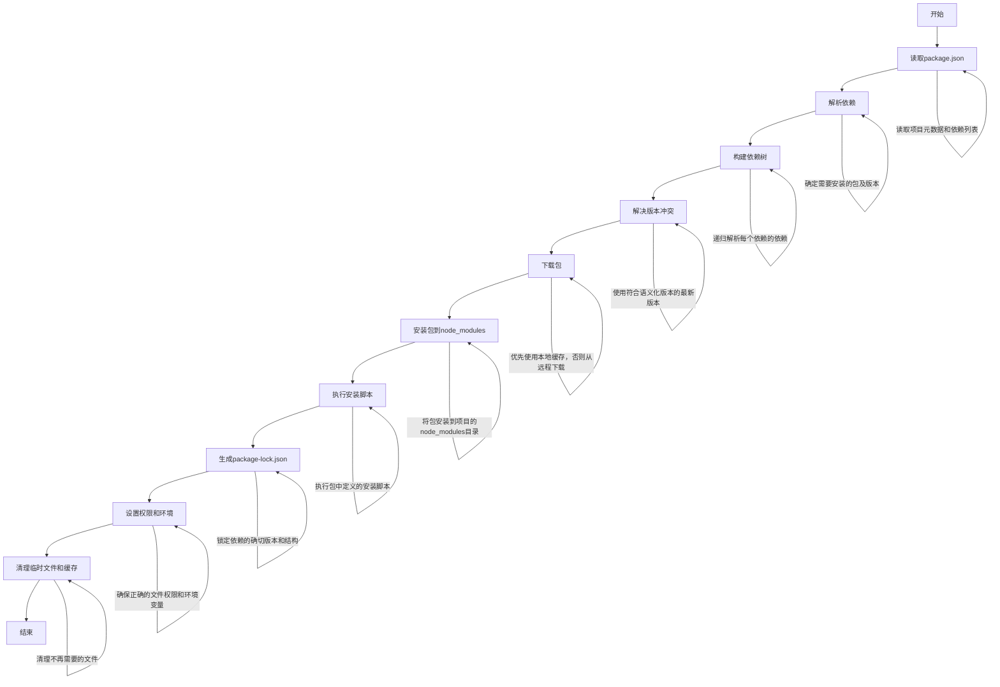
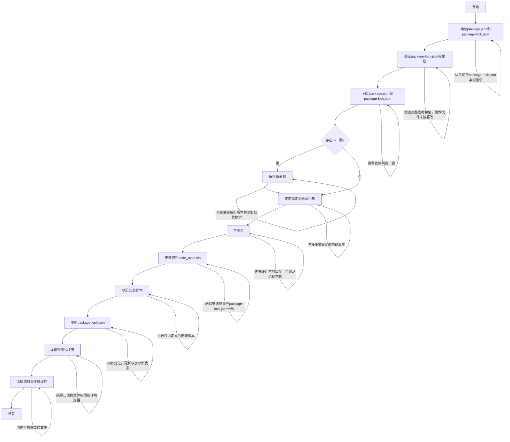

## nodejs

> nodejs是一个基于js v8引擎的应用程序，可以在浏览器外执行js代码，并且可以通过js来进行一些系统操作，如读写文件、网络操作等等。
>
> 前端工程化中node是最底层的运行环境。
>
> nvm-windows：这个工具可以在电脑里管理多个不同版本的node，可以在任意时候切换不同的node版本


## 模块化

> 模块化是指将一个复杂的程序或系统分解成多个相对独立的、可重用的模块。每个模块都有特定的功能，可以独立开发、测试和维护。
>
> 每一个模块可以看作一个单独的js文件，每个模块有自己的作用域；模块化的**核心**就是**导入**和**导出**。


模块化的主要特点和优势包括：

1. 封装性：模块可以隐藏内部实现细节，只暴露必要的接口。
2. 可重用性：模块可以在不同的项目中重复使用，提高开发效率。
3. 可维护性：由于代码被分割成小的、独立的单元，更容易理解和维护。
4. 命名空间：模块可以避免全局命名冲突，每个模块有自己的作用域。
5. 依赖管理：模块可以明确声明它们的依赖关系，使得代码结构更清晰。


在 JavaScript 中，实现模块化的方式经历了几个阶段：

1. 早期的模块模式：使用立即执行函数表达式（IIFE）创建私有作用域。
2. CommonJS：主要用于服务器端 JavaScript（Node.js），使用 `require()` 和 `module.exports`
3. AMD（Asynchronous Module Definition）：主要用于浏览器端，支持异步加载模块。
4. ES6 模块：JavaScript 的官方模块系统，使用 `import` 和 `export` 语句。


### commonjs规范

> 通过exports导出，通过require函数进行导入。
>
> 缺点：commonjs加载和解析模块是同步的，容易造成阻塞。

- 导出的本质

  > 在nodejs中，通过exports进行导出，只不过exports是module.exports的引用拷贝。
  >
  > 在node中的cjs规范实现下：导出的本质是导出的是当前模块的module.exports这个属性对应的对象。exports和require的本质就是引用赋值。

  ```js
  // a.js
  let name = "dd";
  let age = 33;
  function foo() {
    console.log("foo exe");
  }
  
  exports.name = name;
  exports.age = age;
  
  console.log(exports === module.exports); // true
  
  module.exports = {
    name: "18",
    age: 18,
  };
  
  console.log(exports === module.exports, "222"); // false "222"
  
  // b.js
  const b = require("./a.js");
  console.log("b", b); // b { name: '18', age: 18 }
  ```

- 导入的本质

  > 通过require函数将对应模块导出的module.exports对象引用返回。

- require函数的工作原理

  > require函数的查找规则可以分为以下几种情况：
  >
  > 1. 核心模块
  >
  > 2. 文件模块
  >
  > 3. 目录作为模块
  >
  > 4. node_modules 目录
  >
  > 5. 全局模块

  ```js
  // 1. 核心模块
  const fs = require('fs');
  const http = require('http');
  
  // 2. 文件模块
  const myModule = require('./myModule');           // myModule.js
  const jsonData = require('./data.json');          // JSON 文件
  const compiled = require('./example.node');       // 编译的插件
  
  // 3. 目录作为模块
  const directoryModule = require('./myDirectory'); // 查找 myDirectory/index.js
  
  // 4. node_modules 目录
  const lodash = require('lodash');                 // 查找 node_modules/lodash
  
  // 5. 全局模块
  // 假设我们有一个全局安装的模块 'globalModule'
  const globalMod = require('globalModule');
  
  // 目录结构示例：
  // project/
  // ├── node_modules/
  // │   └── lodash/
  // ├── myDirectory/
  // │   └── index.js
  // ├── myModule.js
  // ├── data.json
  // ├── example.node
  // └── main.js
  
  // main.js 中的 require 调用
  ```

- 核心模块：

  - 这些是 Node.js 自带的模块，如 'fs'、'http' 等。
  - 它们的优先级最高，即使在 node_modules 目录中有同名模块，也会优先加载核心模块。

- 文件模块：

  - 以 './'、'../' 或 '/' 开头的模块标识符被视为文件模块。
  - Node.js 会尝试按以下顺序解析： a) 精确的文件名 b) 带 .js 扩展名 c) 带 .json 扩展名 d) 带 .node 扩展名（编译的插件）

- 目录作为模块：

  - 如果 require() 指向一个目录，Node.js 会尝试查找该目录下的 package.json 文件，并加载其中 "main" 字段指定的文件。
  - 如果没有 package.json 或 "main" 入口，则会尝试加载目录下的 index.js、index.json 或 index.node。

- node_modules 目录：

  - 如果模块名不是核心模块且不以 '/'、'./' 或 '../' 开头，Node.js 会从当前目录的 node_modules 开始，沿着目录层次向上查找，直到找到匹配的模块或到达文件系统的根目录。

- 全局模块：

  - 如果模块在本地的 node_modules 中找不到，Node.js 会在全局安装路径中查找（例如 /usr/local/lib/node_modules/）。


### node模块的加载过程

1. 模块在被第一次引入时，模块中的js代码会被运行一次。
2. 模块被多次引入时，会缓存，最终只加载一次。
   1. 为什么只会加载运行一次？
   2. 这是因为每个模块对象module都有一个属性：loaded
   3. 为false表示还没有加载，为true表示已经加载
3. 如果有循环引入，加载顺序通过深度优先算法来进行执行的


### ES Module规范

> ES Module是在前端开发中的模块化规范，在浏览器中实现。
>
> 通过export导出，通过import进行导入。
>
> ps：采用ES Module将自动采用严格模式解析执行代码：“use strict”
>
> ES6模块化主要有以下几种使用方式：
>
> 1. 命名导出和导入
> 2. 默认导出和导入
> 3. 混合使用命名导出和默认导出
> 4. 重命名导出和导入
> 5. 导入所有
> 6. 动态导入

1. 命名导出和导入：

   - 使用 `export` 关键字导出变量、函数或类。

   - 使用 `import { ... } from '...'` 语法导入。

   - 可以一次导出/导入多个项目。

     ```js
     // math.js
     // 1. 命名导出
     export const PI = 3.14159;
     export function add(a, b) {
       return a + b;
     }
     
     // main.js
     // 1. 命名导入
     import { PI, add } from './math.js';
     console.log(PI);  // 3.14159
     console.log(add(2, 3));  // 5
     ```

2. 默认导出和导入：

   - 每个模块只能有一个默认导出，使用 `export default` 语法。

   - 使用 `import name from '...'` 语法导入，其中 `name` 可以是任意标识符。

     ```js
     // math.js
     // 2. 默认导出
     export default function multiply(a, b) {
       return a * b;
     }
     
     // main.js
     // 2. 默认导入
     import multiply from './math.js';
     console.log(multiply(4, 5));  // 20
     ```

3. 混合使用命名导出和默认导出

   - 一个模块可以同时包含命名导出和默认导出。

   - 导入时可以同时导入默认导出和命名导出。

     ```js
     // utils.js
     // 3. 混合使用命名导出和默认导出
     export const VERSION = '1.0.0';
     export function formatDate(date) {
       return date.toISOString();
     }
     
     export default class Logger {
       log(message) {
         console.log(`[LOG]: ${message}`);
       }
     }
     
     // main.js
     // 3. 混合导入
     import Logger, { VERSION } from './utils.js';
     const logger = new Logger();
     logger.log(VERSION);  // [LOG]: 1.0.0
     ```

4. 重命名导出和导入

   - 导出时可以使用 `as` 关键字重命名。

   - 导入时也可以使用 `as` 关键字重命名。

     ```js
     // utils.js
     export function formatDate(date) {
       return date.toISOString();
     }
     // 4. 重命名导出
     export { formatDate as formatISO };
     
     
     // main.js
     // 4. 重命名导入
     import { formatISO, formatDate as format } from './utils.js';
     ```

     

5. 导入所有：

   - 使用 `import * as name from '...'` 语法可以将模块的所有导出作为一个对象导入。

   - 默认导出会成为这个对象的 `default` 属性。

     ```js
     // math.js
     // 命名导出
     export const PI = 3.14159;
     export function add(a, b) {
       return a + b;
     }
     
     // 默认导出
     export default function multiply(a, b) {
       return a * b;
     }
     
     
     // 5. 导入所有
     import * as mathModule from './math.js';
     console.log(mathModule.PI);  // 3.14159
     console.log(mathModule.default(2, 3));  // 6 (使用默认导出的multiply函数)
     ```

6. 动态导入：

   - 使用 `import()` 函数可以在运行时动态导入模块。

   - 返回一个 Promise，resolve 的值是模块对象。

     ```JS
     // math.js
     // 命名导出
     export const PI = 3.14159;
     export function add(a, b) {
       return a + b;
     }
     
     // 默认导出
     export default function multiply(a, b) {
       return a * b;
     }
     
     // 6. 动态导入
     import('./math.js').then(mathModule => {
       console.log(mathModule.add(5, 7));  // 12
     });
     ```


**ES6 模块化中 import 关键字的模块查找规则**

1. **绝对路径**
   - 以 `/` 开头
   - 直接查找指定位置的文件

2. **相对路径**
   - 以 `./` 或 `../` 开头
   - 相对于当前模块的位置查找

3. **模块名称（bare import）**
   - 不带路径前缀的导入
   - 查找顺序：
     1. 检查是否为内置模块
     2. 在 `node_modules` 目录中查找
     3. 在 `package.json` 中指定的目录查找

4. **文件扩展名**
   - 通常需要明确指定文件扩展名
   - 某些构建工具可能允许省略扩展名

5. **目录导入**
   - 默认不会自动查找目录中的 `index.js`
   - 需要明确指定 `index.js` 或配置模块解析器

6. **URL 导入**
   - 支持使用完整 URL 导入模块
   - 主要用于浏览器环境

7. **模块导入顺序**
   - 导入声明会被提升到模块顶部
   - 模块只在第一次导入时执行，后续导入不重复执行

8. **循环依赖**
   - 支持循环依赖，使用生命周期钩子处理
   - 模块导出在编译时确定

注意：具体的查找规则可能因环境（浏览器、Node.js）和构建工具（如 Webpack）的配置而略有不同。

```js
// 1. 绝对路径导入
import { absoluteFunction } from '/src/utils/absolute.js';

// 2. 相对路径导入
import { relativeFunction } from './relative.js';
import { parentFunction } from '../parent.js';

// 3. 模块名称导入（bare import）
import React from 'react';
import _ from 'lodash';

// 4. 文件扩展名
import { withExtension } from './with-extension.js';
// 某些构建工具可能允许省略扩展名
// import { withoutExtension } from './without-extension';

// 5. 目录导入
// 假设 features 目录下有 index.js
import { feature } from './features/index.js';
// 使用构建工具时，可能可以简写为：
// import { feature } from './features';

// 6. URL 导入
import { remoteFunction } from 'https://example.com/modules/remote.js';

// 7. 模块导入顺序（这些导入会被提升到模块顶部）
import { secondFunction } from './second.js';
import { firstFunction } from './first.js';

// 8. 循环依赖示例
// moduleA.js
export function functionA() {
  console.log('Function A');
}
import { functionB } from './moduleB.js';

// moduleB.js
export function functionB() {
  console.log('Function B');
}
import { functionA } from './moduleA.js';

// 其他导入方式
// 命名导入
import { namedExport1, namedExport2 } from './named-exports.js';

// 默认导入和命名导入结合
import DefaultExport, { namedExport } from './mixed-exports.js';

// 导入所有内容作为一个对象
import * as moduleContent from './module-content.js';

// 重命名导入
import { longFunctionName as shortName } from './long-names.js';

// 动态导入
(async () => {
  const dynamicModule = await import('./dynamic-module.js');
  dynamicModule.dynamicFunction();
})();
```


### ES Module的解析流程

> 阶段一：构建（Construction），根据地址查找js文件，并且下载，将其解析成模块记录（Module Record）；
>
> 阶段二：实例化（Instantiation），对模块记录进行实例化，并且分配内存空间，解析模块的导入和导出语句，把模块指向对应的内存地址。
>
> 阶段三：运行（Evaluation），运行代码，计算值，并且将值填充到内存地址中；


**构建阶段**：


当浏览器下载完main.js模块文件时，开始解析，会给该模块生成对应的模块记录（Module Record），记录该模块的导入和导出信息，根据导入的信息，下载对应的模块并解析，生成对应的模块记录，记录对应模块的导入和导出信息。当解析完成后开始对模块记录进行实例化。


一个ES 模块文件（js文件）对应一个模块记录。


**实例化和运行：**实例化时，每一个模块记录会对应生成一个模块环境记录，这个模块环境记录中记录了导入和导出标识符的信息。当运行时，填充对应导出标识符的值。


ps：不能在导入的位置修改导入的变量值。可以在导出的模块修改导出变量的值。


## 包管理工具（Node 包管理器）

> 前端包管理工具是用于管理和维护项目中使用的JavaScript库和依赖的工具。它们可以帮助开发者更轻松地安装、更新和删除项目依赖，以及管理依赖之间的版本冲突。


### 代码共享方案

> 前端的第三方包是存放在一个公共仓库（npm Registry）里面，通过包管理工具，可以下载需要的包到本地使用。


### npm

> npm是安装nodejs时默认帮我们安装的包管理工具


#### npm的配置文件

1. **package.json**

   > package.json 文件是 Node.js 项目中的核心配置文件，它在项目管理、依赖处理、脚本运行等方面起着关键作用。
   >
   > 通常一个项目的名称就是包的名称。

   **主要作用**

   1. 项目元数据：记录项目的名称、版本、描述等基本信息
   2. 依赖管理：列出项目的依赖项及其版本
   3. 脚本定义：定义可以通过 npm 或 yarn 运行的脚本命令
   4. 项目配置：设置项目的各种配置选项

   

   ```json
   {
     // 项目名称，在 npm 上必须是唯一的
     "name": "my-awesome-project",
   
     // 项目版本，遵循语义化版本规范（semver）
     // 版本号 (version): 遵循语义化版本规范（semver），格式为 主版本.次版本.修订版本
     "version": "1.0.0",
   
     // 项目简短描述
     "description": "A comprehensive example of a package.json file",
   
     // 项目主入口点（CommonJS 格式）
     "main": "dist/index.js",
   
     // ES 模块入口点
     "module": "dist/index.esm.js",
   
     // TypeScript 类型定义文件
     "types": "dist/index.d.ts",
   
     // 定义可以通过 npm run 或 yarn run 执行的脚本
     // 脚本 (scripts): 这里定义的脚本可以通过 npm run <script-name> 或 yarn <script-name> 来执行。例如，npm run build 会执行 tsc && rollup -c
     "scripts": {
       // 启动项目
       "start": "node dist/index.js",
       // 构建项目
       "build": "tsc && rollup -c",
       // 运行测试
       "test": "jest",
       // 运行代码检查
       "lint": "eslint src/**/*.ts"
     },
   
     // 生产环境依赖
     // 安装到生产环境
     "dependencies": {
       "lodash": "^4.17.21",
       "axios": "^0.21.1"
     },
   
     // 开发环境依赖
     // 只在开发时使用，不会被安装到生产环境。
     "devDependencies": {
       "typescript": "^4.3.5",
       "jest": "^27.0.6",
       "eslint": "^7.32.0",
       "rollup": "^2.56.3"
     },
   
     // 宿主环境应该提供的依赖
     // 指定了宿主项目中应该存在的依赖，常用于插件或库项目。
     "peerDependencies": {
       "react": "^17.0.2"
     },
   
     // 指定项目运行的 Node.js 版本要求
     // 指定了运行此包所需的 Node.js 版本。这不会阻止安装，但会给用户一个警告。
     "engines": {
       "node": ">=14.0.0"
     },
   
     // 项目作者信息
     "author": {
       "name": "Your Name",
       "email": "you@example.com",
       "url": "https://yourwebsite.com"
     },
   
     // 项目许可证
     "license": "MIT",
   
     // 项目仓库信息
     "repository": {
       "type": "git",
       "url": "https://github.com/yourusername/my-awesome-project.git"
     },
   
     // 项目关键词，用于 npm 搜索
     // 这些关键词帮助其他开发者在 npm 上搜索到你的包。
     "keywords": ["example", "package.json", "node", "javascript"],
   
     // 项目主页
     "homepage": "https://github.com/yourusername/my-awesome-project#readme",
   
     // 问题追踪系统的 URL
     "bugs": {
       "url": "https://github.com/yourusername/my-awesome-project/issues"
     },
   
     // 当设置为 true 时，可以防止包被意外发布到 npm 仓库。
     "private": false,
   
     // 精确控制模块的导出
     // 这是一个较新的字段，用于精确控制模块的导出。它允许你为不同的导入语法（require 或 import）指定不同的入口文件。
     "exports": {
       ".": {
         // CommonJS 格式的导出
         "require": "./dist/index.js",
         // ES 模块格式的导出
         "import": "./dist/index.esm.js"
       },
       // 允许导入 package.json
       "./package.json": "./package.json"
     },
   
     // 指定 npm 包含的文件
     // 指定了哪些文件应该被包含在发布的 npm 包中。这可以用来减小包的大小，只包含必要的文件。
     "files": [
       "dist",
       "README.md"
     ]
   }
   ```

   

   

   **常见配置及其作用**

   1. `name`: 项目名称
   2. `version`: 项目版本
   3. `description`: 项目描述
   4. `main`: 项目的主入口文件
   5. `scripts`: 定义可执行的脚本命令
   6. `dependencies`: 生产环境依赖
   7. `devDependencies`: 开发环境依赖
   8. `peerDependencies`: 宿主环境应该提供的依赖
   9. `engines`: 指定项目运行的 Node.js 版本要求
   10. `author`: 项目作者信息
   11. `license`: 项目许可证
   12. `repository`: 项目仓库地址
   13. `keywords`: 项目关键词，用于 npm 搜索
   14. `homepage`: 项目主页
   15. `bugs`: 问题追踪系统的 URL
   16. `private`: 如果为 true，防止意外发布到 npm
   17. `module`: ES 模块的入口点
   18. `exports`: 精确控制模块的导出
   19. `imports`: 定义包内导入的别名

   

   **包管理器特定字段**

   - `workspaces`: 用于 monorepo 项目结构（npm/Yarn）
   - `resolutions`: 强制解析特定的包版本（Yarn）
   - `overrides`: 覆盖依赖的版本（npm）

   

   **其他可选配置**

   - `browser`: 浏览器环境的入口点
   - `bin`: 可执行文件路径
   - `files`: 指定 npm 包含的文件
   - `typings` 或 `types`: TypeScript 类型定义文件

   

   **创建方式**

   - 通过`npm init -y?`命令创建

     > `-y`参数可选，当加上时，所有配置使用默认值。

   - 通过Vue Cli等脚手架工具来创建项目时会生成**package.json**

2. **package-lock.json**

   1. **锁定依赖版本**： package-lock.json 文件的主要功能是锁定安装依赖的具体版本号，以保证项目在不同环境中具有相同的依赖结构。其中记录了每个依赖包的精确版本，而不像 package.json 中使用带有 ^ 或 ~ 等符号的版本范围。这种锁定机制确保了无论何时运行 `npm install`，所有开发者都能获取完全一致的依赖版本，避免版本差异引发的问题。
   2. **加快安装速度**： 在执行 `npm install` 时，npm 可以利用 package-lock.json 文件中的信息直接安装所需的依赖，而不必重新解析 package.json 文件中版本范围内的最佳匹配版本，从而加快安装速度。
   3. **提高构建一致性**： 在持续集成和重复构建的场景中，由于 package-lock.json 文件记录了精确的依赖版本，可以保证每次构建的一致性，避免因不同时间或环境带来的依赖版本不一致问题。
   4. **自动生成和更新**： 当你在运行 npm install 过程中，安装新的依赖包或更新现有依赖包版本时，npm 会自动生成或更新 package-lock.json 文件，以反映最新的依赖状态。


**各个字段的作用**

1. **name**: 项目名称，这个字段从 `package.json` 中继承。
2. **version**: 项目版本号，这个字段也从 `package.json` 中继承。
3. **lockfileVersion**: `package-lock.json` 文件格式的版本号。
4. **requires**: 一个布尔值，表示是否要求所有的依赖都遵循这个文件中定义的版本。
5. **dependencies**: 列出所有项目依赖及其子依赖，递归显示依赖树。


**dependencies 节的详细字段**

- **version**: 安装的依赖包的版本。
- **resolved**: 该模块的下载URL地址。
- **integrity**: 用于验证文件完整性的哈希值。
- **dev**: 一个布尔值，指示该依赖是否是开发依赖。
- **requires**: 描述该模块依赖的其他模块及其版本。
- **optional**: 一个布尔值，指示该依赖包是否是可选的。


例如，`package-lock.json` 可能的内容如下:

```json
{
  "name": "my-project",
  "version": "1.0.0",
  "lockfileVersion": 2,
  "requires": true,
  "dependencies": {
    "example-package": {
      "version": "1.2.3",
      "resolved": "https://registry.npmjs.org/example-package/-/example-package-1.2.3.tgz",
      "integrity": "sha512-EXAMPLEHASH...",
      "dev": false,
      "requires": {
        "sub-package": "^1.0.0"
      }
    },
    "sub-package": {
      "version": "1.0.0",
      "resolved": "https://registry.npmjs.org/sub-package/-/sub-package-1.0.0.tgz",
      "integrity": "sha512-OTHERSUBHASH...",
      "dev": false
    }
  }
}

```


#### npm命令

- 局部安装

  ```bash
  npm install 包名 --save?#在运行该命令的目录下的node_modules文件下安装对应的包,该包默认添加到package.json中的生产依赖, --save参数可选
  
  npm install 包名 -D/--save-dev #在运行该命令的目录下的node_modules文件下安装对应的包,该包默认添加到package.json中的开发依赖
  ```

- 全局安装（一般安装的都是工具包）

  ```bash
  npm install 包名 -g #全局安装一个对应的包, 该包安装的目录是由node管理的，该目录是被添加到系统的环境变量中的，全局安装完毕后就可以在电脑任何地方使用全局安装的包。
  ```

- 根据package.json文件安装

  ```bash
  npm install #根据package.json中的依赖包进行安装
  ```

  

##### npm install 原理

1. **解析package.json文件**： `npm install` 命令首先会读取项目根目录下的 `package.json` 文件。这个文件列出了项目的所有依赖项，包括直接依赖和开发依赖。
2. **构建依赖树**： npm 会根据 `package.json` 中的 `dependencies` 和 `devDependencies` 字段开始构建依赖树。这个过程不仅限于直接依赖，还包括所有子依赖，确保依赖项之间的版本和需求得到满足。
3. **查找和下载模块**： 一旦构建了完整的依赖树，npm 会从其注册表（默认情况下是 npm 官方注册表）或其他配置的源中拉取并下载这些模块包。下载时，会先查找缓存，如果缓存中已经有对应的包，则直接使用，否则会从远程注册表获取。
4. **安装模块**： 下载完成后，npm 会将这些模块安装到项目的 `node_modules` 目录中。安装过程中，如果某些包已经安装且版本合适，npm 会跳过重新安装，从而提高安装效率。
5. **执行生命周期脚本**： 安装完成后，npm 会依次执行 `preinstall`、`install` 和 `postinstall` 阶段的生命周期脚本（如果有定义的话）。这些脚本可以用于在安装前后执行特定的任务，例如构建、迁移数据等。
6. **更新 package-lock.json**： 最后一步，npm 会生成或更新 `package-lock.json` 文件。这个文件锁定了当前项目所使用的具体包的版本及其来源，确保未来安装过程的一致性和稳定性。


**无package-lock.json**

1. 读取 package.json： npm 首先会读取当前目录下的 package.json 文件，这个文件包含了项目的元数据和依赖列表。

2. 解析依赖： npm 会解析 package.json 中的 dependencies 和 devDependencies 字段，确定需要安装的包及其版本。

3. 构建依赖树： npm 会递归地解析每个依赖包的依赖，构建一个完整的依赖树。

4. 版本冲突解决： 如果存在依赖的不同版本，npm 会尝试解决这些冲突，可能会使用符合语义化版本规范的最新版本。

5. 下载包： npm 会从 npm 注册表（默认是 npmjs.com）下载所需的包。它会首先检查本地缓存，如果缓存中没有或已过期，才会从远程下载。

6. 安装包： 下载完成后，npm 会将这些包安装到项目的 node_modules 目录中。

7. 执行脚本： 如果包中定义了安装脚本（在 package.json 的 scripts 字段中），npm 会执行这些脚本。

8. 生成/更新 package-lock.json： npm 会生成或更新 package-lock.json 文件，这个文件锁定了依赖的确切版本和依赖树结构。

9. 权限和环境设置： npm 会确保正确设置文件权限，并可能根据需要设置环境变量。

10. 清理： 安装完成后，npm 会清理临时文件和下载缓存（如果配置为这样做）。



**有package-lock.json**

1. 读取文件： npm 会首先读取 package.json 和 package-lock.json 文件。

2. 优先使用 package-lock.json： npm 会优先使用 package-lock.json 中的信息，而不是 package.json 中的版本范围。

3. 验证完整性： npm 会检查 package-lock.json 中的完整性哈希值（integrity hash），确保文件没有被篡改。

4. 对比依赖： npm 会比较 package.json 和 package-lock.json 中的依赖列表，确保它们之间没有不一致。

5. 使用锁定的版本： 对于 package-lock.json 中指定的依赖，npm 会直接使用锁定的精确版本，而不是重新解析版本范围。

6. 下载和安装包： npm 会根据 package-lock.json 中的信息下载和安装指定版本的包。如果本地缓存中有这些包，则直接使用缓存。

7. 处理新依赖： 如果 package.json 中有新添加的依赖，而这些依赖在 package-lock.json 中不存在，npm 会为这些新依赖解析版本并添加到依赖树中。

8. 更新 package-lock.json： 如果有任何变化（比如添加了新依赖），npm 会更新 package-lock.json 文件以反映这些变化。

9. 执行脚本： 如同没有 package-lock.json 的情况，npm 会执行相关的安装脚本。

10. 保持一致性： 整个过程旨在确保安装结果与 package-lock.json 中描述的依赖树结构完全一致。




##### npm 脚本执行过程

1. **定义脚本**
   在 package.json 文件中，scripts 字段用于定义各种脚本：

   ```json
   {
     "scripts": {
       "start": "node server.js",
       "test": "jest",
       "build": "webpack"
     }
   }
   ```

2. **运行脚本**
   使用 `npm run <script-name>` 或 `yarn <script-name>` 来执行脚本。

3. **环境设置**
   npm 会设置一些环境变量，包括将 `./node_modules/.bin` 添加到 PATH 中。

4. **脚本解析**
   npm 解析脚本命令，识别要执行的程序和参数。

5. **查找可执行文件**
   npm 按以下顺序查找可执行文件：
   
   - 项目的 `./node_modules/.bin` 目录
   - 全局安装的 npm 包
   - 系统 PATH 中的命令
   
6. **执行脚本**
   找到可执行文件后，npm 在 shell 中执行该命令。

7. **钩子（Hooks）**
   npm 支持 pre 和 post 钩子。例如，`pretest` 会在 `test` 之前自动运行。

8. **错误处理**
   如果脚本执行失败，npm 会报告错误并设置非零退出码。

9. **并行和顺序执行**
   - 使用 `&` 可以并行运行脚本
   - 使用 `&&` 可以顺序运行脚本

10. **传递参数**
    可以通过 `--` 向 npm 脚本传递额外参数。

11. **环境变量**
    脚本可以访问 `process.env` 中的环境变量。

12. **生命周期脚本**
    某些脚本名称（如 `install`、`start`、`test`）有特殊的生命周期意义。


### 语义化版本规范(SemVer)

> 语义化版本规范（SemVer，Semantic Versioning）是用于版本控制的一种方法，它通过特定的规则来定义版本号，以便于管理和使用软件包的依赖关系。语义化版本规范的核心思想是通过版本号传达代码变化的性质和兼容性。一个典型的语义化版本号由三个部分组成：主版本号（MAJOR）、次版本号（MINOR）和修订版号（PATCH），格式为：`MAJOR.MINOR.PATCH`。


#### 语义化版本规范的详细内容：

1. **主版本号（MAJOR）：** 当你做了不兼容的 API 修改时（可能不兼容之前的版本），增加主版本号。
2. **次版本号（MINOR）：** 当你做了向下兼容的功能性新增时（新功能增加，但是兼容之前的版本），增加次版本号。
3. **修订版号（PATCH）：** 当你做了向下兼容的问题修正时（没有新功能，修复了之前版本的bug），增加修订版号。

此外，还可以使用先行版本号和构建元数据来进一步描述版本，但这些是可选的。


#### 使用 npm 下载符合语义化版本规范的包

在使用 npm 下载包时，可以利用 SemVer 的规则来选择符合特定版本范围的包。以下是常见的方法：


1. **安装特定版本的包（@符号）**

   ```bash
   npm install package-name@1.2.3
   ```

   这里的 `1.2.3` 是版本号，npm 将下载该精确版本的包。

2. **按照版本范围安装包**

   - **波浪号（~）：** 表示兼容某个**次版本号**，例如 `~1.2.3` 将匹配所有 `1.2.x` 版本，但不包括 `1.3.0`。（除了x和y不变，z永远安装最新的）

     ```bash
     npm install package-name@~1.2.3
     ```

   - **插入号（^）：** 表示兼容某个**主版本号**，例如 `^1.2.3` 将匹配 `1.x.x` 版本，但不包括 `2.0.0`。（除了x不变，y和z永远安装最新的）

     ```bash
     npm install package-name@^1.2.3
     ```

   - **最新版本：** 如果不指定版本号，npm 将安装最新的稳定版本

     ```bash
     npm install package-name
     ```

     


### npx

> npx是npm (Node Package Manager) 5.2.0版本引入的一个命令行工具。

它有几个主要作用和应用场景:

1. 执行本地安装的模块: npx允许你执行项目中node_modules目录下的可执行命令,而不需要全局安装或者在scripts中配置。

   - 例如,如果你的项目依赖中有mocha测试框架,你可以直接运行:

     ```bash
     npx mocha
     ```

     而不需要全局安装mocha或在package.json的scripts中配置。

2. 一次性使用模块: npx可以一次性下载并执行一个npm包,而不需要将其安装到项目中。这对于一些只需要偶尔使用的工具很有用。

   - 例如：

     ```js
     npx create-react-app my-app
     ```

     这会临时下载create-react-app,用它创建一个新的React应用,然后删除这个包。

3. 指定Node.js版本: npx可以用来运行特定版本的Node.js

   - 例如:

     ```bash
     npx node@14 index.js
     ```

     这会使用Node.js 14版本来运行index.js文件

4. 解决版本冲突: 当你有多个项目使用同一工具的不同版本时,npx可以确保每个项目使用其依赖的正确版本。


**工作原理：**

1. 首先检查命令是否存在于本地项目的node_modules/.bin目录中。
2. 如果不存在,它会在PATH环境变量中查找。
3. 如果仍未找到,npx会临时从npm registry下载该包并执行。


**应用场景：**

- 运行本地安装的工具和脚本。
- 尝试npm包而不需要全局安装。
- 确保使用特定版本的Node.js或npm包。
- 执行一次性任务或命令。
- 在持续集成/持续部署(CI/CD)环境中使用,无需预安装工具。


### pnpm包管理器

> pnpm 出现的主要原因是为了解决 npm 和 Yarn 等传统包管理器存在的一些问题，同时提供更高效的包管理解决方案。


#### 解决的痛点

1. **磁盘空间使用**：
   - 问题：npm 和 Yarn 会在每个项目中重复安装相同的依赖包，占用大量磁盘空间。
   - 解决：pnpm 使用硬链接和符号链接，实现了包的共享，大大节省了磁盘空间。

2. **安装速度**：
   - 问题：npm 和 Yarn 在安装大量包时可能较慢。
   - 解决：由于 pnpm 的链接机制，它能够更快地"安装"已经存在于存储中的包。

3. **幽灵依赖**：
   - 问题：npm 和 Yarn 允许访问未在 package.json 中声明的依赖。
   - 解决：pnpm 创建了一个严格的依赖树，只允许访问明确声明的依赖。

4. **一致性保证**：
   - 问题：npm 和 Yarn 可能在不同环境下产生不一致的依赖树。
   - 解决：pnpm 的链接结构确保了更一致的依赖解析。

5. **monorepo 支持**：
   - 问题：在 monorepo 中管理多个包可能很复杂。
   - 解决：pnpm 提供了内置的 workspace 功能，简化了 monorepo 的管理。


#### 工作原理

pnpm 的核心原理是基于内容寻址存储和符号链接：

1. **内容寻址存储**：
   - pnpm 在系统中维护一个集中的包存储（通常在 ~/.pnpm-store）。
   - 每个包版本只存储一次，通过哈希值进行索引。

2. **硬链接**：
   - 当项目需要一个包时，pnpm 会在项目的 node_modules 中创建一个硬链接，指向存储中的实际文件。
   - 这意味着不同项目可以共享相同的包文件，而不需要复制。

3. **符号链接**：
   - pnpm 使用符号链接创建依赖树结构。
   - 每个包的依赖都通过符号链接指向存储中的相应包。

4. **非扁平化的 node_modules 结构**：
   - 与 npm 和 Yarn 的扁平化结构不同，pnpm 创建了一个嵌套的依赖结构。
   - 这防止了访问未声明的依赖（幽灵依赖问题）。

5. **高效的算法**：
   - pnpm 使用高效的算法来解析和链接依赖，提高了安装和更新的速度。

6. **严格的包隔离**：
   - 每个项目只能访问其 package.json 中声明的依赖。
   - 这增强了项目的可维护性和安全性。

7. **原生 monorepo 支持**：
   - pnpm 内置了 workspace 功能，可以方便地管理多包仓库。

通过这些创新，pnpm 提供了一个更高效、更可靠的包管理解决方案，特别适合大型项目和 monorepo 架构。


#### 应用场景

1. **大型项目或多项目环境**： 对于有多个相关项目的公司或开发者，pnpm 可以显著节省磁盘空间。例如，如果你有 10 个项目都使用 React，pnpm 只会在全局存储中保存一份 React 副本，而不是在每个项目中都复制一份。

2. **Monorepo 管理**： pnpm 的 workspace 功能使得管理 monorepo 变得简单。例如：

   ```bash
   my-monorepo/
   ├── package.json
   ├── pnpm-workspace.yaml
   ├── packages/
   │   ├── app/
   │   │   └── package.json
   │   └── utils/
   │       └── package.json
   ```

   在这种结构中，可以轻松地管理和链接内部包。

3. **CI/CD 环境**： 由于 pnpm 的安装速度更快，它可以显著减少 CI/CD 流程中的构建时间。

4. **严格的依赖管理**： 对于需要严格控制依赖访问的项目，pnpm 的非扁平化结构很有帮助。这可以防止意外使用未声明的依赖，增加代码的可维护性。

5. **快速切换 Node.js 版本**： pnpm 提供了内置的 `pnpm env` 命令，可以方便地管理和切换 Node.js 版本。


#### 问题

- 一些老旧的或不规范的包可能不兼容 pnpm 的严格链接结构。
- 开发者可能需要适应新的 `node_modules` 结构和依赖解析方式。
- 在某些特定的环境或设置中，硬链接和符号链接可能会遇到问题。


### 硬链接和软链接（符号链接）

1. 硬链接（Hard Link）： 硬链接可以被看作是给同一个文件的另一个名字。它直接指向文件的实际数据（称为 inode）。

   - 特点：
     - 与原文件共享相同的 inode。
     - 对任何一个链接的修改都会反映在所有链接上。
     - 只能在同一文件系统中创建。
     - 不能链接到目录。
     - 即使原文件被删除，通过硬链接仍然可以访问文件内容。

   想象一下，硬链接就像是同一本书的不同书签。无论你从哪个书签开始阅读，你读到的都是同一本书的内容。

   当书签没了，找不到这本书了，那么磁盘中对应的文件就消失了。采用的是引用计数的方式，当引用为0时，文件会被删除。

2. 符号链接（Symbolic Link 或 Soft Link）： 符号链接是一个特殊的文件，它包含了另一个文件或目录的路径。它就像是一个快捷方式或指针。

   - 特点：
     - 有自己的 inode。
     - 可以跨文件系统。
     - 可以链接到目录。
     - 如果原文件被删除，符号链接将失效（成为"断开的链接"）。

   想象符号链接就像是一个路标，指示着"真正的文件在那个方向"。如果路标指向的地方没有文件了，那这个路标就失去了意义。

实际应用示例：

1. 硬链接：

   ```bash
   ln /path/to/original_file /path/to/hard_link
   ```

   这个命令创建了一个指向原始文件的硬链接。现在，即使你删除了原始文件，通过硬链接仍然可以访问文件内容。

2. 符号链接：

   ```bash
   ln -s /path/to/original_file /path/to/symbolic_link
   ```

   这个命令创建了一个指向原始文件的符号链接。如果你移动或删除原始文件，这个符号链接将会失效。


在图中，你可以看到：

- 原始文件和硬链接共享同一个 inode（1234）。
- 符号链接有自己的结构，存储了指向原始文件的路径。

这两种链接类型在不同场景下都有其用途。例如，符号链接常用于创建到常用命令或配置文件的快捷方式，而硬链接则可用于创建文件的有效副本而不占用额外空间。


**总结：**硬链接可以看作是磁盘中数据的引用，而符号链接（快捷方式）看作是指向引用的引用；文件名本身是指针，硬链接是和文件名同一级别的指针，软链接是指向指针的指针。


**区别：**原理上，硬链接和源文件的inode节点号相同，两者互为硬链接。软连接和源文件的inode节点号不同，进而指向的block也不同，软连接block中存放了源文件的路径名。 实际上，硬链接和源文件是同一份文件，而软连接是独立的文件，类似于快捷方式，存储着源文件的位置信息便于指向。 使用限制上，不能对目录创建硬链接，不能对不同文件系统创建硬链接，不能对不存在的文件创建硬链接；可以对目录创建软连接，可以跨文件系统创建软连接，可以对不存在的文件创建软连接。
