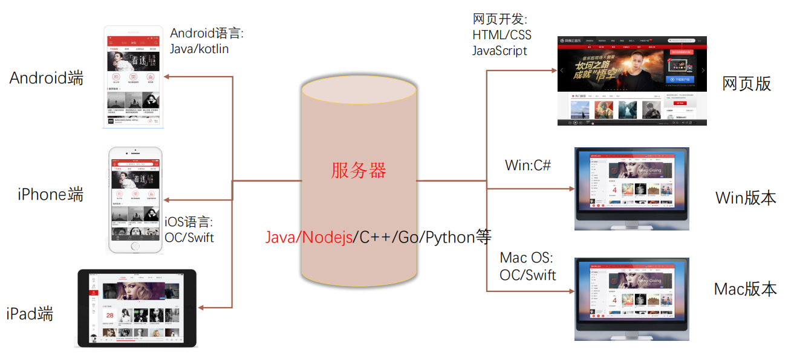
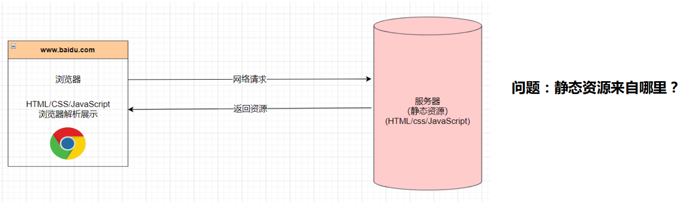
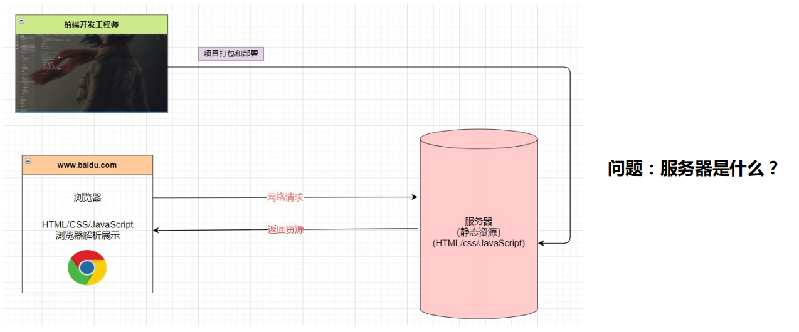
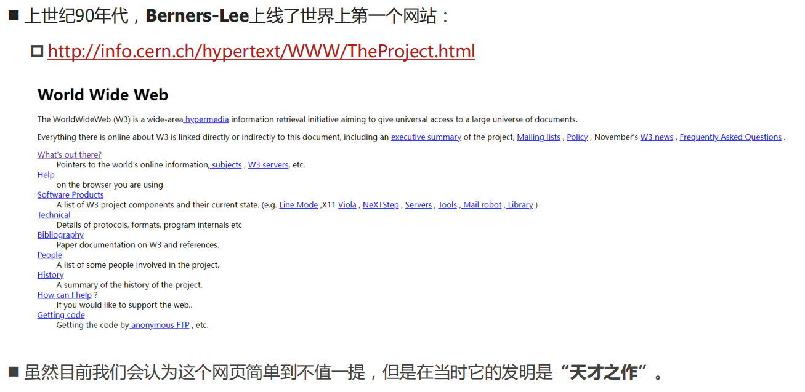
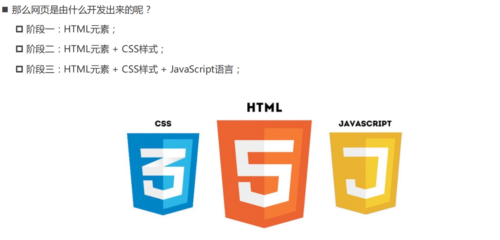
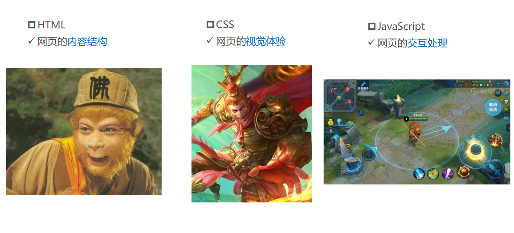
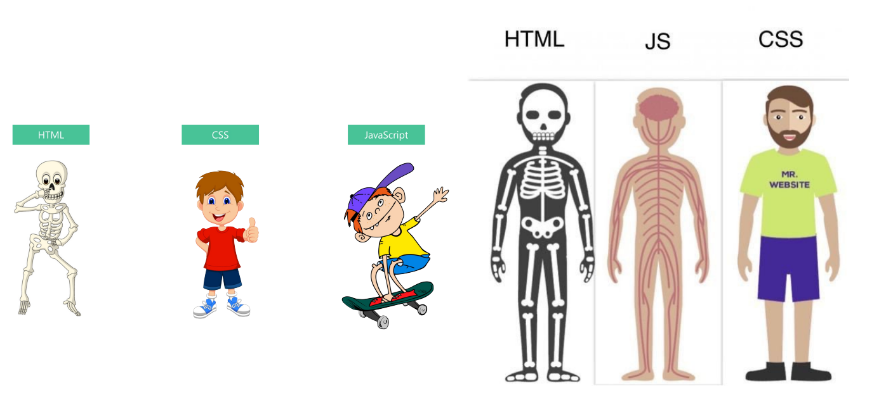
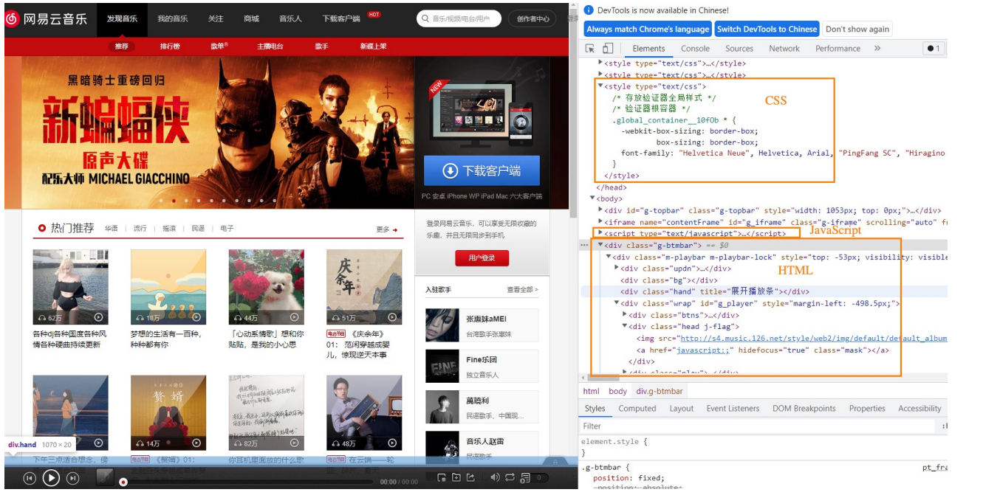
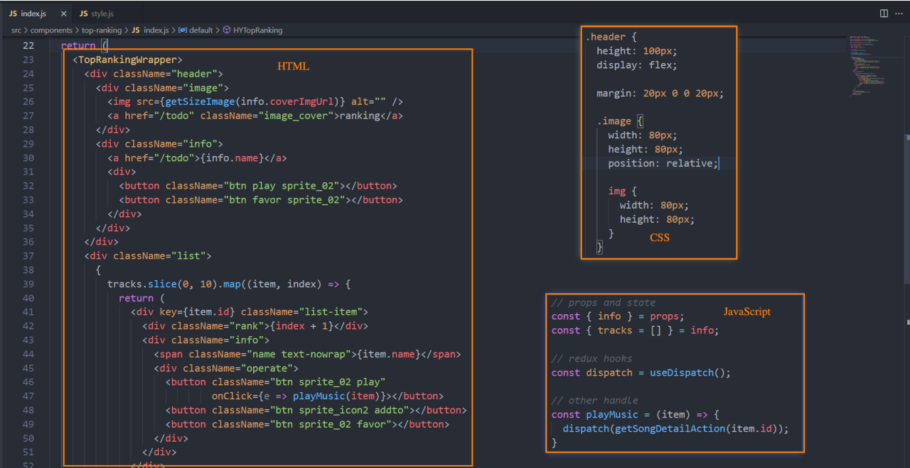
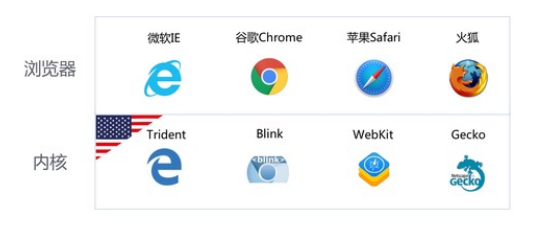

## 前言

### 软件的定义

专业的软件定义：一系列按照特定顺序组织的**计算机数据和指令**，是电脑的**非有型部分**（物理上看不见的部分）。

软件开发是什么呢？就是告诉**计算机一系列的指令**（根据计算机能够识别的代码，提前编写好），这些指令也称之为 **程序**。

开发软件的这部分人就称之为 **软件开发工程师**，也称之为**程序员**。

### 完善的软件系统（网易云音乐为例）

### 前端开发工程师

主要负责的：Web（网站、后台管理系统、手机H5）、小程序端；

也可以做：移动端（Uniapp、React Native）、桌面端（Electron）、服务器开发（Node.js）；

## 认识网站网页

### **什么是网页？**

网页的专业术语叫做 **Web Page**；

打开浏览器**查看到的页面**，是网络中的**一“页”**；

网页的内容可以非常丰富：包括**文字、链接、图片、音乐、视频**等等

### **网站是什么呢？**

网站是由**多个网页组成**的；

通常一个网站由N个网页组成（N >= 1）；

## **网页的显示过程**

### **用户角度**

1. 用户在浏览器输入一个网站；
2. 浏览器会找到对应的服务器地址，请求静态资源（可以存放在世界上任何一个地方）；
3. 服务器返回静态资源给浏览器；
4. 浏览器对静态资源进行解析和展示；

### 前端工程师

1. 开发项目（HTML/CSS/JavaScript/Vue/React）
2. 打包、部署项目到服务器里面

## **服务器是什么？**

- 我们**日常生活**接触到的基本都属于**客户端、前端**的内容：
  - 比如浏览器、微信、QQ、小程序；
- 我们知道自己的**手机并不可能存放哪些多的数据和资源**：
  - 比如你用《网易云听音乐》，音乐数据大部分都是存在“服务器”中的；
- **那么服务器到底是什么呢？**
  - 服务器本质上也是一台类似于你电脑一样的主机；
  - 但是这个主机有几个特点：
    - 二十四小时不关机的（稳定运行）；
    - 没有显示器的；
    - 一般装的是Linux操作系统（比如centos）；
- **那么我以后到公司是不是就看得见服务器了呢？**
  - 目前公司大部分用的是**云服务器**（比如阿里云、腾讯云、华为云）；

## 世界上第一个网页

## 现代网页已经非常复杂

## 网页的组成

## 网页源代码的角度

## 网页开发的角度

## 浏览器的作用

- 我们已经明确知道了**网页的组成部分**：**HTML + CSS + JavaScript**。

- 那么这些看起来**枯燥的代码**，是如何**被渲染成多彩的网页**呢？
  - 我们知道是通过**浏览器**来完成；
- 浏览器最核心的部分其实是 **“浏览器内核”**；

## **浏览器的渲染引擎**

- 浏览器最核心的部分是渲染引擎（Rendering Engine），一般也称为**“浏览器内核”**
  - 负责解析网页语法，并渲染（显示）网页
- **常见的浏览器有很多：**

### **不同浏览器的内核**

- 常见的浏览器内核有
- Trident （ 三叉戟）：IE、360安全浏览器、搜狗高速浏览器、百度浏览器、UC浏览器；
- Gecko（ 壁虎） ：Mozilla Firefox；
- Presto（急板乐曲）-> Blink （眨眼）：Opera
- Webkit ：Safari、360极速浏览器、搜狗高速浏览器、移动端浏览器（Android、iOS）
- Webkit -> Blink ：Google Chrome

- 不同的浏览器内核有不同的解析、渲染规则，所以同一网页在不同内核的浏览器中的渲染效果也可能不同。